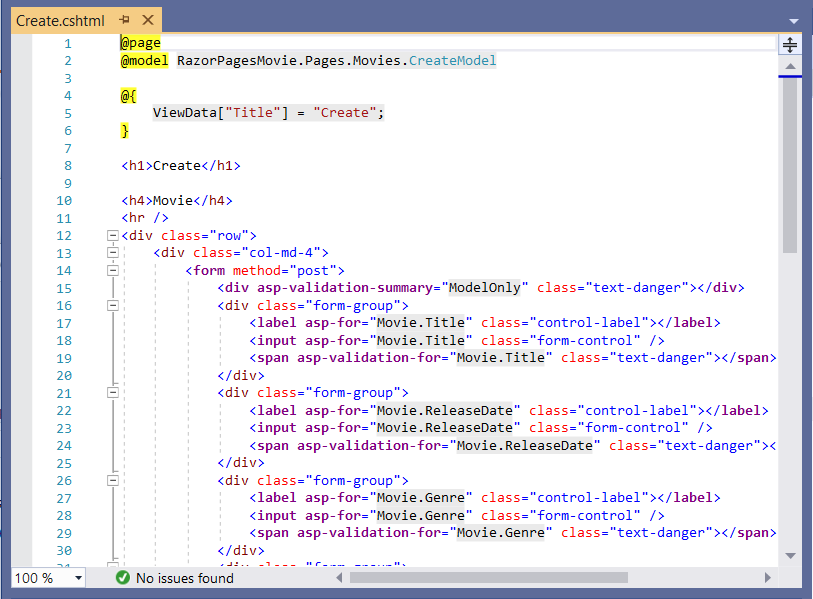
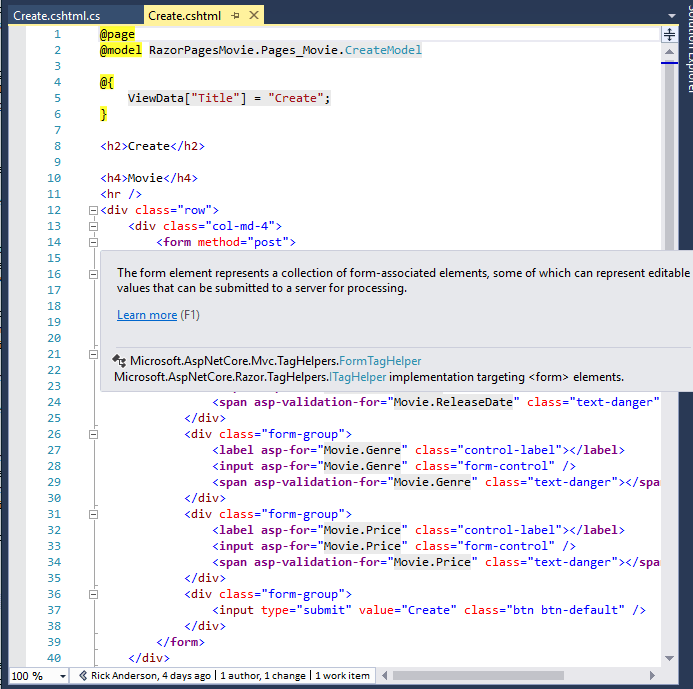

# Scaffolded Razor Pages in ASP.NET Core

::: moniker range=">= aspnetcore-3.0"

By [Rick Anderson](https://twitter.com/RickAndMSFT)

This tutorial examines the Razor Pages created by scaffolding in the [previous tutorial](xref:tutorials/razor-pages/model).

[!INCLUDE[View or download sample code](~/includes/rp/download.md)]

## The Create, Delete, Details, and Edit pages

Examine the *Pages/Movies/Index.cshtml.cs* Page Model:

[!code-csharp[](razor-pages-start/snapshot_sample3/RazorPagesMovie30/Pages/Movies/Index.cshtml.cs)]

Razor Pages are derived from `PageModel`. By convention, the `PageModel`-derived class is called `<PageName>Model`. The constructor uses [dependency injection](xref:fundamentals/dependency-injection) to add the `RazorPagesMovieContext` to the page. All the scaffolded pages follow this pattern. See [Asynchronous code](xref:data/ef-rp/intro#asynchronous-code) for more information on asynchronous programming with Entity Framework.

When a request is made for the page, the `OnGetAsync` method returns a list of movies to the Razor Page. `OnGetAsync` or `OnGet` is called to initialize the state of the page. In this case, `OnGetAsync` gets a list of movies and displays them.

When `OnGet` returns `void` or `OnGetAsync` returns`Task`, no return statement is used. When the return type is `IActionResult` or `Task<IActionResult>`, a return statement must be provided. For example, the *Pages/Movies/Create.cshtml.cs* `OnPostAsync` method:

[!code-csharp[](razor-pages-start/sample/RazorPagesMovie30/Pages/Movies/Create.cshtml.cs?name=snippet)]

<a name="index"></a>
Examine the *Pages/Movies/Index.cshtml* Razor Page:

[!code-cshtml[](razor-pages-start/snapshot_sample3/RazorPagesMovie30/Pages/Movies/Index.cshtml)]

Razor can transition from HTML into C# or into Razor-specific markup. When an `@` symbol is followed by a [Razor reserved keyword](xref:mvc/views/razor#razor-reserved-keywords), it transitions into Razor-specific markup, otherwise it transitions into C#.

### The @page directive

The `@page` Razor directive makes the file an MVC action, which means that it can handle requests. `@page` must be the first Razor directive on a page. `@page` is an example of transitioning into Razor-specific markup. See [Razor syntax](xref:mvc/views/razor#razor-syntax) for more information.

Examine the lambda expression used in the following HTML Helper:

```cshtml
@Html.DisplayNameFor(model => model.Movie[0].Title)
```

The `DisplayNameFor` HTML Helper inspects the `Title` property referenced in the lambda expression to determine the display name. The lambda expression is inspected rather than evaluated. That means there is no access violation when `model`, `model.Movie`, or `model.Movie[0]` is `null` or empty. When the lambda expression is evaluated (for example, with `@Html.DisplayFor(modelItem => item.Title)`), the model's property values are evaluated.

<a name="md"></a>

### The @model directive

[!code-cshtml[](razor-pages-start/snapshot_sample3/RazorPagesMovie30/Pages/Movies/Index.cshtml?range=1-2&highlight=2)]

The `@model` directive specifies the type of the model passed to the Razor Page. In the preceding example, the `@model` line makes the `PageModel`-derived class available to the Razor Page. The model is used in the `@Html.DisplayNameFor` and `@Html.DisplayFor` [HTML Helpers](/aspnet/mvc/overview/older-versions-1/views/creating-custom-html-helpers-cs#understanding-html-helpers) on the page.

### The layout page

Select the menu links (**RazorPagesMovie**, **Home**, and **Privacy**). Each page shows the same menu layout. The menu layout is implemented in the *Pages/Shared/_Layout.cshtml* file. Open the *Pages/Shared/_Layout.cshtml* file.

[Layout](xref:mvc/views/layout) templates allow the HTML container layout to be:

* Specified in one place.
* Applied in multiple pages in the site.

Find the `@RenderBody()` line. `RenderBody` is a placeholder where all the page-specific views show up, *wrapped* in the layout page. For example, select the **Privacy** link and the *Pages/Privacy.cshtml* view is rendered inside the `RenderBody` method.

<a name="vd"></a>

### ViewData and layout

Consider the following markup from the *Pages/Movies/Index.cshtml* file:

[!code-cshtml[](razor-pages-start/snapshot_sample3/RazorPagesMovie30/Pages/Movies/Index.cshtml?range=1-6&highlight=4-999)]

The preceding highlighted markup is an example of Razor transitioning into C#. The `{` and `}` characters enclose a block of C# code.

The `PageModel` base class contains a `ViewData` dictionary property that can be used to pass data to a View. Objects are added to the `ViewData` dictionary using a key/value pattern. In the preceding sample, the `"Title"` property is added to the `ViewData` dictionary.

The `"Title"` property is used in the *Pages/Shared/_Layout.cshtml* file. The following markup shows the first few lines of the *_Layout.cshtml* file.

<!-- we need a snapshot copy of layout because we are
changing in in the next step.
-->
[!code-cshtml[](razor-pages-start/snapshot_sample/RazorPagesMovie/Pages/NU/_Layout.cshtml?highlight=6)]

The line `@*Markup removed for brevity.*@` is a Razor comment. Unlike HTML comments (`<!-- -->`), Razor comments are not sent to the client.

### Update the layout

Change the `<title>` element in the *Pages/Shared/_Layout.cshtml* file to display **Movie** rather than **RazorPagesMovie**.

[!code-cshtml[](razor-pages-start/sample/RazorPagesMovie30/Pages/Shared/_Layout.cshtml?range=1-6&highlight=6)]

Find the following anchor element in the *Pages/Shared/_Layout.cshtml* file.

```cshtml
<a class="navbar-brand" asp-area="" asp-page="/Index">RazorPagesMovie</a>
```

Replace the preceding element with the following markup:

```cshtml
<a class="navbar-brand" asp-page="/Movies/Index">RpMovie</a>
```

The preceding anchor element is a [Tag Helper](xref:mvc/views/tag-helpers/intro). In this case, it's the [Anchor Tag Helper](xref:mvc/views/tag-helpers/builtin-th/anchor-tag-helper). The `asp-page="/Movies/Index"` Tag Helper attribute and value creates a link to the `/Movies/Index` Razor Page. The `asp-area` attribute value is empty, so the area isn't used in the link. See [Areas](xref:mvc/controllers/areas) for more information.

Save your changes, and test the app by clicking on the **RpMovie** link. See the [_Layout.cshtml](https://github.com/dotnet/AspNetCore.Docs/blob/master/aspnetcore/tutorials/razor-pages/razor-pages-start/sample/RazorPagesMovie30/Pages/Shared/_Layout.cshtml) file in GitHub if you have any problems.

Test the other links (**Home**, **RpMovie**, **Create**, **Edit**, and **Delete**). Each page sets the title, which you can see in the browser tab. When you bookmark a page, the title is used for the bookmark.

> [!NOTE]
> You may not be able to enter decimal commas in the `Price` field. To support [jQuery validation](https://jqueryvalidation.org/) for non-English locales that use a comma (",") for a decimal point, and non US-English date formats, you must take steps to globalize your app. See this [GitHub issue 4076](https://github.com/dotnet/AspNetCore.Docs/issues/4076#issuecomment-326590420) for instructions on adding decimal comma.

The `Layout` property is set in the *Pages/_ViewStart.cshtml* file:

[!code-cshtml[](razor-pages-start/sample/RazorPagesMovie30/Pages/_ViewStart.cshtml)]

The preceding markup sets the layout file to *Pages/Shared/_Layout.cshtml* for all Razor files under the *Pages* folder. See [Layout](xref:razor-pages/index#layout) for more information.

### The Create page model

Examine the *Pages/Movies/Create.cshtml.cs* page model:

[!code-csharp[](razor-pages-start/snapshot_sample3/RazorPagesMovie30/Pages/Movies/Create.cshtml.cs?name=snippetALL)]

The `OnGet` method initializes any state needed for the page. The Create page doesn't have any state to initialize, so `Page` is returned. Later in the tutorial, an example of `OnGet` initializing state is shown. The `Page` method creates a `PageResult` object that renders the *Create.cshtml* page.

The `Movie` property uses the `[BindProperty]` attribute to opt-in to [model binding](xref:mvc/models/model-binding). When the Create form posts the form values, the ASP.NET Core runtime binds the posted values to the `Movie` model.

The `OnPostAsync` method is run when the page posts form data:

[!code-csharp[](razor-pages-start/snapshot_sample3/RazorPagesMovie30/Pages/Movies/Create.cshtml.cs?name=snippetPost)]

If there are any model errors, the form is redisplayed, along with any form data posted. Most model errors can be caught on the client-side before the form is posted. An example of a model error is posting a value for the date field that cannot be converted to a date. Client-side validation and model validation are discussed later in the tutorial.

If there are no model errors, the data is saved, and the browser is redirected to the Index page.

### The Create Razor Page

Examine the *Pages/Movies/Create.cshtml* Razor Page file:

[!code-cshtml[](razor-pages-start/snapshot_sample3/RazorPagesMovie30/Pages/Movies/Create.cshtml)]

# [Visual Studio](#tab/visual-studio)

Visual Studio displays the following tags in a distinctive bold font used for Tag Helpers:

* `<form method="post">`
* `<div asp-validation-summary="ModelOnly" class="text-danger"></div>`
* `<label asp-for="Movie.Title" class="control-label"></label>`
* `<input asp-for="Movie.Title" class="form-control" />`
* `<span asp-validation-for="Movie.Title" class="text-danger"></span>`



# [Visual Studio Code](#tab/visual-studio-code)

The following Tag Helpers are shown in the preceding markup:

* `<form method="post">`
* `<div asp-validation-summary="ModelOnly" class="text-danger"></div>`
* `<label asp-for="Movie.Title" class="control-label"></label>`
* `<input asp-for="Movie.Title" class="form-control" />`
* `<span asp-validation-for="Movie.Title" class="text-danger"></span>`

# [Visual Studio for Mac](#tab/visual-studio-mac)

Visual Studio displays the following tags in a distinctive bold font used for Tag Helpers:

* `<form method="post">`
* `<div asp-validation-summary="ModelOnly" class="text-danger"></div>`
* `<label asp-for="Movie.Title" class="control-label"></label>`
* `<input asp-for="Movie.Title" class="form-control" />`
* `<span asp-validation-for="Movie.Title" class="text-danger"></span>`

---

The `<form method="post">` element is a [Form Tag Helper](xref:mvc/views/working-with-forms#the-form-tag-helper). The Form Tag Helper automatically includes an [antiforgery token](xref:security/anti-request-forgery).

The scaffolding engine creates Razor markup for each field in the model (except the ID) similar to the following:

[!code-cshtml[](~/tutorials/razor-pages/razor-pages-start/snapshot_sample3/RazorPagesMovie30/Pages/Movies/Create.cshtml?range=15-20)]

The [Validation Tag Helpers](xref:mvc/views/working-with-forms#the-validation-tag-helpers) (`<div asp-validation-summary` and `<span asp-validation-for`) display validation errors. Validation is covered in more detail later in this series.

The [Label Tag Helper](xref:mvc/views/working-with-forms#the-label-tag-helper) (`<label asp-for="Movie.Title" class="control-label"></label>`) generates the label caption and `for` attribute for the `Title` property.

The [Input Tag Helper](xref:mvc/views/working-with-forms) (`<input asp-for="Movie.Title" class="form-control">`) uses the [DataAnnotations](/aspnet/mvc/overview/older-versions/mvc-music-store/mvc-music-store-part-6) attributes and produces HTML attributes needed for jQuery Validation on the client-side.

For more information on Tag Helpers such as `<form method="post">`, see [Tag Helpers in ASP.NET Core](xref:mvc/views/tag-helpers/intro).

## Additional resources

> [!div class="step-by-step"]
> [Previous: Adding a model](xref:tutorials/razor-pages/model)
> [Next: Database](xref:tutorials/razor-pages/sql)

::: moniker-end

::: moniker range="< aspnetcore-3.0"

By [Rick Anderson](https://twitter.com/RickAndMSFT)

This tutorial examines the Razor Pages created by scaffolding in the [previous tutorial](xref:tutorials/razor-pages/model).

[View or download](https://github.com/dotnet/AspNetCore.Docs/tree/master/aspnetcore/tutorials/razor-pages/razor-pages-start/sample/RazorPagesMovie22) sample.

## The Create, Delete, Details, and Edit pages

Examine the *Pages/Movies/Index.cshtml.cs* Page Model:

[!code-csharp[](razor-pages-start/snapshot_sample/RazorPagesMovie/Pages/Movies/Index.cshtml.cs)]

Razor Pages are derived from `PageModel`. By convention, the `PageModel`-derived class is called `<PageName>Model`. The constructor uses [dependency injection](xref:fundamentals/dependency-injection) to add the `RazorPagesMovieContext` to the page. All the scaffolded pages follow this pattern. See [Asynchronous code](xref:data/ef-rp/intro#asynchronous-code) for more information on asynchronous programming with Entity Framework.

When a request is made for the page, the `OnGetAsync` method returns a list of movies to the Razor Page. `OnGetAsync` or `OnGet` is called on a Razor Page to initialize the state for the page. In this case, `OnGetAsync` gets a list of movies and displays them.

When `OnGet` returns `void` or `OnGetAsync` returns`Task`, no return method is used. When the return type is `IActionResult` or `Task<IActionResult>`, a return statement must be provided. For example, the *Pages/Movies/Create.cshtml.cs* `OnPostAsync` method:

[!code-csharp[](razor-pages-start/sample/RazorPagesMovie22/Pages/Movies/Create.cshtml.cs?name=snippet)]

<a name="index"></a>
Examine the *Pages/Movies/Index.cshtml* Razor Page:

[!code-cshtml[](razor-pages-start/snapshot_sample/RazorPagesMovie/Pages/Movies/Index.cshtml)]

Razor can transition from HTML into C# or into Razor-specific markup. When an `@` symbol is followed by a [Razor reserved keyword](xref:mvc/views/razor#razor-reserved-keywords), it transitions into Razor-specific markup, otherwise it transitions into C#.

The `@page` Razor directive makes the file into an MVC action, which means that it can handle requests. `@page` must be the first Razor directive on a page. `@page` is an example of transitioning into Razor-specific markup. See [Razor syntax](xref:mvc/views/razor#razor-syntax) for more information.

Examine the lambda expression used in the following HTML Helper:

```cshtml
@Html.DisplayNameFor(model => model.Movie[0].Title)
```

The `DisplayNameFor` HTML Helper inspects the `Title` property referenced in the lambda expression to determine the display name. The lambda expression is inspected rather than evaluated. That means there is no access violation when `model`, `model.Movie`, or `model.Movie[0]` are `null` or empty. When the lambda expression is evaluated (for example, with `@Html.DisplayFor(modelItem => item.Title)`), the model's property values are evaluated.

<a name="md"></a>

### The @model directive

[!code-cshtml[](razor-pages-start/snapshot_sample/RazorPagesMovie/Pages/Movies/Index.cshtml?range=1-2&highlight=2)]

The `@model` directive specifies the type of the model passed to the Razor Page. In the preceding example, the `@model` line makes the `PageModel`-derived class available to the Razor Page. The model is used in the `@Html.DisplayNameFor` and `@Html.DisplayFor` [HTML Helpers](/aspnet/mvc/overview/older-versions-1/views/creating-custom-html-helpers-cs#understanding-html-helpers) on the page.

### The layout page

Select the menu links (**RazorPagesMovie**, **Home**, and **Privacy**). Each page shows the same menu layout. The menu layout is implemented in the *Pages/Shared/_Layout.cshtml* file. Open the *Pages/Shared/_Layout.cshtml* file.

[Layout](xref:mvc/views/layout) templates allow you to specify the HTML container layout of your site in one place and then apply it across multiple pages in your site. Find the `@RenderBody()` line. `RenderBody` is a placeholder where all the page-specific views you create show up, *wrapped* in the layout page. For example, if you select the **Privacy** link, the **Pages/Privacy.cshtml** view is rendered inside the `RenderBody` method.

<a name="vd"></a>

### ViewData and layout

Consider the following code from the *Pages/Movies/Index.cshtml* file:

[!code-cshtml[](razor-pages-start/snapshot_sample/RazorPagesMovie/Pages/Movies/Index.cshtml?range=1-6&highlight=4-999)]

The preceding highlighted code is an example of Razor transitioning into C#. The `{` and `}` characters enclose a block of C# code.

The `PageModel` base class has a `ViewData` dictionary property that can be used to add data that you want to pass to a View. You add objects into the `ViewData` dictionary using a key/value pattern. In the preceding sample, the "Title" property is added to the `ViewData` dictionary.

The "Title" property is used in the *Pages/Shared/_Layout.cshtml* file. The following markup shows the first few lines of the *_Layout.cshtml* file.

<!-- we need a snapshot copy of layout because we are
changing in in the next step.
-->
[!code-cshtml[](razor-pages-start/snapshot_sample/RazorPagesMovie/Pages/NU/_Layout.cshtml?highlight=6-99)]

The line `@*Markup removed for brevity.*@` is a Razor comment which doesn't appear in your layout file. Unlike HTML comments (`<!-- -->`), Razor comments are not sent to the client.

### Update the layout

Change the `<title>` element in the *Pages/Shared/_Layout.cshtml* file to display **Movie** rather than **RazorPagesMovie**.

[!code-cshtml[](razor-pages-start/sample/RazorPagesMovie22/Pages/Shared/_Layout.cshtml?range=1-6&highlight=6)]

Find the following anchor element in the *Pages/Shared/_Layout.cshtml* file.

```cshtml
<a class="navbar-brand" asp-area="" asp-page="/Index">RazorPagesMovie</a>
```

Replace the preceding element with the following markup.

```cshtml
<a class="navbar-brand" asp-page="/Movies/Index">RpMovie</a>
```

The preceding anchor element is a [Tag Helper](xref:mvc/views/tag-helpers/intro). In this case, it's the [Anchor Tag Helper](xref:mvc/views/tag-helpers/builtin-th/anchor-tag-helper). The `asp-page="/Movies/Index"` Tag Helper attribute and value creates a link to the `/Movies/Index` Razor Page. The `asp-area` attribute value is empty, so the area isn't used in the link. See [Areas](xref:mvc/controllers/areas) for more information.

Save your changes, and test the app by clicking on the **RpMovie** link. See the [_Layout.cshtml](https://github.com/dotnet/AspNetCore.Docs/blob/master/aspnetcore/tutorials/razor-pages/razor-pages-start/sample/RazorPagesMovie22/Pages/Shared/_Layout.cshtml) file in GitHub if you have any problems.

Test the other links (**Home**, **RpMovie**, **Create**, **Edit**, and **Delete**). Each page sets the title, which you can see in the browser tab. When you bookmark a page, the title is used for the bookmark.

> [!NOTE]
> You may not be able to enter decimal commas in the `Price` field. To support [jQuery validation](https://jqueryvalidation.org/) for non-English locales that use a comma (",") for a decimal point, and non US-English date formats, you must take steps to globalize your app. This [GitHub issue 4076](https://github.com/dotnet/AspNetCore.Docs/issues/4076#issuecomment-326590420) for instructions on adding decimal comma.

The `Layout` property is set in the *Pages/_ViewStart.cshtml* file:

[!code-cshtml[](razor-pages-start/sample/RazorPagesMovie22/Pages/_ViewStart.cshtml)]

The preceding markup sets the layout file to *Pages/Shared/_Layout.cshtml* for all Razor files under the *Pages* folder. See [Layout](xref:razor-pages/index#layout) for more information.

### The Create page model

Examine the *Pages/Movies/Create.cshtml.cs* page model:

[!code-csharp[](razor-pages-start/snapshot_sample/RazorPagesMovie/Pages/Movies/Create.cshtml.cs?name=snippetALL)]

The `OnGet` method initializes any state needed for the page. The Create page doesn't have any state to initialize, so `Page` is returned. Later in the tutorial you see `OnGet` method initialize state. The `Page` method creates a `PageResult` object that renders the *Create.cshtml* page.

The `Movie` property uses the `[BindProperty]` attribute to opt-in to [model binding](xref:mvc/models/model-binding). When the Create form posts the form values, the ASP.NET Core runtime binds the posted values to the `Movie` model.

The `OnPostAsync` method is run when the page posts form data:

[!code-csharp[](razor-pages-start/snapshot_sample/RazorPagesMovie/Pages/Movies/Create.cshtml.cs?name=snippetPost)]

If there are any model errors, the form is redisplayed, along with any form data posted. Most model errors can be caught on the client-side before the form is posted. An example of a model error is posting a value for the date field that cannot be converted to a date. Client-side validation and model validation are discussed later in the tutorial.

If there are no model errors, the data is saved, and the browser is redirected to the Index page.

### The Create Razor Page

Examine the *Pages/Movies/Create.cshtml* Razor Page file:

[!code-cshtml[](razor-pages-start/snapshot_sample/RazorPagesMovie/Pages/Movies/Create.cshtml)]

# [Visual Studio](#tab/visual-studio)

Visual Studio displays the `<form method="post">` tag in a distinctive bold font used for Tag Helpers:



# [Visual Studio Code](#tab/visual-studio-code)

For more information on Tag Helpers such as `<form method="post">`, see [Tag Helpers in ASP.NET Core](xref:mvc/views/tag-helpers/intro).

# [Visual Studio for Mac](#tab/visual-studio-mac)

Visual Studio for Mac displays the `<form method="post">` tag in a distinctive bold font used for Tag Helpers.

---

The `<form method="post">` element is a [Form Tag Helper](xref:mvc/views/working-with-forms#the-form-tag-helper). The Form Tag Helper automatically includes an [antiforgery token](xref:security/anti-request-forgery).

The scaffolding engine creates Razor markup for each field in the model (except the ID) similar to the following:

[!code-cshtml[](~/tutorials/razor-pages/razor-pages-start/snapshot_sample/RazorPagesMovie/Pages/Movies/Create.cshtml?range=15-20)]

The [Validation Tag Helpers](xref:mvc/views/working-with-forms#the-validation-tag-helpers) (`<div asp-validation-summary` and `<span asp-validation-for`) display validation errors. Validation is covered in more detail later in this series.

The [Label Tag Helper](xref:mvc/views/working-with-forms#the-label-tag-helper) (`<label asp-for="Movie.Title" class="control-label"></label>`) generates the label caption and `for` attribute for the `Title` property.

The [Input Tag Helper](xref:mvc/views/working-with-forms) (`<input asp-for="Movie.Title" class="form-control">`) uses the [DataAnnotations](/aspnet/mvc/overview/older-versions/mvc-music-store/mvc-music-store-part-6) attributes and produces HTML attributes needed for jQuery Validation on the client-side.

## Additional resources

* [YouTube version of this tutorial](https://youtu.be/zxgKjPYnOMM)

> [!div class="step-by-step"]
> [Previous: Adding a model](xref:tutorials/razor-pages/model)
> [Next: Database](xref:tutorials/razor-pages/sql)

::: moniker-end
