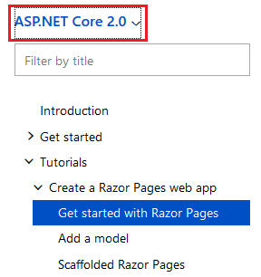
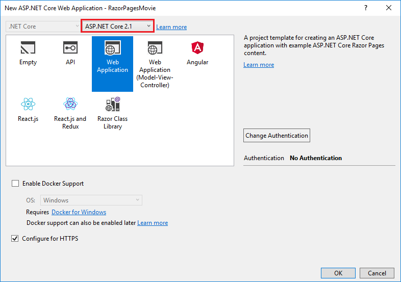
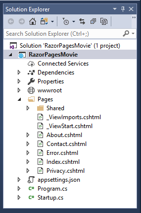
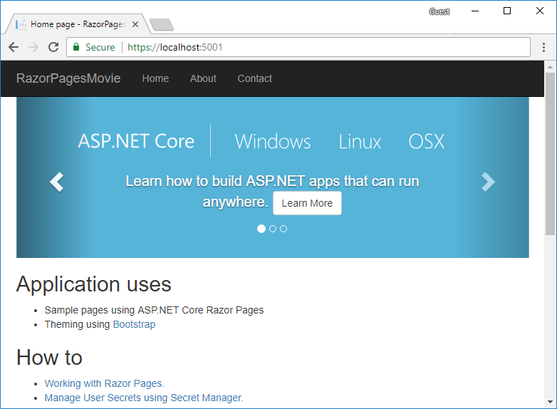
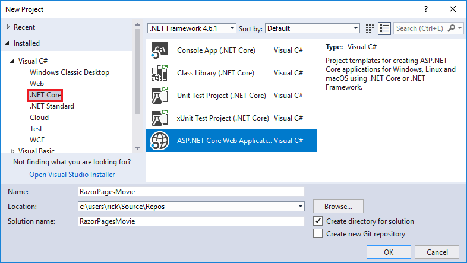

# Get started with Razor Pages in ASP.NET Core

By [Rick Anderson](https://twitter.com/RickAndMSFT)

::: moniker range="= aspnetcore-2.0"

We recommend you follow the ASP.NET Core 2.1 version of this tutorial. It's **much** easier to follow and covers more features. Select **ASP.NET Core 2.1** in the version selector.

::: moniker-end

This tutorial teaches the basics of building an ASP.NET Core Razor Pages web app. Razor Pages is the recommended way to build UI for web apps in ASP.NET Core.

There are three versions of this tutorial:

* Windows: This tutorial
* MacOS: [Get started with Razor Pages with Visual Studio for Mac](xref:tutorials/razor-pages-mac/razor-pages-start)
* macOS, Linux, and Windows: [Get started with ASP.NET Core Razor Pages in Visual Studio Code](xref:tutorials/razor-pages-vsc/razor-pages-start)

[View or download sample code](https://github.com/aspnet/Docs/tree/master/aspnetcore/tutorials/razor-pages/razor-pages-start/sample) ([how to download](xref:tutorials/index#how-to-download-a-sample))

::: moniker range=">= aspnetcore-2.1"

## Prerequisites

[!INCLUDE [Prerequisites](~/includes/net-core-prereqs-windows.md)]

## Create a Razor web app

* From the Visual Studio **File** menu, select **New** > **Project**.
* Create a new ASP.NET Core Web Application. Name the project **RazorPagesMovie**. It's important to name the project *RazorPagesMovie* so the namespaces will match when you copy/paste code.
 
* Select **ASP.NET Core 2.1** in the dropdown, and then select **Web Application**.

 

The Visual Studio template creates a starter project:

Press **F5** to run the app in debug mode or **Ctrl-F5** to run without attaching the debugger. Select **Accept** to consent to tracking. This app doesn't track personal information. The template generated code includes assets to help meet [General Data Protection Regulation (GDPR)](xref:security/gdpr).

The following image shows the app after accepting tracking:

* Visual Studio starts [IIS Express](/iis/extensions/introduction-to-iis-express/iis-express-overview) and runs the app. The address bar shows `localhost:port#` and not something like `example.com`. That's because `localhost` is the standard hostname for your local computer. Localhost only serves web requests from the local computer. When Visual Studio creates a web project, a random port is used for the web server. In the preceding image, the port number is 5000. When you run the app, you'll see a different port number.
* Launching the app with **Ctrl+F5** (non-debug mode) allows you to make code changes, save the file, refresh the browser, and see the code changes. Many developers prefer to use non-debug mode to quickly launch the app and view changes.

[!INCLUDE [razor-pages-start](~/includes/RP/2.1/razor-pages-start.md)]

::: moniker-end

::: moniker range="= aspnetcore-2.0"

## Prerequisites

[!INCLUDE [Prerequisites](~/includes/net-core-prereqs-windows.md)]

## Create a Razor web app

* From the Visual Studio **File** menu, select **New** > **Project**.
* Create a new ASP.NET Core Web Application. Name the project **RazorPagesMovie**. It's important to name the project *RazorPagesMovie* so the namespaces will match when you copy/paste code.
  
* Select **ASP.NET Core 2.0** in the dropdown, and then select **Web Application**.

  [!INCLUDE [install 2.0](~/includes/dotnetcore-on-dotnetfx-vs.md)]

The Visual Studio template creates a starter project:

Press **F5** to run the app in debug mode or **Ctrl-F5** to run without attaching the debugger

* Visual Studio starts [IIS Express](/iis/extensions/introduction-to-iis-express/iis-express-overview) and runs your app. The address bar shows `localhost:port#` and not something like `example.com`. That's because `localhost` is the standard hostname for your local computer. Localhost only serves web requests from the local computer. When Visual Studio creates a web project, a random port is used for the web server. In the preceding image, the port number is 5000. When you run the app, you'll see a different port number.
* Launching the app with **Ctrl+F5** (non-debug mode) allows you to make code changes, save the file, refresh the browser, and see the code changes. Many developers prefer to use non-debug mode to quickly launch the app and view changes.

[!INCLUDE [razor-pages-start](~/includes/RP/razor-pages-start.md)]

::: moniker-end

> [!div class="step-by-step"]
> [Next: Adding a model](xref:tutorials/razor-pages/model)
