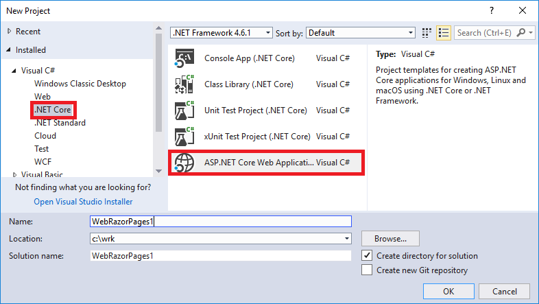
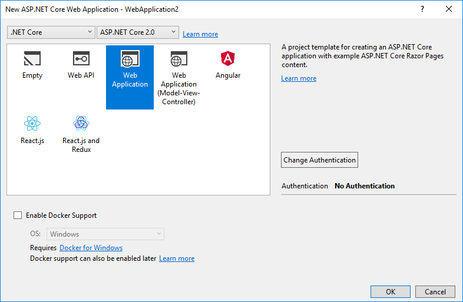
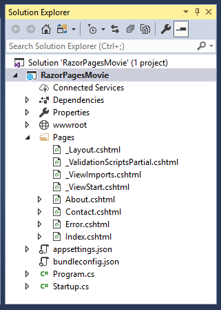
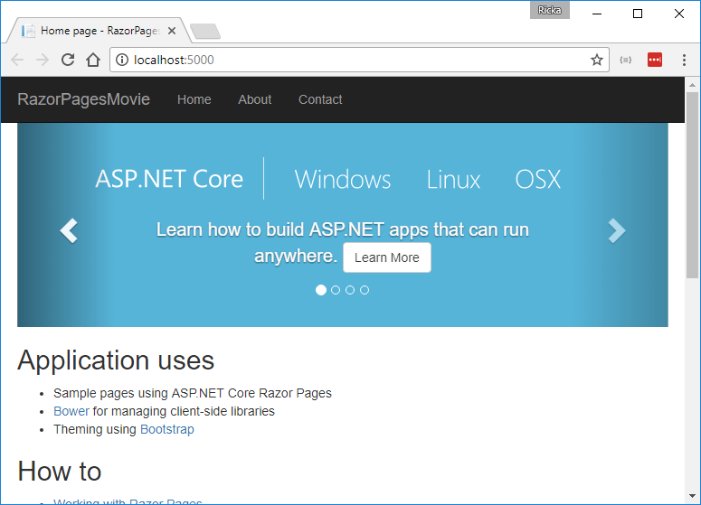

# Getting started with Razor Pages in ASP.NET Core

By [Rick Anderson](https://twitter.com/RickAndMSFT)

This tutorial teaches the basics of building an ASP.NET Core Razor Pages web app. We recommend you complete [Introduction to Razor Pages](xref:mvc/razor-pages/index) before starting this tutorial. Razor Pages is the recommended way to build UI for web applications in ASP.NET Core.

## Prerequisites

[!INCLUDE[install 2.0](../../includes/install2.0.md)]

## Create a Razor web app

* From the Visual Studio **File** menu, select **New > Project**.
* Create a new ASP.NET Core Web Application. Name the project **RazorPagesMovie**. It's important to name the project *RazorPagesMovie* so the namespaces will match when you copy/paste code.
 
* Select **ASP.NET Core 2.0** in the dropdown, and then select **Web Application**.
 

The Visual Studio template creates a starter project:

Press **F5** to run the app in debug mode or **Ctrl-F5** to run without attaching the debugger

* Visual Studio starts [IIS Express](https://docs.microsoft.com/iis/extensions/introduction-to-iis-express/iis-express-overview) and runs your app. The address bar shows `localhost:port#` and not something like `example.com`. That's because `localhost` is the standard hostname for your local computer. Localhost only serves web requests from the local computer. When Visual Studio creates a web project, a random port is used for the web server. In the preceding image, the port number is 5000. When you run the app, you'll see a different port number.
* Launching the app with **Ctrl+F5** (non-debug mode) allows you to make code changes, save the file, refresh the browser, and see the code changes. Many developers prefer to use non-debug mode to quickly launch the app and view changes.

[!INCLUDE[razor-pages-start](../../includes/RP/razor-pages-start.md)]

>[!div class="step-by-step"]
[Next: Adding a model](xref:tutorials/razor-pages/modelz)  
