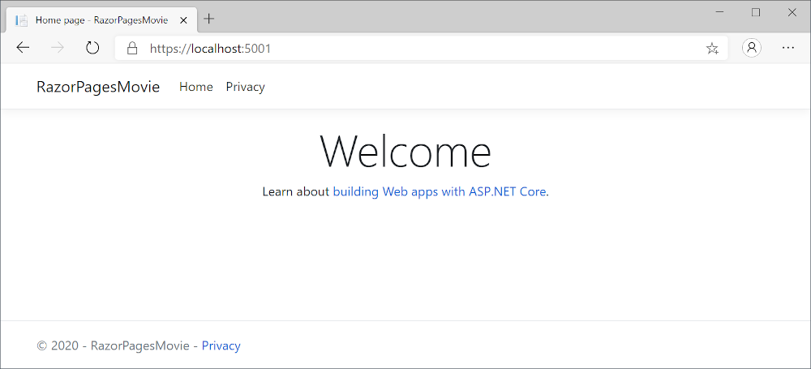
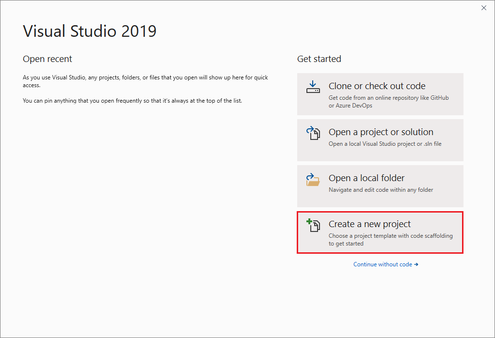
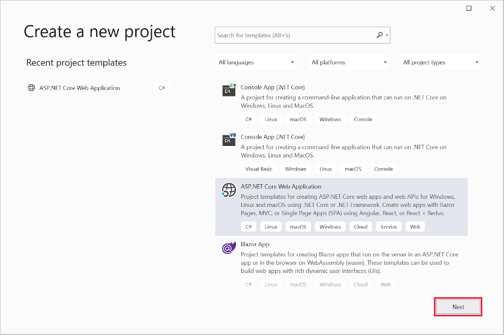
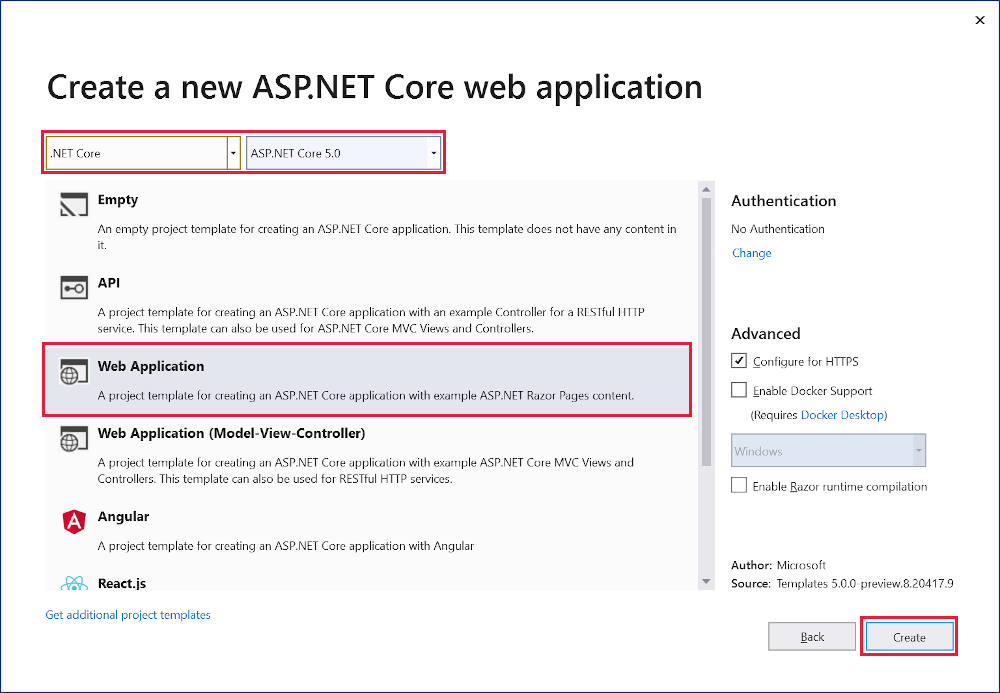

# Tutorial: Get started with Razor Pages in ASP.NET Core

By [Rick Anderson](https://twitter.com/RickAndMSFT)

::: moniker range=">= aspnetcore-5.0"
This is the first tutorial of a series that teaches the basics of building an ASP.NET Core Razor Pages web app.

For a more advanced introduction aimed at developers who are familiar with controllers and views, see [Introduction to Razor Pages](xref:razor-pages/index).

[!INCLUDE [Choose web UI](~/includes/choose-ui-link.md)]

At the end of the series, you'll have an app that manages a database of movies.  

[View or download sample code](https://github.com/dotnet/AspNetCore.Docs/tree/main/aspnetcore/tutorials/razor-pages/razor-pages-start/sample/RazorPagesMovie50) ([how to download](xref:index#how-to-download-a-sample)).

In this tutorial, you:

> [!div class="checklist"]
> * Create a Razor Pages web app.
> * Run the app.
> * Examine the project files.

At the end of this tutorial, you'll have a working Razor Pages web app that you'll enhance in later tutorials.



## Prerequisites

# [Visual Studio](#tab/visual-studio)

[!INCLUDE[](~/includes/net-core-prereqs-vs-5.0.md)]

# [Visual Studio Code](#tab/visual-studio-code)

[!INCLUDE[](~/includes/net-core-prereqs-vsc-5.0.md)]

# [Visual Studio for Mac](#tab/visual-studio-mac)

[!INCLUDE[](~/includes/net-core-prereqs-mac-5.0.md)]

---

## Create a Razor Pages web app

# [Visual Studio](#tab/visual-studio)

1. Start Visual Studio and select **Create a new project**. For more information, see [Create a new project in Visual Studio](/visualstudio/ide/create-new-project).

   

1. In the **Create a new project** dialog, select **ASP.NET Core Web Application**, and then select **Next**.

	
	
1. In the **Configure your new project** dialog, enter `RazorPagesMovie` for **Project name**. It's important to name the project *RazorPagesMovie*, including matching the capitalization, so the namespaces will match when you copy and paste example code.

1. Select **Create**.

	

1. In the **Create a new ASP.NET Core web application** dialog, select:
    1. **.NET Core** and **ASP.NET Core 5.0** in the dropdowns.
    1. **Web Application**.
    1. **Create**.

	 

	The following starter project is created:

	

# [Visual Studio Code](#tab/visual-studio-code)

1. Open the [integrated terminal](https://code.visualstudio.com/docs/editor/integrated-terminal).

1. Change to the directory (`cd`) which will contain the project.

1. Run the following commands:

   ```dotnetcli
   dotnet new webapp -o RazorPagesMovie
   code -r RazorPagesMovie
   ```

   * The `dotnet new` command creates a new Razor Pages project in the *RazorPagesMovie* folder.
   * The `code` command opens the *RazorPagesMovie* folder in the current instance of Visual Studio Code.

# [Visual Studio for Mac](#tab/visual-studio-mac)

1. Select **File** > **New Solution**.

	

1. In Visual Studio for Mac earlier than version 8.6, select **.NET Core** > **App** > **Web Application** > **Next**. In version 8.6 or later, select **Web and Console** > **App** > **Web Application** > **Next**.

	

1. In the **Configure the new Web Application** dialog:

	1. Confirm that **Authentication** is set to **No Authentication**.
	1. If presented an option to select a **Target Framework**, select the latest .NET 5.x version.
  	1. Select **Next**.

1. Name the project *RazorPagesMovie* and select **Create**.

	

<!-- End of VS tabs -->

---

## Run the app

  [!INCLUDE[](~/includes/run-the-app.md)]

## Examine the project files

Here's an overview of the main project folders and files that you'll work with in later tutorials.

### Pages folder

Contains Razor pages and supporting files. Each Razor page is a pair of files:

* A *.cshtml* file that has HTML markup with C# code using Razor syntax.
* A *.cshtml.cs* file that has C# code that handles page events.

Supporting files have names that begin with an underscore. For example, the *_Layout.cshtml* file configures UI elements common to all pages. This file sets up the navigation menu at the top of the page and the copyright notice at the bottom of the page. For more information, see <xref:mvc/views/layout>.

### wwwroot folder

Contains static assets, like HTML files, JavaScript files, and CSS files. For more information, see <xref:fundamentals/static-files>.

### appsettings.json

Contains configuration data, like connection strings. For more information, see <xref:fundamentals/configuration/index>.

### Program.cs

Contains the entry point for the app. For more information, see <xref:fundamentals/host/generic-host>.

### Startup.cs

Contains code that configures app behavior. For more information, see <xref:fundamentals/startup>.

## Next steps

> [!div class="step-by-step"]
> [Next: Add a model](xref:tutorials/razor-pages/model)

::: moniker-end

<!--::: moniker range=">= aspnetcore-5.0" -->

::: moniker range=">= aspnetcore-3.0 < aspnetcore-5.0"

This is the first tutorial of a series that teaches the basics of building an ASP.NET Core Razor Pages web app.

For a more advanced introduction aimed at developers who are familiar with controllers and views, see [Introduction to Razor Pages](xref:razor-pages/index).

At the end of the series, you'll have an app that manages a database of movies.  

[View or download sample code](https://github.com/dotnet/AspNetCore.Docs/tree/main/aspnetcore/tutorials/razor-pages/razor-pages-start/sample/RazorPagesMovie30) ([how to download](xref:index#how-to-download-a-sample)).

In this tutorial, you:

> [!div class="checklist"]
> * Create a Razor Pages web app.
> * Run the app.
> * Examine the project files.

At the end of this tutorial, you'll have a working Razor Pages web app that you'll build on in later tutorials.


## Prerequisites

# [Visual Studio](#tab/visual-studio)

[!INCLUDE[](~/includes/net-core-prereqs-vs-3.1.md)]

# [Visual Studio Code](#tab/visual-studio-code)

[!INCLUDE[](~/includes/net-core-prereqs-vsc-3.1.md)]

# [Visual Studio for Mac](#tab/visual-studio-mac)

[!INCLUDE[](~/includes/net-core-prereqs-mac-3.1.md)]

---

## Create a Razor Pages web app

# [Visual Studio](#tab/visual-studio)

* From the Visual Studio **File** menu, select **New** > **Project**.
* Create a new ASP.NET Core Web Application and select **Next**.
  
* Name the project **RazorPagesMovie**. It's important to name the project *RazorPagesMovie* so the namespaces will match when you copy and paste code.
  

* Select **ASP.NET Core 3.1** in the dropdown, **Web Application**, and then select **Create**.


  The following starter project is created:

  

# [Visual Studio Code](#tab/visual-studio-code)

* Open the [integrated terminal](https://code.visualstudio.com/docs/editor/integrated-terminal).

* Change to the directory (`cd`) which will contain the project.

* Run the following commands:

  ```dotnetcli
  dotnet new webapp -o RazorPagesMovie
  code -r RazorPagesMovie
  ```

  * The `dotnet new` command creates a new Razor Pages project in the *RazorPagesMovie* folder.
  * The `code` command opens the *RazorPagesMovie* folder in the current instance of Visual Studio Code.

* After the status bar's OmniSharp flame icon turns green, a dialog asks **Required assets to build and debug are missing from 'RazorPagesMovie'. Add them?** Select **Yes**.

  A *.vscode* directory, containing *launch.json* and *tasks.json* files, is added to the project's root directory.

  If Visual Studio Code doesn't offer to add the assets automatically, see the **Linux** operating system guidance in <xref:blazor/tooling?pivot=linux>.

# [Visual Studio for Mac](#tab/visual-studio-mac)

* Select **File** > **New Solution**.

  

* In Visual Studio for Mac earlier than version 8.6, select **.NET Core** > **App** > **Web Application** > **Next**. In version 8.6 or later, select **Web and Console** > **App** > **Web Application** > **Next**.

  

* In the **Configure the new Web Application** dialog:

  * Confirm that **Authentication** is set to **No Authentication**.
  * If presented an option to select a **Target Framework**, select the latest 3.x version.

  Select **Next**.

* Name the project **RazorPagesMovie**, and then select **Create**.

  

<!-- End of VS tabs -->

---

## Run the app

  [!INCLUDE[](~/includes/run-the-app.md)]

## Examine the project files

Here's an overview of the main project folders and files that you'll work with in later tutorials.

### Pages folder

Contains Razor pages and supporting files. Each Razor page is a pair of files:

* A *.cshtml* file that has HTML markup with C# code using Razor syntax.
* A *.cshtml.cs* file that has C# code that handles page events.

Supporting files have names that begin with an underscore. For example, the *_Layout.cshtml* file configures UI elements common to all pages. This file sets up the navigation menu at the top of the page and the copyright notice at the bottom of the page. For more information, see <xref:mvc/views/layout>.

### wwwroot folder

Contains static files, like HTML files, JavaScript files, and CSS files. For more information, see <xref:fundamentals/static-files>.

### appSettings.json

Contains configuration data, like connection strings. For more information, see <xref:fundamentals/configuration/index>.

### Program.cs

Contains the entry point for the program. For more information, see <xref:fundamentals/host/generic-host>.

### Startup.cs

Contains code that configures app behavior. For more information, see <xref:fundamentals/startup>.

## Next steps

> [!div class="step-by-step"]
> [Next: Add a model](xref:tutorials/razor-pages/model)

::: moniker-end

<!--::: moniker range=">= aspnetcore-3.0" -->

::: moniker range="< aspnetcore-3.0"

This is the first tutorial of a series. [The series](xref:tutorials/razor-pages/index) teaches the basics of building an ASP.NET Core Razor Pages web app.

For a more advanced introduction aimed at developers who are familiar with controllers and views, see [Introduction to Razor Pages](xref:razor-pages/index).

At the end of the series, you'll have an app that manages a database of movies.  

[View or download sample code](https://github.com/dotnet/AspNetCore.Docs/tree/main/aspnetcore/tutorials/razor-pages/razor-pages-start) ([how to download](xref:index#how-to-download-a-sample)).

In this tutorial, you:

> [!div class="checklist"]
> * Create a Razor Pages web app.
> * Run the app.
> * Examine the project files.

At the end of this tutorial, you'll have a working Razor Pages web app that you'll build on in later tutorials.


## Prerequisites

# [Visual Studio](#tab/visual-studio)

[!INCLUDE[](~/includes/net-core-prereqs-vs2019-2.2.md)]

# [Visual Studio Code](#tab/visual-studio-code)

[!INCLUDE[](~/includes/net-core-prereqs-vsc-2.2.md)]

# [Visual Studio for Mac](#tab/visual-studio-mac)

[!INCLUDE[](~/includes/net-core-prereqs-mac-2.2.md)]

---

## Create a Razor Pages web app

# [Visual Studio](#tab/visual-studio)

* From the Visual Studio **File** menu, select **New** > **Project**.

* Create a new ASP.NET Core Web Application and select **Next**.

  

* Name the project **RazorPagesMovie**. It's important to name the project *RazorPagesMovie* so the namespaces will match when you copy and paste code.

  

* Select **ASP.NET Core 2.2** in the dropdown, **Web Application**, and then select **Create**.


  The following starter project is created:

  

# [Visual Studio Code](#tab/visual-studio-code)

* Open the [integrated terminal](https://code.visualstudio.com/docs/editor/integrated-terminal).

* Change to the directory (`cd`) which will contain the project.

* Run the following commands:

  ```dotnetcli
  dotnet new webapp -o RazorPagesMovie
  code -r RazorPagesMovie
  ```

  * The `dotnet new` command creates a new Razor Pages project in the *RazorPagesMovie* folder.
  * The `code` command opens the *RazorPagesMovie* folder in the current instance of Visual Studio Code.

* After the status bar's OmniSharp flame icon turns green, a dialog asks **Required assets to build and debug are missing from 'RazorPagesMovie'. Add them?** Select **Yes**.

  A *.vscode* directory, containing *launch.json* and *tasks.json* files, is added to the project's root directory.

  If Visual Studio Code doesn't offer to add the assets automatically, see the **Linux** operating system guidance in <xref:blazor/tooling?pivot=linux>.

# [Visual Studio for Mac](#tab/visual-studio-mac)

* Select **File** > **New Solution**.


* In Visual Studio for Mac earlier than version 8.6, select **.NET Core** > **App** > **Web Application** > **Next**. In version 8.6 or later, select **Web and Console** > **App** > **Web Application** > **Next**.

* In the **Configure the new Web Application** dialog:

  * Confirm that **Authentication** is set to **No Authentication**.
  * If presented an option to select a **Target Framework**, select the latest 2.x version.

  Select **Next**.

* Name the project **RazorPagesMovie**, and then select **Create**.

  

<!-- End of VS tabs -->

---

## Run the app

# [Visual Studio](#tab/visual-studio)

* Press Ctrl+F5 to run without the debugger.

  Launching the app with <kbd>Ctrl+F5</kbd> (non-debug mode) allows you to make code changes, save the file, refresh the browser, and see the code changes. Many developers prefer to use non-debug mode to quickly launch the app and view changes.

  [!INCLUDE[](~/includes/trustCertVS.md)]

  Visual Studio starts [IIS Express](/iis/extensions/introduction-to-iis-express/iis-express-overview) and runs the app. The address bar shows `localhost:port#` and not something like `example.com`. That's because `localhost` is the standard hostname for the local computer. Localhost only serves web requests from the local computer. When Visual Studio creates a web project, a random port is used for the web server.

* On the app's home page, select **Accept** to consent to tracking.

  This app doesn't track personal information, but the project template includes the consent feature in case you need it to comply with the European Union's [General Data Protection Regulation (GDPR)](xref:security/gdpr).

  

  The following image shows the app after consent to tracking is provided:

  
  
# [Visual Studio Code](#tab/visual-studio-code)

  [!INCLUDE[](~/includes/trustCertVSC.md)]

* Press <kbd>Ctrl+F5</kbd> to run without the debugger.

  Launching the app with <kbd>Ctrl+F5</kbd> (non-debug mode) allows you to make code changes, save the file, refresh the browser, and see the code changes. Many developers prefer to use non-debug mode to quickly launch the app and view changes.

  Visual Studio Code starts [Kestrel](xref:fundamentals/servers/kestrel), launches a browser, and goes to `http://localhost:5001`. The address bar shows `localhost:port#` and not something like `example.com`. That's because `localhost` is the standard hostname for the local computer. Localhost only serves web requests from the local computer.

* On the app's home page, select **Accept** to consent to tracking.

  This app doesn't track personal information, but the project template includes the consent feature in case you need it to comply with the European Union's [General Data Protection Regulation (GDPR)](xref:security/gdpr).

  

  The following image shows the app after you give consent to tracking:

  
  
# [Visual Studio for Mac](#tab/visual-studio-mac)

  [!INCLUDE[](~/includes/trustCertMac.md)]

* Press **Cmd-Opt-F5** to run without the debugger.

  Launching the app with <kbd>Cmd+Opt+F5</kbd> (non-debug mode) allows you to make code changes, save the file, refresh the browser, and see the code changes. Many developers prefer to use non-debug mode to quickly launch the app and view changes.

  Visual Studio starts [Kestrel](xref:fundamentals/servers/kestrel), launches a browser, and goes to `http://localhost:5001`.

* On the app's home page, select **Accept** to consent to tracking.

  This app doesn't track personal information, but the project template includes the consent feature in case you need it to comply with the European Union's [General Data Protection Regulation (GDPR)](xref:security/gdpr).

  

  The following image shows the app after consent to tracking is provided:

  

<!-- End of VS tabs -->

---

## Examine the project files

Here's an overview of the main project folders and files that you'll work with in later tutorials.

### Pages folder

Contains Razor pages and supporting files. Each Razor page is a pair of files:

* A *.cshtml* file that has HTML markup with C# code using Razor syntax.
* A *.cshtml.cs* file that has C# code that handles page events.

Supporting files have names that begin with an underscore. For example, the *_Layout.cshtml* file configures UI elements common to all pages. This file sets up the navigation menu at the top of the page and the copyright notice at the bottom of the page. For more information, see <xref:mvc/views/layout>.

Razor Pages are derived from `PageModel`. By convention, the `PageModel`-derived class is named `<PageName>Model`.

### wwwroot folder

Contains static files, like HTML files, JavaScript files, and CSS files. For more information, see <xref:fundamentals/static-files>.

### appSettings.json

Contains configuration data, like connection strings. For more information, see <xref:fundamentals/configuration/index>.

### Program.cs

Contains the entry point for the program. For more information, see <xref:fundamentals/host/generic-host>.

### Startup.cs

Contains code that configures app behavior, such as whether it requires consent for cookies. For more information, see <xref:fundamentals/startup>.

## Additional resources

* [YouTube version of this tutorial](https://www.youtube.com/watch?v=F0SP7Ry4flQ&feature=youtu.be)

## Next steps

> [!div class="step-by-step"]
> [Next: Add a model](xref:tutorials/razor-pages/model)

::: moniker-end
