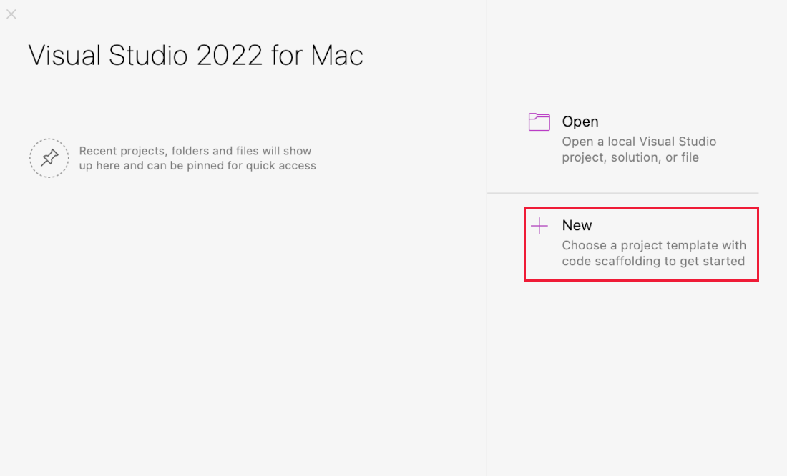
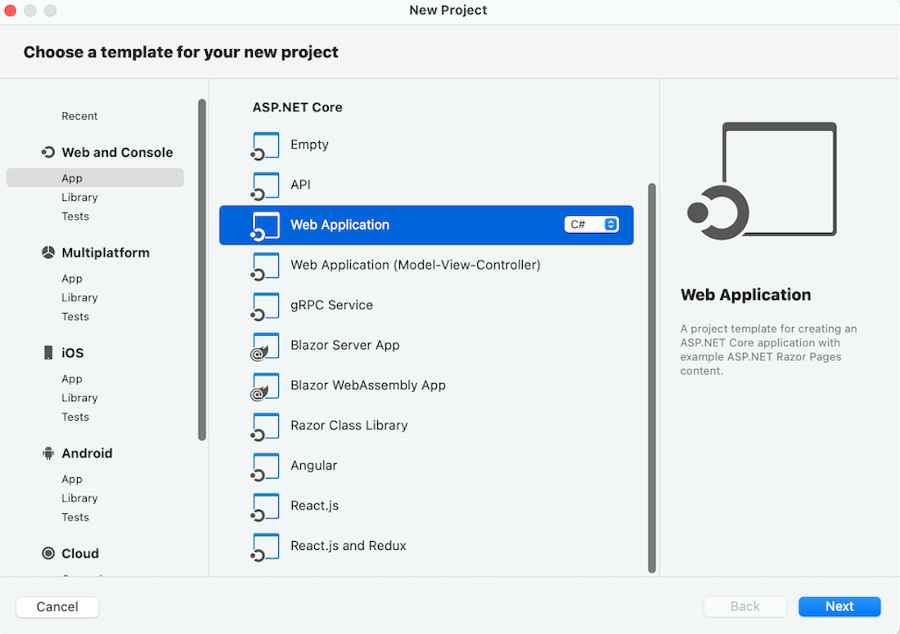
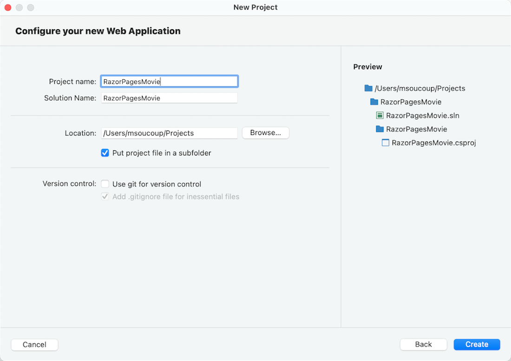

# Tutorial: Get started with Razor Pages in ASP.NET Core

By [Rick Anderson](https://twitter.com/RickAndMSFT)

:::moniker range=">= aspnetcore-6.0"
This is the first tutorial of a series that teaches the basics of building an ASP.NET Core Razor Pages web app.

For a more advanced introduction aimed at developers who are familiar with controllers and views, see [Introduction to Razor Pages](xref:razor-pages/index). For a video introduction, see [Entity Framework Core for Beginners](https://www.youtube.com/playlist?list=PLdo4fOcmZ0oXCPdC3fTFA3Z79-eVH3K-s).

[!INCLUDE [Choose web UI](~/includes/choose-ui-link.md)]

At the end of the series, you'll have an app that manages a database of movies.  

In this tutorial, you:

> [!div class="checklist"]
> * Create a Razor Pages web app.
> * Run the app.
> * Examine the project files.

At the end of this tutorial, you'll have a working Razor Pages web app that you'll enhance in later tutorials.


## Prerequisites

# [Visual Studio](#tab/visual-studio)

[!INCLUDE[](~/includes/net-prereqs-vs-6.0.md)]

# [Visual Studio Code](#tab/visual-studio-code)

[!INCLUDE[](~/includes/net-prereqs-vsc-6.0.md)]

# [Visual Studio for Mac](#tab/visual-studio-mac)

We hope to have Visual Studio for Mac instructions soon.

[!INCLUDE[](~/includes/net-prereqs-mac-6.0.md)]

---

## Create a Razor Pages web app

# [Visual Studio](#tab/visual-studio)

1. Start Visual Studio 2022 and select **Create a new project**.

   

1. In the **Create a new project** dialog, select **ASP.NET Core Web App**, and then select **Next**.

	
	
1. In the **Configure your new project** dialog, enter `RazorPagesMovie` for **Project name**. It's important to name the project *RazorPagesMovie*, including matching the capitalization, so the namespaces will match when you copy and paste example code.

	

1. Select **Next**.

1. In the **Additional information** dialog, select **.NET 6.0 (Long-term support)** and then select **Create**.

	 

	The following starter project is created:

	

# [Visual Studio Code](#tab/visual-studio-code)

1. Open the [integrated terminal](https://code.visualstudio.com/docs/editor/integrated-terminal).

1. Change to the directory (`cd`) that will contain the project.
1. Run the following commands:

   ```dotnetcli
   dotnet new webapp -o RazorPagesMovie
   code -r RazorPagesMovie
   ```
   Visual Studio Code displays a dialog box that asks **Do you trust the authors of the files in this folder**.  Select:
    * The checkbox **trust the authors of all files in the parent folder**
   * **Yes, I trust the authors** (because dotnet generated the files).

   The `dotnet new` command creates a new Razor Pages project in the *RazorPagesMovie* folder.

   The `code` command opens the *RazorPagesMovie* folder in the current instance of Visual Studio Code.

# [Visual Studio for Mac](#tab/visual-studio-mac)

1. Select **File** > **New Solution**.

	

1. In Visual Studio 2022 for Mac select **Web and Console** > **App** > **Web Application** > **Continue**.

	

1. In the **Configure your new Web Application** dialog:

	1. Confirm that **Authentication** is set to **No Authentication**.
	1. Confirm that **Target framework** is set to the latest .NET 6.x version.
  1. Select **Continue**.

1. Name the project *RazorPagesMovie* and select **Continue**.

	

---

## Run the app

# [Visual Studio](#tab/visual-studio)

<!-- replace all of this with updated includes  -->

Select **RazorPagesMovie** in **Solution Explorer**, and then press Ctrl+F5 to run without the debugger.

Visual Studio displays the following dialog when a project is not yet configured to use SSL:


Select **Yes** if you trust the IIS Express SSL certificate.

The following dialog is displayed:


Select **Yes** if you agree to trust the development certificate.

[!INCLUDE[trust FF](~/includes/trust-ff.md)]

Visual Studio:

* Runs the app, which  launches the [Kestrel server](xref:fundamentals/servers/kestrel).
* Launches the default browser at `https://localhost:5001`, which displays the apps UI.

# [Visual Studio Code](#tab/visual-studio-code)

[!INCLUDE[](~/includes/trustCertVSC.md)]

In Visual Studio Code, press Ctrl+F5 to run the app. At the **Select environment** prompt, select **.NET Core**. 

The default browser launched with the following URL: [https://localhost:5001](https://localhost:5001)

# [Visual Studio for Mac](#tab/visual-studio-mac)

Select **Run** > **Start Debugging** to launch the app. Visual Studio for Mac launches a browser and navigates to `https://localhost:<port>`, where `<port>` is a randomly chosen port number.

---

## Examine the project files

The following sections contain an overview of the main project folders and files that you'll work with in later tutorials.

### Pages folder

Contains Razor pages and supporting files. Each Razor page is a pair of files:

* A `.cshtml` file that has HTML markup with C# code using Razor syntax.
* A `.cshtml.cs` file that has C# code that handles page events.

Supporting files have names that begin with an underscore. For example, the `_Layout.cshtml` file configures UI elements common to all pages. This file sets up the navigation menu at the top of the page and the copyright notice at the bottom of the page. For more information, see <xref:mvc/views/layout>.

### wwwroot folder

Contains static assets, like HTML files, JavaScript files, and CSS files. For more information, see <xref:fundamentals/static-files>.

### appsettings.json

Contains configuration data, like connection strings. For more information, see <xref:fundamentals/configuration/index>.

### Program.cs

Contains the following code:

[!code-csharp[](~/tutorials/razor-pages/razor-pages-start/sample/RazorPagesMovie60/Program1Snip.cs?name=snippet_all)]

The following lines of code in this file create a `WebApplicationBuilder` with preconfigured defaults, add Razor Pages support to the [Dependency Injection (DI) container](xref:fundamentals/dependency-injection), and build the app:

[!code-csharp[](~/tutorials/razor-pages/razor-pages-start/sample/RazorPagesMovie60/Program1Snip.cs?name=snippet_di)]

The developer exception page is enabled by default and provides helpful information on exceptions. Production apps should not be run in development mode because the developer exception page can leak sensitive information.

The following code sets the exception endpoint to `/Error` and enables [HTTP Strict Transport Security Protocol (HSTS)](xref:security/enforcing-ssl#http-strict-transport-security-protocol-hsts) when the app is ***not*** running in development mode:

[!code-csharp[](~/tutorials/razor-pages/razor-pages-start/sample/RazorPagesMovie60/Program1Snip.cs?name=snippet_env)]

For example, the preceding code runs when the app is in production or test mode. For more information, see [Use multiple environments in ASP.NET Core](xref:fundamentals/environments).

The following code enables various [Middleware](xref:fundamentals/middleware/index):

* `app.UseHttpsRedirection();` : Redirects HTTP requests to HTTPS.
* `app.UseStaticFiles();` : Enables static files, such as HTML, CSS, images, and JavaScript to be served. For more information, see <xref:fundamentals/static-files>.
* `app.UseRouting();` : Adds route matching to the middleware pipeline. For more information, see <xref:fundamentals/routing>
* `app.MapRazorPages();`: Configures endpoint routing for Razor Pages.
* `app.UseAuthorization();` : Authorizes a user to access secure resources. This app doesn't use authorization, therefore this line could be removed.
* `app.Run();` : Runs the app.

## Troubleshooting with the completed sample

If you run into a problem you can't resolve, compare your code to the completed project. [View or download completed project](https://github.com/dotnet/AspNetCore.Docs/tree/main/aspnetcore/tutorials/razor-pages/razor-pages-start/sample/RazorPagesMovie60) ([how to download](xref:index#how-to-download-a-sample)).

## Next steps

> [!div class="step-by-step"]
> [Next: Add a model](xref:tutorials/razor-pages/model)

:::moniker-end


:::moniker range=">= aspnetcore-5.0 < aspnetcore-6.0"
This is the first tutorial of a series that teaches the basics of building an ASP.NET Core Razor Pages web app.

For a more advanced introduction aimed at developers who are familiar with controllers and views, see [Introduction to Razor Pages](xref:razor-pages/index).

[!INCLUDE [Choose web UI](~/includes/choose-ui-link.md)]

At the end of the series, you'll have an app that manages a database of movies.  

In this tutorial, you:

> [!div class="checklist"]
> * Create a Razor Pages web app.
> * Run the app.
> * Examine the project files.

At the end of this tutorial, you'll have a working Razor Pages web app that you'll enhance in later tutorials.


## Prerequisites

# [Visual Studio](#tab/visual-studio)

[!INCLUDE[](~/includes/net-core-prereqs-vs-5.0.md)]

# [Visual Studio Code](#tab/visual-studio-code)

[!INCLUDE[](~/includes/net-core-prereqs-vsc-5.0.md)]

# [Visual Studio for Mac](#tab/visual-studio-mac)

[!INCLUDE[](~/includes/net-core-prereqs-mac-5.0.md)]

---

## Create a Razor Pages web app

# [Visual Studio](#tab/visual-studio)

1. Start Visual Studio and select **Create a new project**. For more information, see [Create a new project in Visual Studio](/visualstudio/ide/create-new-project).

   

1. In the **Create a new project** dialog, select **ASP.NET Core Web Application**, and then select **Next**.

	
	
1. In the **Configure your new project** dialog, enter `RazorPagesMovie` for **Project name**. It's important to name the project *RazorPagesMovie*, including matching the capitalization, so the namespaces will match when you copy and paste example code.

1. Select **Create**.

	

1. In the **Create a new ASP.NET Core web application** dialog, select:
    1. **.NET Core** and **ASP.NET Core 5.0** in the dropdowns.
    1. **Web Application**.
    1. **Create**.

	 

	The following starter project is created:

	

# [Visual Studio Code](#tab/visual-studio-code)

1. Open the [integrated terminal](https://code.visualstudio.com/docs/editor/integrated-terminal).

1. Change to the directory (`cd`) which will contain the project.

1. Run the following commands:

   ```dotnetcli
   dotnet new webapp -o RazorPagesMovie
   code -r RazorPagesMovie
   ```

   * The `dotnet new` command creates a new Razor Pages project in the *RazorPagesMovie* folder.
   * The `code` command opens the *RazorPagesMovie* folder in the current instance of Visual Studio Code.

# [Visual Studio for Mac](#tab/visual-studio-mac)

1. Select **File** > **New Solution**.

	

1. In Visual Studio for Mac earlier than version 8.6, select **.NET Core** > **App** > **Web Application** > **Next**. In version 8.6 or later, select **Web and Console** > **App** > **Web Application** > **Next**.

	

1. In the **Configure the new Web Application** dialog:

	1. Confirm that **Authentication** is set to **No Authentication**.
	1. If presented an option to select a **Target Framework**, select the latest .NET 5.x version.
  	1. Select **Next**.

1. Name the project *RazorPagesMovie* and select **Create**.

	

<!-- End of VS tabs -->

---

## Run the app

  [!INCLUDE[](~/includes/run-the-app.md)]

## Examine the project files

Here's an overview of the main project folders and files that you'll work with in later tutorials.

### Pages folder

Contains Razor pages and supporting files. Each Razor page is a pair of files:

* A `.cshtml` file that has HTML markup with C# code using Razor syntax.
* A `.cshtml.cs` file that has C# code that handles page events.

Supporting files have names that begin with an underscore. For example, the `_Layout.cshtml` file configures UI elements common to all pages. This file sets up the navigation menu at the top of the page and the copyright notice at the bottom of the page. For more information, see <xref:mvc/views/layout>.

### wwwroot folder

Contains static assets, like HTML files, JavaScript files, and CSS files. For more information, see <xref:fundamentals/static-files>.

### appsettings.json

Contains configuration data, like connection strings. For more information, see <xref:fundamentals/configuration/index>.

### Program.cs

Contains the entry point for the app. For more information, see <xref:fundamentals/host/generic-host>.

### Startup.cs

Contains code that configures app behavior. For more information, see <xref:fundamentals/startup>.

## Troubleshooting with the completed sample

If you run into a problem you can't resolve, compare your code to the completed project. [View or download completed project](https://github.com/dotnet/AspNetCore.Docs/tree/main/aspnetcore/tutorials/razor-pages/razor-pages-start/sample/RazorPagesMovie50) ([how to download](xref:index#how-to-download-a-sample)).

## Next steps

> [!div class="step-by-step"]
> [Next: Add a model](xref:tutorials/razor-pages/model)

:::moniker-end

:::moniker range="< aspnetcore-5.0"

This is the first tutorial of a series that teaches the basics of building an ASP.NET Core Razor Pages web app.

For a more advanced introduction aimed at developers who are familiar with controllers and views, see [Introduction to Razor Pages](xref:razor-pages/index).

At the end of the series, you'll have an app that manages a database of movies.  

[View or download sample code](https://github.com/dotnet/AspNetCore.Docs/tree/main/aspnetcore/tutorials/razor-pages/razor-pages-start/sample/RazorPagesMovie30) ([how to download](xref:index#how-to-download-a-sample)).

In this tutorial, you:

> [!div class="checklist"]
> * Create a Razor Pages web app.
> * Run the app.
> * Examine the project files.

At the end of this tutorial, you'll have a working Razor Pages web app that you'll build on in later tutorials.


## Prerequisites

# [Visual Studio](#tab/visual-studio)

[!INCLUDE[](~/includes/net-core-prereqs-vs-3.1.md)]

# [Visual Studio Code](#tab/visual-studio-code)

[!INCLUDE[](~/includes/net-core-prereqs-vsc-3.1.md)]

# [Visual Studio for Mac](#tab/visual-studio-mac)

[!INCLUDE[](~/includes/net-core-prereqs-mac-3.1.md)]

---

## Create a Razor Pages web app

# [Visual Studio](#tab/visual-studio)

* From the Visual Studio **File** menu, select **New** > **Project**.
* Create a new ASP.NET Core Web Application and select **Next**.
  
* Name the project **RazorPagesMovie**. It's important to name the project *RazorPagesMovie* so the namespaces will match when you copy and paste code.
  

* Select **ASP.NET Core 3.1** in the dropdown, **Web Application**, and then select **Create**.


  The following starter project is created:

  

# [Visual Studio Code](#tab/visual-studio-code)

* Open the [integrated terminal](https://code.visualstudio.com/docs/editor/integrated-terminal).

* Change to the directory (`cd`) which will contain the project.

* Run the following commands:

  ```dotnetcli
  dotnet new webapp -o RazorPagesMovie
  code -r RazorPagesMovie
  ```

  * The `dotnet new` command creates a new Razor Pages project in the *RazorPagesMovie* folder.
  * The `code` command opens the *RazorPagesMovie* folder in the current instance of Visual Studio Code.

* After the status bar's OmniSharp flame icon turns green, a dialog asks **Required assets to build and debug are missing from 'RazorPagesMovie'. Add them?** Select **Yes**.

  A *.vscode* directory, containing `launch.json` and `tasks.json` files, is added to the project's root directory.

  If Visual Studio Code doesn't offer to add the assets automatically, see the **Linux** operating system guidance in <xref:blazor/tooling?pivot=linux>.

# [Visual Studio for Mac](#tab/visual-studio-mac)

* Select **File** > **New Solution**.

  

* In Visual Studio for Mac earlier than version 8.6, select **.NET Core** > **App** > **Web Application** > **Next**. In version 8.6 or later, select **Web and Console** > **App** > **Web Application** > **Next**.

  

* In the **Configure the new Web Application** dialog:

  * Confirm that **Authentication** is set to **No Authentication**.
  * If presented an option to select a **Target Framework**, select the latest 3.x version.

  Select **Next**.

* Name the project **RazorPagesMovie**, and then select **Create**.

  

<!-- End of VS tabs -->

---

## Run the app

  [!INCLUDE[](~/includes/run-the-app.md)]

## Examine the project files

Here's an overview of the main project folders and files that you'll work with in later tutorials.

### Pages folder

Contains Razor pages and supporting files. Each Razor page is a pair of files:

* A `.cshtml` file that has HTML markup with C# code using Razor syntax.
* A `.cshtml.cs` file that has C# code that handles page events.

Supporting files have names that begin with an underscore. For example, the `_Layout.cshtml` file configures UI elements common to all pages. This file sets up the navigation menu at the top of the page and the copyright notice at the bottom of the page. For more information, see <xref:mvc/views/layout>.

### wwwroot folder

Contains static files, like HTML files, JavaScript files, and CSS files. For more information, see <xref:fundamentals/static-files>.

### appSettings.json

Contains configuration data, like connection strings. For more information, see <xref:fundamentals/configuration/index>.

### Program.cs

Contains the entry point for the program. For more information, see <xref:fundamentals/host/generic-host>.

### Startup.cs

Contains code that configures app behavior. For more information, see <xref:fundamentals/startup>.

## Next steps

> [!div class="step-by-step"]
> [Next: Add a model](xref:tutorials/razor-pages/model)

:::moniker-end
