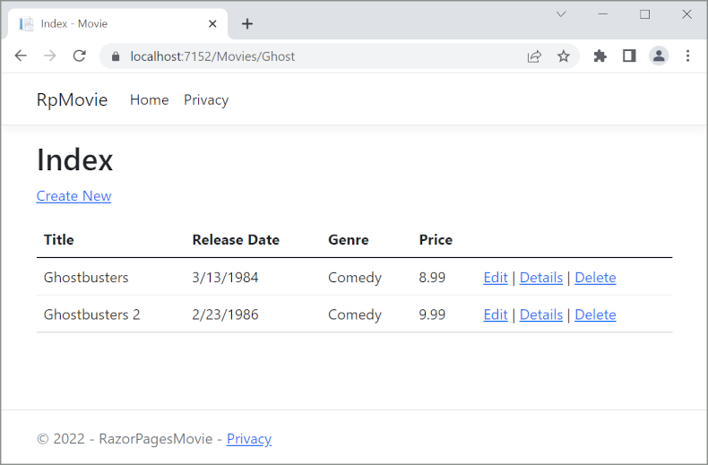

# Adding Search to an ASP.NET Core MVC app

By [Rick Anderson](https://twitter.com/RickAndMSFT)

In this section you add search capability to the `Index` action method that lets you search movies by *genre* or *name*.

Update the `Index` method with the following code:

[!code-csharp[Main](razor-pages-start/sample/RazorPagesMovie/Pages/Movies/Index.cshtml.cs?name=snippet_1stSearch)]

The first line of the `Index` action method creates a [LINQ](https://docs.microsoft.com/dotnet/csharp/programming-guide/concepts/linq/) query to select the movies:

```csharp
 var movies = from m in _context.Movie
              select m;
```

The query is *only* defined at this point, it has **not** been run against the database.

If the `searchString` parameter contains a string, the movies query is modified to filter on the value of the search string:

[!code-csharp[Main](razor-pages-start/sample/RazorPagesMovie/Pages/Movies/Index.cshtml.cs?name=snippet_SearchNull)]

The `s => s.Title.Contains()` code is a [Lambda Expression](https://docs.microsoft.com/en-us/dotnet/csharp/programming-guide/statements-expressions-operators/lambda-expressions). Lambdas are used in method-based [LINQ](https://docs.microsoft.com/dotnet/csharp/programming-guide/concepts/linq/) queries as arguments to standard query operator methods such as the [Where](http://msdn.microsoft.com/library/system.linq.enumerable.where.aspx) method or `Contains` (used in the preceeding code). LINQ queries are not executed when they are defined or when they are modified by calling a method such as `Where`, `Contains`  or `OrderBy`. Rather, query execution is deferred.  That means that the evaluation of an expression is delayed until its realized value is actually iterated over or the `ToListAsync` method is called. For more information about deferred query execution, see [Query Execution](https://docs.microsoft.com/en-us/dotnet/framework/data/adonet/ef/language-reference/query-execution).

Note: The [Contains](http://msdn.microsoft.com/library/bb155125.aspx) method is run on the database, not in the c# code. The case sensitivity on the query depends on the database and the collation. On SQL Server, `Contains` maps to [SQL LIKE](https://docs.microsoft.com/en-us/sql/t-sql/language-elements/like-transact-sql), which is case insensitive. In SQLlite, with the default collation, it's case sensitive.

Navigate to the Movies page and append a query string such as `?searchString=Ghost` to the URL (for example, `http://localhost:5000/Movies?searchString=Ghost`). The filtered movies are displayed.


If you add the following route template to the Index page, you can pass the search string as route data.

```cshtml
@page "{searchString?}"
```

The preceding  route constraint allows searching the title as route data (a URL segment) instead of as a query string value.



However, you can't expect users to modify the URL every time they want to search for a movie. So now you'll add UI to help them filter movies. If you added the route constraint `"{searchString?}"`, remove it.

Open the *Pages/Movies/Index.cshtml* file, and add the `<form>` markup highlighted below:

[!code-cshtml[Main](razor-pages-start/sample/RazorPagesMovie/Pages/Movies/Index2.cshtml?highlight=14-19&range=1-21)]

The HTML `<form>` tag uses the [Form Tag Helper](xref:mvc/views/working-with-forms#the-form-tag-helper). When you submit the form, the filter string is posted to the Pages/Movies/Index Razor Page. Save your changes and test the filter.


## Adding Search by genre

Add the the following highlighted properties to the *Pages/Movies/Index.cshtml.cs* file:

[!code-csharp[Main](razor-pages-start/sample/RazorPagesMovie/Pages/Movies/Index.cshtml.cs?name=snippet_selectlist&highlight=11-)]

The `SelectList Genres` containing the list of genres. This will allow the user to select a genre from the list.

The `MovieGenre` property contains the selected genre.

Update the `OnGetAsync` method with the following code:

[!code-csharp[Main](razor-pages-start/sample/RazorPagesMovie/Pages/Movies/Index.cshtml.cs?name=snippet_SearchGenre)]

The following code is a `LINQ` query that retrieves all the genres from the database.

[!code-csharp[Main](razor-pages-start/sample/RazorPagesMovie/Pages/Movies/Index.cshtml.cs?name=snippet_LINQ)]

The `SelectList` of genres is created by projecting the distinct genres.

<!-- BUG in OPS 
Tag snippet_selectlist's start line '75' should be less than end line '29' when resolving "[!code-csharp[Main](razor-pages-start/sample/RazorPagesMovie/Pages/Movies/Index.cshtml.cs?name=snippet_SelectList)]"

There is no start line.

[!code-csharp[Main](razor-pages-start/sample/RazorPagesMovie/Pages/Movies/Index.cshtml.cs?name=snippet_SelectList)]
-->

```csharp
Genres = new SelectList(await genreQuery.Distinct().ToListAsync());
```

## Adding search by genre to the Index view

Update `Index.cshtml` as follows:

[!code-cshtml[Main](razor-pages-start/sample/RazorPagesMovie/Pages/Movies/IndexFormGenreNoRating.cshtml?highlight=16-18)]

Examine the lambda expression used in the following HTML Helper:

`@Html.DisplayNameFor(model => model.Movies[0].Title))`
 
In the preceding code, the `DisplayNameFor` HTML Helper inspects the `Title` property referenced in the lambda expression to determine the display name. Since the lambda expression is inspected rather than evaluated, you don't receive an access violation when `model`, `model.Movies`, or `model.Movies[0]` are `null` or empty. When the lambda expression is evaluated (for example, with `@Html.DisplayFor(modelItem => item.Title)`), the model's property values are evaluated.

Test the app by searching by genre, by movie title, and by both.


>[!div class="step-by-step"]
[Previous Updating the pages](xref:tutorials/razor-pages/da1)