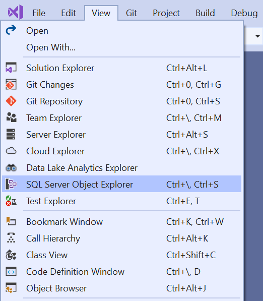
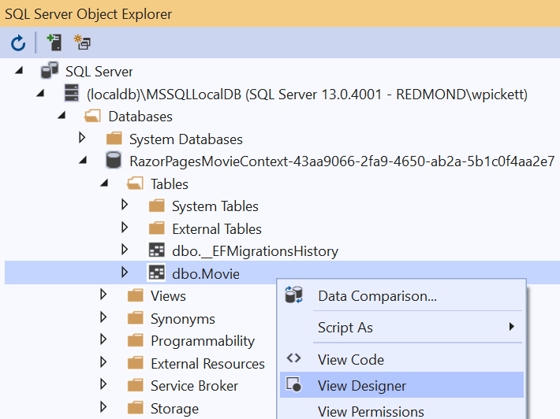
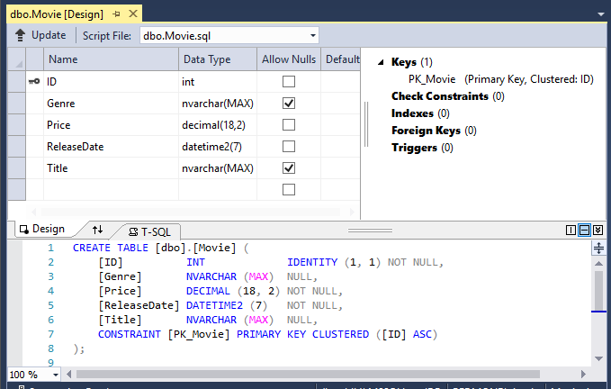
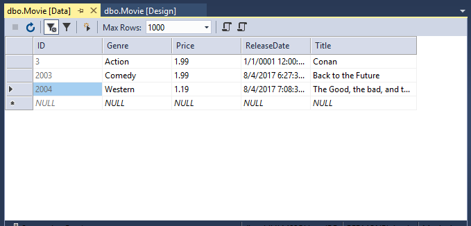
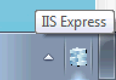
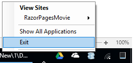
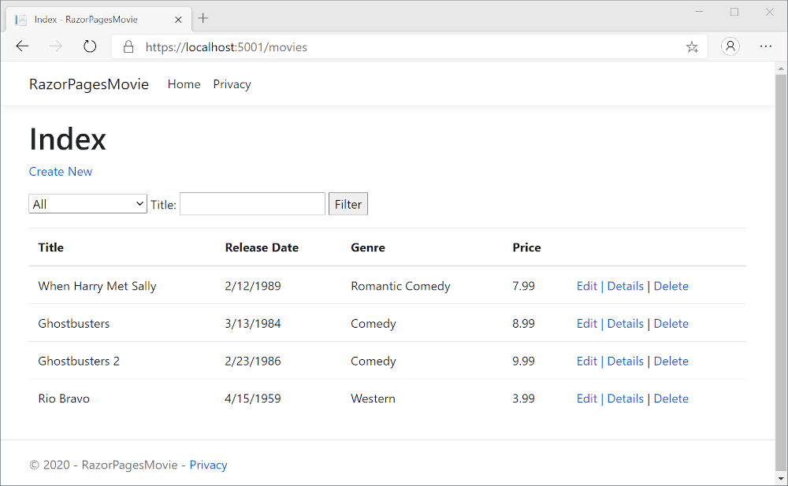
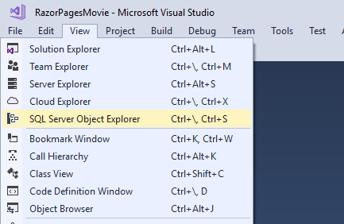
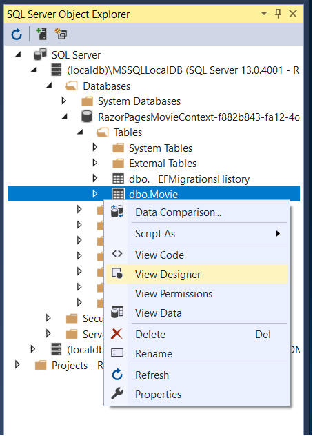

# Part 4 of tutorial series on Razor Pages

By [Rick Anderson](https://twitter.com/RickAndMSFT) and [Joe Audette](https://twitter.com/joeaudette)

:::moniker range="= aspnetcore-5.0"

[View or download sample code](https://github.com/dotnet/AspNetCore.Docs/tree/main/aspnetcore/tutorials/razor-pages/razor-pages-start/sample/RazorPagesMovie50) ([how to download](xref:index#how-to-download-a-sample)).

The `RazorPagesMovieContext` object handles the task of connecting to the database and mapping `Movie` objects to database records. The database context is registered with the [Dependency Injection](xref:fundamentals/dependency-injection) container in the `ConfigureServices` method in `Startup.cs`:

# [Visual Studio](#tab/visual-studio)

[!code-csharp[](razor-pages-start/sample/RazorPagesMovie50/Startup.cs?name=snippet_ConfigureServices&highlight=5-6)]

# [Visual Studio Code / Visual Studio for Mac](#tab/visual-studio-code+visual-studio-mac)

[!code-csharp[](razor-pages-start/sample/RazorPagesMovie50/Startup.cs?name=snippet_UseSqlite&highlight=5-6)]

---

The ASP.NET Core [Configuration](xref:fundamentals/configuration/index) system reads the `ConnectionString` key. For local development, configuration gets the connection string from the `appsettings.json` file.

# [Visual Studio](#tab/visual-studio)

The generated connection string is similar to the following JSON:

[!code-json[](razor-pages-start/sample/RazorPagesMovie50/appsettings.json?highlight=10-12)]

# [Visual Studio Code / Visual Studio for Mac](#tab/visual-studio-code+visual-studio-mac)

[!code-json[](~/tutorials/razor-pages/razor-pages-start/sample/RazorPagesMovie50/appsettings_SQLite.json?highlight=10-12)]

---

When the app is deployed to a test or production server, an environment variable can be used to set the connection string to a test or production database server. For more information, see [Configuration](xref:fundamentals/configuration/index).

# [Visual Studio](#tab/visual-studio)

## SQL Server Express LocalDB

LocalDB is a lightweight version of the SQL Server Express database engine that's targeted for program development. LocalDB starts on demand and runs in user mode, so there's no complex configuration. By default, LocalDB database creates `*.mdf` files in the `C:\Users\<user>\` directory.

<a name="ssox"></a>
1. From the **View** menu, open **SQL Server Object Explorer** (SSOX).

   

1. Right-click on the `Movie` table and select **View Designer**:

   

   

   Note the key icon next to `ID`. By default, EF creates a property named `ID` for the primary key.

1. Right-click on the `Movie` table and select **View Data**:

   

# [Visual Studio Code / Visual Studio for Mac](#tab/visual-studio-code+visual-studio-mac)

## SQLite

The [SQLite](https://www.sqlite.org/) website states:

> SQLite is a self-contained, high-reliability, embedded, full-featured, public-domain, SQL database engine. SQLite is the most used database engine in the world.

There are many third-party tools you can download to manage and view a SQLite database. The image below is from [DB Browser for SQLite](https://sqlitebrowser.org/). If you have a favorite SQLite tool, leave a comment on what you like about it.


> [!NOTE]
> For this tutorial, the Entity Framework Core *migrations* feature is used where possible. Migrations updates the database schema to match changes in the data model. However, migrations can only do the kinds of changes that the EF Core provider supports, and the SQLite provider's capabilities are limited. For example, adding a column is supported, but removing or changing a column is not supported. If a migration is created to remove or change a column, the `ef migrations add` command succeeds but the `ef database update` command fails. Due to these limitations, this tutorial doesn't use migrations for SQLite schema changes. Instead, when the schema changes, the database is dropped and re-created.
>
>The workaround for the SQLite limitations is to manually write migrations code to perform a table rebuild when something in the table changes. A table rebuild involves:
>
>* Creating a new table.
>* Copying data from the old table to the new table.
>* Dropping the old table.
>* Renaming the new table.
>
>For more information, see the following resources:
> * [SQLite EF Core Database Provider Limitations](/ef/core/providers/sqlite/limitations)
> * [Customize migration code](/ef/core/managing-schemas/migrations/#customize-migration-code)
> * [Data seeding](/ef/core/modeling/data-seeding)
> * [SQLite ALTER TABLE statement](https://sqlite.org/lang_altertable.html)

---

## Seed the database

Create a new class named `SeedData` in the *Models* folder with the following code:

[!code-csharp[](razor-pages-start/sample/RazorPagesMovie30/Models/SeedData.cs?name=snippet_1)]

If there are any movies in the database, the seed initializer returns and no movies are added.

```csharp
if (context.Movie.Any())
{
    return;
}
```

<a name="si"></a>

### Add the seed initializer

Replace the contents of the `Program.cs` with the following code:

[!code-csharp[](razor-pages-start/sample/RazorPagesMovie50/Program.cs)]

In the previous code, the `Main` method has been modified to do the following:

* Get a database context instance from the dependency injection container.
* Call the `seedData.Initialize` method, passing to it the database context instance.
* Dispose the context when the seed method completes. The [using statement](/dotnet/csharp/language-reference/keywords/using-statement) ensures the context is disposed.

The following exception occurs when `Update-Database` has not been run:

> `SqlException: Cannot open database "RazorPagesMovieContext-" requested by the login. The login failed.`
> `Login failed for user 'user name'.`

### Test the app

# [Visual Studio](#tab/visual-studio)

1. Delete all the records in the database. Use the delete links in the browser or from [SSOX](xref:tutorials/razor-pages/new-field#ssox)

1. Force the app to initialize by calling the methods in the `Startup` class, so the seed method runs. To force initialization, IIS Express must be stopped and restarted. Stop and restart IIS with any of the following approaches:

   1. Right-click the IIS Express system tray icon in the notification area and select **Exit** or **Stop Site**:

      

      

   1. If the app is running in non-debug mode, press <kbd>F5</kbd> to run in debug mode.
   1. If the app in debug mode, stop the debugger and press <kbd>F5</kbd>.

# [Visual Studio Code / Visual Studio for Mac](#tab/visual-studio-code+visual-studio-mac)

Delete all the records in the database, so the seed method will run. Stop and start the app to seed the database.

---

The app shows the seeded data:



## Additional resources

> [!div class="step-by-step"]
> [Previous: Scaffolded Razor Pages](xref:tutorials/razor-pages/page)
> [Next: Update the pages](xref:tutorials/razor-pages/da1)

:::moniker-end

:::moniker range="< aspnetcore-5.0"

[View or download sample code](https://github.com/dotnet/AspNetCore.Docs/tree/main/aspnetcore/tutorials/razor-pages/razor-pages-start/sample/RazorPagesMovie30) ([how to download](xref:index#how-to-download-a-sample)).

The `RazorPagesMovieContext` object handles the task of connecting to the database and mapping `Movie` objects to database records. The database context is registered with the [Dependency Injection](xref:fundamentals/dependency-injection) container in the `ConfigureServices` method in `Startup.cs`:

# [Visual Studio](#tab/visual-studio)

[!code-csharp[](razor-pages-start/sample/RazorPagesMovie30/Startup.cs?name=snippet_ConfigureServices&highlight=5-6)]

# [Visual Studio Code / Visual Studio for Mac](#tab/visual-studio-code+visual-studio-mac)

[!code-csharp[](razor-pages-start/sample/RazorPagesMovie30/Startup.cs?name=snippet_UseSqlite&highlight=5-6)]

---

The ASP.NET Core [Configuration](xref:fundamentals/configuration/index) system reads the `ConnectionString` key. For local development, configuration gets the connection string from the `appsettings.json` file.

# [Visual Studio](#tab/visual-studio)

The generated connection string will be similar to the following:

[!code-json[](razor-pages-start/sample/RazorPagesMovie30/appsettings.json?highlight=10-12)]

# [Visual Studio Code / Visual Studio for Mac](#tab/visual-studio-code+visual-studio-mac)

[!code-json[](~/tutorials/razor-pages/razor-pages-start/sample/RazorPagesMovie30/appsettings_SQLite.json?highlight=10-12)]

---

When the app is deployed to a test or production server, an environment variable can be used to set the connection string to a test or production database server. See [Configuration](xref:fundamentals/configuration/index) for more information.

# [Visual Studio](#tab/visual-studio)

## SQL Server Express LocalDB

LocalDB is a lightweight version of the SQL Server Express database engine that's targeted for program development. LocalDB starts on demand and runs in user mode, so there's no complex configuration. By default, LocalDB database creates `*.mdf` files in the `C:\Users\<user>\` directory.

<a name="ssox"></a>
* From the **View** menu, open **SQL Server Object Explorer** (SSOX).

  

* Right-click on the `Movie` table and select **View Designer**:

  

  

Note the key icon next to `ID`. By default, EF creates a property named `ID` for the primary key.

* Right-click on the `Movie` table and select **View Data**:

  

# [Visual Studio Code / Visual Studio for Mac](#tab/visual-studio-code+visual-studio-mac)

## SQLite

The [SQLite](https://www.sqlite.org/) website states:

> SQLite is a self-contained, high-reliability, embedded, full-featured, public-domain, SQL database engine. SQLite is the most used database engine in the world.

There are many third-party tools you can download to manage and view a SQLite database. The image below is from [DB Browser for SQLite](https://sqlitebrowser.org/). If you have a favorite SQLite tool, leave a comment on what you like about it.


> [!NOTE]
> For this tutorial, the Entity Framework Core *migrations* feature is used where possible. Migrations updates the database schema to match changes in the data model. However, migrations can only do the kinds of changes that the EF Core provider supports, and the SQLite provider's capabilities are limited. For example, adding a column is supported, but removing or changing a column is not supported. If a migration is created to remove or change a column, the `ef migrations add` command succeeds but the `ef database update` command fails. Due to these limitations, this tutorial doesn't use migrations for SQLite schema changes. Instead, when the schema changes, the database is dropped and re-created.
>
>The workaround for the SQLite limitations is to manually write migrations code to perform a table rebuild when something in the table changes. A table rebuild involves:
>
>* Creating a new table.
>* Copying data from the old table to the new table.
>* Dropping the old table.
>* Renaming the new table.
>
>For more information, see the following resources:
> * [SQLite EF Core Database Provider Limitations](/ef/core/providers/sqlite/limitations)
> * [Customize migration code](/ef/core/managing-schemas/migrations/#customize-migration-code)
> * [Data seeding](/ef/core/modeling/data-seeding)
> * [SQLite ALTER TABLE statement](https://sqlite.org/lang_altertable.html)

---

## Seed the database

Create a new class named `SeedData` in the *Models* folder with the following code:

[!code-csharp[](razor-pages-start/sample/RazorPagesMovie30/Models/SeedData.cs?name=snippet_1)]

If there are any movies in the database, the seed initializer returns and no movies are added.

```csharp
if (context.Movie.Any())
{
    return;
}
```

<a name="si"></a>

### Add the seed initializer

Replace the contents of the `Program.cs` with the following code:

[!code-csharp[](razor-pages-start/sample/RazorPagesMovie30/Program.cs)]

In the previous code, the `Main` method has been modified to do the following:

* Get a database context instance from the dependency injection container.
* Call the `seedData.Initialize` method, passing to it the database context instance.
* Dispose the context when the seed method completes. The [using statement](/dotnet/csharp/language-reference/keywords/using-statement) ensures the context is disposed.

The following exception occurs when `Update-Database` has not been run:

> `SqlException: Cannot open database "RazorPagesMovieContext-" requested by the login. The login failed.`
> `Login failed for user 'user name'.`

### Test the app

# [Visual Studio](#tab/visual-studio)

* Delete all the records in the database. Use the delete links in the browser or from [SSOX](xref:tutorials/razor-pages/new-field#ssox).
* Force the app to initialize by calling the methods in the `Startup` class, so the seed method runs. To force initialization, IIS Express must be stopped and restarted. Stop and restart IIS with any of the following approaches:

  * Right-click the IIS Express system tray icon in the notification area and tap **Exit** or **Stop Site**:

    

    

    * If the app is running in non-debug mode, press <kbd>F5</kbd> to run in debug mode.
    * If the app in debug mode, stop the debugger and press <kbd>F5</kbd>.

# [Visual Studio Code / Visual Studio for Mac](#tab/visual-studio-code+visual-studio-mac)

Delete all the records in the database, so the seed method will run. Stop and start the app to seed the database.

---

The app shows the seeded data:


## Additional resources

> [!div class="step-by-step"]
> [Previous: Scaffolded Razor Pages](xref:tutorials/razor-pages/page)
> [Next: Update the pages](xref:tutorials/razor-pages/da1)

:::moniker-end

:::moniker range=">= aspnetcore-6.0"

The `RazorPagesMovieContext` object handles the task of connecting to the database and mapping `Movie` objects to database records. The database context is registered with the [Dependency Injection](xref:fundamentals/dependency-injection) container in `Program.cs`:

# [Visual Studio](#tab/visual-studio)

[!code-csharp[](~/tutorials/razor-pages/razor-pages-start/sample/RazorPagesMovie60/Program.cs?name=snippet_di&highlight=9-10)]

# [Visual Studio Code / Visual Studio for Mac](#tab/visual-studio-code+visual-studio-mac)

[!code-csharp[](~/tutorials/razor-pages/razor-pages-start/sample/RazorPagesMovie60/Program.cs?name=snippet_di_sl&highlight=6-7)]

---

The ASP.NET Core [Configuration](xref:fundamentals/configuration/index) system reads the `ConnectionString` key. For local development, configuration gets the connection string from the `appsettings.json` file.

# [Visual Studio](#tab/visual-studio)

The generated connection string is similar to the following JSON:

[!code-json[](razor-pages-start/sample/RazorPagesMovie50/appsettings.json?highlight=10-12)]

# [Visual Studio Code / Visual Studio for Mac](#tab/visual-studio-code+visual-studio-mac)

[!code-json[](~/tutorials/razor-pages/razor-pages-start/sample/RazorPagesMovie50/appsettings_SQLite.json?highlight=10-12)]

---

When the app is deployed to a test or production server, an environment variable can be used to set the connection string to a test or production database server. For more information, see [Configuration](xref:fundamentals/configuration/index).

# [Visual Studio](#tab/visual-studio)

## SQL Server Express LocalDB

LocalDB is a lightweight version of the SQL Server Express database engine that's targeted for program development. LocalDB starts on demand and runs in user mode, so there's no complex configuration. By default, LocalDB database creates `*.mdf` files in the `C:\Users\<user>\` directory.

<a name="ssox"></a>
1. From the **View** menu, open **SQL Server Object Explorer** (SSOX).

   

1. Right-click on the `Movie` table and select **View Designer**:

   

   

   Note the key icon next to `ID`. By default, EF creates a property named `ID` for the primary key.

1. Right-click on the `Movie` table and select **View Data**:

   

# [Visual Studio Code / Visual Studio for Mac](#tab/visual-studio-code+visual-studio-mac)

## SQLite

The [SQLite](https://www.sqlite.org/) website states:

> SQLite is a self-contained, high-reliability, embedded, full-featured, public-domain, SQL database engine. SQLite is the most used database engine in the world.

There are many third-party tools you can download to manage and view a SQLite database. The image below is from [DB Browser for SQLite](https://sqlitebrowser.org/). If you have a favorite SQLite tool, leave a comment on what you like about it.


> [!NOTE]
> For this tutorial, the Entity Framework Core *migrations* feature is used where possible. Migrations updates the database schema to match changes in the data model. However, migrations can only do the kinds of changes that the EF Core provider supports, and the SQLite provider's capabilities are limited. For example, adding a column is supported, but removing or changing a column is not supported. If a migration is created to remove or change a column, the `ef migrations add` command succeeds but the `ef database update` command fails. Due to these limitations, this tutorial doesn't use migrations for SQLite schema changes. Instead, when the schema changes, the database is dropped and re-created.
>
>The workaround for the SQLite limitations is to manually write migrations code to perform a table rebuild when something in the table changes. A table rebuild involves:
>
>* Creating a new table.
>* Copying data from the old table to the new table.
>* Dropping the old table.
>* Renaming the new table.
>
>For more information, see the following resources:
> * [SQLite EF Core Database Provider Limitations](/ef/core/providers/sqlite/limitations)
> * [Customize migration code](/ef/core/managing-schemas/migrations/#customize-migration-code)
> * [Data seeding](/ef/core/modeling/data-seeding)
> * [SQLite ALTER TABLE statement](https://sqlite.org/lang_altertable.html)

---

## Seed the database

<!-- Next version put it in the Data folder -->
Create a new class named `SeedData` in the *Models* folder with the following code:

[!code-csharp[](razor-pages-start/sample/RazorPagesMovie60/Models/SeedData.cs?name=snippet_1)]

If there are any movies in the database, the seed initializer returns and no movies are added.

```csharp
if (context.Movie.Any())
{
    return;
}
```

<a name="si"></a>

### Add the seed initializer

Update the `Program.cs` with the following highlighted code:

# [Visual Studio](#tab/visual-studio)

[!code-csharp[](~/tutorials/razor-pages/razor-pages-start/sample/RazorPagesMovie60/ProgramSeed.cs?name=snippet_all&highlight=3,14-19)]

# [Visual Studio Code / Visual Studio for Mac](#tab/visual-studio-code+visual-studio-mac)

[!code-csharp[](~/tutorials/razor-pages/razor-pages-start/sample/RazorPagesMovie60/ProgramSeed.cs?name=snippet_all_sl&highlight=3,14-19)]

---

In the previous code, `Program.cs` has been modified to do the following:

* Get a database context instance from the dependency injection (DI) container.
* Call the `seedData.Initialize` method, passing to it the database context instance.
* Dispose the context when the seed method completes. The [using statement](/dotnet/csharp/language-reference/keywords/using-statement) ensures the context is disposed.

The following exception occurs when `Update-Database` has not been run:

> `SqlException: Cannot open database "RazorPagesMovieContext-" requested by the login. The login failed.`
> `Login failed for user 'user name'.`

### Test the app

Delete all the records in the database so the seed method will run. Stop and start the app to seed the database. If the database isn't seeded, put a breakpoint on `if (context.Movie.Any())` and step through the code.

The app shows the seeded data:


## Additional resources

> [!div class="step-by-step"]
> [Previous: Scaffolded Razor Pages](xref:tutorials/razor-pages/page)
> [Next: Update the pages](xref:tutorials/razor-pages/da1)

:::moniker-end
