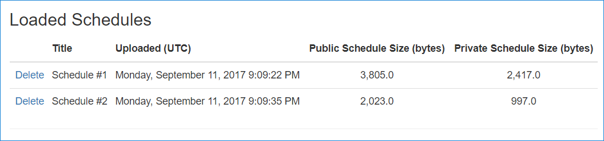

# Uploading files to a Razor Page in ASP.NET Core

By [Luke Latham](https://github.com/guardrex)

In this section, uploading files with a Razor Page is demonstrated.

The [Razor Pages Movie sample app](https://github.com/aspnet/Docs/tree/master/aspnetcore/tutorials/razor-pages/razor-pages-start/sample/RazorPagesMovie) in this tutorial uses simple model binding to upload files, which works well for uploading small files. For information on streaming large files, see [Uploading large files with streaming](xref:mvc/models/file-uploads#uploading-large-files-with-streaming).

In the steps below, you add a movie schedule file upload feature to the sample app. A movie schedule is represented by a `Schedule` class. The class includes two versions of the schedule. One version is provided to customers, `PublicSchedule`. The other version is used for company employees, `PrivateSchedule`. Each version is uploaded as a separate file. The tutorial demonstrates how to perform two file uploads from a page with a single POST to the server.

## Add a FileUpload class

Below, you create a Razor page to handle a pair of file uploads. Add a `FileUpload` class, which is bound to the page to obtain the schedule data. Right click the *Models* folder. Select **Add** > **Class**. Name the class **FileUpload** and add the following properties:

[!code-csharp[Main](razor-pages-start/sample/RazorPagesMovie/Models/FileUpload.cs)]

The class has a property for the schedule's title and a property for each of the two versions of the schedule. All three properties are required, and the title must be 3-60 characters long.

## Add a helper method to upload files

To avoid code duplication for processing uploaded schedule files, add a static helper method first. Create a *Utilities* folder in the app and add a *FileHelpers.cs* file with the following content. The helper method, `ProcessFormFile`, takes an [IFormFile](/dotnet/api/microsoft.aspnetcore.http.iformfile) and [ModelStateDictionary](/api/microsoft.aspnetcore.mvc.modelbinding.modelstatedictionary) and returns a string containing the file's size and content. The content type and length are checked. If the file doesn't pass a validation check, an error is added to the `ModelState`.

[!code-csharp[Main](razor-pages-start/sample/RazorPagesMovie/Utilities/FileHelpers.cs)]

## Add the Schedule class

Right click the *Models* folder. Select **Add** > **Class**. Name the class **Schedule** and add the following properties:

[!code-csharp[Main](razor-pages-start/sample/RazorPagesMovie/Models/Schedule.cs)]

The class uses `Display` and `DisplayFormat` attributes, which produce friendly titles and formatting when the schedule data is rendered.

## Update the MovieContext

Specify a `DbSet` in the `MovieContext` (*Models/MovieContext.cs*) for the schedules:

[!code-csharp[Main](razor-pages-start/sample/RazorPagesMovie/Models/MovieContext.cs?highlight=13)]

## Add the Schedule table to the database

Open the Package Manger Console (PMC): **Tools** > **NuGet Package Manager** > **Package Manager Console**.


In the PMC, execute the following commands. These commands add a `Schedule` table to the database:

```powershell
Add-Migration AddScheduleTable
Update-Database
```

## Add a file upload Razor Page

In the *Pages* folder, create a *Schedules* folder. In the *Schedules* folder, create a page named *Index.cshtml* for uploading a schedule with the following content:

[!code-cshtml[Main](razor-pages-start/sample/RazorPagesMovie/Pages/Schedules/Index.cshtml)]

Each form group includes a **\<label>** that displays the name of each class property. The `Display` attributes in the `FileUpload` model provide the display values for the labels. For example, the `UploadPublicSchedule` property's display name is set with `[Display(Name="Public Schedule")]` and thus displays "Public Schedule" in the label when the form renders.

Each form group includes a validation **\<span>**. If the user's input fails to meet the property attributes set in the `FileUpload` class or if any of the `ProcessFormFile` method file validation checks fail, the model fails to validate. When model validation fails, a helpful validation message is rendered to the user. For example, the `Title` property is annotated with `[Required]` and `[StringLength(60, MinimumLength = 3)]`. If the user fails to supply a title, they receive a message indicating that a value is required. If the user enters a value less than three characters or more than sixty characters, they receive a message indicating that the value has an incorrect length. If a file is provided that has no content, a message appears indicating that the file is empty.

## Add the code-behind file

Add the code-behind file (*Index.cshtml.cs*) to the *Schedules* folder:

[!code-csharp[Main](razor-pages-start/sample/RazorPagesMovie/Pages/Schedules/Index.cshtml.cs)]

The page model (`IndexModel` in *Index.cshtml.cs*) binds the `FileUpload` class:

[!code-csharp[Main](razor-pages-start/snapshot_sample/RazorPagesMovie/Pages/Schedules/Index.cshtml.cs?name=snippet1)]

The model also uses a list of the schedules (`IList<Schedule>`) to display the schedules stored in the database on the page:

[!code-csharp[Main](razor-pages-start/snapshot_sample/RazorPagesMovie/Pages/Schedules/Index.cshtml.cs?name=snippet2)]

When the page loads with `OnGetAsync`, `Schedules` is populated from the database and used to generate an HTML table of loaded schedules:

[!code-csharp[Main](razor-pages-start/snapshot_sample/RazorPagesMovie/Pages/Schedules/Index.cshtml.cs?name=snippet3)]

When the form is posted to the server, the `ModelState` is checked. If invalid, `Schedule` is rebuilt, and the page renders with one or more validation messages stating why page validation failed. If valid, the `FileUpload` properties are used in *OnPostAsync* to complete the file upload for the two versions of the schedule and to create a new `Schedule` object to store the data. The schedule is then saved to the database:

[!code-csharp[Main](razor-pages-start/snapshot_sample/RazorPagesMovie/Pages/Schedules/Index.cshtml.cs?name=snippet4)]

## Link the file upload Razor Page

Open *_Layout.cshtml* and add a link to the navigation bar to reach the file upload page:

[!code-cshtml[Main](razor-pages-start/sample/RazorPagesMovie/Pages/_Layout.cshtml?range=31-38&highlight=4)]

## Add a page to confirm schedule deletion

When the user clicks to delete a schedule, you want them to have a chance to cancel the operation. Add a delete confirmation page (*Delete.cshtml*) to the *Schedules* folder:

[!code-cshtml[Main](razor-pages-start/sample/RazorPagesMovie/Pages/Schedules/Delete.cshtml)]

The code-behind file (*Delete.cshtml.cs*) loads a single schedule identified by `id` in the request's route data. Add the *Delete.cshtml.cs* file to the *Schedules* folder:

[!code-csharp[Main](razor-pages-start/sample/RazorPagesMovie/Pages/Schedules/Delete.cshtml.cs)]

The `OnPostAsync` method handles deleting the schedule by its `id`:

[!code-csharp[Main](razor-pages-start/snapshot_sample/RazorPagesMovie/Pages/Schedules/Delete.cshtml.cs?name=snippet1&highlight=8,12-13)]

After successfully deleting the schedule, the `RedirectToPage` sends the user back to the schedules *Index.cshtml* page.

## The working Schedules Razor Page

When the page loads, labels and inputs for schedule title, public schedule, and private schedule are rendered with a submit button:


Selecting the **Upload** button without populating any of the fields violates the `[Required]` attributes on the model. The `ModelState` is invalid. The validation error messages are displayed to the user:


Type two letters into the **Title** field. The validation message changes to indicate that the title must be between 3-60 characters:


When one or more schedules are uploaded, the **Loaded Schedules** section renders the loaded schedules:



The user can click the **Delete** link from there to reach the delete confirmation view, where they have an opportunity to confirm or cancel the delete operation.

## Troubleshooting

For troubleshooting information with `IFormFile` uploading, see the [File uploads in ASP.NET Core: Troubleshooting](xref:mvc/models/file-uploads#troubleshooting).

Thanks for completing this introduction to Razor Pages. We appreciate any comments you leave. [Getting started with MVC and EF Core](xref:data/ef-mvc/intro) is an excellent follow up to this tutorial.

## Additional resources

* [File uploads in ASP.NET Core](xref:mvc/models/file-uploads)
* [IFormFile](/dotnet/api/microsoft.aspnetcore.http.iformfile)

>[!div class="step-by-step"]
[Previous: Validation](xref:tutorials/razor-pages/validation)
