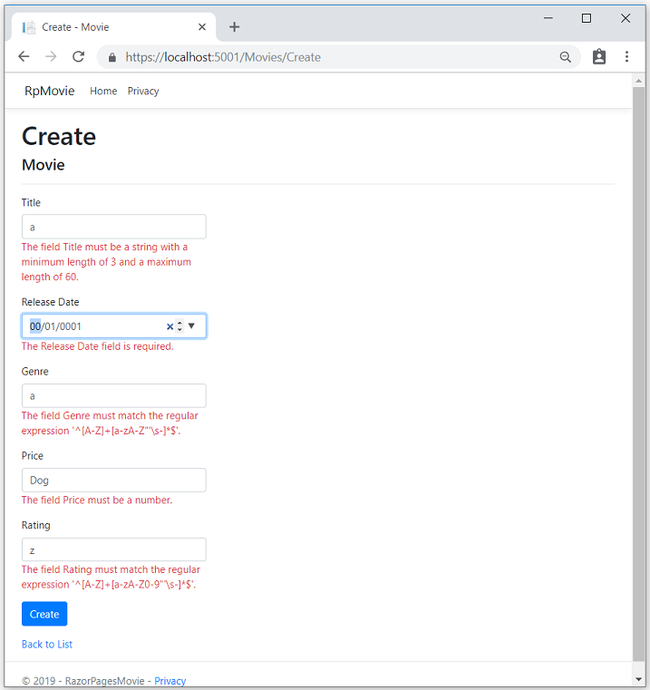

# Adding validation to a Razor Page

By [Rick Anderson](https://twitter.com/RickAndMSFT)

In this section validation logic is added to the `Movie` model. The validation rules are enforced any time a user creates or edits a movie.

## Validation

A key tenet of software development is called [DRY](https://wikipedia.org/wiki/Don%27t_repeat_yourself) ("**D**on't **R**epeat **Y**ourself"). Razor Pages encourages development where functionality is specified once, and it's reflected throughout the app. DRY can help reduce the amount of code in an app. DRY makes the code less error prone, and easier to test and maintain.

The validation support provided by Razor Pages and Entity Framework is a good example of the DRY principle. Validation rules are declaratively specified in one place (in the model class), and the rules are enforced everywhere in the app.

### Adding validation rules to the movie model

Open the *Movie.cs* file. [DataAnnotations](https://docs.microsoft.com/aspnet/mvc/overview/older-versions/mvc-music-store/mvc-music-store-part-6) provides a built-in set of validation attributes that are applied declaratively to a class or property. DataAnnotations also contains formatting attributes like `DataType` that help with formatting and don't provide validation.

Update the `Movie` class to take advantage of the `Required`, `StringLength`, `RegularExpression`, and `Range` validation attributes.

[!code-csharp[Main](../../tutorials/first-mvc-app/start-mvc//sample/MvcMovie/Models/MovieDateRatingDA.cs?name=snippet1)]

Validation attributes specify behavior that is enforced on model properties. The `Required` and `MinimumLength` attributes indicates that a property must have a value; but nothing prevents a user from entering white space to satisfy the validation constraint. The `RegularExpression` attribute is used to limit what characters can be input. In the preceding code, `Genre` and `Rating` must use only letters (white space, numbers and special characters are not allowed). The `Range` attribute constrains a value to within a specified range. The `StringLength` attribute sets the maximum length of a string, and optionally the minimum length. [Value types](https://docs.microsoft.com/dotnet/csharp/language-reference/keywords/value-types) (such as `decimal`, `int`, `float`, `DateTime`) are inherently required and don't need the `[Required]` attribute.

Having validation rules automatically enforced by ASP.NET Core helps make an app more robust. Automatic validation on models helps protect the app because you don't have to remember to apply them when new code is added.

### Validation Error UI in Razor Pages

Run the app and navigate to Pages/Movies.

Select the **Create New** link. Complete the form with some invalid values. When jQuery client-side validation detects the error, it displays an error message.



> [!NOTE]
> You may not be able to enter decimal points or commas in the `Price` field. To support [jQuery validation](https://jqueryvalidation.org/) in non-English locales that use a comma (",") for a decimal point, and non US-English date formats, you must take steps to globalize your app. See [Additional resources](#additional-resources) for more information. For now, just enter whole numbers like 10.

Notice how the form has automatically rendered a validation error message in each field containing an invalid value. The errors are enforced both client-side (using JavaScript and jQuery) and server-side (when a user has JavaScript disabled).

A significant benefit is that **no** code changes were necessary in the Create  or Edit pages. Once DataAnnotations were applied to the model, the validation UI was enabled. The Razor Pages created in this tutorial automatically picked up the validation rules (using validation attributes on the properties of the `Movie` model class). Test validation using the Edit page, the same validation is applied.

The form data is not posted to the server until there are no client-side validation errors. Verify form data is not posted by one or more of the following approaches:

* Put a break point in the `OnPostAsync` method. Submit the form (select **Create** or **Save**). The break point is never hit.
* Use the [Fiddler tool](http://www.telerik.com/fiddler).
* Use the browser developer tools to monitor network traffic.

### Server-side validation

When JavaScript is disabled in the browser, submitting the form with errors will post to the server.

Optional, test server-side validation:

* Disable JavaScript in the browser. If you can't disable JavaScript in the browser, try another browser.
* Set a break point in the `OnPostAsync` method of the Create or Edit page.
* Submit a form with validation errors.
* Verify the model state is invalid:

  ```csharp
   if (!ModelState.IsValid)
   {
      return Page();
   }
  ```

The following code shows a portion of the *Create.cshtml* page that you scaffolded earlier in the tutorial. It's used by the Create and Edit pages to display the initial form and to redisplay the form in the event of an error.

[!code-cshtml[Main](razor-pages-start/sample/RazorPagesMovie/Pages/Movies/Create.cshtml?range=14-20)]

The [Input Tag Helper](xref:mvc/views/working-with-forms) uses the [DataAnnotations](https://docs.microsoft.com/aspnet/mvc/overview/older-versions/mvc-music-store/mvc-music-store-part-6) attributes and produces HTML attributes needed for jQuery Validation on the client-side. The [Validation Tag Helper](xref:mvc/views/working-with-forms#the-validation-tag-helpers) displays validation errors. See [Validation](xref:mvc/models/validation) for more information.

The Create and Edit pages have no validation rules in them. The validation rules and the error strings are specified only in the `Movie` class. These validation rules are automatically applied to Razor Pages that edit the `Movie` model.

When validation logic needs to change, it's done only in the model. Validation is applied consistently throughout the application (validation logic is defined in one place). Validation in one place helps keep the code clean, and makes it easier to maintain and update.

## Using DataType Attributes

Examine the `Movie` class. The `System.ComponentModel.DataAnnotations` namespace provides formatting attributes in addition to the built-in set of validation attributes. The `DataType` attribute is applied to the `ReleaseDate` and `Price` properties.

[!code-csharp[Main](razor-pages-start/sample/RazorPagesMovie/Models/MovieDateRatingDA.cs?highlight=2,6&name=snippet2)]

The `DataType` attributes only provide hints for the view engine to format the data (and supplies attributes such as `<a>` for URL's and `<a href="mailto:EmailAddress.com">` for email). Use the `RegularExpression` attribute to validate the format of the data. The `DataType` attribute is used to specify a data type that is more specific than the database intrinsic type. `DataType` attributes are not validation attributes. In the sample application, only the date is displayed, without time.

The `DataType` Enumeration provides for many data types, such as Date, Time, PhoneNumber, Currency, EmailAddress, and more. The `DataType` attribute can also enable the application to automatically provide type-specific features. For example, a `mailto:` link can be created for `DataType.EmailAddress`. A date selector can be provided for `DataType.Date` in browsers that support HTML5. The `DataType` attributes emits HTML 5 `data-` (pronounced data dash) attributes that HTML 5 browsers consume. The `DataType` attributes do **not** provide any validation.

`DataType.Date` does not specify the format of the date that is displayed. By default, the data field is displayed according to the default formats based on the server's `CultureInfo`.

The `DisplayFormat` attribute is used to explicitly specify the date format:

```csharp
[DisplayFormat(DataFormatString = "{0:yyyy-MM-dd}", ApplyFormatInEditMode = true)]
public DateTime ReleaseDate { get; set; }
```

The `ApplyFormatInEditMode` setting specifies that the formatting should be applied when the value is displayed for editing. You might not want that behavior for some fields. For example, in currency values, you probably do not want the currency symbol in the edit UI.

The `DisplayFormat` attribute can be used by itself, but it's generally a good idea to use the `DataType` attribute. The `DataType` attribute conveys the semantics of the data as opposed to how to render it on a screen, and provides the following benefits that you don't get with DisplayFormat:

* The browser can enable HTML5 features (for example to show a calendar control, the locale-appropriate currency symbol, email links, etc.)
* By default, the browser will render data using the correct format based on your locale.
* The `DataType` attribute can enable the ASP.NET Core framework to choose the right field template to render the data. The `DisplayFormat` if used by itself uses the string template.

Note: jQuery validation does not work with the `Range` attribute and `DateTime`. For example, the following code will always display a client-side validation error, even when the date is in the specified range:

```csharp
[Range(typeof(DateTime), "1/1/1966", "1/1/2020")]
   ```

It's generally not a good practice to compile hard dates in your models, so using the `Range` attribute and `DateTime` is discouraged.

The following code shows combining attributes on one line:

[!code-csharp[Main](razor-pages-start/sample/RazorPagesMovie/Models/MovieDateRatingDAmult.cs?name=snippet1)]

Thanks for completing this introduction to Razor Pages. We appreciate any comments you leave. [Getting started with MVC and EF Core](xref:data/ef-mvc/intro) is an excellent follow up to this tutorial.

## Additional resources

* [Working with Forms](xref:mvc/views/working-with-forms)
* [Globalization and localization](xref:fundamentals/localization)
* [Introduction to Tag Helpers](xref:mvc/views/tag-helpers/intro)
* [Authoring Tag Helpers](xref:mvc/views/tag-helpers/authoring)

>[!div class="step-by-step"]
[Previous: Adding a new field](xref:tutorials/razor-pages/new-field)
