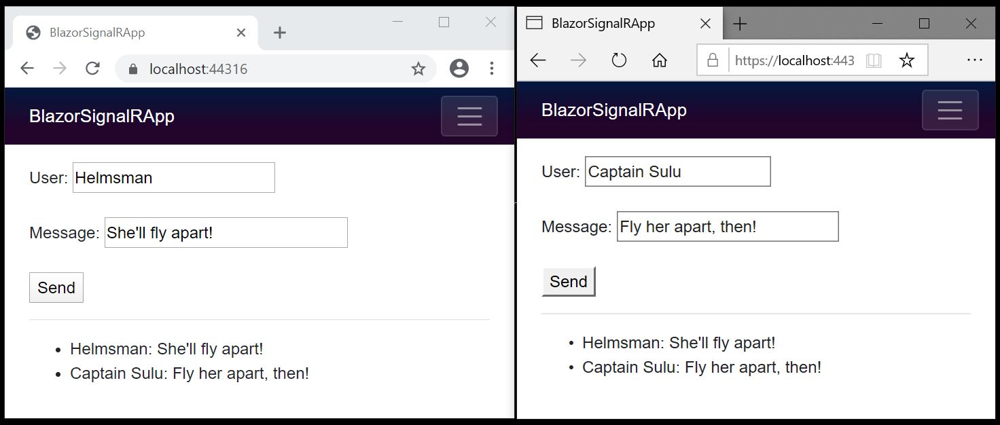

# Use ASP.NET Core SignalR with Blazor WebAssembly

By [Daniel Roth](https://github.com/danroth27) and [Luke Latham](https://github.com/guardrex)

This tutorial teaches the basics of building a real-time app using SignalR with Blazor WebAssembly. You learn how to:

> [!div class="checklist"]
> * Create a Blazor WebAssembly Hosted app project
> * Add the SignalR client library
> * Add a SignalR hub
> * Add SignalR services and an endpoint for the SignalR hub
> * Add Razor component code for chat

At the end of this tutorial, you'll have a working chat app.

[View or download sample code](https://github.com/dotnet/AspNetCore.Docs/tree/master/aspnetcore/tutorials/signalr-blazor-webassembly/samples/) ([how to download](xref:index#how-to-download-a-sample))

## Prerequisites

# [Visual Studio](#tab/visual-studio)

* [Visual Studio 2019 16.6 or later](https://visualstudio.microsoft.com/downloads/?utm_medium=microsoft&utm_source=docs.microsoft.com&utm_campaign=inline+link&utm_content=download+vs2019) with the **ASP.NET and web development** workload
* [!INCLUDE [.NET Core 3.1 SDK](~/includes/3.1-SDK.md)]

# [Visual Studio Code](#tab/visual-studio-code)

[!INCLUDE[](~/includes/net-core-prereqs-vsc-3.1.md)]

# [Visual Studio for Mac](#tab/visual-studio-mac)

* [Visual Studio for Mac version 8.6 or later](https://visualstudio.microsoft.com/vs/mac/)
* [!INCLUDE [.NET Core 3.1 SDK](~/includes/3.1-SDK.md)]

# [.NET Core CLI](#tab/netcore-cli/)

[!INCLUDE[](~/includes/3.1-SDK.md)]

---

## Create a hosted Blazor WebAssembly app project

Follow the guidance for your choice of tooling:

# [Visual Studio](#tab/visual-studio)

> [!NOTE]
> Visual Studio 16.6 or later and .NET Core SDK 3.1.300 or later are required.

1. Create a new project.

1. Select **Blazor App** and select **Next**.

1. Type "BlazorSignalRApp" in the **Project name** field. Confirm the **Location** entry is correct or provide a location for the project. Select **Create**.

1. Choose the **Blazor WebAssembly App** template.

1. Under **Advanced**, select the **ASP.NET Core hosted** check box.

1. Select **Create**.

> [!NOTE]
> If you upgraded or installed a new version of Visual Studio and the Blazor WebAssembly template doesn't appear in the VS UI, reinstall the template using the `dotnet new` command shown previously.

# [Visual Studio Code](#tab/visual-studio-code)

1. In a command shell, execute the following command:

   ```dotnetcli
   dotnet new blazorwasm --hosted --output BlazorSignalRApp
   ```

1. In Visual Studio Code, open the app's project folder.

1. When the dialog appears to add assets to build and debug the app, select **Yes**. Visual Studio Code automatically adds the *.vscode* folder with generated *launch.json* and *tasks.json* files.

# [Visual Studio for Mac](#tab/visual-studio-mac)

1. Install the latest version of [Visual Studio for Mac](https://visualstudio.microsoft.com/vs/mac/) and perform the following steps:

1. Select **File** > **New Solution** or create a **New** project from the **Start Window**.

1. In the sidebar, select **Web and Console** > **App**.

1. Choose the **Blazor WebAssembly App** template. Select **Next**.

   Confirm the following configurations:

   * **Target Framework** set to **.NET Core 3.1**.
   * **Authentication** set to **No Authentication**.

   Select the **ASP.NET Core Hosted** check box.

   Select **Next**.

1. In the **Project Name** field, name the app `BlazorSignalRApp`. Select **Create**.

   If a prompt appears to trust the development certificate, trust the certificate and continue. The user and keychain passwords are required to trust the certificate.

1. Open the project by navigating to the project folder and opening the project's solution file (*.sln*).

# [.NET Core CLI](#tab/netcore-cli/)

In a command shell, execute the following command:

```dotnetcli
dotnet new blazorwasm --hosted --output BlazorSignalRApp
```

---

## Add the SignalR client library

# [Visual Studio](#tab/visual-studio/)

1. In **Solution Explorer**, right-click the **BlazorSignalRApp.Client** project and select **Manage NuGet Packages**.

1. In the **Manage NuGet Packages** dialog, confirm that the **Package source** is set to *nuget.org*.

1. With **Browse** selected, type "Microsoft.AspNetCore.SignalR.Client" in the search box.

1. In the search results, select the [Microsoft.AspNetCore.SignalR.Client](https://www.nuget.org/packages/Microsoft.AspNetCore.SignalR.Client/) package and select **Install**.

1. If the **Preview Changes** dialog appears, select **OK**.

1. If the **License Acceptance** dialog appears, select **I Accept** if you agree with the license terms.

# [Visual Studio Code](#tab/visual-studio-code/)

In the **Integrated Terminal** (**View** > **Terminal** from the toolbar), execute the following commands:

```dotnetcli
dotnet add Client package Microsoft.AspNetCore.SignalR.Client
```

# [Visual Studio for Mac](#tab/visual-studio-mac)

1. In the **Solution** sidebar, right-click the **BlazorSignalRApp.Client** project and select **Manage NuGet Packages**.

1. In the **Manage NuGet Packages** dialog, confirm that the source drop-down is set to *nuget.org*.

1. With **Browse** selected, type "Microsoft.AspNetCore.SignalR.Client" in the search box.

1. In the search results, select the check box next to the [Microsoft.AspNetCore.SignalR.Client](https://www.nuget.org/packages/Microsoft.AspNetCore.SignalR.Client/) package and select **Add Package**.

1. If the **License Acceptance** dialog appears, select **Accept** if you agree with the license terms.

# [.NET Core CLI](#tab/netcore-cli/)

In a command shell, execute the following commands:

```dotnetcli
cd BlazorSignalRApp
dotnet add Client package Microsoft.AspNetCore.SignalR.Client
```

---

## Add a SignalR hub

In the **BlazorSignalRApp.Server** project, create a *Hubs* (plural) folder and add the following `ChatHub` class (*Hubs/ChatHub.cs*):

[!code-csharp[](signalr-blazor-webassembly/samples/3.x/BlazorSignalRApp/Server/Hubs/ChatHub.cs)]

## Add services and an endpoint for the SignalR hub

1. In the **BlazorSignalRApp.Server** project, open the *Startup.cs* file.

1. Add the namespace for the `ChatHub` class to the top of the file:

   ```csharp
   using BlazorSignalRApp.Server.Hubs;
   ```

1. Add SignalR and Response Compression Middleware services to `Startup.ConfigureServices`:

   [!code-csharp[](signalr-blazor-webassembly/samples/3.x/BlazorSignalRApp/Server/Startup.cs?name=snippet_ConfigureServices&highlight=3,5-9)]

1. In `Startup.Configure`:

   * Use Response Compression Middleware at the top of the processing pipeline's configuration.
   * Between the endpoints for controllers and the client-side fallback, add an endpoint for the hub.

   [!code-csharp[](signalr-blazor-webassembly/samples/3.x/BlazorSignalRApp/Server/Startup.cs?name=snippet_Configure&highlight=3,25)]

## Add Razor component code for chat

1. In the **BlazorSignalRApp.Client** project, open the *Pages/Index.razor* file.

1. Replace the markup with the following code:

[!code-razor[](signalr-blazor-webassembly/samples/3.x/BlazorSignalRApp/Client/Pages/Index.razor)]

## Run the app

1. Follow the guidance for your tooling:

# [Visual Studio](#tab/visual-studio)

1. In **Solution Explorer**, select the **BlazorSignalRApp.Server** project. Press <kbd>F5</kbd> to run the app with debugging or <kbd>Ctrl</kbd>+<kbd>F5</kbd> to run the app without debugging.

1. Copy the URL from the address bar, open another browser instance or tab, and paste the URL in the address bar.

1. Choose either browser, enter a name and message, and select the **Send** button. The name and message are displayed on both pages instantly:

   

   Quotes: *Star Trek VI: The Undiscovered Country* &copy;1991 [Paramount](https://www.paramountmovies.com/movies/star-trek-vi-the-undiscovered-country)

# [Visual Studio Code](#tab/visual-studio-code)

1. When VS Code offers to create a launch profile for the Server app (*.vscode/launch.json*), the `program` entry appears similar to the following to point to the app's assembly (`{APPLICATION NAME}.Server.dll`):

   ```json
   "program": "${workspaceFolder}/Server/bin/Debug/netcoreapp3.1/{APPLICATION NAME}.Server.dll"
   ```

1. Press <kbd>F5</kbd> to run the app with debugging or <kbd>Ctrl</kbd>+<kbd>F5</kbd> to run the app without debugging.

1. Copy the URL from the address bar, open another browser instance or tab, and paste the URL in the address bar.

1. Choose either browser, enter a name and message, and select the **Send** button. The name and message are displayed on both pages instantly:

   

   Quotes: *Star Trek VI: The Undiscovered Country* &copy;1991 [Paramount](https://www.paramountmovies.com/movies/star-trek-vi-the-undiscovered-country)

# [Visual Studio for Mac](#tab/visual-studio-mac)

1. In the **Solution** sidebar, select the **BlazorSignalRApp.Server** project. Press <kbd>⌘</kbd>+<kbd>↩</kbd> to run the app with debugging or <kbd>⌥</kbd>+<kbd>⌘</kbd>+<kbd>↩</kbd> to run the app without debugging.

1. Copy the URL from the address bar, open another browser instance or tab, and paste the URL in the address bar.

1. Choose either browser, enter a name and message, and select the **Send** button. The name and message are displayed on both pages instantly:

   

   Quotes: *Star Trek VI: The Undiscovered Country* &copy;1991 [Paramount](https://www.paramountmovies.com/movies/star-trek-vi-the-undiscovered-country)

# [.NET Core CLI](#tab/netcore-cli/)

1. In a command shell, execute the following commands:

   ```dotnetcli
   cd Server
   dotnet run
   ```

1. Copy the URL from the address bar, open another browser instance or tab, and paste the URL in the address bar.

1. Choose either browser, enter a name and message, and select the **Send** button. The name and message are displayed on both pages instantly:

   

   Quotes: *Star Trek VI: The Undiscovered Country* &copy;1991 [Paramount](https://www.paramountmovies.com/movies/star-trek-vi-the-undiscovered-country)

---

## Next steps

In this tutorial, you learned how to:

> [!div class="checklist"]
> * Create a Blazor WebAssembly Hosted app project
> * Add the SignalR client library
> * Add a SignalR hub
> * Add SignalR services and an endpoint for the SignalR hub
> * Add Razor component code for chat

To learn more about building Blazor apps, see the Blazor documentation:

> [!div class="nextstepaction"]
> <xref:blazor/index>

## Additional resources

* <xref:signalr/introduction>
