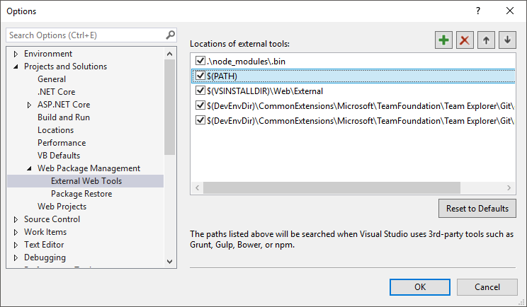
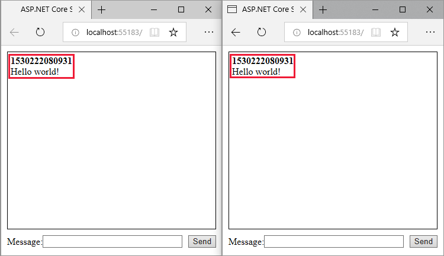

# Use ASP.NET Core SignalR with TypeScript and Webpack

By [Sébastien Sougnez](https://twitter.com/ssougnez) and [Scott Addie](https://twitter.com/Scott_Addie)

[Webpack](https://webpack.js.org/) enables developers to bundle and build the client-side resources of a web app. This tutorial demonstrates using Webpack in an ASP.NET Core SignalR web app whose client is written in [TypeScript](https://www.typescriptlang.org/).

In this tutorial, you learn how to:

> [!div class="checklist"]
> * Scaffold a starter ASP.NET Core SignalR app
> * Configure the SignalR TypeScript client
> * Configure a build pipeline using Webpack
> * Configure the SignalR server
> * Enable communication between client and server

[View or download sample code](https://github.com/aspnet/AspNetCore.Docs/tree/master/aspnetcore/tutorials/signalr-typescript-webpack/sample) ([how to download](xref:index#how-to-download-a-sample))

## Prerequisites

# [Visual Studio](#tab/visual-studio)

* [Visual Studio 2019](https://visualstudio.microsoft.com/downloads/?utm_medium=microsoft&utm_source=docs.microsoft.com&utm_campaign=inline+link&utm_content=download+vs2019) with the **ASP.NET and web development** workload
* [.NET Core SDK 2.2 or later](https://www.microsoft.com/net/download/all)
* [Node.js](https://nodejs.org/) with [npm](https://www.npmjs.com/)

# [Visual Studio Code](#tab/visual-studio-code)

* [Visual Studio Code](https://code.visualstudio.com/download)
* [.NET Core SDK 2.2 or later](https://www.microsoft.com/net/download/all)
* [C# for Visual Studio Code version 1.17.1 or later](https://marketplace.visualstudio.com/items?itemName=ms-vscode.csharp)
* [Node.js](https://nodejs.org/) with [npm](https://www.npmjs.com/)

---

## Create the ASP.NET Core web app

# [Visual Studio](#tab/visual-studio)

Configure Visual Studio to look for npm in the *PATH* environment variable. By default, Visual Studio uses the version of npm found in its installation directory. Follow these instructions in Visual Studio:

1. Navigate to **Tools** > **Options** > **Projects and Solutions** > **Web Package Management** > **External Web Tools**.
1. Select the *$(PATH)* entry from the list. Click the up arrow to move the entry to the second position in the list.

    

Visual Studio configuration is completed. It's time to create the project.

1. Use the **File** > **New** > **Project** menu option and choose the **ASP.NET Core Web Application** template.
1. Name the project *SignalRWebPack*, and select **OK**.
1. Select *.NET Core* from the target framework drop-down, and select *ASP.NET Core 2.2* from the framework selector drop-down. Select the **Empty** template, and select **OK**.

# [Visual Studio Code](#tab/visual-studio-code)

Run the following command in the **Integrated Terminal**:

```console
dotnet new web -o SignalRWebPack
```

An empty ASP.NET Core web app, targeting .NET Core, is created in a *SignalRWebPack* directory.

---

## Configure Webpack and TypeScript

The following steps configure the conversion of TypeScript to JavaScript and the bundling of client-side resources.

1. Execute the following command in the project root to create a *package.json* file:

    ```console
    npm init -y
    ```

1. Add the highlighted property to the *package.json* file:

    [!code-json[package.json](signalr-typescript-webpack/sample/snippets/package1.json?highlight=4)]

    Setting the `private` property to `true` prevents package installation warnings in the next step.

1. Install the required npm packages. Execute the following command from the project root:

    ```console
    npm install -D -E clean-webpack-plugin@1.0.1 css-loader@2.1.0 html-webpack-plugin@4.0.0-beta.5 mini-css-extract-plugin@0.5.0 ts-loader@5.3.3 typescript@3.3.3 webpack@4.29.3 webpack-cli@3.2.3
    ```

    Some command details to note:

    * A version number follows the `@` sign for each package name. npm installs those specific package versions.
    * The `-E` option disables npm's default behavior of writing [semantic versioning](https://semver.org/) range operators to *package.json*. For example, `"webpack": "4.29.3"` is used instead of `"webpack": "^4.29.3"`. This option prevents unintended upgrades to newer package versions.

    See the official [npm-install](https://docs.npmjs.com/cli/install) docs for more detail.

1. Replace the `scripts` property of the *package.json* file with the following snippet:

    ```json
    "scripts": {
      "build": "webpack --mode=development --watch",
      "release": "webpack --mode=production",
      "publish": "npm run release && dotnet publish -c Release"
    },
    ```

    Some explanation of the scripts:

    * `build`: Bundles your client-side resources in development mode and watches for file changes. The file watcher causes the bundle to regenerate each time a project file changes. The `mode` option disables production optimizations, such as tree shaking and minification. Only use `build` in development.
    * `release`: Bundles your client-side resources in production mode.
    * `publish`: Runs the `release` script to bundle the client-side resources in production mode. It calls the .NET Core CLI's [publish](/dotnet/core/tools/dotnet-publish) command to publish the app.

1. Create a file named *webpack.config.js*, in the project root, with the following content:

    [!code-javascript[webpack.config.js](signalr-typescript-webpack/sample/webpack.config.js)]

    The preceding file configures the Webpack compilation. Some configuration details to note:

    * The `output` property overrides the default value of *dist*. The bundle is instead emitted in the *wwwroot* directory.
    * The `resolve.extensions` array includes *.js* to import the SignalR client JavaScript.

1. Create a new *src* directory in the project root. Its purpose is to store the project's client-side assets.

1. Create *src/index.html* with the following content.

    [!code-html[index.html](signalr-typescript-webpack/sample/src/index.html)]

    The preceding HTML defines the homepage's boilerplate markup.

1. Create a new *src/css* directory. Its purpose is to store the project's *.css* files.

1. Create *src/css/main.css* with the following content:

    [!code-css[main.css](signalr-typescript-webpack/sample/src/css/main.css)]

    The preceding *main.css* file styles the app.

1. Create *src/tsconfig.json* with the following content:

    [!code-json[tsconfig.json](signalr-typescript-webpack/sample/src/tsconfig.json)]

    The preceding code configures the TypeScript compiler to produce [ECMAScript](https://wikipedia.org/wiki/ECMAScript) 5-compatible JavaScript.

1. Create *src/index.ts* with the following content:

    [!code-typescript[index.ts](signalr-typescript-webpack/sample/snippets/index1.ts?name=snippet_IndexTsPhase1File)]

    The preceding TypeScript retrieves references to DOM elements and attaches two event handlers:

    * `keyup`: This event fires when the user types something in the textbox identified as `tbMessage`. The `send` function is called when the user presses the **Enter** key.
    * `click`: This event fires when the user clicks the **Send** button. The `send` function is called.

## Configure the ASP.NET Core app

1. The code provided in the `Startup.Configure` method displays *Hello World!*. Replace the `app.Run` method call with calls to [UseDefaultFiles](/dotnet/api/microsoft.aspnetcore.builder.defaultfilesextensions.usedefaultfiles#Microsoft_AspNetCore_Builder_DefaultFilesExtensions_UseDefaultFiles_Microsoft_AspNetCore_Builder_IApplicationBuilder_) and [UseStaticFiles](/dotnet/api/microsoft.aspnetcore.builder.staticfileextensions.usestaticfiles#Microsoft_AspNetCore_Builder_StaticFileExtensions_UseStaticFiles_Microsoft_AspNetCore_Builder_IApplicationBuilder_).

    [!code-csharp[Startup](signalr-typescript-webpack/sample/Startup.cs?name=snippet_UseStaticDefaultFiles)]

    The preceding code allows the server to locate and serve the *index.html* file, whether the user enters its full URL or the root URL of the web app.

1. Call [AddSignalR](/dotnet/api/microsoft.extensions.dependencyinjection.signalrdependencyinjectionextensions.addsignalr#Microsoft_Extensions_DependencyInjection_SignalRDependencyInjectionExtensions_AddSignalR_Microsoft_Extensions_DependencyInjection_IServiceCollection_) in the `Startup.ConfigureServices` method. It adds the SignalR services to your project.

    [!code-csharp[Startup](signalr-typescript-webpack/sample/Startup.cs?name=snippet_AddSignalR)]

1. Map a */hub* route to the `ChatHub` hub. Add the following lines at the end of the `Startup.Configure` method:

::: moniker range=">= aspnetcore-3.0"

```csharp
app.UseRouting();
app.UseEndpoints(endpoints =>
{
    endpoints.MapHub<ChatHub>("/hub");
});
```

::: moniker-end

::: moniker range="<= aspnetcore-2.2"

    [!code-csharp[Startup](signalr-typescript-webpack/sample/Startup.cs?name=snippet_UseSignalR)]

::: moniker-end

1. Create a new directory, called *Hubs*, in the project root. Its purpose is to store the SignalR hub, which is created in the next step.

1. Create hub *Hubs/ChatHub.cs* with the following code:

    [!code-csharp[ChatHub](signalr-typescript-webpack/sample/snippets/ChatHub.cs?name=snippet_ChatHubStubClass)]

1. Add the following code at the top of the *Startup.cs* file to resolve the `ChatHub` reference:

    [!code-csharp[Startup](signalr-typescript-webpack/sample/Startup.cs?name=snippet_HubsNamespace)]

## Enable client and server communication

The app currently displays a simple form to send messages. Nothing happens when you try to do so. The server is listening to a specific route but does nothing with sent messages.

1. Execute the following command at the project root:

    ```console
    npm install @aspnet/signalr
    ```

    The preceding command installs the [SignalR TypeScript client](https://www.npmjs.com/package/@aspnet/signalr), which allows the client to send messages to the server.

1. Add the highlighted code to the *src/index.ts* file:

    [!code-typescript[index.ts](signalr-typescript-webpack/sample/snippets/index2.ts?name=snippet_IndexTsPhase2File&highlight=2,9-23)]

    The preceding code supports receiving messages from the server. The `HubConnectionBuilder` class creates a new builder for configuring the server connection. The `withUrl` function configures the hub URL.

    SignalR enables the exchange of messages between a client and a server. Each message has a specific name. For example, you can have messages with the name `messageReceived` that execute the logic responsible for displaying the new message in the messages zone. Listening to a specific message can be done via the `on` function. You can listen to any number of message names. It's also possible to pass parameters to the message, such as the author's name and the content of the message received. Once the client receives a message, a new `div` element is created with the author's name and the message content in its `innerHTML` attribute. It's added to the main `div` element displaying the messages.

1. Now that the client can receive a message, configure it to send messages. Add the highlighted code to the *src/index.ts* file:

    [!code-typescript[index.ts](signalr-typescript-webpack/sample/src/index.ts?highlight=34-35)]

    Sending a message through the WebSockets connection requires calling the `send` method. The method's first parameter is the message name. The message data inhabits the other parameters. In this example, a message identified as `newMessage` is sent to the server. The message consists of the username and the user input from a text box. If the send works, the text box value is cleared.

1. Add the highlighted method to the `ChatHub` class:

    [!code-csharp[ChatHub](signalr-typescript-webpack/sample/Hubs/ChatHub.cs?highlight=8-11)]

    The preceding code broadcasts received messages to all connected users once the server receives them. It's unnecessary to have a generic `on` method to receive all the messages. A method named after the message name suffices.

    In this example, the TypeScript client sends a message identified as `newMessage`. The C# `NewMessage` method expects the data sent by the client. A call is made to the [SendAsync](/dotnet/api/microsoft.aspnetcore.signalr.clientproxyextensions.sendasync) method on [Clients.All](/dotnet/api/microsoft.aspnetcore.signalr.ihubclients-1.all). The received messages are sent to all clients connected to the hub.

## Test the app

Confirm that the app works with the following steps.

# [Visual Studio](#tab/visual-studio)

1. Run Webpack in *release* mode. Using the **Package Manager Console** window, execute the following command in the project root. If you are not in the project root, enter `cd SignalRWebPack` before entering the command.

    [!INCLUDE [npm-run-release](../includes/signalr-typescript-webpack/npm-run-release.md)]

1. Select **Debug** > **Start without debugging** to launch the app in a browser without attaching the debugger. The *wwwroot/index.html* file is served at `http://localhost:<port_number>`.

1. Open another browser instance (any browser). Paste the URL in the address bar.

1. Choose either browser, type something in the **Message** text box, and click the **Send** button. The unique user name and message are displayed on both pages instantly.

# [Visual Studio Code](#tab/visual-studio-code)

1. Run Webpack in *release* mode by executing the following command in the project root:

    [!INCLUDE [npm-run-release](../includes/signalr-typescript-webpack/npm-run-release.md)]

1. Build and run the app by executing the following command in the project root:

    ```console
    dotnet run
    ```

    The web server starts the app and makes it available on localhost.

1. Open a browser to `http://localhost:<port_number>`. The *wwwroot/index.html* file is served. Copy the URL from the address bar.

1. Open another browser instance (any browser). Paste the URL in the address bar.

1. Choose either browser, type something in the **Message** text box, and click the **Send** button. The unique user name and message are displayed on both pages instantly.

---



## Additional resources

* <xref:signalr/javascript-client>
* <xref:signalr/hubs>
