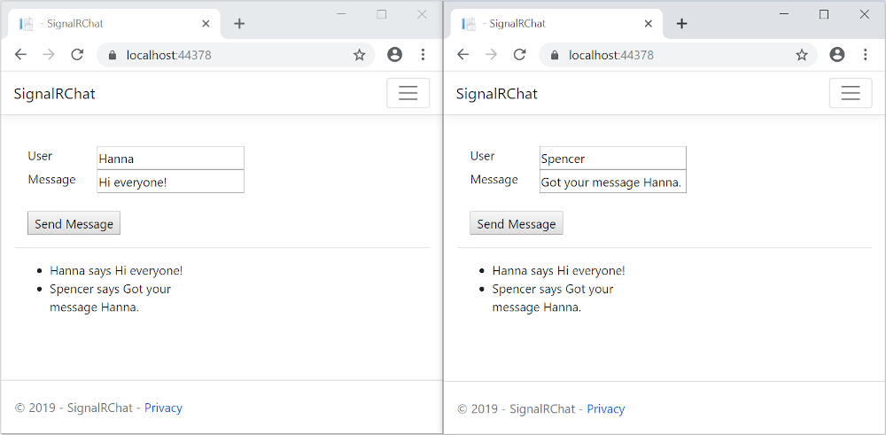
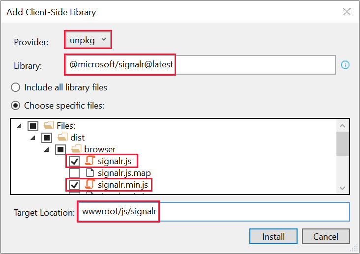
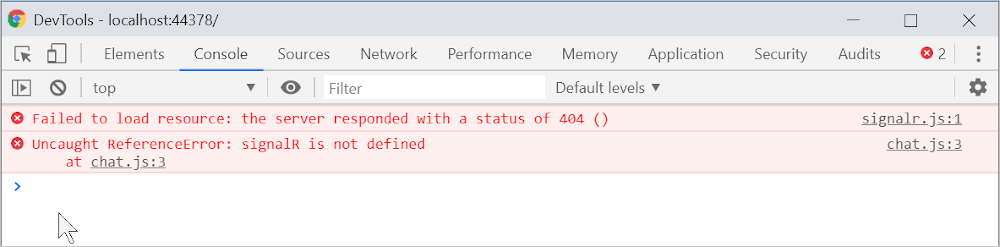
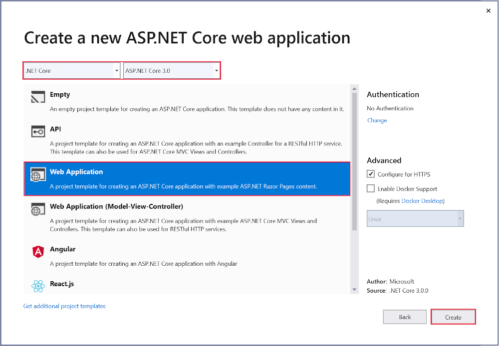

# Tutorial: Get started with ASP.NET Core SignalR

:::moniker range=">= aspnetcore-6.0"

This tutorial teaches the basics of building a real-time app using SignalR. You learn how to:

> [!div class="checklist"]
> * Create a web project.
> * Add the SignalR client library.
> * Create a SignalR hub.
> * Configure the project to use SignalR.
> * Add code that sends messages from any client to all connected clients.

At the end, you'll have a working chat app:



## Prerequisites

# [Visual Studio](#tab/visual-studio)

[!INCLUDE[](~/includes/net-prereqs-vs-6.0.md)]

# [Visual Studio Code](#tab/visual-studio-code)

[!INCLUDE[](~/includes/net-prereqs-vsc-6.0.md)]

# [Visual Studio for Mac](#tab/visual-studio-mac)

[!INCLUDE[](~/includes/net-prereqs-mac-6.0.md)]

---

## Create a web app project

# [Visual Studio](#tab/visual-studio)

1. Start Visual Studio 2022 and select **Create a new project**.

   

1. In the **Create a new project** dialog, select **ASP.NET Core Web App**, and then select **Next**.

	
	
1. In the **Configure your new project** dialog, enter `SignalRChat` for **Project name**. It's important to name the project *SignalRChat*, including matching the capitalization, so the namespaces will match when you copy and paste example code.

1. Select **Next**.

1. In the **Additional information** dialog, select **.NET 6.0 (Long-term support)** and then select **Create**.

	 

# [Visual Studio Code](#tab/visual-studio-code)

1. Open the [integrated terminal](https://code.visualstudio.com/docs/editor/integrated-terminal).

1. Change to the directory (`cd`) that will contain the project.
1. Run the following commands:

   ```dotnetcli
   dotnet new webapp -o SignalRChat
   code -r SignalRChat
   ```
   Visual Studio Code displays a dialog box that asks **Do you trust the authors of the files in this folder**.  Select:
    * The checkbox **trust the authors of all files in the parent folder**
   * **Yes, I trust the authors** (because dotnet generated the files).

   The `dotnet new` command creates a new Razor Pages project in the *SignalRChat* folder.

   The `code` command opens the *SignalRChat* folder in the current instance of Visual Studio Code.

# [Visual Studio for Mac](#tab/visual-studio-mac)

1. Select **File** > **New Solution**.

	

1. In Visual Studio 2022 for Mac select **Web and Console** > **App** > **Web Application** > **Continue**.

	

1. In the **Configure your new Web Application** dialog:

	1. Confirm that **Authentication** is set to **No Authentication**.
	1. Confirm that **Target framework** is set to the latest .NET 6.x version.
  1. Select **Continue**.

1. Name the project *SignalRChat* and select **Continue**.

---

## Add the SignalR client library

The SignalR server library is included in the ASP.NET Core shared framework. The JavaScript client library isn't automatically included in the project. For this tutorial, use Library Manager (LibMan) to get the client library from [unpkg](https://unpkg.com/). `unpkg`is a fast, global content delivery network for everything on [npm](https://unpkg.com/). 

# [Visual Studio](#tab/visual-studio/)

  * In **Solution Explorer**, right-click the project, and select **Add** > **Client-Side Library**.
  * In the **Add Client-Side Library** dialog:
    * Select **unpkg** for **Provider**
    * Enter `@microsoft/signalr@latest` for **Library**
    * Select **Choose specific files**, expand the *dist/browser* folder, and select `signalr.js` and `signalr.min.js`.
    * Set **Target Location** to *wwwroot/js/signalr/*
    * Select **Install**

  

  LibMan creates a *wwwroot/js/signalr* folder and copies the selected files to it.

# [Visual Studio Code](#tab/visual-studio-code/)

  * In the integrated terminal, run the following command to install LibMan.

  ```dotnetcli
  dotnet tool install -g Microsoft.Web.LibraryManager.Cli
  ```

  * Run the following command to get the SignalR client library by using LibMan. You might have to wait a few seconds before seeing output.

  ```console
  libman install @microsoft/signalr@latest -p unpkg -d wwwroot/js/signalr --files dist/browser/signalr.js --files dist/browser/signalr.min.js
  ```

  The parameters specify the following options:
  * Use the unpkg provider.
  * Copy files to the *wwwroot/js/signalr* destination.
  * Copy only the specified files.

  The output looks like the following example:

  ```console
  wwwroot/js/signalr/dist/browser/signalr.js written to disk
  wwwroot/js/signalr/dist/browser/signalr.min.js written to disk
  Installed library "@microsoft/signalr@latest" to "wwwroot/js/signalr"
  ```

# [Visual Studio for Mac](#tab/visual-studio-mac)

  * In the **Terminal**, run the following command to install LibMan.

  ```dotnetcli
  dotnet tool install -g Microsoft.Web.LibraryManager.Cli
  ```

  * Navigate to the project folder (the one that contains the `SignalRChat.csproj` file).

  * Run the following command to get the SignalR client library by using LibMan.

  ```console
  libman install @microsoft/signalr@latest -p unpkg -d wwwroot/js/signalr --files dist/browser/signalr.js --files dist/browser/signalr.min.js
  ```

  The parameters specify the following options:
  * Use the unpkg provider.
  * Copy files to the *wwwroot/js/signalr* destination.
  * Copy only the specified files.

  The output looks like the following example:

  ```console
  wwwroot/js/signalr/dist/browser/signalr.js written to disk
  wwwroot/js/signalr/dist/browser/signalr.min.js written to disk
  Installed library "@microsoft/signalr@latest" to "wwwroot/js/signalr"
  ```

---

## Create a SignalR hub

A *hub* is a class that serves as a high-level pipeline that handles client-server communication.

  * In the SignalRChat project folder, create a *Hubs* folder.
  * In the *Hubs* folder, create the `ChatHub` class with the following code:

  [!code-csharp[ChatHub](signalr/samples/SignalRChat/Hubs/ChatHub.cs)]

  The `ChatHub` class inherits from the SignalR <xref:Microsoft.AspNetCore.SignalR.Hub> class. The `Hub` class manages connections, groups, and messaging.

  The `SendMessage` method can be called by a connected client to send a message to all clients. JavaScript client code that calls the method is shown later in the tutorial. SignalR code is asynchronous to provide maximum scalability.

## Configure SignalR

The SignalR server must be configured to pass SignalR requests to SignalR. Add the following highlighted code to the `Program.cs` file.

[!code-csharp[Startup](signalr/samples/SignalRChat/Program.cs?highlight=1,6,24)]

The preceding highlighted code adds SignalR to the ASP.NET Core dependency injection and routing systems.

## Add SignalR client code

* Replace the content in `Pages/Index.cshtml` with the following code:

  [!code-cshtml[Index](signalr/samples/SignalRChat/Pages/Index.cshtml)]

  The preceding markup:

  * Creates text boxes and a submit button.
  * Creates a list with `id="messagesList"` for displaying messages that are received from the SignalR hub.
  * Includes script references to SignalR and the `chat.js` app code is created in the next step.

* In the *wwwroot/js* folder, create a `chat.js` file with the following code:

  [!code-javascript[chat](signalr/samples/SignalRChat/wwwroot/js/chat.js)]

  The preceding JavaScript:

  * Creates and starts a connection.
  * Adds to the submit button a handler that sends messages to the hub.
  * Adds to the connection object a handler that receives messages from the hub and adds them to the list.

## Run the app

# [Visual Studio](#tab/visual-studio)

* Press **CTRL+F5** to run the app without debugging.

# [Visual Studio Code](#tab/visual-studio-code)

* In the integrated terminal, run the following command:

  ```dotnetcli
  dotnet watch run --project SignalRChat.csproj
  ```

# [Visual Studio for Mac](#tab/visual-studio-mac)

  * From the menu, select **Run > Start Without Debugging**.

---

  * Copy the URL from the address bar, open another browser instance or tab, and paste the URL in the address bar.
  * Choose either browser, enter a name and message, and select the **Send Message** button.
  The name and message are displayed on both pages instantly.

  

> [!TIP]
> * If the app doesn't work, open your browser developer tools (F12) and go to the console. You might see errors related to your HTML and JavaScript code. For example, suppose you put `signalr.js` in a different folder than directed. In that case the reference to that file won't work and you'll see a 404 error in the console.
>   
> * If you get the error ERR_SPDY_INADEQUATE_TRANSPORT_SECURITY in Chrome, run these commands to update your development certificate:
>
>   ```dotnetcli
>   dotnet dev-certs https --clean
>   dotnet dev-certs https --trust
>   ```

## Publish to Azure

For information on deploying to Azure, see [Quickstart: Deploy an ASP.NET web app](/azure/app-service/quickstart-dotnetcore).

:::moniker-end

:::moniker range="< aspnetcore-6.0"

This tutorial teaches the basics of building a real-time app using SignalR. You learn how to:

> [!div class="checklist"]
> * Create a web project.
> * Add the SignalR client library.
> * Create a SignalR hub.
> * Configure the project to use SignalR.
> * Add code that sends messages from any client to all connected clients.

At the end, you'll have a working chat app:


## Prerequisites

# [Visual Studio](#tab/visual-studio)

[!INCLUDE[](~/includes/net-core-prereqs-vs-3.1.md)]

# [Visual Studio Code](#tab/visual-studio-code)

[!INCLUDE[](~/includes/net-core-prereqs-vsc-3.1.md)]

# [Visual Studio for Mac](#tab/visual-studio-mac)

[!INCLUDE[](~/includes/net-core-prereqs-mac-3.1.md)]

---

## Create a web app project

# [Visual Studio](#tab/visual-studio/)

  * From the menu, select **File > New Project**.
  * In the **Create a new project** dialog, select **ASP.NET Core Web Application**, and then select **Next**.
  * In the **Configure your new project** dialog, name the project *SignalRChat*, and then select **Create**.
  * In the **Create a new ASP.NET Core web Application** dialog, select **.NET Core** and **ASP.NET Core 3.1**.
  * Select **Web Application** to create a project that uses Razor Pages, and then select **Create**.

  

# [Visual Studio Code](#tab/visual-studio-code/)

  * Open the [integrated terminal](https://code.visualstudio.com/docs/editor/integrated-terminal) to the folder in which the new project folder will be created.
  * Run the following commands:

   ```dotnetcli
   dotnet new webapp -o SignalRChat
   cd SignalRChat
   code -r .
   ```

# [Visual Studio for Mac](#tab/visual-studio-mac)

  * From the menu, select **File > New Solution**.
  * Select **.NET Core > App > Web Application** (Don't select **Web Application (Model-View-Controller)**), and then select **Next**.
  * Make sure the **Target Framework** is set to **.NET Core 3.1**, and then select **Next**.
  * Name the project *SignalRChat*, and then select **Create**.

---

## Add the SignalR client library

The SignalR server library is included in the ASP.NET Core 3.1 shared framework. The JavaScript client library isn't automatically included in the project. For this tutorial, you use Library Manager (LibMan) to get the client library from *unpkg*. unpkg is a content delivery network (CDN) that can deliver anything found in npm, the Node.js package manager.

# [Visual Studio](#tab/visual-studio/)

  * In **Solution Explorer**, right-click the project, and select **Add** > **Client-Side Library**.
  * In the **Add Client-Side Library** dialog, for **Provider** select **unpkg**.
  * For **Library**, enter `@microsoft/signalr@latest`.
  * Select **Choose specific files**, expand the *dist/browser* folder, and select `signalr.js` and `signalr.min.js`.
  * Set **Target Location** to *wwwroot/js/signalr/*
  * Select **Install**

  

  LibMan creates a *wwwroot/js/signalr* folder and copies the selected files to it.

# [Visual Studio Code](#tab/visual-studio-code/)

  * In the integrated terminal, run the following command to install LibMan.

  ```dotnetcli
  dotnet tool install -g Microsoft.Web.LibraryManager.Cli
  ```

  * Run the following command to get the SignalR client library by using LibMan. You might have to wait a few seconds before seeing output.

  ```console
  libman install @microsoft/signalr@latest -p unpkg -d wwwroot/js/signalr --files dist/browser/signalr.js --files dist/browser/signalr.min.js
  ```

  The parameters specify the following options:
  * Use the unpkg provider.
  * Copy files to the *wwwroot/js/signalr* destination.
  * Copy only the specified files.

  The output looks like the following example:

  ```console
  wwwroot/js/signalr/dist/browser/signalr.js written to disk
  wwwroot/js/signalr/dist/browser/signalr.min.js written to disk
  Installed library "@microsoft/signalr@latest" to "wwwroot/js/signalr"
  ```

# [Visual Studio for Mac](#tab/visual-studio-mac)


  * In the **Terminal**, run the following command to install LibMan.

  ```dotnetcli
  dotnet tool install -g Microsoft.Web.LibraryManager.Cli
  ```

  * Navigate to the project folder (the one that contains the `SignalRChat.csproj` file).

  * Run the following command to get the SignalR client library by using LibMan.

  ```console
  libman install @microsoft/signalr@latest -p unpkg -d wwwroot/js/signalr --files dist/browser/signalr.js --files dist/browser/signalr.min.js
  ```

  The parameters specify the following options:
  * Use the unpkg provider.
  * Copy files to the *wwwroot/js/signalr* destination.
  * Copy only the specified files.

  The output looks like the following example:

  ```console
  wwwroot/js/signalr/dist/browser/signalr.js written to disk
  wwwroot/js/signalr/dist/browser/signalr.min.js written to disk
  Installed library "@microsoft/signalr@latest" to "wwwroot/js/signalr"
  ```

---

## Create a SignalR hub

A *hub* is a class that serves as a high-level pipeline that handles client-server communication.

  * In the SignalRChat project folder, create a *Hubs* folder.
  * In the *Hubs* folder, create a `ChatHub.cs` file with the following code:

  [!code-csharp[ChatHub](signalr/sample-snapshot/3.x/ChatHub.cs)]

  The `ChatHub` class inherits from the SignalR `Hub` class. The `Hub` class manages connections, groups, and messaging.

  The `SendMessage` method can be called by a connected client to send a message to all clients. JavaScript client code that calls the method is shown later in the tutorial. SignalR code is asynchronous to provide maximum scalability.

## Configure SignalR

The SignalR server must be configured to pass SignalR requests to SignalR.

* Add the following highlighted code to the `Startup.cs` file.

  [!code-csharp[Startup](signalr/sample-snapshot/3.x/Startup.cs?highlight=11,28,55)]

  These changes add SignalR to the ASP.NET Core dependency injection and routing systems.

## Add SignalR client code

* Replace the content in `Pages/Index.cshtml` with the following code:

  [!code-cshtml[Index](signalr/sample-snapshot/3.x/Index.cshtml)]

  The preceding code:

  * Creates text boxes for name and message text, and a submit button.
  * Creates a list with `id="messagesList"` for displaying messages that are received from the SignalR hub.
  * Includes script references to SignalR and the `chat.js` application code that you create in the next step.

* In the *wwwroot/js* folder, create a `chat.js` file with the following code:

  [!code-javascript[chat](signalr/sample-snapshot/3.x/chat.js)]

  The preceding code:

  * Creates and starts a connection.
  * Adds to the submit button a handler that sends messages to the hub.
  * Adds to the connection object a handler that receives messages from the hub and adds them to the list.

## Run the app

# [Visual Studio](#tab/visual-studio)

* Press **CTRL+F5** to run the app without debugging.

# [Visual Studio Code](#tab/visual-studio-code)

* In the integrated terminal, run the following command:

  ```dotnetcli
  dotnet watch run -p SignalRChat.csproj
  ```

# [Visual Studio for Mac](#tab/visual-studio-mac)

  * From the menu, select **Run > Start Without Debugging**.

---

  * Copy the URL from the address bar, open another browser instance or tab, and paste the URL in the address bar.
  * Choose either browser, enter a name and message, and select the **Send Message** button.
  The name and message are displayed on both pages instantly.

  

> [!TIP]
> * If the app doesn't work, open your browser developer tools (F12) and go to the console. You might see errors related to your HTML and JavaScript code. For example, suppose you put `signalr.js` in a different folder than directed. In that case the reference to that file won't work and you'll see a 404 error in the console.
>   
> * If you get the error ERR_SPDY_INADEQUATE_TRANSPORT_SECURITY in Chrome, run these commands to update your development certificate:
>
>   ```dotnetcli
>   dotnet dev-certs https --clean
>   dotnet dev-certs https --trust
>   ```

## Publish to Azure

For information on deploying to Azure, see [Quickstart: Deploy an ASP.NET web app](/azure/app-service/quickstart-dotnetcore).

:::moniker-end
