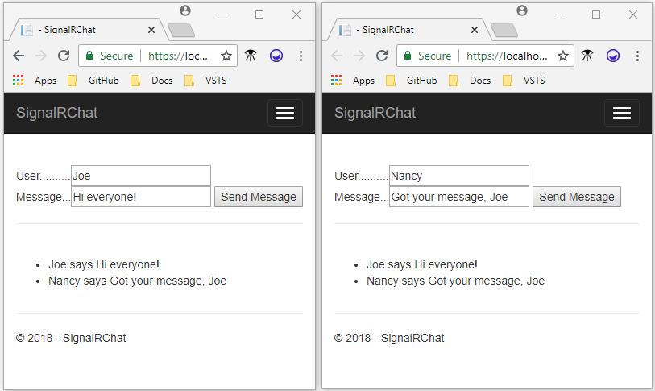
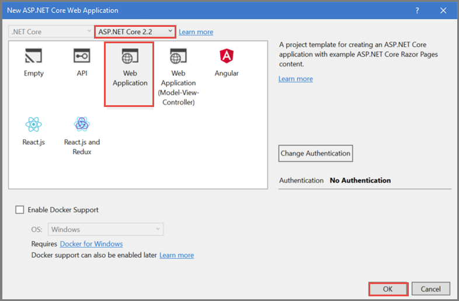

# Tutorial: Get started with SignalR on ASP.NET Core

This tutorial teaches the basics of building a real-time app using SignalR. You learn how to:

> [!div class="checklist"]
> * Create a web app that uses SignalR on ASP.NET Core.
> * Create a SignalR hub on the server.
> * Connect to the SignalR hub from JavaScript clients.
> * Use the hub to send messages from any client to all connected clients.

At the end you'll have a working chat app:



[View or download sample code](https://github.com/aspnet/Docs/tree/master/aspnetcore/tutorials/signalr/sample) ([how to download](xref:tutorials/index#how-to-download-a-sample)).

## Prerequisites

# [Visual Studio](#tab/visual-studio)

* [Visual Studio 2017 version 15.7.3 or later](https://www.visualstudio.com/downloads/) with the **ASP.NET and web development** workload
* [.NET Core SDK 2.1 or later](https://www.microsoft.com/net/download/all)
* [npm](https://www.npmjs.com/get-npm) (Package manager for Node.js, used for the SignalR JavaScript client library.)

# [Visual Studio Code](#tab/visual-studio-code)

* [Visual Studio Code](https://code.visualstudio.com/download)
* [.NET Core SDK 2.1 or later](https://www.microsoft.com/net/download/all)
* [C# for Visual Studio Code](https://marketplace.visualstudio.com/items?itemName=ms-vscode.csharp)
* [npm](https://www.npmjs.com/get-npm) (Package manager for Node.js, used for the SignalR JavaScript client library.)

# [Visual Studio for Mac](#tab/visual-studio-mac)

* [Visual Studio for Mac version 7.5.4 or later](https://www.visualstudio.com/downloads/)
* [.NET Core SDK 2.1 or later](https://www.microsoft.com/net/download/all) (included in the Visual Studio install)
* [npm](https://www.npmjs.com/get-npm) (Package manager for Node.js, used for the SignalR JavaScript client library.)

---

## Create the project

# [Visual Studio](#tab/visual-studio/)

* From the menu, select **File > New Project**.

* In the **New Project** dialog, select **Installed > Visual C# > Web > ASP.NET Core Web Application**. Name the project *SignalRChat*.

  

* Select **Web Application** to create a project that uses Razor Pages.

* Make sure that the target framework is **ASP.NET Core 2.1**, and then select **OK**. 

  

# [Visual Studio Code](#tab/visual-studio-code/)

* Open a folder that you can use for a new project.

* In the **Integrated Terminal**, run the following command:

   ```console
   dotnet new webapp -o SignalRChat
   ```

   [!INCLUDE[](~/includes/webapp-alias-notice.md)]

# [Visual Studio for Mac](#tab/visual-studio-mac)

* From the menu, select **File > New Solution**.

* Select **.NET Core > App > ASP.NET Core Web App** (Don't select **ASP.NET Core Web App (MVC)**).

* Select **Next**.

* Name the project *SignalRChat*, and then select **Create**.

---

## Add the SignalR client library

The SignalR server library is included in the [Microsoft.AspnetCore.App metapackage](xref:fundamentals/metapackage-app). But you have to get the JavaScript client library from npm, the Node.js package manager.

# [Visual Studio](#tab/visual-studio/)

* In **Package Manager Console** (PMC), change to the project folder (the one that contains the *SignalRChat.csproj* file).

  ```console
  cd SignalRChat
  ``` 

# [Visual Studio Code](#tab/visual-studio-code/)

2. Change to the new project folder.

  ```console
  cd SignalRChat
  ``` 

# [Visual Studio for Mac](#tab/visual-studio-mac)

* In the **Terminal**, navigate to the project folder (the one that contains the *SignalRChat.csproj* file).

---

* Run the npm initializer to create a *package.json* file:

  ```console
  npm init -y
  ```

  The command creates output similar to the following example:

  ```console
  Wrote to C:\tmp\SignalRChat\package.json:
  {
    "name": "SignalRChat",
    "version": "1.0.0",
    "description": "",
    "main": "index.js",
    "scripts": {
      "test": "echo \"Error: no test specified\" && exit 1"
    },
    "keywords": [],
    "author": "",
    "license": "ISC"0
  }
  ```

* Install the client library package:

  ```console
  npm install @aspnet/signalr
  ```

  The command creates output similar to the following example:

  ```
  npm notice created a lockfile as package-lock.json. You should commit this file.
  npm WARN signalrchat@1.0.0 No description
  npm WARN signalrchat@1.0.0 No repository field.

  + @aspnet/signalr@1.0.2
  added 1 package in 0.98s
  ```

The `npm install` command downloaded the JavaScript client library to a subfolder under *node_modules*. Copy it from there to a folder under *wwwroot* that you can reference from the chat app web page.

* Create a *signalr* folder in *wwwroot/lib*.

* Copy the *signalr.js* file from *node_modules/@aspnet/signalr/dist/browser* to the new *wwwroot/lib/signalr* folder.

## Create the SignalR hub

A [hub](xref:signalr/hubs) is a class that serves as a high-level pipeline that handles client-server communication.

* In the SignalRChat project folder, create a *Hubs* folder.

* In the *Hubs* folder, create a *ChatHub.cs* file with the following code:

  [!code-csharp[Startup](signalr/sample/Hubs/ChatHub.cs)]

  The `ChatHub` class inherits from the SignalR [Hub](/dotnet/api/microsoft.aspnetcore.signalr.hub) class. The `Hub` class manages connections, groups, and messaging.

  The `SendMessage` method can be called by any connected client. It sends the received message to all clients. SignalR code is asynchronous to provide maximum scalability.

## Configure the project to use SignalR

The SignalR server must be configured to pass SignalR requests to SignalR.

* Add the following highlighted code to the *Startup.cs* file.

  [!code-csharp[Startup](signalr/sample/Startup.cs?highlight=7,33,52-55)]

  These changes add SignalR to the the [dependency injection](xref:fundamentals/dependency-injection) system and the [middleware](xref:fundamentals/middleware/index) pipeline.

## Create the SignalR client code

* Replace the content in *Pages\Index.cshtml* with the following:

  [!code-cshtml[Index](signalr/sample/Pages/Index.cshtml)]

  The preceding code:

  * Creates text boxes for name and message text, and a submit button.
  * Creates a list with `id="messagesList"` for displaying messages that are received from the SignalR hub.
  * Includes script references to SignalR and the *chat.js* application code that you create in the next step.

* In the *wwwroot/js* folder, create a *chat.js* file with the following code:

  [!code-javascript[Index](signalr/sample/wwwroot/js/chat.js)]

  The preceding code:

  * Creates and starts a connection.
  * Adds to the submit button a handler that sends messages to the hub.
  * Adds to the connection object a handler that receives messages from the hub and adds them to the list.

## Run the app

# [Visual Studio](#tab/visual-studio)

* Press **CTRL+F5** to run the app without debugging.

# [Visual Studio Code](#tab/visual-studio-code)

* Press **CTRL+F5** to run the app without debugging.

# [Visual Studio for Mac](#tab/visual-studio-mac)

* From the menu, select **Run > Start Without Debugging**.

---

* Copy the URL from the address bar, open another browser instance or tab, and paste the URL in the address bar.

* Choose either browser, enter a name and message, and select the **Send** button.

  The name and message are displayed on both pages instantly.

  

> [!TIP]
> If the app doesn't work, open your browser developer tools (F12) and go to the console. You might see errors related to your HTML and JavaScript code. For example, suppose you put *signalr.js* in a different folder than directed. In that case the reference to that file won't work and you'll see a 404 error in the console.
> 

## Next steps

If you want clients to connect to a SignalR app from different domains, you have to enable Cross-Origin Resource Sharing (CORS). For more information, see [Cross-origin resource sharing](xref:signalr/security?view=aspnetcore-2.1#cross-origin-resource-sharing).

To learn more about SignalR, hubs, and JavaScript clients, see these resources:

* [Introduction to SignalR for ASP.NET Core](xref:signalr/introduction)
* [Use hubs in SignalR for ASP.NET Core](xref:signalr/hubs)
* [ASP.NET Core SignalR JavaScript client](xref:signalr/javascript-client)
