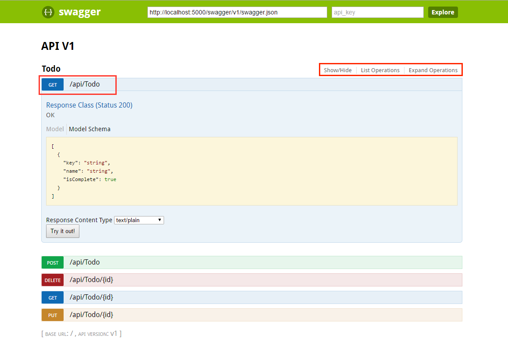
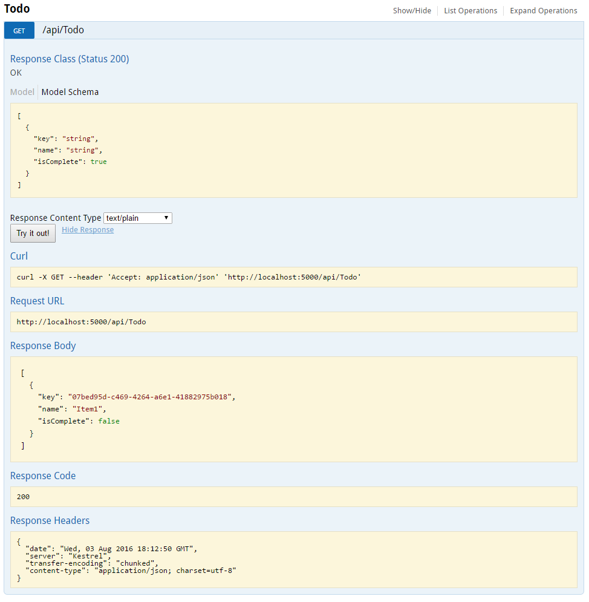

# ASP.NET Core web API help pages with Swagger / OpenAPI

By [Christoph Nienaber](https://twitter.com/zuckerthoben) and [Rico Suter](https://blog.rsuter.com/)

When consuming a Web API, understanding its various methods can be challenging for a developer. [Swagger](https://swagger.io/), also known as [OpenAPI](https://www.openapis.org/), solves the problem of generating useful documentation and help pages for Web APIs. It provides benefits such as interactive documentation, client SDK generation, and API discoverability.

In this article, the [Swashbuckle.AspNetCore](https://github.com/domaindrivendev/Swashbuckle.AspNetCore) and [NSwag](https://github.com/RicoSuter/NSwag) .NET Swagger implementations are showcased:

* **Swashbuckle.AspNetCore** is an open source project for generating Swagger documents for ASP.NET Core Web APIs.

* **NSwag** is another open source project for generating Swagger documents and integrating [Swagger UI](https://swagger.io/swagger-ui/) or [ReDoc](https://github.com/Rebilly/ReDoc) into ASP.NET Core web APIs. Additionally, NSwag offers approaches to generate C# and TypeScript client code for your API.

## What is Swagger / OpenAPI?

Swagger is a language-agnostic specification for describing [REST](https://en.wikipedia.org/wiki/Representational_state_transfer) APIs. The Swagger project was donated to the [OpenAPI Initiative](https://www.openapis.org/), where it's now referred to as OpenAPI. Both names are used interchangeably; however, OpenAPI is preferred. It allows both computers and humans to understand the capabilities of a service without any direct access to the implementation (source code, network access, documentation). One goal is to minimize the amount of work needed to connect disassociated services. Another goal is to reduce the amount of time needed to accurately document a service.

## Swagger specification (swagger.json)

The core to the Swagger flow is the Swagger specification&mdash;by default, a document named *swagger.json*. It's generated by the Swagger tool chain (or third-party implementations of it) based on your service. It describes the capabilities of your API and how to access it with HTTP. It drives the Swagger UI and is used by the tool chain to enable discovery and client code generation. Here's an example of a Swagger specification, reduced for brevity:

```json
{
   "swagger": "2.0",
   "info": {
       "version": "v1",
       "title": "API V1"
   },
   "basePath": "/",
   "paths": {
       "/api/Todo": {
           "get": {
               "tags": [
                   "Todo"
               ],
               "operationId": "ApiTodoGet",
               "consumes": [],
               "produces": [
                   "text/plain",
                   "application/json",
                   "text/json"
               ],
               "responses": {
                   "200": {
                       "description": "Success",
                       "schema": {
                           "type": "array",
                           "items": {
                               "$ref": "#/definitions/TodoItem"
                           }
                       }
                   }
                }
           },
           "post": {
               ...
           }
       },
       "/api/Todo/{id}": {
           "get": {
               ...
           },
           "put": {
               ...
           },
           "delete": {
               ...
   },
   "definitions": {
       "TodoItem": {
           "type": "object",
            "properties": {
                "id": {
                    "format": "int64",
                    "type": "integer"
                },
                "name": {
                    "type": "string"
                },
                "isComplete": {
                    "default": false,
                    "type": "boolean"
                }
            }
       }
   },
   "securityDefinitions": {}
}
```

## Swagger UI

[Swagger UI](https://swagger.io/swagger-ui/) offers a web-based UI that provides information about the service, using the generated Swagger specification. Both Swashbuckle and NSwag include an embedded version of Swagger UI, so that it can be hosted in your ASP.NET Core app using a middleware registration call. The web UI looks like this:



Each public action method in your controllers can be tested from the UI. Click a method name to expand the section. Add any necessary parameters, and click **Try it out!**.



> [!NOTE]
> The Swagger UI version used for the screenshots is version 2. For a version 3 example, see [Petstore example](https://petstore.swagger.io/).

## Next steps

* [Get started with Swashbuckle](xref:tutorials/get-started-with-swashbuckle)
* [Get started with NSwag](xref:tutorials/get-started-with-nswag)
