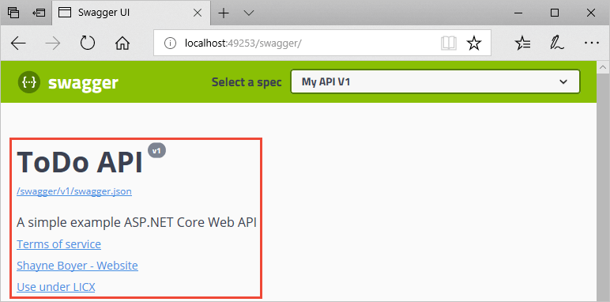
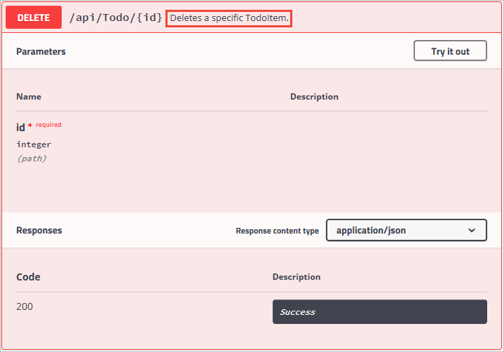
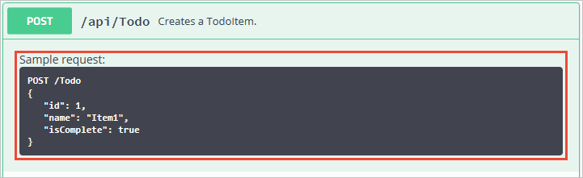
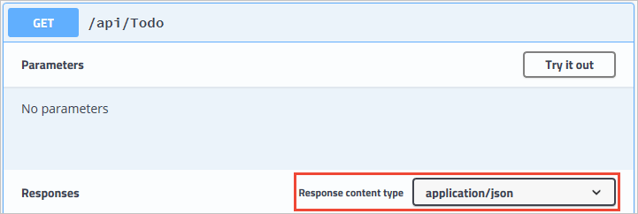
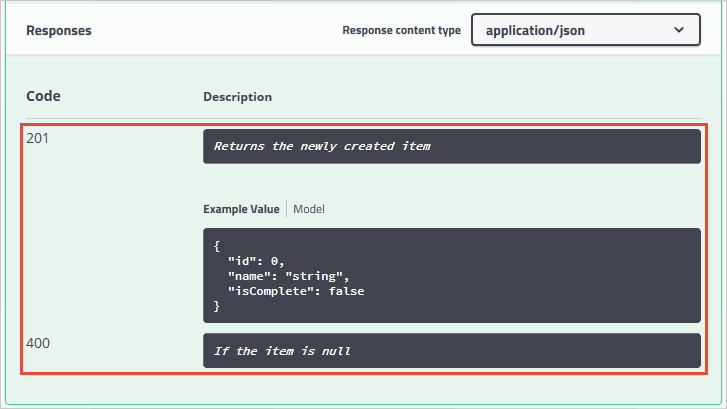

# Get started with Swashbuckle and ASP.NET Core

When consuming a Web API, understanding its various methods can be challenging for a developer. [Swagger](https://swagger.io/), also known as [OpenAPI](https://www.openapis.org/), solves the problem of generating useful documentation and help pages for Web APIs. It provides benefits such as interactive documentation, client SDK generation, and API discoverability.

In this sample, the [Swashbuckle.AspNetCore](https://github.com/domaindrivendev/Swashbuckle.AspNetCore) the .NET implementation is shown.

## Add and configure Swagger middleware

```csharp
public void ConfigureServices(IServiceCollection services)
{
    services.AddDbContext<TodoContext>(opt =>
        opt.UseInMemoryDatabase("TodoList"));
    services.AddControllers();

    // Register the Swagger generator, defining 1 or more Swagger documents
    services.AddSwaggerGen(c =>
    {
        c.SwaggerDoc("v1", new OpenApiInfo { Title = "My API", Version = "v1" });
    });
}
```

In the `Startup.Configure` method, enable the middleware for serving the generated JSON document and the Swagger UI:

```csharp
public void Configure(IApplicationBuilder app)
{
    // Enable middleware to serve generated Swagger as a JSON endpoint.
    app.UseSwagger();

    // Enable middleware to serve swagger-ui (HTML, JS, CSS, etc.),
    // specifying the Swagger JSON endpoint.
    app.UseSwaggerUI(c =>
    {
        c.SwaggerEndpoint("/swagger/v1/swagger.json", "My API V1"); 
    });

    app.UseRouting();
    app.UseEndpoints(endpoints =>
    {
        endpoints.MapControllers();
    });
}
```

The preceding `UseSwaggerUI` method call enables an embedded version of the Swagger UI tool. It depends on the [Static File Middleware](https://learn.microsoft.com/aspnet/core/fundamentals/static-files). If targeting .NET Framework or .NET Core 1.x, add the [Microsoft.AspNetCore.StaticFiles](https://www.nuget.org/packages/Microsoft.AspNetCore.StaticFiles/) NuGet package to the project.

Launch the app, and navigate to `http://localhost:<port>/swagger/v1/swagger.json`. The generated document describing the endpoints appears as shown in [Swagger specification (swagger.json)](https://learn.microsoft.com/aspnet/core/tutorials/web-api-help-pages-using-swagger#swagger-specification-swaggerjson).

The Swagger UI can be found at `http://localhost:<port>/swagger`. Explore the API via Swagger UI and incorporate it in other programs.

> [!TIP]
> To serve the Swagger UI at the app's root (`http://localhost:<port>/`), set the `RoutePrefix` property to an empty string:
>
> ```csharp
>app.UseSwaggerUI(c =>
>{
>    c.SwaggerEndpoint("/swagger/v1/swagger.json", "My API V1");
>    c.RoutePrefix = string.Empty;
>});
>```

If using directories with IIS or a reverse proxy, set the Swagger endpoint to a relative path using the `./` prefix. For example, `./swagger/v1/swagger.json`. Using `/swagger/v1/swagger.json` instructs the app to look for the JSON file at the true root of the URL (plus the route prefix, if used). For example, use `http://localhost:<port>/<route_prefix>/swagger/v1/swagger.json` instead of `http://localhost:<port>/<virtual_directory>/<route_prefix>/swagger/v1/swagger.json`.

## Customize and extend

Swagger provides options for documenting the object model and customizing the UI to match your theme.

In the `Startup` class, add the following namespaces:
```csharp
using System;
using System.Reflection;
using System.IO;
```

### API info and description

The configuration action passed to the `AddSwaggerGen` method adds information such as the author, license, and description:

```csharp
// Register the Swagger generator, defining 1 or more Swagger documents
services.AddSwaggerGen(c =>
{
    c.SwaggerDoc("v1", new OpenApiInfo
    {
        Version = "v1",
        Title = "ToDo API",
        Description = "A simple example ASP.NET Core Web API",
        TermsOfService = new Uri("https://example.com/terms"),
        Contact = new OpenApiContact
        {
            Name = "Shayne Boyer",
            Email = string.Empty,
            Url = new Uri("https://twitter.com/spboyer"),
        },
        License = new OpenApiLicense
        {
            Name = "Use under LICX",
            Url = new Uri("https://example.com/license"),
        }
    });
});
```

The Swagger UI displays the version's information:



### XML comments

XML comments can be enabled with the following approaches:

#### [Visual Studio](#tab/visual-studio)

* Right-click the project in **Solution Explorer** and select *`Edit <project_name>.csproj`*.
* Manually add the highlighted lines to the `.csproj` file:

```xml
<PropertyGroup>
    <GenerateDocumentationFile>true</GenerateDocumentationFile>
    <NoWarn>$(NoWarn);1591</NoWarn>
</PropertyGroup>
```

#### [Visual Studio for Mac](#tab/visual-studio-mac)

* From the *Solution Pad*, press **control** and click the project name. Navigate to **Tools** > **Edit File**.
* Manually add the highlighted lines to the `.csproj` file:

```xml
<PropertyGroup>
    <GenerateDocumentationFile>true</GenerateDocumentationFile>
    <NoWarn>$(NoWarn);1591</NoWarn>
</PropertyGroup>
```

#### [Visual Studio Code](#tab/visual-studio-code)

Manually add the highlighted lines to the `.csproj` file:

```xml
<PropertyGroup>
    <GenerateDocumentationFile>true</GenerateDocumentationFile>
    <NoWarn>$(NoWarn);1591</NoWarn>
</PropertyGroup>
```

---

Enabling XML comments provides debug information for undocumented public types and members. Undocumented types and members are indicated by the warning message. For example, the following message indicates a violation of warning code 1591:

```text
warning CS1591: Missing XML comment for publicly visible type or member 'TodoController.GetAll()'
```

To suppress warnings project-wide, define a semicolon-delimited list of warning codes to ignore in the project file. Appending the warning codes to `$(NoWarn);` applies the [C# default values](https://github.com/dotnet/sdk/blob/2eb6c546931b5bcb92cd3128b93932a980553ea1/src/Tasks/Microsoft.NET.Build.Tasks/targets/Microsoft.NET.Sdk.CSharp.props#L16) too.

```xml
<NoWarn>$(NoWarn);1591</NoWarn>
```

To suppress warnings only for specific members, enclose the code in [#pragma warning](https://learn.microsoft.com/dotnet/csharp/language-reference/preprocessor-directives/preprocessor-pragma-warning) preprocessor directives. This approach is useful for code that shouldn't be exposed via the API docs. In the following example, warning code CS1591 is ignored for the entire `Program` class. Enforcement of the warning code is restored at the close of the class definition. Specify multiple warning codes with a comma-delimited list.

```csharp
namespace TodoApi
{
#pragma warning disable CS1591
    public class Program
    {
        public static void Main(string[] args) =>
            BuildWebHost(args).Run();

        public static IWebHost BuildWebHost(string[] args) =>
            WebHost.CreateDefaultBuilder(args)
                .UseStartup<Startup>()
                .Build();
    }
#pragma warning restore CS1591
}
```

Configure Swagger to use the XML file that's generated with the preceding instructions. For Linux or non-Windows operating systems, file names and paths can be case-sensitive. For example, a `TodoApi.XML` file is valid on Windows but not CentOS.

```csharp
/// NOTE LAST 3 LINES IN THIS SNIPPET
public void ConfigureServices(IServiceCollection services)
{
    services.AddDbContext<TodoContext>(opt =>
        opt.UseInMemoryDatabase("TodoList"));
    services.AddControllers();

    // Register the Swagger generator, defining 1 or more Swagger documents
    services.AddSwaggerGen(c =>
    {
        c.SwaggerDoc("v1", new OpenApiInfo
        {
            Version = "v1",
            Title = "ToDo API",
            Description = "A simple example ASP.NET Core Web API",
            TermsOfService = new Uri("https://example.com/terms"),
            Contact = new OpenApiContact
            {
                Name = "Shayne Boyer",
                Email = string.Empty,
                Url = new Uri("https://twitter.com/spboyer"),
            },
            License = new OpenApiLicense
            {
                Name = "Use under LICX",
                Url = new Uri("https://example.com/license"),
            }
        });

        // Set the comments path for the Swagger JSON and UI.
        var xmlFile = $"{Assembly.GetExecutingAssembly().GetName().Name}.xml";
        var xmlPath = Path.Combine(AppContext.BaseDirectory, xmlFile);
        c.IncludeXmlComments(xmlPath);
    });
}
```

In the preceding code, [Reflection](https://learn.microsoft.com/dotnet/csharp/programming-guide/concepts/reflection) is used to build an XML file name matching that of the web API project. The [AppContext.BaseDirectory](https://learn.microsoft.com/dotnet/api/system.appcontext.basedirectory) property is used to construct a path to the XML file. Some Swagger features (for example, schemata of input parameters or HTTP methods and response codes from the respective attributes) work without the use of an XML documentation file. For most features, namely method summaries and the descriptions of parameters and response codes, the use of an XML file is mandatory.

Adding triple-slash comments to an action enhances the Swagger UI by adding the description to the section header. Add a [\<summary>](https://learn.microsoft.com/dotnet/csharp/programming-guide/xmldoc/summary) element above the `Delete` action:

```csharp
/// <summary>
/// Deletes a specific TodoItem.
/// </summary>
/// <param name="id"></param>        
[HttpDelete("{id}")]
public IActionResult Delete(long id)
{
    var todo = _context.TodoItems.Find(id);

    if (todo == null)
    {
        return NotFound();
    }

    _context.TodoItems.Remove(todo);
    _context.SaveChanges();

    return NoContent();
}
```
The Swagger UI displays the inner text of the preceding code's `<summary>` element:



The UI is driven by the generated JSON schema:

```json
"delete": {
    "tags": [
        "Todo"
    ],
    "summary": "Deletes a specific TodoItem.",
    "operationId": "ApiTodoByIdDelete",
    "consumes": [],
    "produces": [],
    "parameters": [
        {
            "name": "id",
            "in": "path",
            "description": "",
            "required": true,
            "type": "integer",
            "format": "int64"
        }
    ],
    "responses": {
        "200": {
            "description": "Success"
        }
    }
}
```
Add a [\<remarks>](https://learn.microsoft.com/dotnet/csharp/programming-guide/xmldoc/remarks) element to the `Create` action method documentation. It supplements information specified in the `<summary>` element and provides a more robust Swagger UI. The `<remarks>` element content can consist of text, JSON, or XML.

```csharp
/// <summary>
/// Creates a TodoItem.
/// </summary>
/// <remarks>
/// Sample request:
///
///     POST /Todo
///     {
///        "id": 1,
///        "name": "Item1",
///        "isComplete": true
///     }
///
/// </remarks>
/// <param name="item"></param>
/// <returns>A newly created TodoItem</returns>
/// <response code="201">Returns the newly created item</response>
/// <response code="400">If the item is null</response>            
[HttpPost]
[ProducesResponseType(StatusCodes.Status201Created)]
[ProducesResponseType(StatusCodes.Status400BadRequest)]
public ActionResult<TodoItem> Create(TodoItem item)
{
    _context.TodoItems.Add(item);
    _context.SaveChanges();

    return CreatedAtRoute("GetTodo", new { id = item.Id }, item);
}
```
Notice the UI enhancements with these additional comments:



### Data annotations

Mark the model with attributes, found in the [System.ComponentModel.DataAnnotations](https://learn.microsoft.com/dotnet/api/system.componentmodel.dataannotations) namespace, to help drive the Swagger UI components.

Add the `[Required]` attribute to the `Name` property of the `TodoItem` class:

```csharp
using System.ComponentModel;
using System.ComponentModel.DataAnnotations;

namespace TodoApi.Models
{
    public class TodoItem
    {
        public long Id { get; set; }

        [Required]
        public string Name { get; set; }

        [DefaultValue(false)]
        public bool IsComplete { get; set; }
    }
}
```

The presence of this attribute changes the UI behavior and alters the underlying JSON schema:

```json
"definitions": {
    "TodoItem": {
        "required": [
            "name"
        ],
        "type": "object",
        "properties": {
            "id": {
                "format": "int64",
                "type": "integer"
            },
            "name": {
                "type": "string"
            },
            "isComplete": {
                "default": false,
                "type": "boolean"
            }
        }
    }
},
```

Add the `[Produces("application/json")]` attribute to the API controller. Its purpose is to declare that the controller's actions support a response content type of *application/json*:

```csharp
[Produces("application/json")]
[Route("api/[controller]")]
[ApiController]
public class TodoController : ControllerBase
{
    private readonly TodoContext _context;
```
The **Response Content Type** drop-down selects this content type as the default for the controller's GET actions:



As the usage of data annotations in the web API increases, the UI and API help pages become more descriptive and useful.

### Describe response types

Developers consuming a web API are most concerned with what's returned&mdash;specifically response types and error codes (if not standard). The response types and error codes are denoted in the XML comments and data annotations.

The `Create` action returns an HTTP 201 status code on success. An HTTP 400 status code is returned when the posted request body is null. Without proper documentation in the Swagger UI, the consumer lacks knowledge of these expected outcomes. Fix that problem by adding the highlighted lines in the following example:

```csharp
/// <returns>A newly created TodoItem</returns>
/// <response code="201">Returns the newly created item</response>
/// <response code="400">If the item is null</response>            
[HttpPost]
[ProducesResponseType(StatusCodes.Status201Created)]
[ProducesResponseType(StatusCodes.Status400BadRequest)]
public ActionResult<TodoItem> Create(TodoItem item)
```

The Swagger UI now clearly documents the expected HTTP response codes:



In ASP.NET Core 2.2 or later, conventions can be used as an alternative to explicitly decorating individual actions with `[ProducesResponseType]`. For more information, see [Use web API conventions](https://learn.microsoft.com/aspnet/core/web-api/advanced/conventions).

For information on customizing the UI see: [Customize the UI](https://learn.microsoft.com/aspnet/core/tutorials/getting-started-with-swashbuckle?#customize-and-extend)
