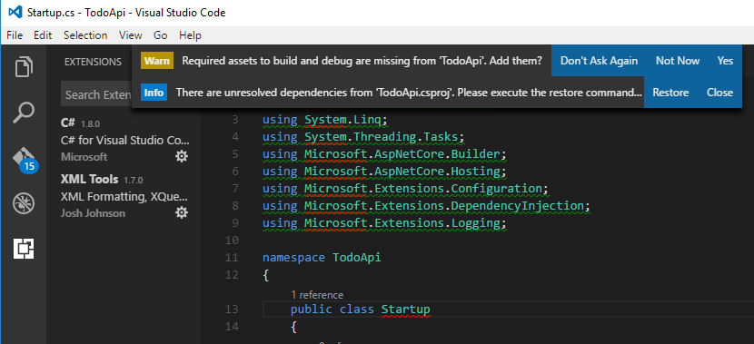

# Create a Web API with ASP.NET Core MVC and Visual Studio Code on Linux, macOS, and Windows

By [Rick Anderson](https://twitter.com/RickAndMSFT) and [Mike Wasson](https://github.com/mikewasson)

In this tutorial, you’ll build a web API for managing a list of "to-do" items. You won’t build a UI.

There are 3 versions of this tutorial:

* macOS, Linux, Windows: Web API with Visual Studio Code (This tutorial)
* macOS: [Web API with Visual Studio for Mac](xref:tutorials/first-web-api-mac)
* Windows: [Web API with Visual Studio for Windows](xref:tutorials/first-web-api)

<!-- WARNING: The code AND images in this doc are used by uid: tutorials/web-api-vsc, tutorials/first-web-api-mac and tutorials/first-web-api. If you change any code/images in this tutorial, update uid: tutorials/web-api-vsc -->

[!INCLUDE[template files](../includes/webApi/intro.md)]

## Set up your development environment

Download and install:
- [.NET Core](https://www.microsoft.com/net/core)
- [Visual Studio Code](https://code.visualstudio.com)
- Visual Studio Code [C# extension](https://marketplace.visualstudio.com/items?itemName=ms-vscode.csharp)

## Create the project

From a console, run the following commands:

```console
mkdir TodoApi
cd TodoApi
dotnet new webapi
```

Open the *TodoApi* folder in Visual Studio Code (VS Code) and select the *Startup.cs* file.

- Select **Yes** to the **Warn** message "Required assets to build and debug are missing from 'TodoApi'. Add them?"
- Select **Restore** to the **Info** message "There are unresolved dependencies".

<!-- uid: tutorials/first-mvc-app-xplat/start-mvc uses the pic below. If you change it, make sure it's consistent -->



Press **Debug** (F5) to build and run the program. In a browser navigate to http://localhost:5000/api/values . The following is displayed:

`["value1","value2"]`

See [Visual Studio Code help](#visual-studio-code-help) for tips on using VS Code.

## Add support for Entity Framework Core

Edit the *TodoApi.csproj* file to install the [Entity Framework Core InMemory](https://docs.microsoft.com/ef/core/providers/in-memory/) database provider. This database provider allows Entity Framework Core to be used with an in-memory database.

[!code-xml[Main](web-api-vsc/sample/TodoApi/TodoApi.csproj?highlight=12)]

Run `dotnet restore` to download and install the EF Core InMemory DB provider. You can run `dotnet restore` from the terminal or enter `⌘⇧P` (macOS) or `Ctrl+Shift+P` (Linux) in VS Code and then type **.NET**. Select **.NET: Restore Packages**.

## Add a model class

A model is an object that represents the data in your application. In this case, the only model is a to-do item.

Add a folder named *Models*. You can put model classes anywhere in your project, but the *Models* folder is used by convention.

Add a `TodoItem` class with the following code:

[!code-csharp[Main](first-web-api/sample/TodoApi/Models/TodoItem.cs)]

The database generates the `Id` when a `TodoItem` is created.

## Create the database context

The *database context* is the main class that coordinates Entity Framework functionality for a given data model. You create this class by deriving from the `Microsoft.EntityFrameworkCore.DbContext` class.

Add a `TodoContext` class in the *Models* folder:

[!code-csharp[Main](first-web-api/sample/TodoApi/Models/TodoContext.cs)]

[!INCLUDE[Register the database context](../includes/webApi/register_dbContext.md)]

## Add a controller

In the *Controllers* folder, create a class named `TodoController`. Add the following code:

[!INCLUDE[code and get todo items](../includes/webApi/getTodoItems.md)]

### Launch the app

In VS Code, press F5 to launch the app. Navigate to  http://localhost:5000/api/todo   (The `Todo` controller we just created).

[!INCLUDE[last part of web API](../includes/webApi/end.md)]

## Visual Studio Code help

- [Getting started](https://code.visualstudio.com/docs)
- [Debugging](https://code.visualstudio.com/docs/editor/debugging)
- [Integrated terminal](https://code.visualstudio.com/docs/editor/integrated-terminal)
- [Keyboard shortcuts](https://code.visualstudio.com/docs/getstarted/keybindings#_keyboard-shortcuts-reference)

  - [Mac keyboard shortcuts](https://code.visualstudio.com/shortcuts/keyboard-shortcuts-macos.pdf)
  - [Linux keyboard shortcuts](https://code.visualstudio.com/shortcuts/keyboard-shortcuts-linux.pdf)
  - [Windows keyboard shortcuts](https://code.visualstudio.com/shortcuts/keyboard-shortcuts-windows.pdf)

[!INCLUDE[next steps](../includes/webApi/next.md)]


