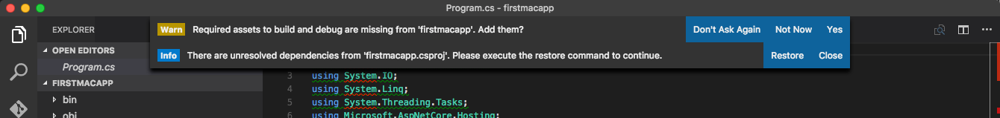

# Build an ASP.NET Core app on a Mac or Linux using Visual Studio Code

This article will show you how to write your first ASP.NET Core application on macOS or Linux.

## Setting up your development environment

Download and install [.NET Core](https://microsoft.com/net/core) and [Visual Studio Code](https://code.visualstudio.com) with the [C# extension](https://marketplace.visualstudio.com/items?itemName=ms-vscode.csharp).

## Scaffolding applications using dotnet new

We will be using `dotnet new` to generate a new web application using the "Empty Web Template". Create a working directory for your project called *firstapp* . cd to *firstapp*.

Start Visual Studio Code and open the *firstapp* folder. Press Ctrl + '\`' (the back-quote character) to open an embedded terminal in VS Code. Alternatively, use a separate terminal window.
Run the `dotnet new` command to create a new web application, passing the `mvc` parameter as the template type.

```console
dotnet new mvc
```

If you get an error running `dotnet new mvc`, install the latest [.NET Core](https://microsoft.com/net/core). When the CLI command completes; the following output and files are produced.

```console
Content generation time: 79.6691 ms
The template "Empty ASP.NET Core Web Application" created successfully.
```
<!-- the ~ format is perferred but not working on DocFX. It does work on OPS. See bug https://mseng.visualstudio.com/DefaultCollection/VSChina/_workitems#_a=edit&id=959814
[!INCLUDE[template files](~/includes/template-files.md)]
-->

[!INCLUDE[template files](../includes/template-files.md)]

## Developing ASP.NET Core applications on a Mac and Linux with Visual Studio Code

Open the project folder in Visual Studio Code (VS Code) and select the *Startup.cs* file.. VS Code will prompt to restore the needed project dependencies and add build/debug dependencies. Tap **Yes** to add the build and debug assets and then tap **Restore** to restore the project dependencies.



For **Restore**,  alternately, you can run `dotnet restore` from the terminal or enter `⌘⇧P` or `Ctrl+Shift+P` in VS Code and then type `.NET` as shown:


VS Code provides a streamlined, clean interface for working with files and a productive coding enviromment. 

In the left navigation bar, there are five icons, representing four viewlets:

* Explore
* Search
* Git
* Debug
* Extensions

The Explorer viewlet provides folder navigation and a view of the files you have open. It displays a badge to indicate files with unsaved changes. You can create new folders and files in the viewlet. You can select **Save All** from a menu option that appears on mouse over.

The Search viewlet allows you to search the folder tree of files you have open. The search is for filenames and file contents.

*VS Code* will integrate with Git if it is installed on your system. You can initialize a new repository, make commits, and push changes from the Git viewlet.


The Debug viewlet supports interactive debugging of applications.

VS Code's editor has a ton of great features. You'll notice unused using statements are underlined and can be removed automatically by using `⌘ .` or `Ctrl + .` when the lightbulb icon appears. Classes and methods also display how many references there are in the project to them.

More on editor in [Visual Studio Code](https://code.visualstudio.com).

## Using the VS Code debugger

The sample is configured to use [Kestrel](../fundamentals/servers/kestrel.md) for the web server.

Run the app in the debugger:

* Tap the Debug icon in the View Bar on the left pane

* Tap the "Play (F5)" icon to launch the app


Your default browser will automatically launch and navigate to `http://localhost:5000`


* To stop the application, close the browser and hit the "Stop" icon on the debug bar


### Using the dotnet commands

* Run `dotnet run` command to launch the app from terminal/bash

* Navigate to `http://localhost:5000`

* To stop the web server enter `⌃+C` or `Ctrl+C`.

## Publishing to Azure

VS Code provides Git integration to push updates to production, hosted on [Microsoft Azure](http://azure.microsoft.com).

### Initialize Git

Initialize Git in the folder you're working in. Tap on the Git viewlet and click the `Initialize Git repository` button.


Add a commit message and tap enter or tap the checkmark icon to commit the staged files.


Git is tracking changes, so if you make an update to a file, the Git viewlet will display the files that have changed since your last commit.

### Initialize Azure Website

You can deploy to Azure Web Apps directly using Git.

* If you don't have an Azure account, you can [create a free trial](http://azure.microsoft.com/en-us/pricing/free-trial/).

Create a Web App in the Azure Portal to host your new application.


Configure the Web App in Azure to support [continuous deployment using Git](https://azure.microsoft.com/en-us/documentation/articles/app-service-deploy-local-git/).

Record the Git URL for the Web App from the Azure portal.


In a Terminal window, add a remote named `azure` with the Git URL you noted previously.

`git remote add azure https://shayneboyer@myfirstappmac.scm.azurewebsites.net:443/MyFirstAppMac.git`

Push to master.  `git push azure master` to deploy.

   

Browse to the newly deployed web app.


Looking at the Deployment Details in the Azure Portal, you can see the logs and steps each time there is a commit to the branch.


## Additional resources

* [Visual Studio Code](https://code.visualstudio.com)
* [Fundamentals](../fundamentals/index.md)
