# Your First ASP.NET Core Application on a Mac Using Visual Studio Code

By [Daniel Roth](https://github.com/danroth27), [Steve Smith](http://ardalis.com), [Rick Anderson](https://twitter.com/RickAndMSFT) and [Shayne Boyer](https://twitter.com/spboyer)

This article will show you how to write your first ASP.NET Core application on a Mac.

## Setting Up Your Development Environment

To setup your development machine download and install [.NET Core](https://microsoft.com/net/core) and [Visual Studio Code](https://code.visualstudio.com) with the [C# extension](https://marketplace.visualstudio.com/items?itemName=ms-vscode.csharp). Node.js and npm is also required. If not already installed visit [nodejs.org](https://nodejs.org/en/download/package-manager/#osx).

## Scaffolding Applications Using Yeoman

We will be using `yo aspnet` to generate the **Web Application Basic** template, you may follow the full instructions in [Building Projects with Yeoman](../client-side/yeoman.md) to create an ASP.NET Core project which show an **Empty Web** for reference.

Install the necessary yeoman generators and bower using npm.

```console
npm install -g yo generator-aspnet bower
   ```

Run the ASP.NET Core generator

```console
yo aspnet
   ```

* Select **Web Application Basic [without Membership and Authorization]** and tap Enter

* Select Bootstrap (3.3.6) as the UI framework and tap Enter

* Use "MyFirstApp" for the app name and tap Enter

When the generator completes scaffolding the files, it will instruct you to restore, build, and run the application.

```console
Your project is now created, you can use the following commands to get going
       cd "MyFirstApp"
       dotnet restore
       dotnet build (optional, build will also happen with it's run)
       dotnet run
   ```

## Developing ASP.NET Core Applications on a Mac With Visual Studio Code

* Start **Visual Studio Code**

* Tap **File > Open** and navigate to your ASP.NET Core app

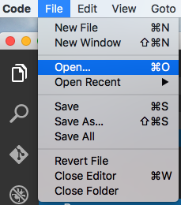

When the application is opened, Visual Studio Code will prompt to restore the needed project dependencies as well as add build and debug dependencies.

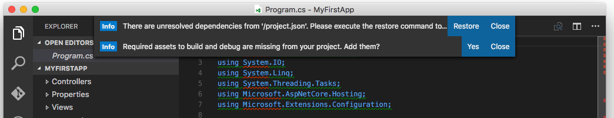

Tap "Yes" to add the build and debug assets.

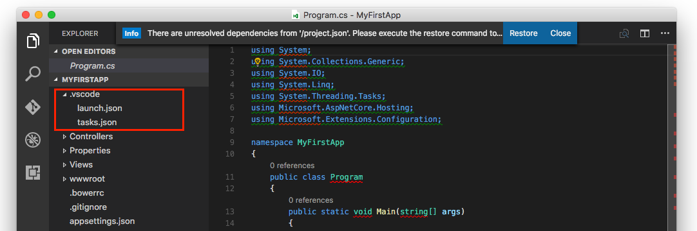

Tap "Restore" to restore the project dependencies. Alternately, you can enter `⌘⇧P` in Visual Studio Code and then type `dot` as shown:

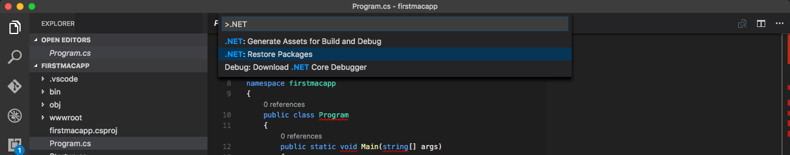

You can run commands directly from within Visual Studio Code, including `dotnet restore` and any tools referenced in the *project.json* file, as well as custom tasks defined in *.vscode/tasks.json*. Visual Studio Code also includes an integrated console `⌃` where you can execute these commands without leaving the editor.

If this is your first time using Visual Studio Code (or just *Code* for short), note that it provides a very streamlined, fast, clean interface for quickly working with files, while still providing tooling to make writing code extremely productive.

In the left navigation bar, there are five icons, representing four viewlets:

* Explore
* Search
* Git
* Debug
* Extensions

The Explorer viewlet allows you to quickly navigate within the folder system, as well as easily see the files you are currently working with. It displays a badge to indicate whether any files have unsaved changes, and new folders and files can easily be created (without having to open a separate dialog window). You can easily Save All from a menu option that appears on mouse over, as well.

The Search viewlet allows you to quickly search within the folder structure, searching filenames as well as contents.

*Code* will integrate with Git if it is installed on your system. You can easily initialize a new repository, make commits, and push changes from the Git viewlet.


The Debug viewlet supports interactive debugging of applications.

Code's editor has a ton of great features. You'll notice unused using statements are underlined and can be removed automatically by using `⌘ .` when the lightbulb icon appears. Classes and methods also display how many references there are in the project to them. If you're coming from Visual Studio, Code includes many of the same keyboard shortcuts, such as `⌘KC` to comment a block of code, and `⌘KU` to uncomment.

More on editor in [Visual Studio Code](https://code.visualstudio.com).

## Running Locally Using Kestrel

The sample is configured to use [Kestrel](../fundamentals/servers.md#kestrel) for the web server. You can see it configured in the *project.json* file, where it is specified as a dependency.

  `"Microsoft.AspNetCore.Server.Kestrel":`

### Using Visual Studio Code Debugger

If you chose to have the debug and build assets added to the project:

* Tap the Debug icon in the View Bar on the left pane

* Tap the "Play (F5)" icon to launch the app


Your default browser will automatically launch and navigate to `http://localhost:5000`

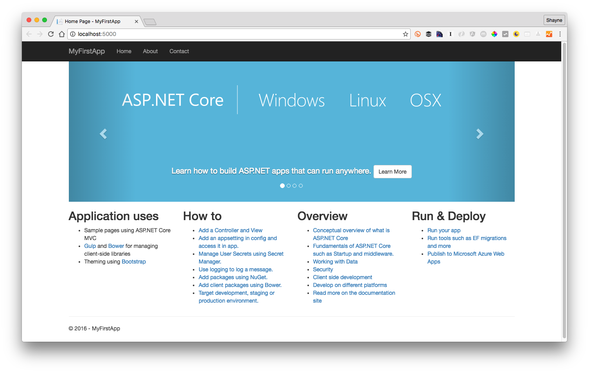

* To stop the application, close the browser and hit the "Stop" icon on the debug bar

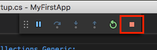

### Using the dotnet commands

* Run `dotnet run` command to launch the app from terminal/bash

* Navigate to `http://localhost:5000`

* To stop the web server enter `⌃+C`.

## Publishing to Azure

Once you've developed your application, you can easily use the Git integration built into Visual Studio Code to push updates to production, hosted on [Microsoft Azure](http://azure.microsoft.com).

### Initialize Git

Initialize Git in the folder you're working in. Tap on the Git viewlet and click the `Initialize Git repository` button.


Add a commit message and tap enter or tap the checkmark icon to commit the staged files.


Git is tracking changes, so if you make an update to a file, the Git viewlet will display the files that have changed since your last commit.

### Initialize Azure Website

You can deploy to Azure Web Apps directly using Git.

* If you don't have an Azure account, you can [create a free trial](http://azure.microsoft.com/en-us/pricing/free-trial/).

Create a Web App in the Azure Portal to host your new application.

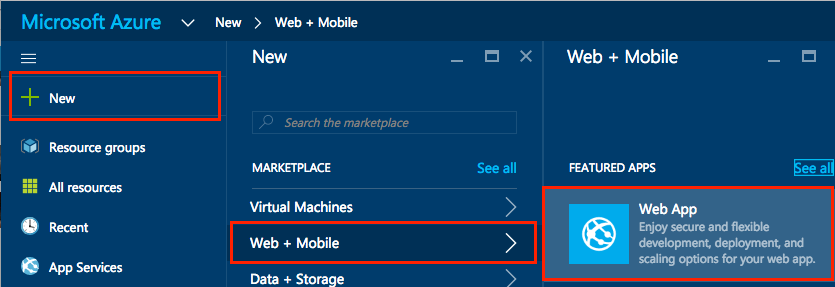

Configure the Web App in Azure to support [continuous deployment using Git](https://azure.microsoft.com/en-us/documentation/articles/app-service-deploy-local-git/).

Record the Git URL for the Web App from the Azure portal.

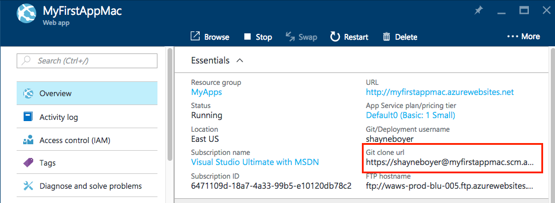

In a Terminal window, add a remote named `azure` with the Git URL you noted previously.

`git remote add azure https://shayneboyer@myfirstappmac.scm.azurewebsites.net:443/MyFirstAppMac.git`

Push to master.  `git push azure master` to deploy.

   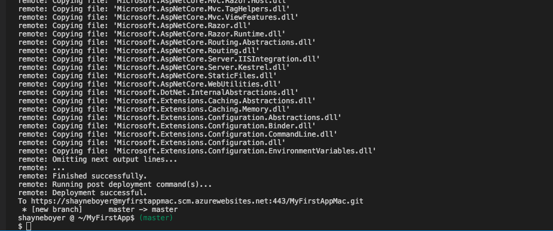

Browse to the newly deployed web app.

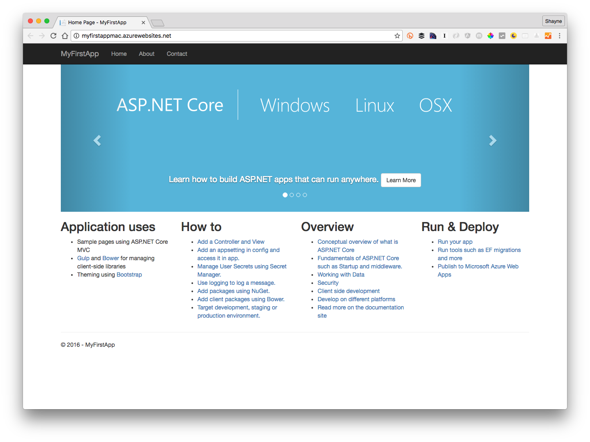

Looking at the Deployment Details in the Azure Portal, you can see the logs and steps each time there is a commit to the branch.

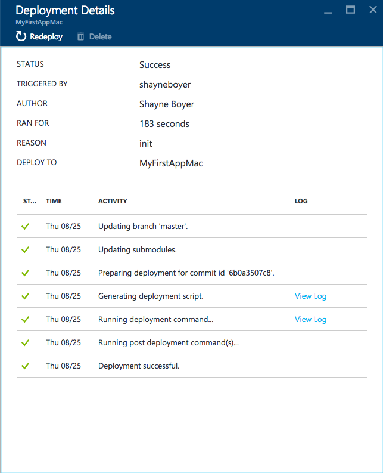

## Additional Resources

* [Visual Studio Code](https://code.visualstudio.com)
* [Building Projects with Yeoman](../client-side/yeoman.md)
* [Fundamentals](../fundamentals/index.md)
