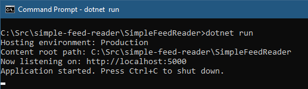
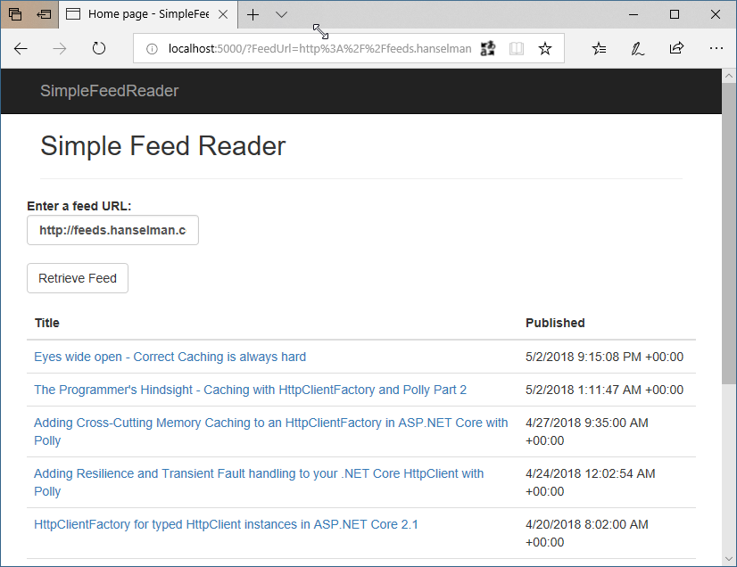

# Deploying an app to App Service

## Overview

[Azure App Service](https://docs.microsoft.com/azure/app-service/) is Azure's web hosting platform. Deploying a web app to Azure App Service can be done multiple ways, either manually or by an automated process. This section of the guide will discuss deployment methods that can be initiated manually or by script.

In this section, you will:

* Download and build the sample app.
* Create an Azure App Service Web App using the Azure Cloud Shell.
* Deploy the sample app to Azure using Git.
* Deploy a change to the app using Visual Studio.
* Add a staging slot to the web app.
* Deploy an update to the staging slot.
* Swap the staging and production slots.

## Download and test the app

The application used in this guide is a pre-built ASP.NET Core application, [Simple Feed Reader](https://github.com/Azure-Samples/simple-feed-reader/). It's a Razor Pages application that uses the `Microsoft.SyndicationFeed.ReaderWriter` API to retrieve an RSS/Atom feed and display the news items in a list.

Feel free to review the code, but it's important to understand that there's nothing special about this app. It's just a simple ASP.NET Core app for illustrative purposes.

From the command line, download the code, build the project, and run it as follows.

> *Note: Linux/macOS users should make appropriate changes for paths, e.g., using forward slash (`/`) rather than back slash (`\`).*

1. Clone the code to a folder on your local machine.
    
    ```console
    git clone https://github.com/Azure-Samples/simple-feed-reader/
    ```
    
2. Change your working folder to the simple-feed-reader folder that was just created.

    ```console
    cd .\simple-feed-reader\SimpleFeedReader
    ```
     
3. Restore the packages and build the solution.
    
    ```console
    dotnet build
    ```

4. Run the application.
    
    ```console
    dotnet run
    ```
    
    

5. Open a browser and navigate to `http://localhost:5000`. The app allows you to type or paste a syndication feed URL and view a list of news items.
    
     
    
6. When you are satisfied the app is working correctly, shut it down by pressing `Ctrl+C` in the command line window.

## Creating the Azure App Service Web App

To deploy the app, you'll need to create an App Service [Web App](https://docs.microsoft.com/azure/app-service/app-service-web-overview), after which you'll deploy from your local maching using Git.

1. Log into the [Azure Cloud Shell](https://shell.azure.com/bash). Note: On first login, Cloud Shell will prompt to create a storage account for configuration files. Accept the defaults or provide a unique name. 

2. Use the Cloud Shell for the following steps.

    a. Set a variable to contain the name of your web app. It will be part of the default URL, so it must be unique. Setting the variable like this will create a random name in the format `webappname99999`.
        
    ```azure-cli
    webappname=mywebapp$RANDOM
    ```
    b. Create a resource group. Resource groups are a way to group your Azure resources so they can be managed as a group.
        
    ```azure-cli
    az group create --location centralus --name AzureTutorial
    ```
    c. Create an App Service plan in S1 tier. An App Service plan is a grouping of web apps that share the same pricing tier. The S1 tier is not free, but it is required for the staging slots feature.
    
    ```azure-cli
    az appservice plan create --name $webappname --resource-group AzureTutorial --sku S1
    ```
    
    d. Create the web app resource in Azure.
        
    ```azure-cli
    az webapp create --name $webappname --resource-group AzureTutorial --plan $webappname
    ```
    
    e. Set the deployment credentials. These deployment credentials will apply to all the web apps in your subscription. Do not use special characters in the user name.

    ```azure-cli
    az webapp deployment user set --user-name <REPLACE WITH USER NAME> --password <REPLACE WITH PASSWORD>
    ```
    
    f. Configure the web app to accept deployments from local Git and display the *Git deployment URL*. **Be sure to note this URL for later**.
        
    ```azure-cli
    echo Git deployment URL: $(az webapp deployment source config-local-git --name $webappname --resource-group AzureTutorial --query url --output tsv)
    ```

    g. Display the *web app URL*. Browse to this URL to see the blank web app. **Be sure to note this URL for later**.
        
    ```
    echo Web app URL: http://$webappname.azurewebsites.net
    ```    

3. Using a command prompt on your local machine, navigate to the web app's project folder (e.g., `.\simple-feed-reader\SimpleFeedReader`) and execute the following commands to set up Git to push to the deployment URL:
    
    a. Add the remote URL to the local repo.  You only need to do this once.
    
    ```console
    git remote add azure <Replace with Git deployment URL>
    ```
    
    b. Push the local master branch to the "azure" remote's master branch.
    
    ```console
    git push azure master
    ```
    
    You will be prompted for the deployment credentials you created earlier. Observe the output in the command line window and note that Azure builds the ASP.NET Core app remotely.  

4. In a browser, navigate to the *Web app URL* and note the app has been built and deployed.  Additional changes can be committed to the local Git repo with `git commit` and pushed to Azure the same way.

## Deployment with Visual Studio

> *Note: This section applies to Windows only. Linux/macOS users should make the change described in step 2 below, save the file, and then commit the change to the local repo with `git commit`. Finally, push the change with `git push` as in the first section.*

Having deployed the app using command line tools, let's use Visual Studio's integrated tools to deploy an update to the app. Behind the scenes, Visual Studio accomplishes the same thing as the command line tools, but within Visual Studio's familiar UI. *Note: 

1. Open *SimpleFeedReader.sln* in Visual Studio.
2. In Solution Explorer, open *Pages\Index.cshtml* and change `<h2>Simple Feed Reader</h2>` to `<h2>Simple Feed Reader - V2</h2>`.
3. Press **Ctrl-Shift-B** to build the application.
4. In Solution Explorer, right-click on the project, and select **Publish**.
    
    
5. Visual Studio can create a new App Service resource, but we're going to publish this update over the existing deployment. In the **Pick a publish target** dialog, select **App Service** from the list on the left, and then select **Select Existing**. Click **Publish**.
6. In the **App Service** dialog, ensure that the Microsoft or Organizational account used to create your Azure subscription is displayed in the upper right. If it's not, click the drop down and add it.
7. Ensure the correct Azure **Subscription** is selected. For **View**, select **Resource Group**. Expand the **AzureTutorial** resource group and then select the existing web app. Click **OK**.
    
    

Visual Studio builds and deploys the application to Azure. Browse to the web app URL and note that the change to the `<H2>` is live.


## Deployment slots

Deployment slots are used to stage changes without affecting the running production app. When the staged version of the app has been verified, the production and staging slots can be swapped, promoting the app in staging to production. The following steps create a staging slot, deploy some changes to it, and swap the staging slot with production after verification.

1. Log into the [Azure Cloud Shell](https://shell.azure.com/bash) if not already logged in. 
2. Create the staging slot. 
    
    a. Create a deployment slot with the name "staging".
    
    ```azure-cli
    az webapp deployment slot create --name $webappname --resource-group AzureTutorial --slot staging
    ```

    b. Configure the staging slot to use deployment from local Git and get the **staging** deployment URL. **Be sure to note this URL for later**.
    
    ```azure-cli
    echo Git deployment URL for staging: $(az webapp deployment source config-local-git --name $webappname --resource-group AzureTutorial --slot staging --query url --output tsv)
    ```

    c. Display the staging slot's URL. Browse to the URL to see the empty staging slot. **Be sure to note this URL for later**.

    ```azure-cli
    echo Staging web app URL: http://$webappname-staging.azurewebsites.net
    ```

3. In a text editor or Visual Studio, modify *Pages/Index.cshtml* again so that the `<h2>` element reads `<h2>Simple Feed Reader - V3</h2>` and save the file.

4. Commit the file to the local Git repo, using either the **Changes** page in Visual Studio's *Team Explorer* tab, or by entering the following using the command line on your local machine:
    
    ```console
    git commit -a -m "upgraded to V3"
    ```
5. Using the command line on your local machine, add the staging deployment URL as a Git remote and push the committed changes:
    
    a. Add the remote URL for staging to the local repo.  You only need to do this once.
    
    ```console
    git remote add staging <Replace with staging Git deployment URL>
    ```
    
    b. Push the local master branch to the "staging" remote's master branch.
    
    ```console
    git push staging master
    ```

    Wait while Azure builds and deploys the app.

6. To verify that V3 has been deployed to the staging slot, open two browser windows or tabs. In one, navigate to the original web app URL. In the other, navigate to the staging web app URL. Note that the production URL displays V2 of the app, while the staging URL displays V3.
    
    

7. In the Cloud Shell, swap the verified/warmed up staging slot into production.
    
    ```azure-cli
    az webapp deployment slot swap --name $webappname --resource-group AzureTutorial --slot staging
    ```

8. To verify that the swap occurred, refresh the two browsers. Note that the V2 and V3 versions have swapped.
    
    

## Summary

In this section, you:

* Downloaded and built the sample app.
* Created an Azure App Service Web App using the Azure Cloud Shell.
* Deployed the sample app to Azure using Git.
* Deployed a change to the app using Visual Studio.
* Added a staging slot to the web app.
* Deployed an update to the staging slot.
* Swapped the staging and production slots.

In the next section, you'll learn how to build a continuous integration environment with Azure and Visual Studio Team Services.

## Additional Reading
* [Web Apps overview](https://docs.microsoft.com/azure/app-service/app-service-web-overview)
* [Build a .NET Core and SQL Database web app in Azure App Service](https://docs.microsoft.com/azure/app-service/app-service-web-tutorial-dotnetcore-sqldb)
* [Configure deployment credentials for Azure App Service](https://docs.microsoft.com/azure/app-service/app-service-deployment-credentials)
* [Set up staging environments in Azure App Service](https://docs.microsoft.com/azure/app-service/web-sites-staged-publishing)