# Continuous Integration and Continuous Deployment

## Overview

In the previous chapter, you created a local Git repository for the Simple Feed Reader app. In this chapter, you'll publish that code to a GitHub repository and construct a Visual Studio Team Services (VSTS) DevOps pipeline. The pipeline enables continuous builds and deployments of the app. Any commit to the GitHub repository triggers a build and a deployment to the Azure Web App's staging slot.

In this section, you'll complete the following tasks:

* Publish the app's code to GitHub
* Create a VSTS account
* Create a team project in VSTS
* Create a build definition
* Create a release definition
* Commit changes to GitHub and automatically deploy to Azure
* Examine the VSTS DevOps pipeline

## Publish the app's code to GitHub

1. Open a browser window, and navigate to `https://github.com`.
1. Click the **+** drop-down in the header, and select **New repository**:

    

1. Select your account in the **Owner** drop-down, and enter *simple-feed-reader* in the **Repository name** textbox.
1. Click the **Create repository** button.
1. Open your local machine's command shell. Navigate to the directory in which the *simple-feed-reader* Git repository is stored.
1. Rename the existing *origin* remote to *upstream*. Execute the following command:
    ```console
    git remote rename origin upstream
    ```
1. Add a new *origin* remote pointing to your copy of the repository on GitHub. Execute the following command:
    ```console
    git remote add origin https://github.com/<GitHub_username>/simple-feed-reader/
    ```
1. Publish your local Git repository to the newly created GitHub repository. Execute the following command:
    ```console
    git push -u origin master
    ```
1. Open a browser window, and navigate to `https://github.com/<GitHub_username>/simple-feed-reader/`. Validate that your code appears in the GitHub repository.

## Configure the DevOps pipeline

1. Open the [Azure portal](https://portal.azure.com/), and navigate to the *staging (mywebapp<unique_number>/staging)* Web App. The Web App can be quickly located by entering *mywebapp<unique_number>/staging* in the portal's search box:

    

1. Click **Deployment options**. A new panel appears. Click **Disconnect** to remove the local Git source control configuration that was added in the previous chapter. Confirm the removal operation by clicking the **Yes** button.
1. Navigate to the *mywebapp<unique_number>* App Service. As a reminder, the portal's search box can be used to quickly locate the App Service.
1. Click **Deployment options**. A new panel appears. Click **Disconnect** to remove the local Git source control configuration that was added in the previous chapter. Confirm the removal operation by clicking the **Yes** button.
1. Click **Continuous Delivery (Preview)**:

    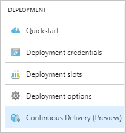

1. Click the **Configure** button. A **Configure Continuous Delivery** panel appears:

    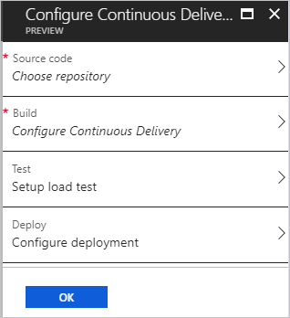

1. Navigate to the sections listed below to complete the configuration. No modifications are needed to the **Setup load test** section.

### Choose repository

Click the **Source code: Choose repository** option, and follow these steps:

1. Select *GitHub* from the **Code repository** drop-down.
1. Select *<GitHub_username>/simple-feed-reader* from the **Repository** drop-down.
1. Select *master* from the **Branch** drop-down.
1. Click the **OK** button to save your selections:

    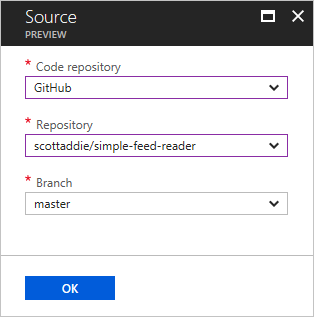

### Configure Continuous Delivery

Click the **Build: Configure Continuous Delivery** option, and follow these steps:

1. Select *ASP.NET Core* from the **Web Application framework** drop-down. This selection is important. It determines the build definition template to be used.
1. Click the *Create new* option of the **Visual Studio Team Service account** toggle button.
1. Enter a unique name in the **Account name** textbox. A green checkmark indicates the name isn't already being used.
1. Select the region closest to you from the **Location** drop-down.
1. Click the **OK** button to save your selections:

    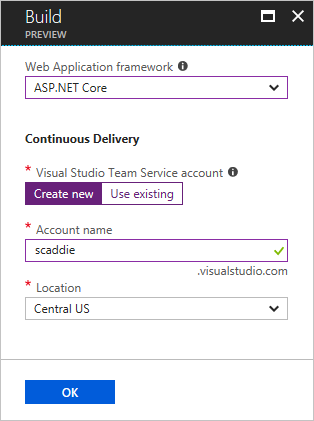

### Configure deployment

Click the **Deploy: Configure deployment** option, and follow these steps:

1. Click the *YES* option of the **Deploy to staging** toggle button. Without this change, the default behavior is to deploy to production.
1. In the **Deployment slot** section, select the *Use existing* radio button. Select *staging* from the drop-down.
1. Click the **OK** button to save your selections.

    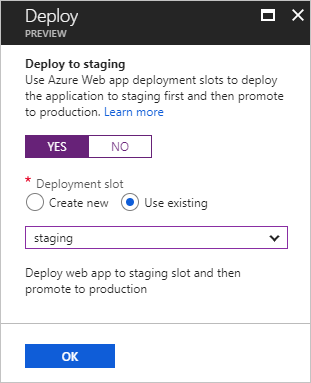

1. Click the **OK** button on the **Configure Continuous Delivery** panel. Wait several minutes for completion.

    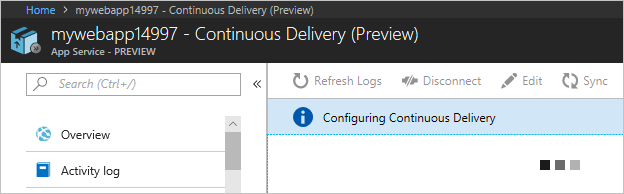

    The following things are occurring during this waiting period:

    * A new VSTS account is created and is accessible at `https://<account_name>.visualstudio.com`. A confirmation email is sent with the details.
    * A build definition and a release definition are created within a new team project named *MyFirstProject*.
    * A build of the app is triggered. When the build succeeds, a deployment to the production environment is triggered.

1. Click the **Build triggered** link to monitor the build's progress.

    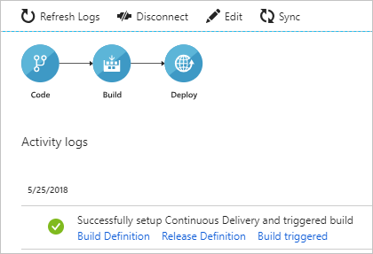

## Commit changes to GitHub and automatically deploy to Azure

1. Open *SimpleFeedReader.sln* in Visual Studio.
1. In Solution Explorer, open *Pages\Index.cshtml*. Change `<h2>Simple Feed Reader - V3</h2>` to `<h2>Simple Feed Reader - V4</h2>`.
1. Press **Ctrl**+**Shift**+**B** to build the app.
1. Commit the file to the GitHub repository. Use either the **Changes** page in Visual Studio's *Team Explorer* tab, or execute the following using the local machine's command shell:

    ```console
    git commit -a -m "upgraded to V4"
    ```
1. Push the change in the *master* branch to *origin* remote of your GitHub repository:

    ```console
    git push origin master
    ```

The commit appears in the GitHub repository's *master* branch:

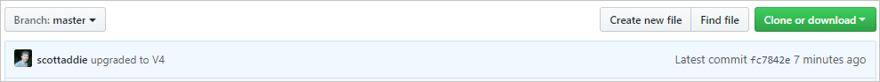

The build is triggered, since continuous integration is enabled in the build definition's **Triggers** tab:


Navigate to the **Queued** tab of the **Build and Release** > **Builds** page in VSTS. The queued build shows the branch and commit that triggered the build:

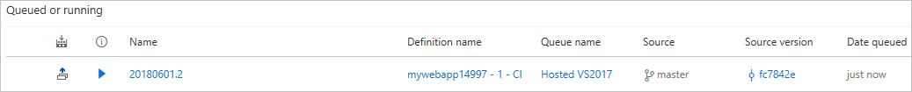

Once the build succeeds, a deployment to Azure occurs. Navigate to the app in the browser. Notice that the "V4" text appears in the heading:


## Examine the VSTS DevOps pipeline

### Build definition

A build definition was created with the name *mywebapp<unique_number> - CI*. Upon completion, the build produces a *.zip* file including the assets to be published. The release definition deploys those assets to Azure.

The build definition's **Tasks** tab lists the individual steps being used. There are five build tasks.


1. **Restore** &mdash; Executes the `dotnet restore` command to restore the app's NuGet packages. The default package feed used is nuget.org.
1. **Build** &mdash; Executes the `dotnet build --configuration Release` command to compile the app's code. This `--configuration` option is used to produce an optimized version of the code, which is suitable for deployment to a production environment. Modify the *BuildConfiguration* variable on the build definition's **Variables** tab if, for example, a debug configuration is needed.
1. **Test** &mdash; Executes the `dotnet test --configuration Release` command to run the app's unit tests. This step currently serves no purpose, as no unit tests were written.
1. **Publish** &mdash; Executes the `dotnet publish --configuration Release --output <local_path_on_build_agent>` command to produce a *.zip* file with the artifacts to be deployed. The `--output` option specifies the publish location of the *.zip* file. That location is specified by passing a [predefined variable](https://docs.microsoft.com/vsts/pipelines/build/variables) named `$(build.artifactstagingdirectory)`. That variable expands to a local path, such as *c:\agent\_work\1\a*, on the build agent.
1. **Publish Artifact** &mdash; Publishes the *.zip* file produced by the **Publish** task. The task accepts the *.zip* file location as a parameter, which is the predefined variable `$(build.artifactstagingdirectory)`. The *.zip* file is published as a folder named *drop*.

Click the build definition's **Summary** link to view a history of builds with the definition:

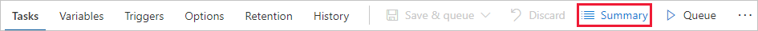

On the resulting page, click the link corresponding to the unique build number:

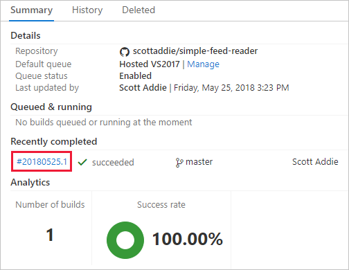

A summary of this specific build is displayed. Click the **Artifacts** tab, and notice the *drop* folder produced by the build is listed:

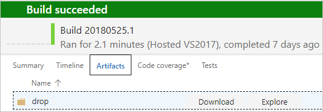

Use the **Download** and **Explore** links to inspect the published artifacts.

### Release definition

A release definition was created with the name *mywebapp<unique_number> - CD*:


The two major components of the release definition are the **Artifacts** and the **Environments**. Clicking the box in the **Artifacts** section reveals the following panel:

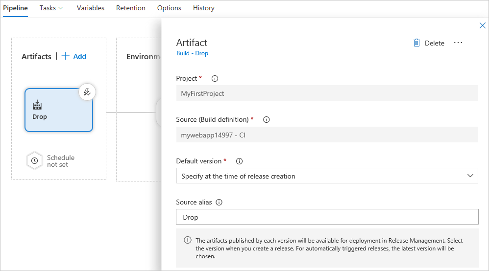

The **Source (Build definition)** value represents the build definition to which this release definition is linked. The *.zip* file produced by a successful run of the build definition is provided to the *Production* environment for deployment to Azure. Click the *1 phase, 2 tasks* link in the *Production* environment box to view the release definition tasks:


The release definition consists of two tasks: *Deploy Azure App Service to Slot* and *Manage Azure App Service - Slot Swap*. Clicking the first task reveals the following task configuration:

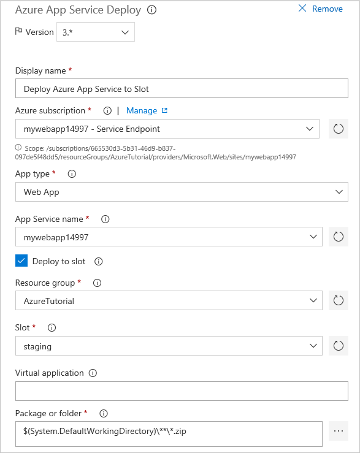

The Azure subscription, service type, web app name, resource group, and deployment slot are defined in the deployment task. The **Package or folder** textbox holds the *.zip* file path to be extracted and deployed to the *staging* slot of the *mywebapp14997* web app.

Clicking the slot swap task reveals the following task configuration:

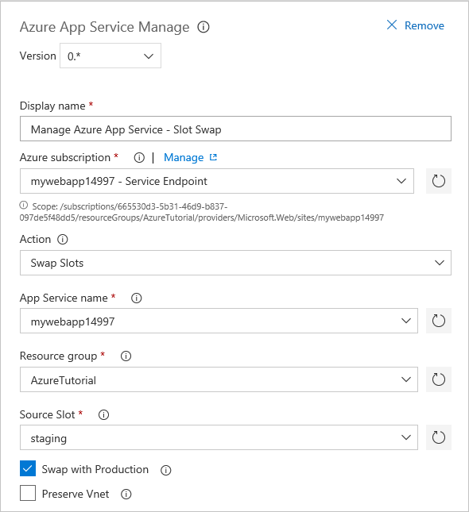

The subscription, resource group, service type, web app name, and deployment slot details are provided. The **Swap with Production** checkbox is checked. Consequently, the bits deployed to the *staging* slot are swapped into the production environment.

## Additional reading

* [Build your ASP.NET Core app](https://docs.microsoft.com/vsts/build-release/apps/aspnet/build-aspnet-core)
* [Build and deploy to an Azure Web App](https://docs.microsoft.com/vsts/build-release/apps/cd/azure/aspnet-core-to-azure-webapp)