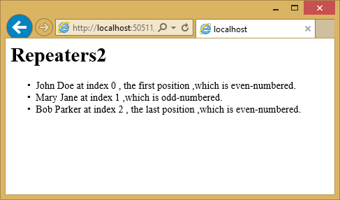

Using Angular for Single Page Applications (SPAs)
=================================================
By :ref:`Venkata Koppaka <angular-author>` | Originally Published: 5 May 2015 

.. _`Venkata Koppaka`: Author_

In this article, you will learn how to build a SPA-style ASP.NET application using AngularJS.

In this article:
	- `What is AngularJS?`_
	- `Getting Started`_
	- `Key Components`_
	- `Angular 2.0`_
	
`View this article's samples on GitHub <https://github.com/aspnet/Docs/tree/master/docs/client-side/angular/sample>`_.

What is AngularJS?
------------------

AngularJS is a modern JavaScript framework from Google commonly used to work with Single Page Applications (SPAs). AngularJS is open sourced under MIT license and the development progress of AngularJS can be followed on `its GitHub repository <https://github.com/angular/angular.js>`_. The library is called Angular because HTML uses angular brackets.

AngularJS is not a DOM manipulation library like jQuery but it uses a subset of jQuery called jQLite. AngularJS is primarily based on declarative HTML attributes that you can add to your HTML tags. You can try AngularJS in your browser using the `Code School website <http://campus.codeschool.com/courses/shaping-up-with-angular-js/intro>`_.

Version 1.3.x is the current stable version and the Angular team is working towards a big rewrite of AngularJS for V2.0 which is currently still in development. This article focuses on Angular 1.X with some notes on where Angular is heading with 2.0.

Getting Started
---------------

To start using AngularJS in your ASP.NET application, you must either install it as part of your project, or reference it from a content delivery network (CDN).

Installation
^^^^^^^^^^^^

There are several ways to add AngularJS to your application. If you’re starting a new web application in Visual Studio 2015 and ASP.NET 5, you can add AngularJS using the built-in NPM and Bower support. Simply open ``bower.json`` and add an entry to the ``dependencies`` property:

.. literalinclude:: angular/sample/src/bower.json
	:language: javascript
	:linenos:
	:emphasize-lines: 5
	
One you save the file, Angular will be installed for your project, located in the Bower folder. You can then use `Grunt or Gulp <../grunt-gulp/grunt-gulp>`_ to copy the appropriate files into your ``wwwroot/lib`` folder, as shown:

.. image:: angular/_static/angular-solution-explorer.png

Next, add a ``
		@RenderSection("scripts", required: false)
	</body>
	</html>

It's recommended that production applications utilize CDNs for common libraries like Angular. You can reference Angular from one of several CDNs, such as this one:

.. code-block:: html

	

Once you have a reference to the angular.js script file, you're ready to begin using Angular in your web pages.

Key Components
--------------

AngularJS includes a number of major components, such as *directives*, *templates*, *repeaters*, *modules*, *controllers*, and more. Let's examine how these components work together to add behavior to your web pages.

Directives
^^^^^^^^^^

AngularJS uses directives to extend HTML with custom attributes and elements. AngularJS directives are defined via ``data-ng-*`` or ``ng-*`` prefixes(``ng`` is short for angular). There are two types of AngularJS directives:

	- Primitive Directives: These are pre-defined by the Angular team and are part of the AngularJS framework.
	- Custom Directives: These are custom directives that you can define.

One of the primitive directives used in all AngularJS applications is the ``ng-app`` directive used to bootstrap the AngularJS application. This directive can be added to the whole document body or to specific pieces of the body. Let's see an example in action. Assuming you're in an ASP.NET project, you can either add an HTML file to the ``wwwroot`` folder, or add a new controller action and associated view. In this case, I've added a new ``Directives()`` action method to ``HomeController.cs`` and the associated view is shown here:

.. code-block:: html
	:linenos:
	:emphasize-lines: 4,6

	@{ Layout = "";
	}
	<html>
	<body ng-app>
		<h1>Directives</h1>
		{{2+2}}
		
	</body>
	</html>

To keep these samples independent of one another, I'm not using the shared layout file. You can see that we decorated the body tag with the ``ng-app`` directive to indicate this page is an AngularJS application. The ``{{2+2}}`` is an Angular data binding expression that you will learn more about in a moment. Here is the result if you run this application: 

.. image:: angular/_static/simple-directive.png

Other primitive directives in AngularJS include:

``ng-controller``
	Determines which JavaScript controller is bound to which view.

``ng-model``
	Determines what model the values of an HTML element's properties are bound to.

``ng-init``
	Used to initialize the application data in the form of an expression for the current scope.

``ng-if``
	If clause used within your AngularJS application; usually used with an expression.

``ng-repeat``
	Repeats a given block of HTML over a set of data.

``ng-show``
	Shows or hides the given HTML element based on the expression provided.

For a full list of all primitive directives supported in AngularJS please refer to the `directive documentation section on the AngularJS documentation website <https://docs.angularjs.org/api/ng/directive>`_.

Data Binding
^^^^^^^^^^^^

AngularJS provides data binding support out-of-the-box using either the ``ng-bind`` directive or a data binding expression syntax such as ``{{expression}}``. AngularJS supports two-way data binding where data from a model is kept in synchronization with a view template at all times. Any changes to the view are automatically reflected in the model and any changes in the model are likewise reflected in the view.

Create a new HTML file or controller action and view called ``Databinding`` and include the following:

.. code-block:: html
	:linenos:
	:emphasize-lines: 7-9
	:caption: Databinding.cshtml

	@{ Layout = "";
	}
	<html>
	<body ng-app>
		<h1>Databinding</h1>

		

			<strong>First name:</strong> {{firstName}}  
			<strong>Last name:</strong> 
		

		
	</body>
	</html>

Notice that you can display model values using either directives or data binding (``ng-bind``). The resulting page should look like this:

.. image:: angular/_static/simple-databinding.png

Templates
^^^^^^^^^

Templates in AngularJS are just plain HTML pages decorated with AngularJS directives and artifacts. A template in AngularJS is a mixture of directives, expressions, filters, and controls that combine with HTML to form the view.

Add another view to demonstrate templates, and add the following to it:

.. code-block:: html
	:linenos:
	:emphasize-lines: 7-9
	:caption: Templates.cshtml

	@{ Layout = "";
	}
	<html>
	<body ng-app>
		<h1>Templates</h1>

		

			<input ng-model="personName" /> {{personName}}
		

		
	</body>
	</html>

The template has AngularJS directives like ``ng-app``, ``ng-init``, ``ng-model`` and data binding expression syntax to bind the ``personName`` property. Running in the browser, the view looks like the screenshot below: 

.. image:: angular/_static/simple-templates-1.png

If you change the name by typing in the input field, you will see the text next to the input field dynamically update, showing Angular two-way data binding in action.

.. image:: angular/_static/simple-templates-2.png

Expressions
^^^^^^^^^^^

Expressions in AngularJS are JavaScript-like code snippets that are written inside the ``{{ expression }}`` syntax. The data from these expressions are bound to HTML the same way as ng-bind directives. The main difference between AngularJS expressions and regular JavaScript expressions is that AngularJS expressions are evaluated against the ``$scope`` object in AngularJS. 

The AngularJS expressions in the sample below bind personName and a simple JavaScript calculated expression:

.. code-block:: html
	:linenos:
	:emphasize-lines: 7-9
	:caption: Expressions.cshtml

	@{ Layout = "";
	}
	<html>
	<body ng-app>
    <h1>Expressions</h1>

    

        Person's name is: {{personName}}  
        Simple JavaScript calculation of 1 + 2: {{1+2}}
    

		
	</body>
	</html>

The example running in the browser displays the personName data and the results of the calculation:

.. image:: angular/_static/simple-expressions.png

Repeaters
^^^^^^^^^

Repeating in AngularJS is done via a primitive directive called ``ng-repeat``. The ``ng-repeat`` directive repeats a given HTML element in a view over the length of a repeating data array. Repeaters in AngularJS can repeat over an array of strings or objects. Here is a sample usage of repeating over an array of strings: 

.. code-block:: html
	:linenos:
	:emphasize-lines: 7,9-10
	:caption: Repeaters.cshtml

	@{ Layout = "";
	}
	<html>
	<body ng-app>
		<h1>Repeaters</h1>

		

			<ul>
				<li ng-repeat="name in names">
					{{name}}
				</li>
			</ul>
		

		
	</body>
	</html>

The repeat directive outputs a series of list items in an unordered list, as you can see in the developer tools shown in this screenshot:

.. image:: angular/_static/repeater.png

Here is an example that repeats over an array of objects. The ``ng-init`` directive establishes a names array, where each element is an object contains first and last names. The ``ng-repeat`` assignment, ``name in names``, outputs a list item for every array element.

.. code-block:: html
	:linenos:
	:emphasize-lines: 7-10, 12-13
	:caption: Repeaters.cshtml

	@{ Layout = "";
	}
	<html>
	<body ng-app>
		<h1>Repeaters</h1>

		

			<ul>
				<li ng-repeat="name in names">
					{{name.firstName + ' ' + name.lastName}}
				</li>
			</ul>
		

		
	</body>
	</html>

The output in this case is the same as in the previous example.

Angular provides some additional directives that can help provide behavior based on where the loop is in its execution.

``$index``
	Use ``$index`` in the ``ng-repeat`` loop to determine which index position your loop currently is on.

``$even`` and ``$odd``
	Use ``$even`` in the ``ng-repeat`` loop to determine whether the current index in your loop is an even indexed row. Similarly, use ``$odd`` to determine if the current index is an odd indexed row.

``$first`` and ``$last``
	Use ``$first`` in the ``ng-repeat`` loop to determine whether the current index in your loop is the first row. Similarly, use ``$last`` to determine if the current index is the last row.

Below is a sample that shows $index, $even, $odd, $first, $odd in action: 

.. code-block:: html
	:linenos:
	:emphasize-lines: 12-17
	:caption: Repeaters.cshtml

	@{ Layout = "";
	}
	<html>
	<body ng-app>
		<h1>Repeaters2</h1>

		

			<ul>
				<li ng-repeat="name in names">
					{{name.firstName + ' ' + name.lastName}} at index {{$index}}
					, the first position
					, the last position
					,which is odd-numbered.
					,which is even-numbered.
				</li>
			</ul>
		

		
	</body>
	</html>

Here is the resulting output:

$scope
^^^^^^

``$scope`` is a JavaScript object that acts as glue between the view (template) and the controller (explained below). A view template in AngularJS only knows about the values that are set on the ``$scope`` object from the controller. 

.. note:: In the MVVM world, the ``$scope`` object in AngularJS is often defined as the ViewModel. The AngularJS team refers to the ``$scope`` object as the Data-Model.

Below is a simple example showing how to set properties on ``$scope`` within a separate JavaScript file, ``scope.js``:

.. code-block:: javascript
	:linenos:
	:emphasize-lines: 2
	:caption: scope.js

	var personApp = angular.module('personApp', []);
	personApp.controller('personController', ['$scope', function ($scope) {
		$scope.name = 'Mary Jane';
	}]);

Observe the $scope parameter passed to the controller on line #2. This object is what the view knows about. In line #3, we are setting a property called "name" to "Mary Jane". 

What happens when a particular property is not found by the view? The view defined below refers to name and age properties: 

.. code-block:: html
	:linenos:
	:emphasize-lines: 4,7-10,13
	:caption: Scope.cshtml

	@{ Layout = "";
	}
	<html>
	<body ng-app="personApp">
		<h1>Scope</h1>

		

			<strong>Name:</strong> {{name}}  
			<strong>Missing Property (age):</strong> {{age}}
		

		
		
	</body>
	</html>

Notice in line #8 that we are asking Angular to show the "name" property using expression syntax. Line #9 then refers to "age", a property that does not exist. The running example shows the name set to "Mary Jane" and nothing for age - missing properties are ignored.

.. image:: angular/_static/scope.png

Modules
^^^^^^^

Services
^^^^^^^^

Angular 2.0
-----------

Summary
-------

Migrating a simple Web API 2 project to MVC 6 is fairly straightforward, thanks to the fact that Web API has been merged with MVC 6 in ASP.NET 5. The main pieces every Web API 2 project will need to migrate are routes, controllers, and models, along with updates to the types used by MVC 6 controllers and actions.

Related Resources
-----------------

`Create a Web API in MVC 6 <http://www.asp.net/vnext/overview/aspnet-vnext/create-a-web-api-with-mvc-6>`_

.. _angular-author:

.. include:: /_authors/venkata-koppaka.rst
