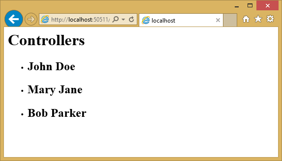
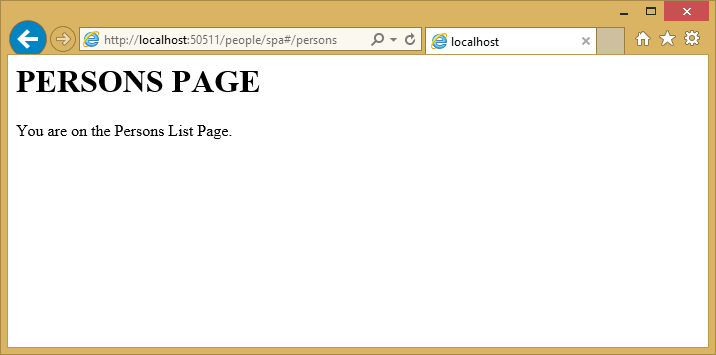

Using Angular for Single Page Applications (SPAs)
=================================================
By :ref:`Venkata Koppaka <angular-author>` | Originally Published: 5 May 2015 

.. _`Venkata Koppaka`: Author_

In this article, you will learn how to build a SPA-style ASP.NET application using AngularJS.

In this article:
	- `What is AngularJS?`_
	- `Getting Started`_
	- `Key Components`_
	- `Angular 2.0`_
	
`View this article's samples on GitHub <https://github.com/aspnet/Docs/tree/master/docs/client-side/angular/sample>`_.

What is AngularJS?
------------------

`AngularJS <http://angularjs.org/>`_ is a modern JavaScript framework from Google commonly used to work with Single Page Applications (SPAs). AngularJS is open sourced under MIT license and the development progress of AngularJS can be followed on `its GitHub repository <https://github.com/angular/angular.js>`_. The library is called Angular because HTML uses angular brackets.

AngularJS is not a DOM manipulation library like jQuery but it uses a subset of jQuery called jQLite. AngularJS is primarily based on declarative HTML attributes that you can add to your HTML tags. You can try AngularJS in your browser using the `Code School website <http://campus.codeschool.com/courses/shaping-up-with-angular-js/intro>`_.

Version 1.3.x is the current stable version and the Angular team is working towards a big rewrite of AngularJS for V2.0 which is currently still in development. This article focuses on Angular 1.X with some notes on where Angular is heading with 2.0.

Getting Started
---------------

To start using AngularJS in your ASP.NET application, you must either install it as part of your project, or reference it from a content delivery network (CDN).

Installation
^^^^^^^^^^^^

There are several ways to add AngularJS to your application. If you’re starting a new web application in Visual Studio 2015 and ASP.NET 5, you can add AngularJS using the built-in NPM and Bower support. Simply open ``bower.json`` and add an entry to the ``dependencies`` property:

.. _angular-bower-json:

.. literalinclude:: angular/sample/src/bower.json
	:language: javascript
	:linenos:
	:emphasize-lines: 11
	
One you save the file, Angular will be installed for your project, located in the Bower folder. You can then use `Grunt or Gulp <../grunt-gulp/grunt-gulp>`_ to copy the appropriate files into your ``wwwroot/lib`` folder, as shown:

.. image:: angular/_static/angular-solution-explorer.png

Next, add a ``
		@RenderSection("scripts", required: false)
	</body>
	</html>

It's recommended that production applications utilize CDNs for common libraries like Angular. You can reference Angular from one of several CDNs, such as this one:

.. code-block:: html

	

Once you have a reference to the angular.js script file, you're ready to begin using Angular in your web pages.

Key Components
--------------

AngularJS includes a number of major components, such as *directives*, *templates*, *repeaters*, *modules*, *controllers*, and more. Let's examine how these components work together to add behavior to your web pages.

Directives
^^^^^^^^^^

AngularJS uses `directives <https://docs.angularjs.org/guide/directive>`_ to extend HTML with custom attributes and elements. AngularJS directives are defined via ``data-ng-*`` or ``ng-*`` prefixes(``ng`` is short for angular). There are two types of AngularJS directives:

	- Primitive Directives: These are pre-defined by the Angular team and are part of the AngularJS framework.
	- Custom Directives: These are custom directives that you can define.

One of the primitive directives used in all AngularJS applications is the ``ng-app`` directive used to bootstrap the AngularJS application. This directive can be added to the whole document body or to specific pieces of the body. Let's see an example in action. Assuming you're in an ASP.NET project, you can either add an HTML file to the ``wwwroot`` folder, or add a new controller action and associated view. In this case, I've added a new ``Directives()`` action method to ``HomeController.cs`` and the associated view is shown here:

.. literalinclude:: angular/sample/src/Views/Home/Directives.cshtml
	:language: html
	:linenos:
	:emphasize-lines: 4,6

To keep these samples independent of one another, I'm not using the shared layout file. You can see that we decorated the body tag with the ``ng-app`` directive to indicate this page is an AngularJS application. The ``{{2+2}}`` is an Angular data binding expression that you will learn more about in a moment. Here is the result if you run this application: 

.. image:: angular/_static/simple-directive.png

Other primitive directives in AngularJS include:

``ng-controller``
	Determines which JavaScript controller is bound to which view.

``ng-model``
	Determines what model the values of an HTML element's properties are bound to.

``ng-init``
	Used to initialize the application data in the form of an expression for the current scope.

``ng-if``
	If clause used within your AngularJS application; usually used with an expression.

``ng-repeat``
	Repeats a given block of HTML over a set of data.

``ng-show``
	Shows or hides the given HTML element based on the expression provided.

For a full list of all primitive directives supported in AngularJS please refer to the `directive documentation section on the AngularJS documentation website <https://docs.angularjs.org/api/ng/directive>`_.

Data Binding
^^^^^^^^^^^^

AngularJS provides `data binding <https://docs.angularjs.org/guide/databinding>`_ support out-of-the-box using either the ``ng-bind`` directive or a data binding expression syntax such as ``{{expression}}``. AngularJS supports two-way data binding where data from a model is kept in synchronization with a view template at all times. Any changes to the view are automatically reflected in the model and any changes in the model are likewise reflected in the view.

Create a new HTML file or controller action and view called ``Databinding`` and include the following:

.. literalinclude:: angular/sample/src/Views/Home/Databinding.cshtml
	:language: html
	:linenos:
	:emphasize-lines: 7-9

Notice that you can display model values using either directives or data binding (``ng-bind``). The resulting page should look like this:

.. image:: angular/_static/simple-databinding.png

Templates
^^^^^^^^^

`Templates <https://docs.angularjs.org/guide/templates>`_ in AngularJS are just plain HTML pages decorated with AngularJS directives and artifacts. A template in AngularJS is a mixture of directives, expressions, filters, and controls that combine with HTML to form the view.

Add another view to demonstrate templates, and add the following to it:

.. literalinclude:: angular/sample/src/Views/Home/Templates.cshtml
	:language: html
	:linenos:
	:emphasize-lines: 7-9

The template has AngularJS directives like ``ng-app``, ``ng-init``, ``ng-model`` and data binding expression syntax to bind the ``personName`` property. Running in the browser, the view looks like the screenshot below: 

.. image:: angular/_static/simple-templates-1.png

If you change the name by typing in the input field, you will see the text next to the input field dynamically update, showing Angular two-way data binding in action.

.. image:: angular/_static/simple-templates-2.png

Expressions
^^^^^^^^^^^

`Expressions <https://docs.angularjs.org/guide/expression>`_ in AngularJS are JavaScript-like code snippets that are written inside the ``{{ expression }}`` syntax. The data from these expressions are bound to HTML the same way as ng-bind directives. The main difference between AngularJS expressions and regular JavaScript expressions is that AngularJS expressions are evaluated against the ``$scope`` object in AngularJS. 

The AngularJS expressions in the sample below bind personName and a simple JavaScript calculated expression:

.. literalinclude:: angular/sample/src/Views/Home/Expressions.cshtml
	:language: html
	:linenos:
	:emphasize-lines: 7-9

The example running in the browser displays the personName data and the results of the calculation:

.. image:: angular/_static/simple-expressions.png

Repeaters
^^^^^^^^^

Repeating in AngularJS is done via a primitive directive called ``ng-repeat``. The ``ng-repeat`` directive repeats a given HTML element in a view over the length of a repeating data array. Repeaters in AngularJS can repeat over an array of strings or objects. Here is a sample usage of repeating over an array of strings: 

.. literalinclude:: angular/sample/src/Views/Home/Repeaters.cshtml
	:language: html
	:linenos:
	:emphasize-lines: 7,9-10

The `repeat directive <https://docs.angularjs.org/api/ng/directive/ngRepeat>`_ outputs a series of list items in an unordered list, as you can see in the developer tools shown in this screenshot:

.. image:: angular/_static/repeater.png

Here is an example that repeats over an array of objects. The ``ng-init`` directive establishes a names array, where each element is an object containing first and last names. The ``ng-repeat`` assignment, ``name in names``, outputs a list item for every array element.

.. literalinclude:: angular/sample/src/Views/Home/Repeaters2.cshtml
	:language: html
	:linenos:
	:emphasize-lines: 7-10,12-13

The output in this case is the same as in the previous example.

Angular provides some additional directives that can help provide behavior based on where the loop is in its execution.

``$index``
	Use ``$index`` in the ``ng-repeat`` loop to determine which index position your loop currently is on.

``$even`` and ``$odd``
	Use ``$even`` in the ``ng-repeat`` loop to determine whether the current index in your loop is an even indexed row. Similarly, use ``$odd`` to determine if the current index is an odd indexed row.

``$first`` and ``$last``
	Use ``$first`` in the ``ng-repeat`` loop to determine whether the current index in your loop is the first row. Similarly, use ``$last`` to determine if the current index is the last row.

Below is a sample that shows $index, $even, $odd, $first, $odd in action: 

.. literalinclude:: angular/sample/src/Views/Home/Repeaters3.cshtml
	:language: html
	:linenos:
	:emphasize-lines: 13-17

Here is the resulting output:

.. image:: angular/_static/repeaters2.png

$scope
^^^^^^

``$scope`` is a JavaScript object that acts as glue between the view (template) and the controller (explained below). A view template in AngularJS only knows about the values that are set on the ``$scope`` object from the controller. 

.. note:: In the MVVM world, the ``$scope`` object in AngularJS is often defined as the ViewModel. The AngularJS team refers to the ``$scope`` object as the Data-Model. `Learn more about Scopes in AngularJS <https://docs.angularjs.org/guide/scope>`_

Below is a simple example showing how to set properties on ``$scope`` within a separate JavaScript file, ``scope.js``:

.. literalinclude:: angular/sample/src/wwwroot/app/scope.js
	:language: html
	:linenos:
	:emphasize-lines: 2-3

Observe the ``$scope`` parameter passed to the controller on line #2. This object is what the view knows about. In line #3, we are setting a property called "name" to "Mary Jane". 

What happens when a particular property is not found by the view? The view defined below refers to name and age properties: 

.. literalinclude:: angular/sample/src/Views/Home/Scope.cshtml
	:language: html
	:linenos:
	:emphasize-lines: 8-9,13

Notice in line #8 that we are asking Angular to show the "name" property using expression syntax. Line #9 then refers to "age", a property that does not exist. The running example shows the name set to "Mary Jane" and nothing for age - missing properties are ignored.

.. image:: angular/_static/scope.png

Modules
^^^^^^^

A `module <https://docs.angularjs.org/guide/module>`_ in AngularJS is a collection of controllers, services, directives etc. The ``angular.module()`` function call is used to create, register and retrieve modules in AngularJS. All modules, including those shipped by the AngularJS team and third party libraries should be registered using the ``angular.module()`` function. 

Below is a snippet of code that shows how to create a new module in AngularJS. The first parameter is the name of the module. The second parameter defines dependencies on other modules. Later in this article we will be showing how to pass these dependencies to an ``angular.module()`` method call.

.. code-block:: javascript

	var personApp = angular.module('personApp', []);

Use the ``ng-app`` directive to represent an AngularJS module on the page. To use a module, assign the name of the module, ``personApp`` in this example, to the ``ng-app`` directive in our template.

.. code-block:: html

	<body ng-app="personApp">

Controllers
^^^^^^^^^^^

`Controllers <https://docs.angularjs.org/guide/controller>`_ in AngularJS are the first point of entry for your code. The ``<module name>.controller()`` function call is used to create and register controllers in AngularJS. The ``ng-controller`` directive is used to represent an AngularJS controller on the HTML page. The role of the controller in Angular is to set state and behavior of the data model (``$scope``). Controllers should not be used to manipulate the DOM directly.

Below is a snippet of code that registers a new controller. The ``personApp`` variable in the snippet is an Angular module, defined on line 5.

.. literalinclude:: angular/sample/src/wwwroot/app/controllers.js
	:language: javascript
	:linenos:
	:emphasize-lines: 2,5

The view using the ``ng-controller`` directive assigns the controller name: 

.. literalinclude:: angular/sample/src/Views/Home/Controllers.cshtml
	:language: html
	:linenos:
	:emphasize-lines: 7,13

The page shows "Mary" and "Jane" that correspond to the ``firstName`` and ``lastName`` properties assigned to the ``$scope`` object.

.. image:: angular/_static/controllers.png

Services
^^^^^^^^

`Services <https://docs.angularjs.org/guide/services>`_ in AngularJS are commonly used shared code that are abstracted away into a file that can be used throughout the lifetime of an angular application. Services are lazily instantiated, meaning that there will not be an instance of a service unless a component that depends on the service gets used. Factories are an example of a service used in AngularJS applications. Factories are created using the ``myApp.factory()`` function call, where ``myApp`` is the module. 

Below is an example that shows how to use factories in AngularJS: 

.. literalinclude:: angular/sample/src/wwwroot/app/simpleFactory.js
	:language: javascript
	:linenos:
	:emphasize-lines: 1

To call this factory from the controller, pass ``personFactory`` as a parameter to the ``controller()`` function: 

.. code-block:: javascript

	personApp.controller('personController', function($scope,personFactory) {
		$scope.name = personFactory.getName();
	});

Using services to talk to a REST endpoint
^^^^^^^^^^^^^^^^^^^^^^^^^^^^^^^^^^^^^^^^^

Below is an end-to-end example using services in AngularJS to interact with an ASP.NET 5 Web API endpoint. The example gets data from the Web API built using ASP.NET 5 and displays the data in a view template. Let's start with the view first: 

.. literalinclude:: angular/sample/src/Views/People/Index.cshtml
	:language: html
	:linenos:
	:emphasize-lines: 4,7,9,16-18

In this view, we have an Angular module called ``PersonsApp`` and a controller called ``personController``. We are using ``ng-repeat`` to iterate over the list of persons. We are referencing three separate script files on lines 16-18.

The ``personApp.js`` file is used to register the ``PersonsApp`` module. The syntax is similar to previous examples. We are using the ``angular.module()`` function to create a new instance of the module that we will be working with.

.. literalinclude:: angular/sample/src/wwwroot/app/personApp.js
	:language: javascript
	:linenos:
	:emphasize-lines: 3

Let's take a look at ``personFactory.js``, below. We are calling the module’s ``factory()`` method to create a factory. Line #12 shows the built-in Angular ``$http`` service retrieving people information from a web service.

.. literalinclude:: angular/sample/src/wwwroot/app/personFactory.js
	:language: javascript
	:linenos:
	:emphasize-lines: 6-7,12

In ``personController.js``, we are calling the module’s ``controller()`` method to create the controller. The ``$scope`` object's ``people`` property is assigned the data returned from the personFactory (line #13).

.. literalinclude:: angular/sample/src/wwwroot/app/personController.js
	:language: javascript
	:linenos:
	:emphasize-lines: 6-7,13

Let's take a quick look at the ASP.NET 5 Web API and the model behind it. The Person model is a plain POCO (Plain Old CLR Object) with Id, FirstName and LastName properties:

.. literalinclude:: angular/sample/src/Models/Person.cs
	:language: csharp
	:linenos:

The Person controller returns a JSON-formatted list of Persons.

.. literalinclude:: angular/sample/src/Controllers/Api/PersonController.cs
	:language: csharp
	:linenos:
	:emphasize-lines: 9-10,19

Let's see the application in action: 

You can `view the application's structure on GitHub <https://github.com/aspnet/Docs/tree/master/docs/client-side/angular/sample>`_.

.. note:: For more on structuring AngularJS applications, see `John Papa's Angular Style Guide <https://github.com/johnpapa/angular-styleguide>`_

.. note:: To create AngularJS module, controller, factory, directive and view files easily, be sure to check out Sayed Hashimi's `SideWaffle template pack for Visual Studio <http://sidewaffle.com/>`_. Sayed Hashimi is a Senior Program Manager on the Visual Studio Web Team at Microsoft and SideWaffle templates are considered the gold standard. At the time of this writing, SideWaffle is only available for Visual Studio 2012 and 2013.

Routing and Multiple Views
^^^^^^^^^^^^^^^^^^^^^^^^^^

AngularJS has a built-in route provider to handle SPA (Single Page Application) based navigation. To work with routing in AngularJS you have to add the ``angular-route`` library using NPM or Bower. You can see in the :ref:`project.json <angular-bower-json>` file referenced at the start of this article that we are already referencing it in our project.

After you install the package, add the script reference (``angular-route.js``) to your view.

Now let's take the Person App we have been building and add navigation to it. First, we will make a copy of the app by creating a new ``PeopleController`` action called ``Spa`` and a corresponding ``Spa.cshtml`` View by copying the Index.cshtml view in the People folder. Add a script reference to ``angular-route`` (see line #11). Also add a ``div`` marked with the ``ng-view`` directive (see line #6) as a placeholder to place views in. We are going to be using several additional ``.js`` files which are referenced on lines 12-15.

.. literalinclude:: angular/sample/src/Views/People/Spa.cshtml
	:language: html
	:linenos:
	:emphasize-lines: 6,11-15
	
Let's take a look at ``personModule.js`` file to see how we are instantiating the module with routing. We are passing ``ngRoute`` as a library into the module. This module handles routing in our application.

.. literalinclude:: angular/sample/src/wwwroot/app/personmodule.js
	:language: javascript
	:linenos:

The ``personRoutes.js`` file, below, defines routes based on the route provider. Lines 4-7 define navigation by effectively saying, when a URL with ``/persons`` is requested, use a template called ``partials/personList`` by working through ``personListController``. Lines 8-11 indicate a detail page with a route parameter of ``personId``. If the URL doesn't match one of the patterns, Angular defaults to the ``/persons`` view.

.. literalinclude:: angular/sample/src/wwwroot/app/personroutes.js
	:language: javascript
	:linenos:
	:emphasize-lines: 4-7, 8-11, 13

The ``personlist.html`` file is a partial view, which only has HTML that is needed to show person list. 

.. literalinclude:: angular/sample/src/wwwroot/app/partials/personlist.html
	:language: html
	:linenos:
	:emphasize-lines: 3

The controller is defined by using the module's ``controller()`` function in ``personListController.js``.

.. literalinclude:: angular/sample/src/wwwroot/app/personListController.js
	:language: javascript
	:linenos:
	:emphasize-lines: 1

If we run this application and go to the ``people/spa#/persons`` URL we will see:

If we navigate to a detail page, for example, ``people/spa#/persons/2``, we will see the detail partial view: 

.. image:: angular/_static/spa-persons-2.png

You can view the full source and any files not shown in this article on `GitHub <https://github.com/aspnet/Docs/tree/master/docs/client-side/angular/sample>`_.

Event Handlers
^^^^^^^^^^^^^^

There are a number of directives in AngularJS that add event-handling capabilities to the input elements in your HTML DOM. Below is a list of the events that are built into AngularJS.

	- ``ng-click``
	- ``ng-dbl-click``
	- ``ng-mousedown``
	- ``ng-mouseup``
	- ``ng-mouseenter``
	- ``ng-mouseleave``
	- ``ng-mousemove``
	- ``ng-keydown``
	- ``ng-keyup``
	- ``ng-keypress``
	- ``ng-change``

.. note:: You can add your own event handlers using the `custom directives feature in AngularJS <https://docs.angularjs.org/guide/directive>`_.

Let's look at how the ``ng-click`` event is wired up. Create a new JavaScript file, ``eventHandlerController.js``, and add the following to it.

.. literalinclude:: angular/sample/src/wwwroot/app/eventHandlerController.js
	:language: javascript
	:linenos:
	:emphasize-lines: 5-7

Notice in the eventHandlerController we now have a new ``sayName()`` function (line #5). All the method is doing for now is showing a JavaScript alert to the user with a welcome message.

The view below binds a controller function to an AngularJS event. Line #8 has a new ``<input>`` element of type button marked with the ``ng-click`` angular directive that calls our ``sayName()`` function which is part of the ``$scope`` object passed to this view.

.. literalinclude:: angular/sample/src/Views/People/Events.cshtml
	:language: html
	:linenos:
	:emphasize-lines: 8

The running example demonstrates that the controller's ``sayName()`` function is called automatically when the button is clicked.

.. image:: angular/_static/events.png

For more detail on AngularJS built-in event handler directives, be sure to head to the `documentation website <https://docs.angularjs.org/api/ng/directive/ngClick>`_ of AngularJS.

Angular 2.0
-----------

Angular 2.0 is the next version of AngularJS, which is totally reimagined with ES6 and mobile in mind. It's built using Microsoft's TypeScript language. Angular 2.0 is supposed to be released towards the end of calendar year 2015. There are many changes in Angular 2.0 when compared to 1.X but the Angular team is working hard to provide guidance to developers and things will become more clear closer to the release. If you wish to play with Angular 2.0 now, the Angular team has released a website, `Angular.io <http://angular.io>`_ to show their progress, provide early documentation, and to gather feedback. 

Summary
-------

This article provides an overview of AngularJS for ASP.NET developers, and should help developers new to the framework get up to speed with AngularJS quickly.

Related Resources
-----------------

- `Angular Docs <https://docs.angularjs.org>`_
- `Angular 2 Info <http://angular.io>`_

.. _angular-author:

.. include:: /_authors/venkata-koppaka.rst
