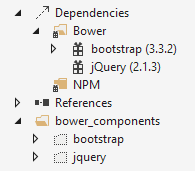

Manage Client-Side Packages with Bower
============================
By `Noel Rice`_ | Originally Published: 28 April 2015 

.. _`Noel Rice`: Author_

Bower is a "package manager for the web." Bower lets you install and restore client-side packages, include JavaScript and CSS libraries. For example, with Bower you can install CSS files, fonts, client frameworks, and JavaScript libraries from external sources. Bower resolves dependencies and will automatically download and install all the packages you need. For example, if you configure Bower to load the Bootstrap package, the right jQuery package will automatically come along for the ride.  (For server-side libraries like the MVC 6 framework, you will still use NuGet Package Manager.)

.. note:: Visual Studio developers are already familiar with NuGet, so why not use NuGet instead of Bower? Mainly because Bower already has a rich eco-system with about 18 thousand packages in play, and integrates well with the Gulp and Grunt task runners.

Getting Started with Bower
--------------------------

The ASP.NET 5 Starter Web MVC project pre-constructs the client build process for you. The ubiquitous jQuery and Bootstrap packages are installed, and plumbing for NPM, Grunt, and Bower is already in place. The following screenshot  shows the initial project in Solution Explorer. 

.. image:: bower/_static/mvc-project.png

Client-side packages are listed in the bower.json file. The ASP.NET 5 Starter Web project pre-configures bower.json with jQuery, jQuery validation, Bootstrap, and `Hammer.js <http://hammerjs.github.io/>`_. 

Let’s add support for photo albums by installing the `Fotorama <http://fotorama.io/>_` jQuery plugin. 

1.	At the end of the ``dependencies`` section in bower.json, add a comma and type "fotorama". Notice as you type that you get IntelliSense with a list of available packages. Select "fotorama" from the list. 

	.. image:: bower/_static/add-package.png

2.	Add a colon and then select the latest stable version of the package from the drop down list.

	.. image:: bower/_static/version-intellisense.png

3.	Save the bower.json file. 
4.	In Solution Explorer, right-click the **Dependencies\Bower** node. Select **Restore Packages** from the drop down menu.
5.	Right-click gruntfile.js and select **Task Runner Explorer**. 
6.	Double-click **Tasks** > **bower** to run the Bower deployment task. This task runs Bower to download and install the packages listed in bower.json.
 
	.. image:: bower/_static/bower-deploy.png

7.	In Solution Explorer, expand the **wwwroot** node. The *lib* directory should now contain all of the packages, including the fotorama package. 

	.. image:: bower/_static/package-lib.png

Next, let's add an HTML page to the project. In Solution Explorer, right-click *wwwroot* node and select **Add** > **New Item** > **HTML Page**. Name the page Index.html. Replace the contents of the file with the following:

.. code-block:: html

	<!DOCTYPE html>
	<html>
	<head>
		<meta charset="utf-8" />
		<title>Bower and Fotorama</title>
		<link href="lib/fotorama/fotorama.css" rel="stylesheet" />
	</head>
	<body>
		

			
			
			
			
		

		
		
	</body>
	</html>
	
This example uses images currently available inside *wwwroot\images*, but you can add any images on hand. 

Press Ctrl-Shift-W to display the page in the browser. The control displays the images and allows navigation by clicking the thumbnail list below the main image. This quick test shows that Bower installed the correct packages and dependencies. 

.. image:: bower/_static/photo-gallery.png

Exploring the Client Build Process
----------------------------------

The **ASP.NET 5 Starter Web** project has everything you need for Bower already set up. This next walk-through starts with the **Empty** project template, and adds each piece manually, so you can get feel for how Bower is used in a project. See what happens to the project structure and the run-time output as each configuration change is made to the project. 

The general steps to use the client-side build process with Bower are: 

- Define and download packages used in your project. 
- Install the packages to the root of your web application.
- Reference packages from your web pages.  

Define Packages
^^^^^^^^^^^^^^^ 

The first step is to define the packages your application needs and download them. This example uses Bower to load jQuery and Bootstrap. Start by configuring NPM to install design-time packages such as the Grunt task runner. Then use Grunt to run Bower so that Bower installs run-time packages jQuery and Bootstrap. 

1.	In Visual Studio 2015, create a new ASP.NET Web Application.
2.	In the **New ASP.NET Project** dialog, select the **ASP.NET 5 Empty** template and click **OK**.
3.	In Solution Explorer, the *src* directory includes a project.json file, and wwwroot and Dependencies nodes. The project directory will look like the screenshot below, where the *Properties* and *wwwroot* directories are empty.

	.. image:: bower/_static/empty-project.png

4.	In the Solution Explorer toolbar, enable **Show All Files**. 
5.	In Solution Explorer, right-click the project and add the following items:

	- NPM configuration file – package.json 
	- Grunt configuration file – gruntfile.js
	- Bower configuration file – bower.json

6. The package.json file is the NPM package definition that loads all the files, include the grunt and grunt-bower-task dependencies.

	.. image:: bower/_static/package-json.png

7.	In gruntfile.js, define a task that runs Bower. This is used later to manage run-time packages, like jQuery or Bootstrap, on the client. The grunt.initConfig task options dictate that files be copied to the wwwroot/lib directory. Grunt loads the grunt-bower-task that triggers Bower to install packages to your web application. 

	.. code-block:: javascript
	
		module.exports = function (grunt) {
			grunt.initConfig({
				bower: {
					install: {
						options: {
							targetDir: "wwwroot/lib",
							layout: "byComponent",
							cleanTargetDir: false
						}
					}
				},
			});

			grunt.registerTask("default", ["bower:install"]);

			grunt.loadNpmTasks("grunt-bower-task");
		};

8.	In Solution Explorer, right-click the **Dependencies\NPM** node and click **Restore Packages**.
9.	In Solution Explorer, view the restored packages: 

	- Open the **Dependencies\NPM** grunt node to see all packages that Grunt depends on. 
	- Open the *node_modules* directory to view the files copied to your local machine during the package restoration. 
	
	.. note:: If you don’t see the *node_modules* directory, make sure that **Show All Files** is enabled in the Solution Explorer toolbar.
	
10.	Open bower.json and remove the ``exportsOverride`` section for the time being. We will replace it later after you see how Bower deploys files without this section.
11.	Add jquery and bootstrap to the dependencies section. The resulting bower.json file should look like the example here. The versions will change over time, so use the latest stable build version from the drop down list.

	.. code-block:: none

		{
			"name": "bower",
			"license": "Apache-2.0",
			"private": true,
			"dependencies": {
				"jquery": "2.1.3",
				"bootstrap": "3.3.2"
			}
		}

12.	Save the bower.json file.
13. Right-click **Dependencies** > **Bower** and click **Restore packages**. 

The project should now include *bootstrap* and *jQuery* directories in two locations: *Dependencies\Bower* and *bower_components*. 

 
.. note:: If you don’t see the bower_components directory, make sure that the Show All Files button is enabled in Solution Explorer’s toolbar.

Install Packages to the Web Application
^^^^^^^^^^^^^^^^^^^^^^^^^^^^^^^^^^^^^^^

You’ve installed all the required files to your machine but haven’t deployed them yet. In this step, you will use Bower to copy from *bower_components* to the *lib* directory under the web application root. 

1.	Right-click gruntfile.js and select **Task Runner Explorer**. You can also reach Task Runner Explorer through the **View** > **Other Windows** menu.

	.. image:: bower/_static/task-runner-explorer.png

2.	In Task Runner Explorer, right-click **Tasks** > **Bower** and select **Run**. This step copies the Bower packages to the root of the project (the default is *wwwroot*) under the *lib* directory.

	.. image:: bower/_static/run-bower-task.png

3.	In Solution Explorer, expand the *wwwroot\lib\bootstrap* and *wwwroot\lib\jquery* directories. You should see the deployed files there.

	.. image:: bower/_static/package-lib2.png

4.	Now delete the *wwwroot* node. You will be able to replace it easily in the next step.
5.	Open bower.json and add the ``exportsOverride`` element as shown in the listing below. 

	.. code-block:: none
	
		"exportsOverride": {
			"bootstrap": {
				"js": "dist/js/*.*",
				"css": "dist/css/*.*",
				"fonts": "dist/fonts/*.*"
			},
			"jquery": {
				"js": "dist/jquery.{js,min.js,min.map}"
			}
		}

	The ``exportsOverride`` element defines source directories and target directories. For example, Bootstrap JavaScript files are copied from *bower_components\bootstrap\dist\js* to *wwwroot\lib\bootstrap\js*.
	
6.	From Task Runner Explorer, run the Bower task a second time. The files are now organized under the target *css*, *fonts*, and *js* directories.

	.. image:: bower/_static/exports-override.png

Reference Packages
^^^^^^^^^^^^^^^^^^

Now that Bower has copied the client support packages needed by the application, you can test that an HTML page can use the deployed jQuery and Bootstrap functionality. 

1.	Right-click **wwwroot** and select **Add** > **New Item** > **HTML Page**.
2.	Add the CSS and JavaScript references. 

	- In Solution Explorer, expand **wwwroot** and locate bootstrap.css. Drag this file into the ``head`` element of the HTML page. 
	- Drag jquery.js and bootstrap.js to the end of the ``body`` element. 

Make sure bootstrap.js follows jquery.js, so that jQuery is loaded first. 

.. code-block:: html

	<!DOCTYPE html>
	<html>
	<head>
		<meta charset="utf-8" />
		<title>Bower Example</title>
		<link href="lib/bootstrap/css/bootstrap.css" rel="stylesheet" />
	</head>
	<body>

		
		
	</body>
	</html>

