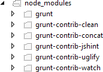
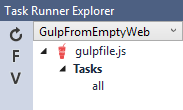

Grunt and Gulp: Task Runners
============================
By :ref:`Noel Rice <grunt-gulp-author>` | Originally Published: 28 April 2015 

Both Grunt and Gulp are JavaScript task runners that automate script minification, TypeScript compilation, code quality "lint" tools, CSS pre-processors, and just about any repetitive chore that needs doing to support client development. Both Grunt and Gulp are equally supported in Visual Studio 2015. The ASP.NET project templates use Gulp by default.

In this article:
	- `Gulp and Grunt`_
	- `Using Grunt`_
	- `Using Gulp`_
	
Gulp and Grunt
--------------

What's the difference between Gulp and Grunt? While Gulp is a later entry to the field, it has gained popularity for crisp performance and elegant syntax. Unlike Grunt, which tends to read and write files to disk, Gulp uses a stream (`Vinyl <https://www.npmjs.com/package/vinyl>`_) object to pipe method results to following methods, allowing calls to be chained together in a fluent syntax. Grunt is an earlier entry in the client-build-tool space. Grunt modules predefine most everyday tasks like linting, minimizing, and unit testing, and Grunt is widely adopted and downloaded thousands of times each day.

Using Grunt
-----------

This example uses the Empty ASP.NET 5 template to show how to automate the client build process from scratch. The non-empty ASP.NET 5 project templates use Gulp by default.

The finished example cleans the target deployment directory, combines JavaScript files, checks code quality, condenses JavaScript file content and deploys to the root of your web application. We will use the following packages: 

- **grunt**: The Grunt task runner package.
- **grunt-contrib-clean**: A task that removes files or directories.
- **grunt-contrib-jshint**: A task that reviews JavaScript code quality.
- **grunt-contrib-concat**: A task that joins files into a single file.
- **grunt-contrib-uglify**: A task that minifies JavaScript to reduce size.
- **grunt-contrib-watch**: A task that watches file activity.

Preparing the Application
^^^^^^^^^^^^^^^^^^^^^^^^^

To begin, set up a new empty web application and add TypeScript example files. TypeScript files are automatically compiled into JavaScript using default Visual Studio 2015 settings and will be our raw material to process using Grunt.

1.	In Visual Studio 2015, create a new ``ASP.NET Web Application``.
2.	In the **New ASP.NET Project** dialog, select the **ASP.NET 5 Empty** template and click the OK button.
3.	In the Solution Explorer, review the project structure. The ``\src`` folder includes empty ``wwwroot`` and ``Dependencies`` nodes.

.. image:: grunt-gulp/_static/grunt-solution-explorer.png

4.	Add a new folder named ``TypeScript`` to your project directory.
5.	Before adding any files, let’s make sure that Visual Studio 2015 has the option 'compile on save' for TypeScript files checked. *Tools > Options > Text Editor > Typescript > Project*

.. image:: grunt-gulp/_static/typescript-options.png

6.	Right-click the ``TypeScript`` directory and select **Add > New Item** from the context menu. Select the **JavaScript file** item and name the file **Tastes.ts** (note the \*.ts extension). Copy the line of TypeScript code below into the file (when you save, a new Tastes.js file will appear with the JavaScript source).
enum Tastes { Sweet, Sour, Salty, Bitter }

.. code-block:: javascript

	enum Tastes { Sweet, Sour, Salty, Bitter }
	
7.	Add a second file to the **TypeScript** directory and name it ``Food.ts``. Copy the code below into the file.

.. code-block:: javascript

	class Food {
		constructor(name: string, calories: number) {
			this._name = name;
			this._calories = calories; 
		}

		private _name: string;
		get Name() {
			return this._name;
		}

		private _calories: number;
		get Calories() {
			return this._calories;
		}

		private _taste: Tastes;
		get Taste(): Tastes { return this._taste }
		set Taste(value: Tastes) {
			this._taste = value;
		}
	}	

Configuring NPM
^^^^^^^^^^^^^^^

Next, configure NPM to download grunt and grunt-tasks.

1.	In the Solution Explorer, right-click the project and select **Add > New Item** from the context menu. Select the **NPM configuration file** item, leave the default name, ``package.json``, and click the **Add** button.

2.	In the package.json file, inside the ``devDependencies`` object braces, enter "grunt". Select ``grunt`` from the Intellisense list and press the Enter key. Visual Studio will quote the grunt package name, and add a colon. To the right of the colon, select the latest stable version of the package from the top of the Intellisense list (press ``Ctrl-Space`` if Intellisense does not appear).

.. image:: grunt-gulp/_static/devdependencies-grunt.png

.. note:: NPM uses `semantic versioning <http://semver.org/>`_ to organize dependencies. Semantic versioning, also known as SemVer, identifies packages with the numbering scheme <major>.<minor>.<patch>. Intellisense simplifies semantic versioning by showing only a few common choices. The top item in the Intellisense list (0.4.5 in the example above) is considered the latest stable version of the package. The carat ^ symbol matches the most recent major version and the tilde ~ matches the most recent minor version. See the `NPM semver version parser reference <https://www.npmjs.com/package/semver>`_ as a guide to the full expressivity that SemVer provides.

3.	Add more dependencies to load grunt-contrib* packages for *clean, jshint, concat, uglify and watch* as shown in the example below. The versions do not need to match the example.

.. code-block:: javascript

	"devDependencies": {
			"grunt": "0.4.5",
			"grunt-contrib-clean": "0.6.0",
			"grunt-contrib-jshint": "0.11.0",
			"grunt-contrib-concat": "0.5.1",
			"grunt-contrib-uglify": "0.8.0",
			"grunt-contrib-watch": "0.6.1"
	}

4.	Save the ``packages.json`` file.

The packages for each devDependencies item will download, along with any files that each package requires. You can find the package files in the ``node_modules`` directory by enabling the **Show All Files** button in the Solution Explorer.  

.. note:: If you need to, you can manually restore dependencies in Solution Explorer by right-clicking on ``Dependencies\\NPM`` and selecting the **Restore Packages** menu option.

.. image:: grunt-gulp/_static/restore-packages.png

Configuring Grunt
^^^^^^^^^^^^^^^^^

Grunt is configured using a manifest named ``gruntfile.js`` that defines, loads and registers tasks that can be run manually or configured to run automatically based on events in Visual Studio.

1.	Right-click the project and select **Add > New Item**. Select the **Grunt Configuration file** option, leave the default name, ``Gruntfile.js``, and click the **Add** button. 

The initial code includes a module definition and the ``grunt.initConfig()`` method. The ``initConfig()`` is used to set options for each package, and the remainder of the module will load and register tasks.

.. code-block:: javascript

	module.exports = function (grunt) {
		grunt.initConfig({
		});
	}; 

2.	Inside the ``initConfig()`` method, add options for the ``clean`` task as shown in the example Gruntfile.js below. The clean task accepts an array of directory strings. This task removes files from wwwroot/lib and removes the entire /temp directory.

.. code-block:: javascript

	module.exports = function (grunt) {
		grunt.initConfig({
			clean: ["wwwroot/lib/*", "temp/"],
		});
	};

3.	Below the initConfig() method, add a call to ``grunt.loadNpmTasks()``. This will make the task runnable from Visual Studio.

.. code-block:: javascript

	grunt.loadNpmTasks("grunt-contrib-clean");

4.	Save Gruntfile.js. The file should look something like the screenshot below. 

.. image:: grunt-gulp/_static/gruntfile-js-initial.png

5.	Right-click Gruntfile.js and select **Task Runner Explorer** from the context menu. The Task Runner Explorer window will open.

.. image:: grunt-gulp/_static/task-runner-explorer-menu.png

6.	Verify that ``clean`` shows under **Tasks** in the Task Runner Explorer.

.. image:: grunt-gulp/_static/task-runner-explorer-tasks.png

7.	Right-click the clean task and select **Run** from the context menu. A command window displays progress of the task.

.. image:: grunt-gulp/_static/task-runner-explorer-run-clean.png

.. note:: There are no files or directories to clean yet. If you like, you can manually create them in the Solution Explorer and then run the clean task as a test. 

8.	In the initConfig() method, add an entry for ``concat`` using the code below. 

The ``src`` property array lists files to combine, in the order that they should be combined. The ``dest`` property assigns the path to the combined file that is produced.

.. code-block:: javascript

	concat: {
		all: {
			src: ['TypeScript/Tastes.js', 'TypeScript/Food.js'],
			dest: 'temp/combined.js'
		}
	}, 

.. note:: The ``all`` property in the code above is the name of a target. Targets are used in some Grunt tasks to allow multiple build environments. You can view the built-in targets using Intellisense or assign your own.

9.	Add the ``jshint`` task using the code below. 

The jshint code-quality utility is run against every JavaScript file found in the temp directory.

.. code-block:: javascript

	jshint: {
		files: ['temp/*.js'],
		options: {
			'-W069': false,
		}
	},

.. note:: The option "-W069" is an error produced by jshint when JavaScript uses bracket syntax to assign a property instead of dot notation, i.e. ``Tastes["Sweet"]`` instead of ``Tastes.Sweet``. The option turns off the warning to allow the rest of the process to continue.

10.	Add the ``uglify`` task using the code below. 

The task minifies the combined.js file found in the temp directory and creates the result file in wwwroot/lib following the standard naming convention <file name>.min.js.

.. code-block:: javascript

	uglify: {
		all: {
			src: ['temp/combined.js'],
			dest: 'wwwroot/lib/combined.min.js'
		}
	},

11.	Under the call grunt.loadNpmTasks() that loads grunt-contrib-clean, include the same call for jshint, concat and uglify using the code below.

.. code-block:: javascript

	grunt.loadNpmTasks('grunt-contrib-jshint');
	grunt.loadNpmTasks('grunt-contrib-concat');
	grunt.loadNpmTasks('grunt-contrib-uglify');

12.	Save ``Gruntfile.js``. The file should look something like the example below.

.. image:: grunt-gulp/_static/gruntfile-js-complete.png
 
13.	Notice that the Task Runner Explorer Tasks list includes ``clean``, ``concat``, ``jshint`` and ``uglify`` tasks. Run each task in order and observe the results in Solution Explorer. Each task should run without errors.

.. image:: grunt-gulp/_static/task-runner-explorer-run-each-task.png

The concat task creates a new combined.js file and places it into the temp directory. The jshint task simply runs and doesn’t produce output. The uglify task creates a new combined.min.js file and places it into wwwroot\lib. On completion, the solution should look something like the screenshot below:

.. image:: grunt-gulp/_static/solution-explorer-after-all-tasks.png

.. note:: For more information on the options for each package, visit https://www.npmjs.com/ and lookup the package name in the search box on the main page. For example, you can look up the grunt-contrib-clean package to get a documentation link that explains all of its parameters.

All Together Now
^^^^^^^^^^^^^^^^

Use the Grunt ``registerTask()`` method to run a series of tasks in a particular sequence. For example, to run the example steps above in the order clean -> concat -> jshint -> uglify, add the code below to the module. The code should be added to the same level as the loadNpmTasks() calls, outside initConfig.

.. code-block:: javascript

	grunt.registerTask("all", ['clean', 'concat', 'jshint', 'uglify']);

The new task shows up in Task Runner Explorer under Alias Tasks. You can right-click and run it just as you would other tasks. The ``all`` task will run ``clean``, ``concat``, ``jshint`` and ``uglify``, in order. 

.. image:: grunt-gulp/_static/alias-tasks.png

Watching For Changes
^^^^^^^^^^^^^^^^^^^^

A ``watch`` task keeps an eye on files and directories. The watch triggers tasks automatically if it detects changes. Add the code below to initConfig to watch for changes to \*.js files in the TypeScript directory. If a JavaScript file is changed, ``watch`` will run the ``all`` task.

.. code-block:: javascript

	watch: {
		files: ["TypeScript/*.js"],
		tasks: ["all"]
	}

Add a call to ``loadNpmTasks()`` to show the ``watch`` task in Task Runner Explorer. 

.. code-block:: javascript

	grunt.loadNpmTasks('grunt-contrib-watch');

Right-click the watch task in Task Runner Explorer and select Run from the context menu. The command window that shows the watch task running will display a waiting… message. Open one of the TypeScript files, add a space, and then save the file. This will trigger the watch task and trigger the other tasks to run in order. The screenshot below shows a sample run.

.. image:: grunt-gulp/_static/watch-running.png

Binding to Visual Studio Events
^^^^^^^^^^^^^^^^^^^^^^^^^^^^^^^

Unless you want to manually start your tasks every time you work in Visual Studio, you can bind tasks to **Before Build**, **After Build**, **Clean**, and **Project Open** events. 

Let’s bind ``watch`` so that it runs every time Visual Studio opens. In Task Runner Explorer, right-click the watch task and select **Bindings > Project Open** from the context menu. 

.. image:: grunt-gulp/_static/bindings-project-open.png

Unload and reload the project. When the project loads again, the watch task will start running automatically.

Using Gulp
----------

Gulp configuration is similar to Grunt with some notable differences. The example below parallels the Grunt example using Gulp packages and conventions.

NPM Package Differences
^^^^^^^^^^^^^^^^^^^^^^^

The ``devDependencies`` defined in ``package.json`` are specific to Gulp. To get the same result as the Grunt walk-through, ``package.json`` should look something like the code below. You will need to change the package versions in the devDependencies list to the latest version. You can get the correct version number using Intellisense (``Ctrl-space``).

.. code-block:: javascript

	{
		"version": "1.0.0",
		"name": "GulpFromEmptyWeb",
		"private": true,
		"devDependencies": {
			"gulp": "3.8.11",
			"gulp-clean": "0.3.1",
			"gulp-jshint": "1.9.2",
			"gulp-concat": "2.5.2",
			"gulp-uglify": "1.1.0",
			"gulp-rename": "1.2.0"
		}
	}

Gulpfile vs Gruntfile Examples
^^^^^^^^^^^^^^^^^^^^^^^^^^^^^^

Instead of adding Gruntfile.js to the project, add a JavaScript file to the project and name it ``gulpfile.js``. In gulpfile.js, assign a series of objects using the node.js ``require()`` method. Make the assignment for Gulp itself and for every package needed for automation. The code below assigns the same tasks used in the Grunt example:

.. code-block:: javascript

	var gulp = require('gulp');
	var clean = require('gulp-clean');
	var concat = require('gulp-concat');
	var jshint = require('gulp-jshint');
	var uglify = require('gulp-uglify');

Below these assignments in gulpfile.js, call the ``gulp`` object ``task()`` method. The first parameter to task() is the name of the task and the second is a function.

.. code-block:: javascript

	gulp.task("all", function () {

	});

Just adding the empty task() method to gulpfile.js displays the ``all`` task in Task Runner Explorer.

Inside the ``task()`` function, use the objects defined earlier by ``require()`` to do the work. The example below cleans any files from the wwwroot/lib directory.

.. code-block:: javascript

	gulp.task("all", function () {
		 gulp.src('wwwroot/lib/*').pipe(clean());
	});

The Gulp Stream
^^^^^^^^^^^^^^^

Gulp is a streaming object that includes methods ``src()``, ``pipe()`` and ``dest()``.
 
	- src() defines where the stream is coming from -- wwwroot/lib in our example. The method returns a stream that can be passed to other Gulp plugins. 
	- pipe() pulls data from the stream and writes it to the destination parameter. 
	- dest() outputs streams to files. 

The general coding pattern for Gulp looks like this partial example:

.. code-block:: javascript

	gulp.src()
		.pipe()
		.pipe()
		.pipe(dest());

The src() method gathers the initial raw materials. A series of pipe() calls allow Gulp plugins to operate on the stream. Finally, the dest() method writes out the final results. The advantage to this flow is that only one file read and one file write occur, making the whole process quicker.

All Together
^^^^^^^^^^^^

Here’s the complete example that concatenates, lints, minifies and writes out the minified file. The processing time is quite fast.

.. code-block:: javascript

	gulp.task("all", function () {
		 gulp.src('wwwroot/lib/*').pipe(clean());
		 gulp.src(['TypeScript/Tastes.js', 'TypeScript/Food.js'])
			.pipe(concat("combined.js"))
			.pipe(jshint())
			.pipe(uglify())
			.pipe(rename({
				extname: '.min.js'
			 }))
			.pipe(gulp.dest('wwwroot/lib'))
	});

Watcher tasks are similar to the Grunt parallel task and are simple to set up. Again, the gulp.task() method names the task that will show in the Task Runner Explorer. The Gulp ``watch()`` method takes a path or array of paths and second parameter is an array of tasks to run. 

.. code-block:: javascript

	gulp.task("watcher", function () {
		gulp.watch("TypeScript/*.js", ['all']);
	});

The Task Runner Explorer running Gulp tasks uses the same interface as Grunt. The screenshot below shows the ``watcher`` task running. 

.. image:: grunt-gulp/_static/task-runner-explorer-gulp-watcher.png

Summary
-------

Both Grunt and Gulp are powerful tasks runners that automate most client-build tasks. Grunt and Gulp both require support from NPM to deliver their packages. While Grunt is configured using Gruntfile.js and Gulp is configured using Gulpfile.js, both build tools play nicely in Visual Studio, automatically sensing changes to the configuration files. Task Runner Explorer detects changes to configuration files and provides a convenient interface to run tasks, view running tasks, and bind tasks to Visual Studio events. 

.. _grunt-gulp-author:

.. include:: /_authors/noel-rice.txt
