Building Projects with Yeoman
=============================
By :ref:`Noel Rice <yeoman-author>` | Originally Published: 30 April 2015 

`Yeoman <http://yeoman.io/>`_ builds a complete, running project for a given set of client-tools. You may be overwhelmed by "feature-shock" for the latest glut of client-tools (NPM, Gulp, Angular, etc.) or have simply run out of time to work through each feature set, much less the details, of every client tool. Yeoman generates everything you need to get over your first hurdle, the "hello world" that demonstrates that a group of technologies function together. 

Yeoman is an open-source tool that works like a Visual Studio project template, but targets a wide developer audience that range from Ruby, browser extensions, PhoneGap, FaceBook React, jQuery-Mobile, and Microsoft technologies like ASP.NET.

Yeoman is *opinionated*, that is, it prescribes tools and best practices for your target technologies so you don't have to decide "Use version X or Y?" or "What directory structure should I use?" Yeoman gets you stared with a known-good project that runs.

The Yeoman command line tool yo works alongside a Yeoman generator. Generators define the technologies that go into a project. Here are a few sample `generators <http://yeoman.io/generators/>`_:

- `AngularJS Generator <https://github.com/yeoman/generator-angular>`_ creates a starting point for a new single-page Angular application. 
- `JQuery Generator <https://github.com/yeoman/generator-jquery>`_ creates the shell code for a jQuery plug-in.
- `Chrome App Generator <https://github.com/yeoman/generator-chromeapp>`_ generates everything you need to create an extension for the Chrome browser.
- The `Flux-React generator <https://github.com/banderson/generator-flux-react>`_ creates an application based on Facebook's Flux/React architecture.
- `ASPNET generator <https://github.com/OmniSharp/generator-aspnet>`_ builds several types of ASP.NET 5 applications including Empty, Console, Web, Web API, Nancy ASP.NET, and Class Library.
- You can even `generate your own Yeoman generator <https://github.com/yeoman/generator-generator>`_.

In this article:
	- `Getting Started`_
	- `Integrating Generated Projects with Visual Studio`_
	- `Generating a Webapp`_
	- `Generating a Chrome Plugin`_

Getting Started
---------------
Let's start by installing Yeoman without relying on the Visual Studio installation. 

1.	Download and install `Node.js <https://nodejs.org/>`_ from https://nodejs.org. Leave the defaults to install the npm package manager and to make Node and npm accessible globally.

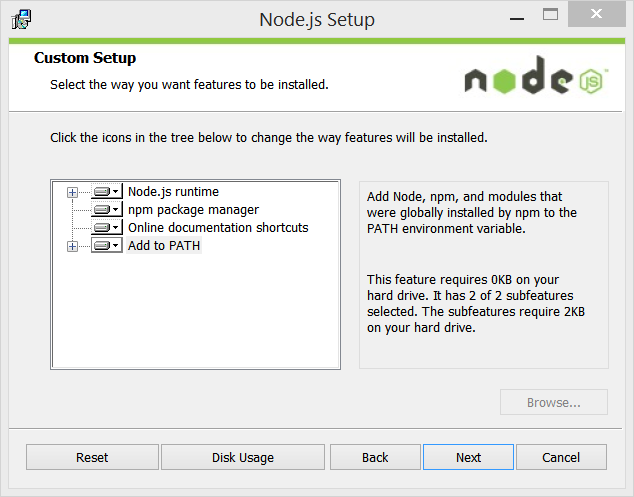
 
2.	Open a command line such as Windows PowerShell, and run the command to list all NPM packages found globally. The list will also show you where the packages are located on your system.

.. code-block:: console

 npm ls -g
  
3.	Run the command to install the Gulp command line interpreter:

.. code-block:: console

 npm install -g gulp-cli

4.	On the command line, install the ASP.NET generator:  

.. code-block:: console

 npm install -g generator-aspnet

.. note:: The **–g** flag installs the generator globally so that you can use it from any path on your system. The **yo** command and supporting Node.js modules are installed automatically.
 
5.	Make a new directory where your project will be generated:

.. code-block:: console

 mkdir c:\MyYo

6.	On the command line, make the new directory the current directory.

.. code-block:: console
 
 cd c:\MyYo

7.	Run the ``yo`` command and pass the name of the generator.

.. code-block:: console 

 yo aspnet

8.	The aspnet generator displays a menu. Leave the default **Empty Application** type selected and press ``Enter``.

9.	The generator prompts for the name of the application. Leave the default and press ``Enter``.

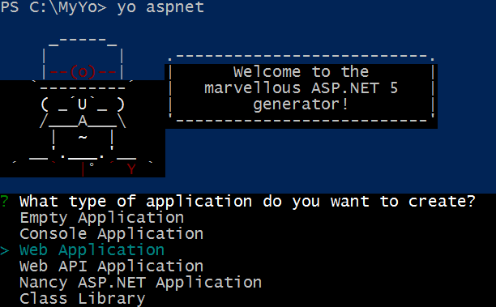

10.	Open Visual Studio 2015. From the File menu select :menuselection:`Open --> Project/Solution`.

11.	In the Open Project dialog, navigate to the ``project.json`` file, select it and click the **Open** button. In the Solution Explorer, the project should look something like the screenshot below.

 .. image:: yeoman/_static/yeoman-empty-application.png
 
12.	This example doesn't use the cross-platform Kestrel server, so open ``project.json`` for editing and remove both references to **kestrel** from the **dependencies** and **commands** sections. Save the ``project.json`` file.

13.	Press **F5** to run the project. The default Welcome screen should display.
 
 .. image:: yeoman/_static/yeoman-welcome.png 
 
Integrating Generated Projects with Visual Studio
-------------------------------------------------

Generator authors may not have Visual Studio in mind when they create a new Yeoman generator. Each generator implements its own distinct, opinionated, grouping of technology. As long as the generator creates a working set of files for the purpose, the generator is successful. For example, the `Yeoman team <http://yeoman.io/>`_ has a webapp generator that scaffolds a front-end web application. The generator includes a build process with Grunt or Gulp and Bower and a number of other features. The generated files have no concept of "project". The generated files (see screenshot below) don't contain a `project.json` and you won't find project files that are specific to Visual Studio.

 .. image:: yeoman/_static/yeoman-generated-files.png  
  
To work on Yeoman generated files in Visual Studio, you have options:
 
- Leave the file structure exactly as generated and use the Visual Studio :menuselection:`File --> Open --> Web Site` option to populate the solution as shown in the screenshot below. The web site option is the safest route for getting the project to work in Visual Studio initially. You can test the site from the command line before adding it to Visual Studio. If the site runs separately, it will run as a web site in Visual Studio. The Grunt and Gulp client-build tools will still work in Visual Studio, but, at the time of this writing, the **Dependencies** folder for NPM and Bower will not appear automatically. 
 
 .. image:: yeoman/_static/yeoman-yowebapp-solution.png  
  
- If the generator creates a project.json file, you can open these from the Visual Studio :menuselection:`File --> Open --> Project/Solution...` and then select the generated `project.json` (ASP.NET 5 Project File type). 

- If you want the integration and tooling supplied by a Visual Studio project but the generator doesn't produce a project.json file, you can create a Visual Studio project and copy the client build and application files into the project.

Generating a Webapp
--------------------

This next walkthrough demonstrates how to generate a new webapp. The webapp will run from command line, as a Visual Studio Web Site or as a Visual Studio Web Application project. 

1.	Open up a command line. 

2.	From the command line, install Yeoman and Bower globally.

.. code-block:: console
 
 npm install --global yo bower

3.	Install the `webapp generator <https://github.com/yeoman/generator-gulp-webapp>`_ globally using the command below. This particular version also generates a Gulp file that you can use in Visual Studio. There may be some dependency warnings in this install, but you can ignore them. 

.. code-block:: console
 
 npm install --global generator-gulp-webapp

4.	Create a new directory for the generated project. This example creates a YoWebApp directory in the root of the c: drive.

.. code-block:: console
 
 mkdir c:\YoWebApp

5.	Make the **YoWebApp** directory the current directory. Be aware that generated files will be placed in the current directory. 

.. code-block:: console

 cd YoWebApp

6.	Run the generator to scaffold your webapp. 

.. code-block:: console

 yo gulp-webapp

Yeoman will prompt to include options for Sass, Boostrap and Modernizr. Using the arrow keys and the space bar, de-select Sass and Modernizr, leaving Bootstrap selected. Press ``Enter`` to continue.

 .. image:: yeoman/_static/yeoman-yo-gulp-webapp.png   

Yeoman will run the NPM and Bower installations to resolve dependencies. Depending on your network connection, this part of the installation may take a little time.

Testing from the Command Line
=============================

Run the server from the command line.

.. code-block:: console

 gulp serve 
 
Gulp will run a built-in preview server and your new app will show in the default browser. The Gulp task also watches for source file changes and reflects changes immediately in the running web page. 
 
Testing from Visual Studio as a Web Site
========================================

To run the webapp as a Visual Studio Web Site:  

1.	Close the command line if its still open.

2.	Open Visual Studio. 

3.	From the main menu, select :menuselection:`File --> Open --> Web Site...`, select the directory where the generated files are located, and click the ``Open`` button.
 
4.	From the Visual Studio main menu select :menuselection:`View --> Other Windows --> Task Runner Explorer`. 

5.	Double-click ``serve`` from the list of tasks. The task will run the webapp in the browser and watch for file changes. 
 
6.	With the browser still open and displaying the generated webapp, open ``/app/index.html``. Change the text "'Allo, 'Allo!" to "Running as a Visual Studio Web Site", then save your changes. Notice that the page updates immediately in the browser. 
 
7.	Close the solution. 

Test as a Visual Studio Project
===============================
You can add the Yeoman generated files to a Visual Studio project. From there, the Visual Studio project **Dependencies** node lets you restore packages from the UI instead of the command line. 

1.	In the Visual Studio main menu, select :menuselection:`File --> New --> Project...`

2.	In the New Project dialog, select the ``ASP.NET Web Application`` web template and click the ``OK`` button.

3.	In the New ASP.NET Project dialog, select the ``ASP.NET 5 Empty`` template. Click the ``OK`` button to create the project. At this point you have a minimal project that includes a **Dependencies** node and a **project.json** file. 

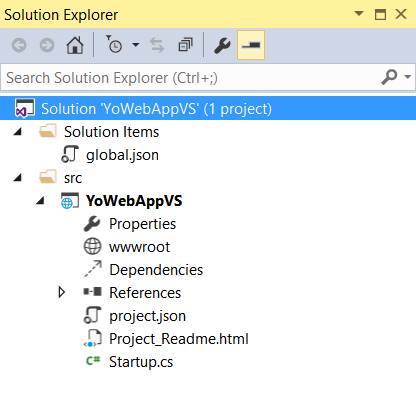
 
4.	From the directory containing the generated files, copy the entire ``/app`` directory, along with ``bower.json``, ``gulp.js`` and ``package.json`` files, to the Visual Studio project directory. The project should now look something like the screenshot below.
 
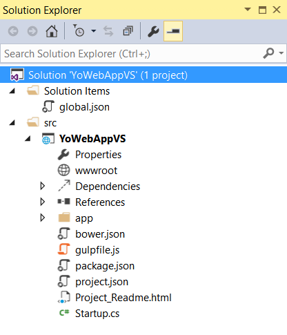

5.	In the Solution Explorer, open the ``Dependencies`` node, right-click the ``Bower`` node  and select ``Restore Packages`` from the context menu.
 
6.	Right-click the ``NPM`` node  and select ``Restore Packages`` from the context menu. This may take a little time to complete. 

.. note:: Why restore packages a second time for NPM and Bower? You could just copy the the node_modules and bower_components directories into your project, but the NPM and Bower versions used by Visual Studio may differ from the global command line version. 

7.	Click the ``Task Runner Explorer`` refresh button. 

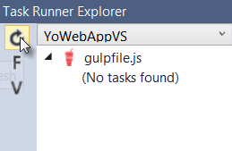
 
8.	A list of tasks will appear in the Task Runner Explorer. Double-click the ``serve`` task. The **serve** task will launch the browser again and watch for file changes. 

9.	Open ``/app/Index.html`` and change the heading "Running as a Visual Studio Web Site" to "Running as a Visual Studio Project" and save the file. The changes will appear automatically in the browser. 

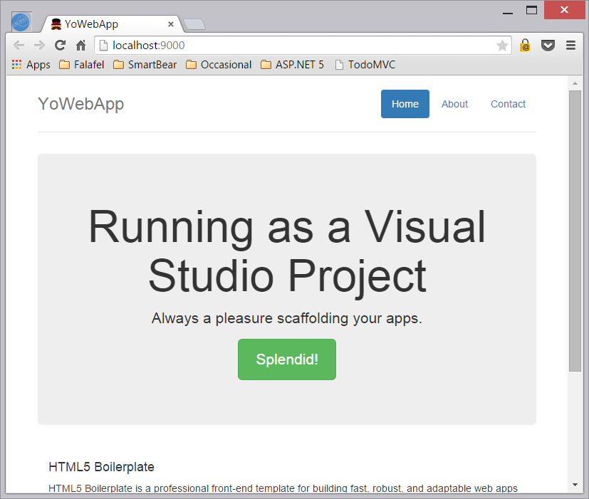
 
10.	In the Task Runner Explorer, double-click the ``build`` task. The task will populate the **/dist** folder. 

Setting the Web Root Folder
===========================

How do you push the entire web site out to the **wwwroot** directory? The Gulp **build** task populates a folder called **/dist**. You could change all **/dist** references in gulpfile.js to **/wwwroot**. Another approach is to configure the project to recognize **/dist** as the root folder instead of wwwroot. To do this, open ``project.json`` and change ``"webroot": "wwwroot"`` to ``"webroot": "dist"``. Once you save the file, Visual Studio will recognize **dist** as the root of the web application and the change will be reflected in Solution Explorer.

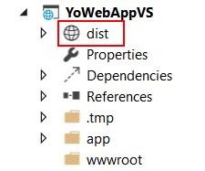
 
Generating a Chrome Plugin
--------------------------

You can generate files that are not web applications in the traditional sense. For example, you can create a `Web Starter Kit mobile project <https://github.com/yeoman/generator-mobile>`_, `WordPress plugins <https://github.com/wesleytodd/YeoPress>`_ or `Polymer Web Components <https://github.com/yeoman/generator-polymer>`_. If you use the Chrome browser, you have probably used one of the hundreds of plug-ins that extend Chrome. Enter chrome://extensions/ to the Chrome address bar to list your currently installed extensions.

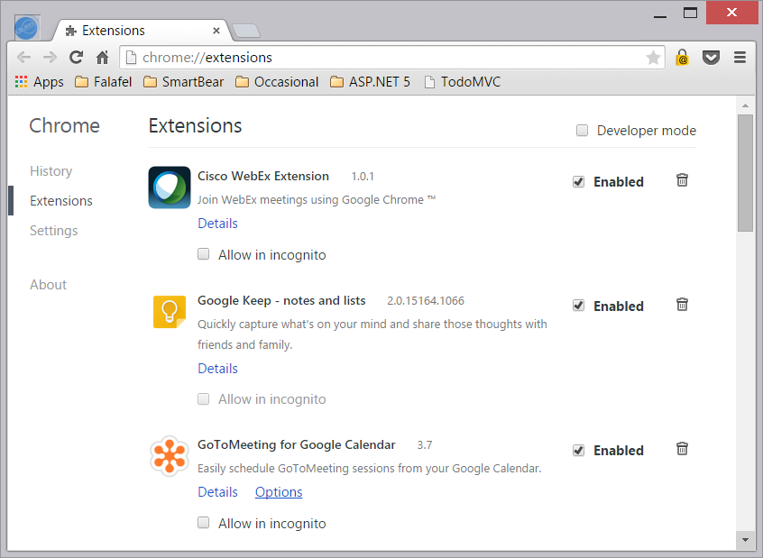
 
The `chrome-extension generator <https://github.com/yeoman/generator-chrome-extension>`_, builds a Chrome plug-in using only two commands. The first installs the generator and the second generates the chrome extension files. 

.. code-block:: console

 npm install -g generator-chrome-extension 
 yo chrome-extension

.. note::Remember that running ``yo chrome-extension`` will create the files in your current directory.

The generator walks you through a number of choices (see the screenschot below). In this example we're taking all the defaults except for the **Would you like to use UI Action** prompt. Here you can choose the Browser option to include an icon in the Chrome toolbar.

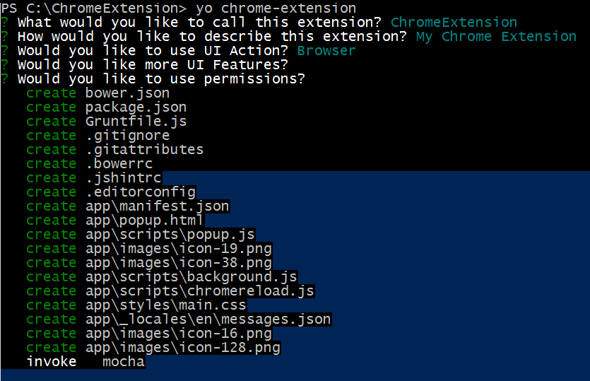
 
Testing the Generated Chrome Extension Plugin
=============================================

Back in the Chrome Extensions page (chrome://extensions), enable the ``Developer mode`` checkbox. 
 
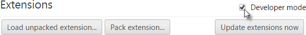
 
Then, click the ``Load unpacked extension...`` button. Navigate to the directory that contains your generated Chrome extension and select the ``\app`` folder.

.. image:: yeoman/_static/yeoman-browse-for-folder.png   
 
The extension loads into Chrome and shows up in the Extensions list. You should also see a Yeoman icon in the toolbar. Clicking the icon displays the signature Yeoman 'Allo 'Allo! message.  

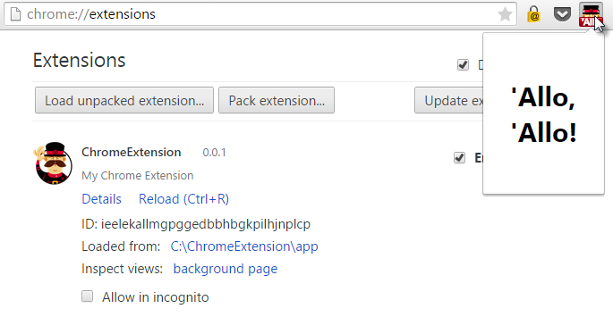
 
You can add the extension code to Visual Studio using the steps in the **Test as a Visual Studio Project** walk-through. The only major difference example is that this generator uses Grunt instead of Gulp. You will need to run the Grunt ``build`` task to create the **dist** directory that contains the extension files.
 
Summary
-------
Yeoman generates complete running projects for a wide range of technology combinations. The generated files can be loaded into Visual Studio as web sites or projects. Task Runner Explorer and other Visual Studio tooling help configure and automate unfamiliar technologies in a familiar environment. 
