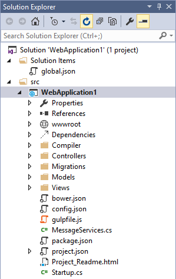
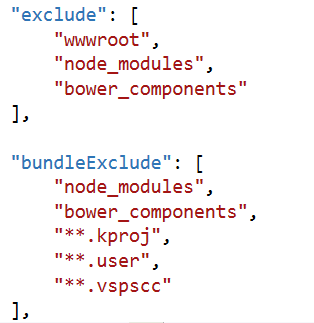
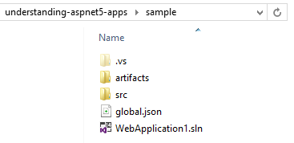
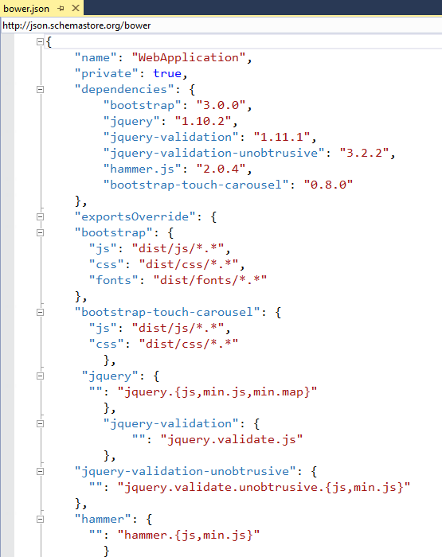
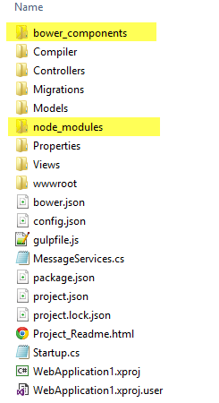
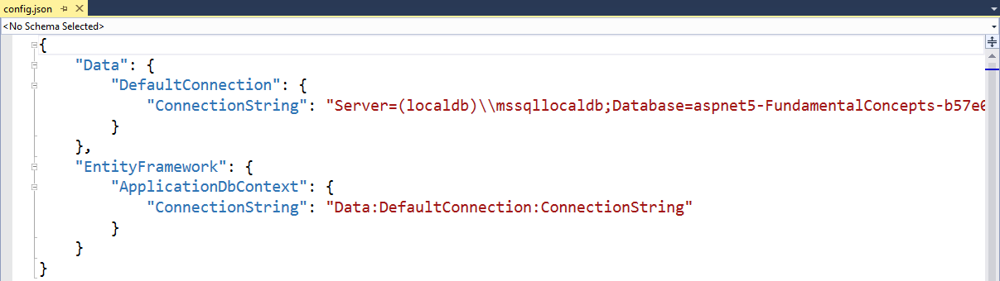

Understanding ASP.NET 5 Web Apps
================================
By :ref:`Steve Smith <understanding-aspnet5-apps-author>` | Updated : 27 April 2015 

ASP.NET 5 introduces several new fundamental concepts of web programming that are important to understand in order to productively create web apps. These concepts are not necessarily new to web programming in general, but are new to ASP.NET and thus are likely new to many developers whose experience with web programming has mainly been using ASP.NET and Visual Studio.

In this article:
	- `ASP.NET Project Structure`_
	- `Framework Target`_
	- `The project.json File`_
	- `The global.json File`_
	- `The wwwroot folder`_
	- `Client Side Dependency Management`_
	- `Server Side Dependency Management`_
	- `Configuring the Application`_
	- `Application Startup`_
	
.. `View or download <https://github.com/aspnet/docs/tree/master/docs/conceptual-overview/understanding-aspnet5-apps/sample>`_ the finished source from the project created in this article.

ASP.NET Project Structure
-------------------------

ASP.NET 5's project structure adds new concepts and replaces some legacy elements found in previous versions of ASP.NET projects. The new default web project template creates a solution and project structure like the one shown here: 

The first thing you may notice about this new structure is that it includes a Solution Items folder with a *global.json* file, and the web 
project itself is located within a *src* folder within the solution. The new structure also includes a special *wwwroot* folder and a 
Dependencies section in addition to the References section that was present in past versions of ASP.NET (but which has been updated in this 
version). In the root the project there are also several new files such as *bower.json, config.json, gruntfile.js, package.json, project.json*, 
and *Startup.cs*. You may notice that the files *global.asax, packages.config*, and *web.config* are gone. In previous versions of 
ASP.NET, a great deal of application configuration was stored in these files and in the project file. In ASP.NET 5, this information and logic 
has been refactored into files that are generally smaller and more focused.

Framework Target
----------------

ASP.NET 5 can target multiple frameworks, allowing the application to be deployed into different hosting environments. By default applications will target the full version of .NET, but they can also target the .NET Core. Most legacy apps will target the full ASP.NET 5, at least initially, since they're likely to have dependencies that include framework base class libraries that are not available in .NET Core today. .NET Core is a small version of the .NET framework that is optimized for web apps and supports Linux and Mac environments. It can be deployed with an application, allowing multiple apps on the same server to target different versions of .NET Core. It is also modular, allowing additional functionality to be added only when it is required, as separate NuGet packages (:doc:`learn more about .NET Core <dotnetcore>`).

You can see which framework is currently being targeted in the web application project's properties, by right-clicking on the web project in Solution Explorer and selecting Properties:
 
.. image:: understanding-aspnet5-apps/_static/project-properties.png

By default, the checkbox for *Use specific DNX version* is unchecked. To target a specific version, check the box and choose the appropriate *Version*, *Platform*, and *Architecture*.

The project.json File
---------------------

The project.json file is new to ASP.NET 5. It is used to define the project's `server side dependencies`_ (discussed below), as well as other project-specific information. The sections included in *project.json* by default with the default web project template are shown below.

.. image:: understanding-aspnet5-apps/_static/project-json.png

The **webroot** section specifies the folder that should act as the root of the web site, which by convention defaults to `the wwwroot folder`_. The version property specifies the current version of the project. You can also specify other metadata about the project such as **authors** and **description**.

ASP.NET 5 has a great deal of support for command line tooling, and the **commands** section allows you to configure what certain command line commands should do (for instance, launch a web site or run tests).

.. code-block:: javascript

    "commands": {
        "web": "Microsoft.AspNet.Hosting --server Microsoft.AspNet.Server.WebListener --server.urls http://localhost:5000",
        "gen": "Microsoft.Framework.CodeGeneration",
        "ef": "EntityFramework.Commands"
    },

The **frameworks** section designates which targeted frameworks will be built, and what dependencies need to be included. For instance, if you were using LINQ and collections, you could ensure these were included with your .NET Core build by adding them to the ``dnxcore50`` list of dependencies as shown.

**See Also:** `Diagnosing dependency issues with ASP.NET 5 <http://davidfowl.com/diagnosing-dependency-issues-with-asp-net-5/>`_

.. TODO Update this section

The **exclude** section is used to identify files and folders that should be excluded from builds. Likewise, **bundleExclude** is used to identify content portions of the project that should be excluded when bundling the site (for example, in production).

The **scripts** section is used to specify when certain build automation scripts should run. Visual Studio now has built-in support for running such scripts before and after certain events. The default ASP.NET project template has scripts in place to run during *postrestore* and *prepare* that install `client side dependencies`_ using npm and bower.

.. TODO add link to npm/bower article(s)

.. image:: understanding-aspnet5-apps/_static/scripts.png

The global.json File
--------------------

The global.json file is used to configure the solution as a whole. It includes just two sections, ``projects`` and ``sdk`` by default.

.. literalinclude:: understanding-aspnet5-apps/sample/global.json
	:language: javascript

The *projects* property designates which folders contain source code for the solution. By default the project structure places source files in a *src* folder, allowing build artifacts to be placed in a sibling folder, making it easier to exclude such things from source control.

The *sdk* property specifies the version of the DNX (.Net Execution Environment) that Visual Studio will use when opening the solution. It's set here, rather than in project.json, to avoid scenarios where different projects within a solution are targeting different versions of the SDK.

.. _`the wwwroot folder` :

The wwwroot Folder
------------------

In previous versions of ASP.NET, the root of the project was typically the root of the website. If you placed a *Default.aspx* file in the project root of an early version of ASP.NET, it would load if a request was made to the web application’s root. In later versions of ASP.NET, support for routing was added, making it possible to decouple the locations of files from their corresponding URLs (thus, HomeController in the Controllers folder is able to serve requests made to the root of the site, using a default route implementation). However, this routing  was used only for ASP.NET-specific application logic, not static files needed by the client to properly render the resulting page. Resources like images, script files, and stylesheets were generally still loaded based on their location within the file structure of the application, based off of the root of the project.

The file based approach presented several problems. First, protecting sensitive project files required framework-level protection of certain filenames or extensions, to prevent having things like *web.config* or *global.asax* served to a client in response to a request. Having to specifically block access (also know as blacklisting) to certain files is much less secure than granting access only to those files which should be accessible(also known as whitelisting). Typically different versions were required for dev/test and production (for example *web.config*).  Scripts would typically be referenced individually and in a readable format during development, but would be minified and bundled together when deployed for production. It’s beneficial to deploy only production files to production, but handling these kinds of scenarios was difficult with the previous file structure.

Enter the *wwwroot* folder in ASP.NET 5. The *wwwroot* folder represents the actual root of the web app when running on a web server. Static files, like *config.json*, which are not located in *wwwroot* will never be accessible, and there is no need to create special rules to block access to sensitive files. Instead of blacklisting access to sensitive files, a more secure whitelist approach is taken whereby only those files in the *wwwroot* folder are accessible via web requests.

In addition to the security benefits, the *wwwroot* folder also simplifies common tasks like bundling and minification, which can now be more easily incorporated into a standard build process and automated using tools like Grunt.

.. _`client side dependencies` :

Client Side Dependency Management
---------------------------------

The Dependencies folder contains two subfolders: Bower and NPM. These folders correspond to two package managers by the same names, and they’re used to pull in client-side dependencies and tools (e.g. jQuery, bootstrap, or grunt). Expanding the folders reveals which dependencies are currently managed by each tool, and the current version being used by the project.

.. image:: understanding-aspnet5-apps/_static/dependencies.png

The bower dependencies are controlled by the *bower.json* file. You'll notice that each of the items listed in the figure above correspond to dependencies listed in bower.json:

Each dependency is then further configured in its own section within the *bower.json* file, indicating how it should be deployed to the *wwwroot* folder when the bower task is executed.

By default, the bower task is executed using gulp, which is configured in *gulpfile.js*. The current web template’s gulpfile includes tasks for copying and cleaning script and CSS files from the bower folder to a ``/lib`` folder in ``wwwroot``.

.. _`server side dependencies` :

Server Side Dependency Management
---------------------------------

The *References* folder details the server-side references for the project. It should be familiar to ASP.NET developers, but it has been modified to differentiate between references for different framework targets, such as the full ASP.NET 5.0 vs. ASP.NET Core 5.0.  Within each framework target, you will find individual references, with icons indicating whether the reference is to an assembly, a NuGet package, or a project. Note that these dependencies are checked at compile time, with missing dependencies downloaded from the configured NuGet package source (specified under Options – NuGet Package Manager – Package Sources).	

.. image:: understanding-aspnet5-apps/_static/references.png

Configuring the Application
---------------------------

ASP.NET 5 no longer stores configuration settings in XML files (*web.config* and *machine.config*). Configuration is now stored in *config.json*, which was designed specifically for storing app configuration settings. The default ASP.NET project template includes Entity Framework, and so specifies the database connection string details in the *config.json* file included in the project.

Individual entries within *config.json* are not limited to name-value pairs, but can specify rich objects. Entries can also reference other entries, as you can see the EF configuration does above.

There's nothing special about the *config.json* filename - it's specified by name in Startup.cs_. You can add as many different configuration files as makes sense for your app, rather than having to add to an ever-growing *web.config* file. You're also not limited to just JSON-formatted files - you can still use XML or even .INI files if you prefer.

Accessing configuration data from your app is best done by injecting the `IConfiguration <https://github.com/aspnet/Configuration/blob/dev/src/Microsoft.Framework.ConfigurationModel.Interfaces/IConfiguration.cs>`_ interface into your controller, and then simply calling its ``Get`` method with the name of the configuration element you need. For example, to store the application name in config and display it on the About page, you would need to make three changes to the default project. First, add the entry to *project.config*.

.. image:: understanding-aspnet5-apps/_static/add-config.png

Next, make sure ASP.NET knows what to return when a constructor requires an instance of ``IConfiguration``. In this case, we can specify that the configuration value is a singleton, since we don't expect it to change throughout the life of the application. We'll address *Startup.cs* in a moment, but for this step just add one line to the end of the ``ConfigureServices()`` method in *Startup.cs*:

.. code-block:: c#
	
	services.AddSingleton(_ => Configuration);

The third and final step is to specify that your controller expects an ``IConfiguration`` instance via its constructor. Following the `Explicit Dependencies Principle`_ with your classes is a good habit to get into, and will allow ASP.NET 5's built-in support for Dependency Injection to work correctly. Assign the instance to a local field, and then access the configuration value by calling the ``Get`` method on this instance.

.. _`Explicit Dependencies Principle`: http://deviq.com/explicit-dependencies-principle/

You will need to ensure you have this using statement:

.. code-block:: c#

	using Microsoft.Framework.ConfigurationModel;
	
Then, update the controller as shown:

.. image:: understanding-aspnet5-apps/_static/get-config.png

Run the application and navigate to the About page and you should see the result.

.. image:: understanding-aspnet5-apps/_static/about-page.png

.. _Startup.cs: 
.. _fundamentalconcepts-application-startup:

Application Startup
-------------------

ASP.NET 5 has decomposed its feature set into a variety of modules that can be individually added to a web app. This allows for lean web apps that do not import or bring in features they don't use. When your ASP.NET app starts, the ASP.NET runtime calls ``Configure`` in the ``Startup`` class. If you create a new ASP.NET web project using the Empty template, you will find that the *Startup.cs* file has only a couple lines of code. The default Web project’s ``Startup`` class wires up configuration, MVC, EF, Identity services, logging, routes, and more. It provides a good example for how to configure the services used by your ASP.NET app. There are three parts to the sample startup class: a constructor, ``ConfigureServices``, and ``Configure``. The ``Configure`` method is called after ``ConfigureServices`` and is used to configure middleware.

The constructor specifies how configuration will be handled by the app. Configuration is a property of the ``Startup`` class and can be read from a variety of file formats as well as from environment variables. The default project template wires up ``Configuration`` to use a *config.json* and environment variables.

.. code-block:: c#

	public Startup(IHostingEnvironment env)
	{
		// Setup configuration sources.
		Configuration = new Configuration()
			.AddJsonFile("config.json")
			.AddEnvironmentVariables();
	}
	
The ``ConfigureServices`` method is used to specify which services are available to the app. The default template uses helper methods to add a variety of services used for EF, Identity, and MVC. This is also where you can add your own services, as we did above to expose the configuration as a service. The complete ``ConfigureServices`` method, including the call to add ``Configuration`` as a singleton, is shown here:

.. code-block:: c#

	// This method gets called by the runtime.
	public void ConfigureServices(IServiceCollection services)
	{
		// Add EF services to the services container.
		services.AddEntityFramework(Configuration)
			.AddSqlServer()
			.AddDbContext<ApplicationDbContext>();

		// Add Identity services to the services container.
		services.AddIdentity<ApplicationUser, IdentityRole>(Configuration)
			.AddEntityFrameworkStores<ApplicationDbContext>();

		// Add MVC services to the services container.
		services.AddMvc();

		services.AddSingleton(_ => Configuration);
	}
	
Finally, the ``Configure`` method will be called by the runtime after ``ConfigureServices``. In the sample project, ``Configure`` is used to wire up a console logger, add several useful features for the development environment, add support for static files, Identity, and MVC routing. Note that adding Identity and MVC in ``ConfigureServices`` isn’t sufficient - they also need to be configured in  the request pipeline via these calls in ``Configure``.

.. code-block:: c#

	// Configure is called after ConfigureServices is called.
	public void Configure(IApplicationBuilder app, IHostingEnvironment env, ILoggerFactory loggerfactory)
	{
		// Configure the HTTP request pipeline.
		// Add the console logger.
		loggerfactory.AddConsole();

		// Add the following to the request pipeline only in development environment.
		if (string.Equals(env.EnvironmentName, "Development", StringComparison.OrdinalIgnoreCase))
		{
			app.UseBrowserLink();
			app.UseErrorPage(ErrorPageOptions.ShowAll);
			app.UseDatabaseErrorPage(DatabaseErrorPageOptions.ShowAll);
		}
		else
		{
			// Add Error handling middleware which catches all application specific errors and
			// send the request to the following path or controller action.
			app.UseErrorHandler("/Home/Error");
		}

		// Add static files to the request pipeline.
		app.UseStaticFiles();

		// Add cookie-based authentication to the request pipeline.
		app.UseIdentity();

		// Add MVC to the request pipeline.
		app.UseMvc(routes =>
		{
			routes.MapRoute(
				name: "default",
				template: "{controller}/{action}/{id?}",
				defaults: new { controller = "Home", action = "Index" });
		});
	}

As you can see, configuring which services are available and how the request pipeline is configured is now done completely in code in the ``Startup`` class, as opposed to using HTTP Modules and Handlers managed via *web.config*. 

.. TODO: You can learn more about how the request pipeline is configured as well as how to write your own middleware components.
	
Summary
-------

ASP.NET 5 introduces a few concepts that didn't exist in previous versions of ASP.NET. Rather than working with *web.config*, packages.config, and a variety of project properties stored in the .csproj/.vbproj file, developers can now work with specific files and folders devoted to specific purposes. Although at first there is some learning curve, the end result is more secure, more maintainable, works better with source control, and has better separation of concerns than the approach used in previous versions of ASP.NET.

.. _understanding-aspnet5-apps-author:

.. include:: /_authors/steve-smith.txt
