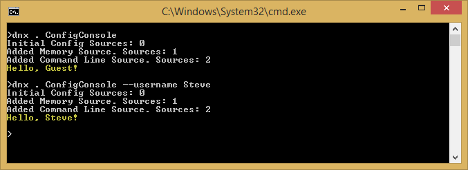

Configuration
=============
By :ref:`Steve Smith <configuration-author>` | Originally Published: 16 May 2015

ASP.NET 5 supports a variety of different configuration options. Application configuration data can come from files using built-in support for JSON, XML, and INI formats, as well as from environment variables. Of course, developers can build their own custom configuration providers, as well.

In this article:
	- `Getting and setting configuration settings`_
	- `Using the built-in providers`_
	- `Using Options and configuration objects`_
	- `Writing custom providers`_
	
`Download sample from GitHub <https://github.com/aspnet/docs>`_.

Getting and setting configuration settings
------------------------------------------

ASP.NET 5's configuration system has been re-architected from previous versions of ASP.NET, which relied on ``System.Configuration`` and XML configuration files like ``web.config``. The new `configuration model <https://github.com/aspnet/Configuration>`_ provides streamlined access to key/value based settings that can be retrieved from a variety of sources.

To work with settings in your ASP.NET application, you can instantiate a new instance of ``Configuration`` anywhere you need one. However, it's recommended to do this once in your application's ``Startup``, and then inject an instance of ``IConfiguration`` into any controllers or services that need to access configuration. At its simplest, the ``Configuration`` class is just a collection of ``Sources``, which provide the ability to read and write name/value pairs. You must configure at least one source in order for ``Configuration`` to function correctly. For instance, you could include the following code in any method in your ASP.NET application:

.. code-block:: c#
	:linenos:

	// assumes using Microsoft.Framework.ConfigurationModel is specified
	var config = new Configuration();
	config.Add(new MemoryConfigurationSource());
		
	config.Set("somekey", "somevalue");
	
	// do some other work
	
	string setting = config.Get("somekey); // returns "somevalue"
	// or
	string setting2 = config["somekey"]; // also returns "somevalue"

.. note:: You must set at least one configuration source.

It's not unusual to store configuration values in a hierarchical structure, especially when using external files (e.g. JSON, XML, INI). In this case, configuration values can be retrieved using a ``:`` separated key, starting from the root of the hierarchy. For example, consider the following ``config.json`` file:

.. _config-json:

.. literalinclude:: configuration/sample/src/ConfigDemo/config.json
	:linenos:
	:language: javascript

Access to the "SiteTitle" setting is done through a key of ``AppSettings:SiteTitle``. Similarly, access to the ``ConnectionString`` setting is achieved through this key: ``Data:DefaultConnection:ConnectionString``.

It's not recommended that developers access configuration directly within their ASP.NET applications by instantiating ``Configuration`` wherever they might need access to a setting. The recommended approach is to create your own settings class (probably several different classes, corresponding to different sets of settings), and use  :ref:`Options and configuration objects <options-config-objects>` and `Dependency Injection <dependency-injection.html>`_ to access these classes wherever they're needed (:ref:`see below <options-config-objects>`).

Injecting the Configuration object
^^^^^^^^^^^^^^^^^^^^^^^^^^^^^^^^^^
It is also possible to inject the configuration system itself into your classes. This is not the preferred approach, since it doesn't take advantage of separate classes for separate groups of settings, and results in a more tightly coupled design. But it's a bit simpler and is still better than referencing ``Configuration`` directly from the app. 

First, set up configuration in ``Startup.cs`` (we'll see how in :ref:`the next section <config-setup>`), and assign the ``Configuration`` instance to a property on ``Startup``.  Next, in ``ConfigureServices()``, add the ``Configuration`` property to the list of services ASP.NET manages, like so:

.. code-block:: c#

	// set this in Startup() constructor
	public IConfiguration Configuration { get; set; }

	// This method gets called by the runtime. Use this method to add services to the container.
	public void ConfigureServices(IServiceCollection services)
	{
		services.AddSingleton(_ => Configuration);
		// more code omitted
	}

.. _inject-config:

Now with this in place, you can request an instance of ``IConfiguration`` in the constructor of any controller that needs access to configuration values.

.. literalinclude:: configuration/sample/src/ConfigDemo/Controllers/HomeController.cs
	:linenos:
	:language: c#
	:emphasize-lines: 8-12,15-16
	:lines: 1-12, 19-25, 38-

The main benefits of this approach are that it allows your app to follow the `Don't Repeat Yourself, or DRY, Principle <http://deviq.com/don-t-repeat-yourself/>`_ and results in more testable code. The ``Configuration`` instance is only defined in one place in the application, and tests are able to replace the configuration values with a fake or mock ``IConfiguration`` instance that can easily be set up to provide values specific to individual tests. However, this approach does not provide any factoring of settings based on functionality or concern, and it tends to `spread magic strings <http://deviq.com/magic-strings/>`_ throughout the app, since the configuration key values must still be specified. The :ref:`Options <options-config-objects>` approach below provides the same benefits as this approach, without the associated drawbacks.

Using the built-in providers
----------------------------

ASP.NET 5 ships with built-in support for JSON, XML, and INI configuration files, as well as support for in-memory configuration (directly setting values in code) and the ability to pull configuration from environment variables and command line parameters. Developers are not limited to using a single configuration source, and in fact several may be set up together such that a default configuration is overridden by settings from another source if they are present.

Adding support for additional configuration file sources is accomplished through extension methods. These methods can be called on a ``Configuration`` instance in a standalone fashion, or chained together as a fluent API, as shown.

.. _config-setup:

.. literalinclude:: configuration/sample/src/ConfigDemo/ConfigSetup.cs
	:linenos:
	:language: c#
	:lines: 9-17

The order in which configuration sources are specified is important, as this establishes the precedence with which settings will be applied if they exist in multiple locations. In the example above, if the same setting exists in both ``config.json`` and in an environment variable, the setting from the environment variable will be the one that is used. Essentially, the last configuration source specified "wins" if a setting exists in more than one location.

One challenge with the use of configuration files for specifying sensitive information like connection strings and API keys is that such files are typically committed to source control, possibly exposing such secrets. This is particularly troublesome for open source applications, but can be an issue with any application. By using environment variables for such values, default development settings and keys can be checked into source control (making them available to all developers), while in production the development settings are overridden. Access to the production system's environment variables can be much more restrictive than access to the application's source control system, resulting in greater security for these secrets. Learn more about `safe storage of application secrets </security/app-secrets.html>`_

One way to leverage the order precedence of ``Configuration`` is to specify default values, which can be overridden. In this simple console application, a default value for the ``username`` setting is specified in a ``MemoryConfigurationSource``, but this is overridden if a command line argument for ``username`` is passed to the application. You can see in the output how many configuration sources are configured at each stage of the program.

.. literalinclude:: configuration/sample/src/ConfigConsole/Program.cs
	:linenos:
	:language: c#
	:emphasize-lines: 15-17,20,23
	
When run, the program will display the default value unless a command line parameter overrides it.

.. note:: As you can see, you can run DNX console applications using dnx commands, in addition to being able to compile them into EXEs.

.. _options-config-objects:

Using Options and configuration objects
---------------------------------------

The default ASP.NET 5 web site template includes an example configuration object, ``AppSettings``, that is configured to be used with the ``IOptions<T>`` type. Using ``Options`` you can easily convert any class (or POCO - Plain Old CLR Object) into a settings class. It's recommended that you create well-factored settings objects that correspond to certain features within your application, thus following the Interface Segregation Principle (ISP) (classes depend only on the configuration settings they use) as well as Separation of Concerns (settings for disparate parts of your app are managed separately, and thus are less likely to negatively impact one another).

The simple AppSettings.cs class included with the template is shown here:

.. literalinclude:: configuration/sample/src/ConfigDemo/Properties/AppSettings.cs
	:language: c#

The built-in ``Configuration`` object is responsible for mapping this class to settings in whichever configuration sources you have set up. To provide app-wide access to these settings, the settings must be added to the built-in ASP.NET services container in ``Startup.cs``:

.. literalinclude:: configuration/sample/src/ConfigDemo/Startup.cs
	:language: c#
	:emphasize-lines: 26
	:lines: 16-41

The call to ``Configuration.GetSubKey("AppSettings")`` returns an `IConfiguration` instance. ``Services.Configure<T>`` is responsible for mapping that ``IConfiguration`` instance to the associated POCO type specified. With this in place, the `AppSettings` configuration object can be referenced anywhere within the application by injecting an ``IOptions<AppSettings>`` type, as shown, and accessing the configuration object via its ``Options`` property:

.. literalinclude:: configuration/sample/src/ConfigDemo/Controllers/OptionsController.cs
	:language: c#
	:emphasize-lines: 10,12
	:linenos:

In this simple example, we're passing the ``AppSettings`` type to the view as a strongly-typed viewmodel, which is then displayed on the page as shown:

.. literalinclude:: configuration/sample/src/ConfigDemo/Views/Options/index.cshtml
	:language: c#
	:emphasize-lines: 1,3,5
	:linenos:

When run, the page displays the ``AppSettings:SiteTitle`` setting defined in ``config.json`` (:ref:`shown above <config-json>`):

.. image:: configuration/_static/options-screenshot.png

.. note:: Options (Microsoft.Framework.OptionsModel) is a framework for accessing and configuring POCO settings, and is part of ASP.NET 5. You can `view its source and comment or contribute to the project on GitHub <https://github.com/aspnet/Options>`_ or `download it from NuGet <http://www.nuget.org/packages/Microsoft.Framework.OptionsModel>`_.

Writing custom providers
------------------------

In addition to using `the built-in configuration source providers <https://github.com/aspnet/Configuration/tree/dev/src/Microsoft.Framework.ConfigurationModel/Sources>`_, you can also write your own. To do so, you simply inherit from ``ConfigurationSource``, and populate the ``Data`` property with the settings from your configuration source.

Example: Entity Framework Settings
^^^^^^^^^^^^^^^^^^^^^^^^^^^^^^^^^^

You may wish to store some of your application's settings in a database, and access them using Entity Framework. There are many ways in which you could choose to store such values, ranging from a simple table with a column for the setting name and another column for the setting value, to having separate columns for each setting value. In this example, I'm going to create a simple ``Settings`` model type that will store each of its settings in a separate column in the database table. Here is the ``Settings`` class:

.. literalinclude:: configuration/sample/src/ConfigDemo/Models/Settings.cs
	:linenos:
	:language: c#

Next we add this type to our DbContext, and add migrations if necessary. This custom configuration provider is not designed to be reused without modification between applications, but instead is specific to this application's requirements. Thus, it will rely directly on the ``ApplicationDbContext`` defined in this project, rather than a more generic type. Below is the updated ``ApplicationDbContext`` from the sample project.

.. literalinclude:: configuration/sample/src/ConfigDemo/Models/ApplicationDbContext.cs
	:linenos:
	:emphasize-lines: 8
	:language: c#

Next, create the custom configuration source by inheriting from ``ConfigurationSource``. In this implementation, the provider assumes there is only ever one row in the Settings table (and if it doesn't exist, the provider will create one). Again, you can customize this behavior in your own implementation, perhaps by allowing for multiple named configurations to be stored in the database, for instance. The complete ``EfSettingConfigurationSource`` is shown below.

.. literalinclude:: configuration/sample/src/ConfigDemo/EfSettingConfigurationSource.cs
	:linenos:
	:emphasize-lines: 7, 22-24
	:language: c#

You can see an example of how to use this custom ``ConfigurationSource`` in your application in the following example. A reference to the application's ``ApplicationDbContext`` is passed into the controller using Dependency Injection. Then, the ``Index()`` method creates a new ``Configuration`` instance and adds the ``EfSettingConfigurationSource`` to it (you could create your own extension method for this, if desired, as well, to match the `built-in extension methods <https://github.com/aspnet/Configuration/blob/dev/src/Microsoft.Framework.ConfigurationModel/ConfigurationExtensions.cs>`_).

.. literalinclude:: configuration/sample/src/ConfigDemo/Controllers/SettingsController.cs
	:linenos:
	:emphasize-lines: 21-22
	:language: c#

.. note:: In a production application, you would probably perform this configuration setup work in ``Startup.cs`` and pass an ``IConfiguration`` into your Controllers, :ref:`as shown above <inject-config>`.

The view simply displays the values specified, in this case showing the defaults that are created when ``Settings`` already exists in the data source:

.. image:: configuration/_static/settings-view.png

Summary
-------

ASP.NET 5 provides a very flexible configuration model that supports a number of different file-based options, as well as command-line, in-memory, and environment variables. You can create your own custom configuration source providers as well, which can work with or replace the built-in providers, allowing for extreme flexibility.

.. _configuration-author:

.. include:: /_authors/steve-smith.txt
