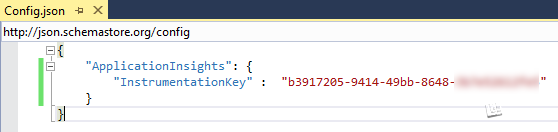

Diagnostics
===========

By :ref:`Steve Smith <diagnostics-author>` | Originally Published: 5 May 2015 

ASP.NET 5 includes a number of new features that can assist with diagnosing problems. Configuring different handlers for application errors or to display additional information about the application can easily be achieved in the application's startup class.

In this article:
	- `Configuring an error handling page`_
	- `Using the error page during development`_
	- `The runtime info page`_
	- `The welcome page`_
	- `Using Application Insights`_
	
`Browse or download samples on GitHub <https://github.com/aspnet/Docs/tree/master/docs/fundamentals/diagnostics/sample>`_.

.. _configure-error-page

Configuring an error handling page
----------------------------------

In ASP.NET 5, you configure the pipeline for each request in the ``Startup`` class's ``Configure()`` method (learn more about `configuration <configuration>`_. In order to add a simple error handling page, all that's required is to add a dependency on ``Microsoft.AspNet.Diagnostics`` to the project (and a using statement to ``Startup.cs``), and then add one line to ``Configure()`` in ``Startup.cs``:

.. _diag-startup:

.. literalinclude:: diagnostics/sample/src/DiagDemo/Startup.cs
	:language: csharp
	:linenos:
	:emphasize-lines: 2,18

The above code, which is built from the ASP.NET 5 Empty Application template, includes simple mechanism for creating an exception on line 26. If a request includes a non-empty querystring parameter for the variable ``throw``, an exception will be thrown. Line 18 makes the call to ``UseErrorPage()`` with `ErrorPageOptions <https://github.com/aspnet/Diagnostics/blob/dev/src/Microsoft.AspNet.Diagnostics/ErrorPageOptions.cs>`_ set to ``ShowAll``. Using ``ErrorPageOption`` you can toggle the visibility of the following features of the error page that is shown:

- Exception details
- Source code
- Query
- Cookies
- Headers
- Environment

To disable the display of cookies, for instance, you would pass in options as shown:

.. code-block:: c#

	var errorPageOptions = new ErrorPageOptions();
	errorPageOptions.ShowCookies = false;
	app.UseErrorPage(errorPageOptions);

If you comment out or remove the call to ``UseErrorPage()`` on line 18 and trigger an exception, you will see the default ASP.NET behavior (without an error page) for the specified web server (in this case IIS Express):

.. image:: diagnostics/_static/oops-500.png

Now, replace line 18 again. We will cover the features provided by the error page in the next section.

Using the error page during development
---------------------------------------

During development, when the application is compiled in Debug mode, the default error page will display some useful diagnostics information when an unhandled exception occurs within the web processing pipeline. The error page includes several tabs with information about the exception that was triggered and the request that was made. The first tab shows the stack trace:

.. image:: diagnostics/_static/errorpage-stack.png

The next tab shows the contents of the Querystring collection, if any:

.. image:: diagnostics/_static/errorpage-query.png

In this case, you can see the value of the ``throw`` parameter that was passed to this request. This request didn't have any cookies, but if it did, they would appear on the Cookies tab. You can see the headers that were passed, here:

.. image:: diagnostics/_static/errorpage-headers.png

Finally, any environment variables defined for the server environment would be displayed on the Environment tab.

.. note:: In the current pre-release build, both the Cookies and Environment sections of the ErrorPage are not yet enabled. `View ErrorPage Source <https://github.com/aspnet/Diagnostics/blob/dev/src/Microsoft.AspNet.Diagnostics/Views/ErrorPage.cshtml>`_.

In most cases, you will not want to display detailed stack traces and environment settings in a production setting. The error page will only display detailed information if the ``ASPNET_ENV`` environment variable is set to ``Development`` (which is the default set in Visual Studio, and which is not case sensitive). If you are using Visual Studio 2015, you can customize the environment variables used when the application runs in the web application project's properties, under the Debug tab, as shown here:

.. image:: diagnostics/_static/project-properties-env-vars.png

With ``ASPNET_ENV`` set to ``Production`` (or anything other than ``development``), the error page displayed is:

.. note:: In the current pre-release build, this feature is not yet complete; the error page does not vary based on changes to the ``ASPNET_ENV`` variable. This behavior will ship with the released version of ASP.NET 5.

The runtime info page
---------------------

In addition to `configuring and displaying an error page <configure-error-page>`_, you can also add a runtime info page by simply calling an extension method in ``Startup.cs``. The following line, shown above as well, is used to enable this feature:

.. code-block:: c#

	app.UseRuntimeInfoPage(); // default path is /runtimeinfo

Once this is added to your ASP.NET application, you can browse to the specified path (``/runtimeinfo``) to see information about the runtime that is being used and the packages that are included in the application, as shown below:

.. image:: diagnostics/_static/runtimeinfo-page.png

The path for this page can be optionally specified in the call to ``UseRuntimeInfoPage()``. It accepts a `RuntimeInfoPageOptions <https://github.com/aspnet/Diagnostics/blob/dev/src/Microsoft.AspNet.Diagnostics/RuntimeInfoPageOptions.cs>`_ instance as a parameter, which has a ``Path`` property. For example, to specify a path of ``/info`` you would call ``UseRuntimeInfoPage()`` as shown here:

.. code-block:: c#

	app.UseRuntimeInfoPage(new RuntimeInfoPageOptions() { Path = new PathString("/info") });

.. note:: Remember that the ``Configure()`` method in ``Startup.cs`` is defining the pipeline that will be used by all requests to your application, which means the order is important. If for example you move the call to ``UseRuntimeInfoPage()`` after the call to ``app.Run()`` in the examples shown here, it will never be called because ``app.Run()`` will handle the request before it reaches the call to ``UseRuntimeInfoPage``.

The welcome page
----------------

Another extension method you may find useful, especially when you're first spinning up a new ASP.NET 5 application, is the ``UseWelcomePage()`` method. Add it to ``Configure()`` like so:

.. code-block:: c#

    app.UseWelcomePage();

Once included, this will handle all requests (by default) with a cool hello world page that uses embedded images and fonts to display a rich view, as shown here:

.. image:: diagnostics/_static/welcome-page.png

You can optionally configure the welcome page to only respond to certain paths. The code shown below will configure the page to only be displayed for the ``/welcome`` path (other paths will be ignored, and will fall through to other handlers):

.. code-block:: c#

	app.UseWelcomePage(new WelcomePageOptions() { Path = new PathString("/welcome") });

With this in place as shown, the :ref:`startup.cs <diag-startup>` shown above will respond to requests as follows:

.. list-table:: Requests
	:header-rows: 1

	* - Path
	  - Result
	* - /runtimeinfo
	  - ``UseRuntimeInfoPage`` will handle and display runtime info page
	* - /welcome
	  - ``UseWelcomePage`` will handle and display welcome page
	* - (any path without ``?throw=``)
	  - ``app.Run()`` will respond with "Hello World!"
	* - (any path with ``?throw=``)
	  - ``app.Run()`` throws an exception; ``UseErrorPage`` handles, displays an error page
	
Using Application Insights
--------------------------

*Application Insights, like ASP.NET 5, is in preview.*

Visual Studio Application Insights allows developers to insert a few lines of code into their application in order to find out how users are interacting with the app. It can also `detect and diagnose performance issues and exceptions <http://azure.microsoft.com/en-us/documentation/articles/app-insights-detect-triage-diagnose/>`_ in your applications. You can send telemetry data from web servers as well as clients/browers, as well as desktop applications and mobile devices.

Getting started
^^^^^^^^^^^^^^^

To get started with Application Insights, you will need a subscription to Microsoft Azure. If your team or organization already has a subscription, you can ask the owner to add you to it using your Microsoft account.

Sign in to the `Azure portal <http://portal.azure.com/>`_ with your account and create a new Application Insights resource. 

.. image:: diagnostics/_static/azure-create-appinsight.png

Choose ASP.NET as the application type. Note the *Instrumentation Key* (under Settings, Properties) associated with the Application Insights resource you've created (`see detailed instructions with more screenshots here <http://azure.microsoft.com/en-us/documentation/articles/app-insights-start-monitoring-app-health-usage/>`_). You will need the instrumentation key in a few moments when you configure your ASP.NET 5 application to use Application Insights.

Next, add Application Insights to your ASP.NET project. You can do so by right-clicking on the project in Solution Explorer and selecting ``Manage NuGet Packages``:

Next, update ``project.json`` to add a new reference to ``Microsoft.ApplicationInsights.AspNet``, as shown:

.. image:: diagnostics/_static/manage-nuget-packages.png

Then be sure you have checked ``Include prerelease`` and that your package source is ``nuget.org``. Search for "Application" and you should see ``Microsoft.ApplicationInsights.Web as one of the first choices. Click the ``Install`` button and accept the license agreement.

.. image:: diagnostics/_static/nuget-package-manager.png

This will download and install a number of packages and may take a few minutes. When completed, you should see a new entry in your ``project.json`` file's ``dependencies`` section:

.. code-block:: javascript

	"Microsoft.ApplicationInsights.Web": "0.16.1-build00418"

Next, create or edit a ``config.json`` file, adding the instrumentation key you noted above from your Application Insights resource in Windows Azure. Specify an "ApplicationInsights" section with a key named "InstrumentationKey". Set its value to the instrumentation key.

Summary
-------

In ASP.NET 5, you can easily add error pages, view diagnostic information, or respond to requests with a simple welcome page by adding just one line to your app's ``Startup.cs`` class. You can also quickly configure Application Insights 

.. _diagnostics-author:

.. include:: /_authors/steve-smith.txt
