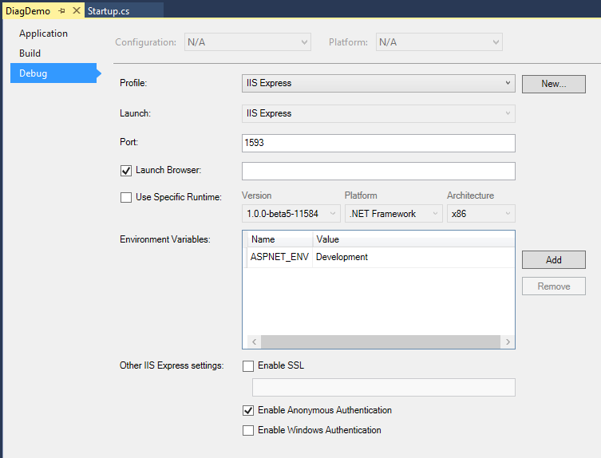
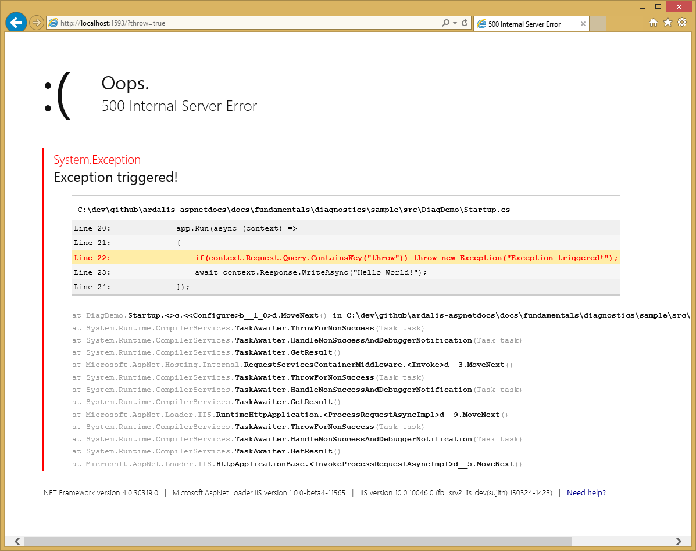
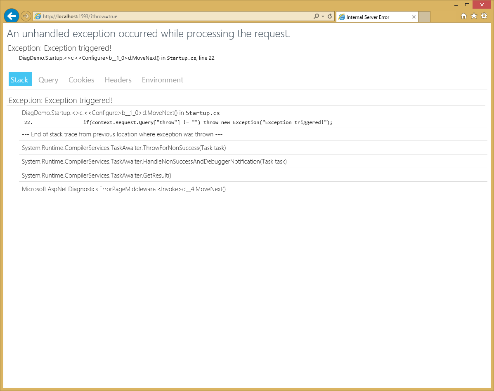
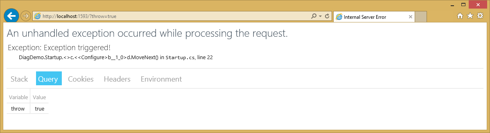
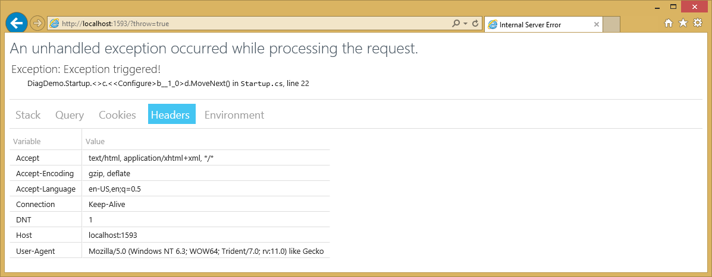

Diagnostics
===========

By :ref:`Steve Smith <diagnostics-author>` | Originally Published: 6 May 2015 

ASP.NET 5 includes a number of new features that can assist with diagnosing problems. Configuring different handlers for application errors or to display additional information about the application can easily be achieved in the application's startup class.

In this article:
	- `Configuring an error handling page`_
	- `Using the error page during development`_
	- `HTTP 500 errors on Azure`_
	- `The runtime info page`_
	- `The welcome page`_
	
`Browse or download samples on GitHub <https://github.com/aspnet/Docs/tree/master/docs/fundamentals/diagnostics/sample>`_.

.. _configure-error-page:

Configuring an error handling page
----------------------------------

In ASP.NET 5, you configure the pipeline for each request in the ``Startup`` class's ``Configure()`` method (learn more about :doc:`configuration`). You can add a simple error page, meant only for use during development, very easily. All that's required is to add a dependency on ``Microsoft.AspNet.Diagnostics`` to the project (and a ``using`` statement to ``Startup.cs``), and then add one line to ``Configure()`` in ``Startup.cs``:

.. _diag-startup:

.. literalinclude:: diagnostics/sample/src/DiagDemo/Startup.cs
	:language: csharp
	:linenos:
	:emphasize-lines: 2,21

The above code, which is built from the ASP.NET 5 Empty template, includes a simple mechanism for creating an exception on line 36. If a request includes a non-empty querystring parameter for the variable ``throw`` (e.g. a path of ``/?throw=true``), an exception will be thrown. Line 21 makes the call to ``UseErrorPage()`` with `ErrorPageOptions <https://github.com/aspnet/Diagnostics/blob/dev/src/Microsoft.AspNet.Diagnostics/ErrorPageOptions.cs>`_ set to ``ShowAll``. Using ``ErrorPageOptions`` you can toggle the visibility of the following features of the error page:

- Exception details
- Source code
- Query
- Cookies
- Headers

To disable the display of cookies, for instance, you would pass in an options instance configured as follows:

.. code-block:: c#

	var errorPageOptions = new ErrorPageOptions();
	errorPageOptions.ShowCookies = false;
	app.UseErrorPage(errorPageOptions);

Notice that the call to ``UseErrorPage()`` is wrapped inside an ``if`` condition that checks the current ``EnvironmentName``. This is a good practice, since you typically do not want to share detailed diagnostic information about your application publicly once it is in production. This check uses the ``ASPNET_ENV`` environment variable. If you are using Visual Studio 2015, you can customize the environment variables used when the application runs in the web application project's properties, under the Debug tab, as shown here:

	
Setting the ``ASPNET_ENV`` variable to anything other than Development (e.g. Production) will cause the application not to call ``UseErrorPage()``, and thus any exceptions will be handled by the underlying web server package(in this case, ``Microsoft.AspNet.Server.IIS``) as shown here:

We will cover the features provided by the error page in the next section (ensure ``ASPNET_ENV`` is reset to Development if you are following along).

Using the error page during development
---------------------------------------

The default error page will display some useful diagnostics information when an unhandled exception occurs within the web processing pipeline. The error page includes several tabs with information about the exception that was triggered and the request that was made. The first tab shows the stack trace:

The next tab shows the contents of the Querystring collection, if any:

In this case, you can see the value of the ``throw`` parameter that was passed to this request. This request didn't have any cookies, but if it did, they would appear on the Cookies tab. You can see the headers that were passed, here:

.. note:: In the current pre-release build, the Cookies section of ErrorPage is not yet enabled. `View ErrorPage Source <https://github.com/aspnet/Diagnostics/blob/dev/src/Microsoft.AspNet.Diagnostics/Views/ErrorPage.cshtml>`_.

HTTP 500 errors on Azure
-------------------------

If your app throws an exception before the ``Configure`` method in *Startup.cs* completes, the error page won't be configured. For local development using IIS Express, you'll still get a call stack showing where the exception occurred. The same app deployed to Azure (or another production server) will return an HTTP 500 error with no message details. ASP.NET 5 uses a new configuration model that is not based on *web.config*, and when you create a new web app with Visual Studio 2015, the project no longer contains a *web.config* file. (See `Understanding ASP.NET 5 Web Apps <http://docs.asp.net/en/latest/conceptual-overview/understanding-aspnet5-apps.html>`_.)

The publish wizard in Visual Studio 2015 creates a *web.config* file if you don't have one. If you have a *web.config* file in the *wwwroot* folder, deploy inserts the markup into the the *web.config* file it generates. 

To get detailed error messages on Azure, add the following *web.config* file to the *wwwroot* folder.

.. note:: Security warning: Enabling detailed error message can leak critical information from your app. You should never enable detailed error messages on a production app.

.. code-block:: html

	<configuration>
	   <system.web>
		  <customErrors mode="Off"/>
	   </system.web>
	</configuration>

The runtime info page
---------------------

In addition to :ref:`configuring and displaying an error page <configure-error-page>`, you can also add a runtime info page by simply calling an extension method in ``Startup.cs``. The following line, is used to enable this feature:

.. code-block:: c#

	app.UseRuntimeInfoPage(); // default path is /runtimeinfo

Once this is added to your ASP.NET application, you can browse to the specified path (``/runtimeinfo``) to see information about the runtime that is being used and the packages that are included in the application, as shown below:

.. image:: diagnostics/_static/runtimeinfo-page.png

The path for this page can be optionally specified in the call to ``UseRuntimeInfoPage()``. It accepts a `RuntimeInfoPageOptions <https://github.com/aspnet/Diagnostics/blob/dev/src/Microsoft.AspNet.Diagnostics/RuntimeInfoPageOptions.cs>`_ instance as a parameter, which has a ``Path`` property. For example, to specify a path of ``/info`` you would call ``UseRuntimeInfoPage()`` as shown here:

.. code-block:: c#

	app.UseRuntimeInfoPage("/info");

As with ``UseErrorPage()``, it is a good idea to limit public access to diagnostic information about your application. As such, in our sample we are only implementing ``UseRuntimeInfoPage()`` when the EnvironmentName is set to Development.

.. note:: Remember that the ``Configure()`` method in ``Startup.cs`` is defining the pipeline that will be used by all requests to your application, which means the order is important. If for example you move the call to ``UseRuntimeInfoPage()`` after the call to ``app.Run()`` in the examples shown here, it will never be called because ``app.Run()`` will handle the request before it reaches the call to ``UseRuntimeInfoPage``.

.. TODO: Link to UseErrorHandler article.

The welcome page
----------------

Another extension method you may find useful, especially when you're first spinning up a new ASP.NET 5 application, is the ``UseWelcomePage()`` method. Add it to ``Configure()`` like so:

.. code-block:: c#

    app.UseWelcomePage();

Once included, this will handle all requests (by default) with a cool hello world page that uses embedded images and fonts to display a rich view, as shown here:

.. image:: diagnostics/_static/welcome-page.png

You can optionally configure the welcome page to only respond to certain paths. The code shown below will configure the page to only be displayed for the ``/welcome`` path (other paths will be ignored, and will fall through to other handlers):

.. code-block:: c#

	app.UseWelcomePage("/welcome"));

Configured in this manner, the :ref:`startup.cs <diag-startup>` shown above will respond to requests as follows:

.. list-table:: Requests
	:header-rows: 1

	* - Path
	  - Result
	* - /runtimeinfo
	  - ``UseRuntimeInfoPage`` will handle and display runtime info page
	* - /welcome
	  - ``UseWelcomePage`` will handle and display welcome page
	* - paths without ``?throw=``
	  - ``app.Run()`` will respond with "Hello World!"
	* - paths with ``?throw=``
	  - ``app.Run()`` throws an exception; ``UseErrorPage`` handles, displays an error page

Summary
-------

In ASP.NET 5, you can easily add error pages, view diagnostic information, or respond to requests with a simple welcome page by adding just one line to your app's ``Startup.cs`` class.

Additional Resources
--------------------

- :ref:`Using Application Insights <application-insights>` Collect detailed usage and diagnostic data for your application.

.. _diagnostics-author:

.. include:: /_authors/steve-smith.txt
