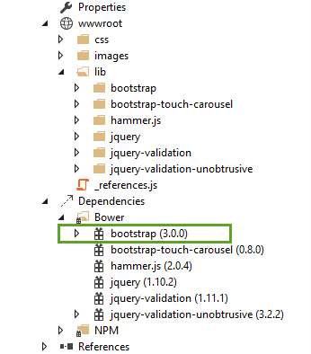

Working with Bootstrap
======================
By `Steve Smith`_ | Originally Published: 1 June 2015 

.. _`Steve Smith`: Author_

Bootstrap 3 is currently the most popular web framework for developing responsive web applications. It offers a number of features and benefits that can improve your users’ experience with your web site, whether you’re a novice at front-end design and development or an expert. Bootstrap is deployed as a set of HTML, CSS and JavaScript files, and is designed to help your website or application scale efficiently from phones to tablets to desktops.

Getting Started
^^^^^^^^^^^^^^^

There are several ways to get started with Bootstrap. If you’re starting a new web application in Visual Studio, you can choose the default starter template for ASP.NET 5, in which case Bootstrap will come pre-installed:

 
You can also install bootstrap using one of several package managers, such as bower, npm, or NuGet. In each case, the process is essentially the same:

Bower
-----

.. code-block:: console

	bower install bootstrap
	
npm
---

.. code-block:: console

	npm install bootstrap
	
NuGet
-----

.. code-block:: console

	Install-Package bootstrap
	
If you’re referencing your own local versions of Bootstrap, you’ll need to reference them in any pages that will use it. In the default ASP.NET site template, the _Layout.cshtml file does so like this:

.. image:: _static/bootstrap-in-layout.png

You can also simply reference Bootstrap using its CDN (Content Delivery Network) links, which is how you may wish to have your application reference bootstrap in production in any case. Simply replace the two references above with these:

.. code-block:: html

	<!-- Latest compiled and minified CSS --> 
	<link rel="stylesheet" href="https://maxcdn.bootstrapcdn.com/bootstrap/3.3.2/css/bootstrap.min.css">

	<!-- Latest compiled and minified JavaScript -->
	

Note that if you’re going to be using any of Bootstrap’s jQuery plugins, you will also need to reference jQuery (as shown above on line 40). If you’re going the CDN route, you can of course use jQuery’s CDN as well:

.. code-block:: html

	

Basic Templates and Features
^^^^^^^^^^^^^^^^^^^^^^^^^^^^

The most basic Bootstrap template looks very much like the _Layout.cshtml file shown above, and simply includes a basic menu for navigation and a place to render the rest of the page.

Basic Navigation
----------------

The default template uses a set of 
 elements to render a top navbar and the main body of the page. If you’re using HTML5, you can replace the first 
 tag with a <nav> tag to get the same effect, but with more precise semantics.  Within this first 
 you can see there are several others. First, a 
 with a class of “container”, and then within that, two more 
 elements: “navbar-header” and “navbar-collapse”.  The navbar-header div includes a button that will appear when the screen is below a certain minimum width, showing 3 horizontal lines (a so-called “hamburger icon”). The icon is rendered using pure HTML and CSS; no image is required. This is the code that displays the icon, with each of the  tags rendering one of the white bars:

Summary
^^^^^^^

.. include:: /_authors/steve-smith.rst
