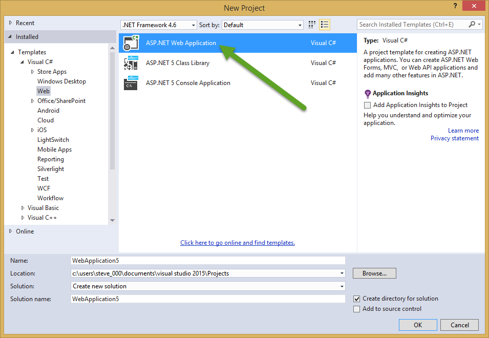
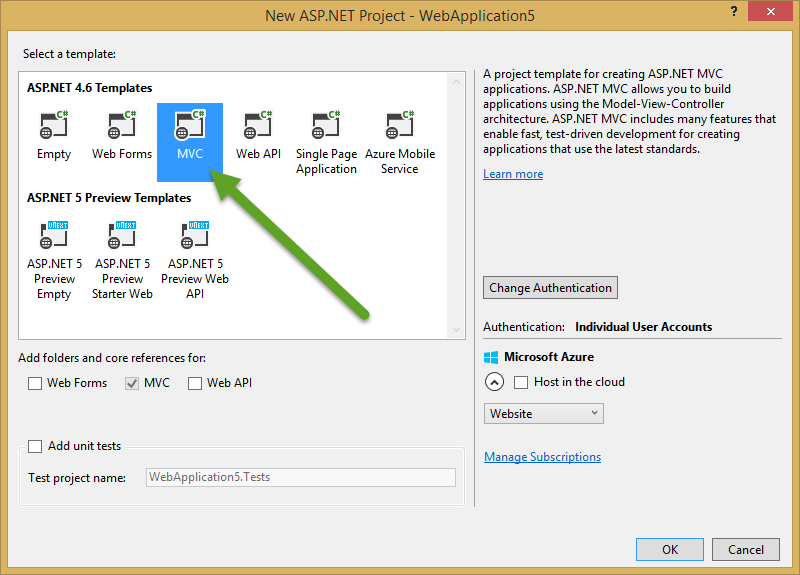
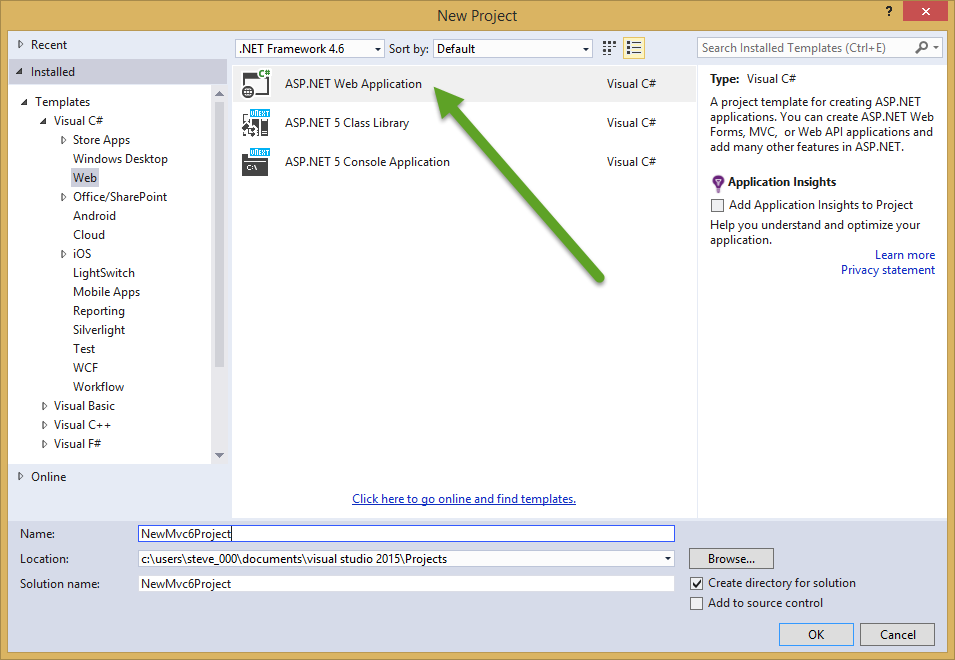
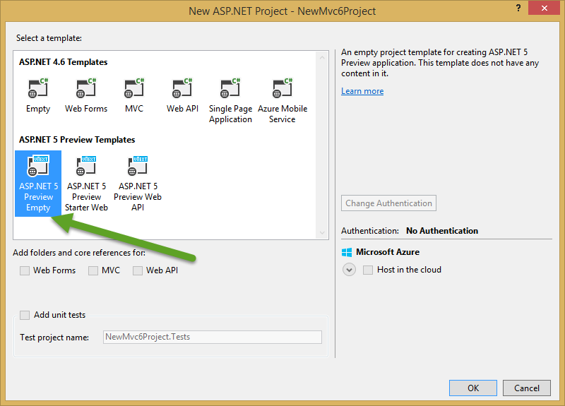
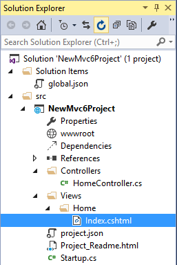
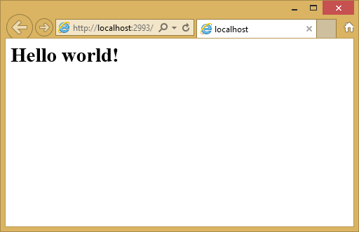
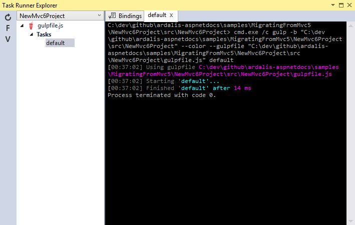
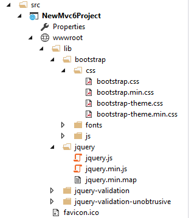
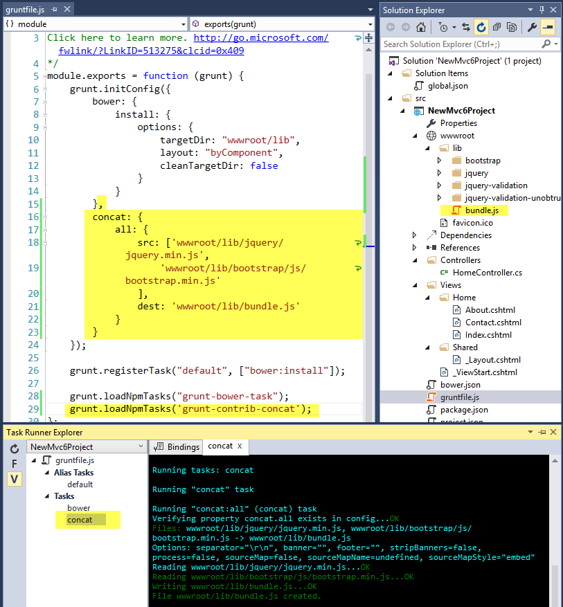

Migrating From ASP.NET MVC 5 to MVC 6
=====================================
By `Steve Smith`_ | Originally Published: 1 June 2015 

.. _`Steve Smith`: Author_

Migrating from ASP.NET MVC 5 to ASP.NET 5 and MVC 6 requires a few steps to complete, since ASP.NET 5 introduces a number of new concepts. In this article you will learn how to migrate from the ASP.NET MVC 5 default project template to ASP.NET MVC 6, including initial setup, basic controllers and views, static content, and client side dependencies.

This article covers the following topics:
	- Create the Initial Project
	- Create the Destination Solution
	- Migrate Basic Controllers, Views, and Static Content
	- Configure Bundling

You can download the finished source from the project created in this article HERE **(TODO)**.

Create the Initial Project
^^^^^^^^^^^^^^^^^^^^^^^^^^

For the purposes of this article, we will be starting from the default ASP.NET MVC 5 starter web project, which you can create in Visual Studio 2015 by adding a new web project and choosing MVC 5.

If you prefer, you can `view or download the MVC 5 Project used in this article </https://github.com/aspnet/Docs/tree/master/samples/MigratingFromMvc5/Mvc5Project>`_.

This sample web project will demonstrate how to migrate an MVC 5 web project that includes controllers, views, and ASP.NET Identity models, as well as startup and configuration logic common to many MVC 5 projects.

Create the Destination Solution
^^^^^^^^^^^^^^^^^^^^^^^^^^^^^^^

We will begin our migration by creating a new, empty ASP.NET 5 solution. Create a new project in Visual Studio 2015, choose an ASP.NET Web Application, and then choose the ASP.NET 5 Empty template.

This migration will start from an empty template. If you're already familiar with ASP.NET 5 and its starter templates and there are features in a starter template you would like to take advantage of, you may wish to start from another template. The next step is to configure the site to use MVC. This requires changes to the project.json file and Startup.cs file. First, open project.json and add "Microsoft.AspNet.Mvc" to the "dependencies" property:

.. code-block:: javascript

	"dependencies": {
		"Microsoft.AspNet.Server.IIS": "1.0.0-beta4",
		"Microsoft.AspNet.Mvc": "6.0.0-beta4"
	},

Now open Startup.cs and modify it as follows:

.. code-block:: c#

	public void ConfigureServices(IServiceCollection services)
	{
		services.AddMvc();
	}

	public void Configure(IApplicationBuilder app)
	{
		app.UseMvc(routes =>
		{
			routes.MapRoute(
				name: "default",
				template: "{controller=Home}/{action=Index}/{id?}");
		});
	}

At this point we are ready to create a simple Controller and View. Add a Controllers folder and a Views folder to the project. Add an MVC Controller called HomeController.cs class to the Controllers folder and a Home folder in the Views folder. Finally, add an Index.cshtml MVC View Page to the Views/Home folder. The project structure should be as shown:

Modify Index.cshtml to show a welcome message:

.. code-block:: html

	<h1>Hello world!</h1>

Run the application - you should see Hello World output in your browser.

Migrate Basic Controllers, Views, and Static Content
^^^^^^^^^^^^^^^^^^^^^^^^^^^^^^^^^^^^^^^^^^^^^^^^^^^^

Now that we've confirmed we have a simple, working ASP.NET MVC 6 project, it's time to start migrating functionality from the source project. There are many different ways one can approach this task. We will need to move all of the client-side content files (CSS, fonts, scripts), all of the controllers, views, and models, and migrate configured features like bundling, filters, and identity. Let's begin by replacing our simple "hello world" implementation of HomeController with the actual HomeController and Views from the source project.

Copy each of the methods from the source HomeController to the HomeController we added to the project in the previous section. Note that in MVC 5, actions typically returned ActionResult, but in MVC 6 this has changed to IActionResult (though it will still compile if you leave it as ActionResult).

Next, create new MVC View Pages in the Views/Home folder for About and Contact. Copy the contents of the corresponding views in the old project to these new views, as well as Index.cshtml. At this point you should once again be able to run the new application, and although the styles are not yet in place, you should see the correct content on the home page as well as /home/about and /home/contact (contact is shown here):

.. image:: _static/contact-page.png

In MVC 5 and previous versions of ASP.NET, static content was hosted from the root of the web project, and was intermixed with server-side files. In MVC 6, all static content files are hosted from the /wwwroot folder, so we will need to adjust where we are storing our static content files. For instance, we can copy the favicon.ico file from the root of the original project to the /wwwroot folder in the new project.

The MVC 5 project uses Bootstrap for its styling, with files stored in /Content and /Scripts and referenced in /Views/Shared/_Layout.cshtml. We could simply copy the bootstrap.js and bootstrap.css files from the old project to the /wwwroot folder in the new project, but there are better ways to handle these kinds of client-side library dependencies in ASP.NET 5.

In our new project, we'll add support for Bootstrap (and other client-side libraries), but we'll do so using the new support for client-side build tooling using Bower and grunt. First, add a new Bower JSON Configuration File to the project root, called bower.json. In its "dependencies" property, add bootstrap, jquery, jquery-validation, and jquery-validation-unobtrusive. Add new properties for these items to the "exportsOverride" property as well, so that the complete bower.json file looks like this:

.. code-block:: javascript

	{
		"name": "NewMvc6Project",
		"private": true,
		"dependencies": {
			"bootstrap": "3.0.0",
			"jquery": "1.10.2",
			"jquery-validation": "1.11.1",
			"jquery-validation-unobtrusive": "3.2.2"
		},
		"exportsOverride": {
			"bootstrap": {
				"js": "dist/js/*.*",
				"css": "dist/css/*.*",
				"fonts": "dist/fonts/*.*"
			},

			"jquery": {
				"": "jquery.{js,min.js,min.map}"
			},
			"jquery-validation": {
				"": "jquery.validate.js"
			},
			"jquery-validation-unobtrusive": {
				"": "jquery.validate.unobtrusive.{js,min.js}"
			}
		}
	}

Bower will automatically download the specified dependencies, but for now the files are not yet in the wwwroot folder, and so cannot be requested by the browser:

.. image:: _static/project-structure-bower.png

Next, we will configure Grunt to process these files and place them where we want them in the wwwroot folder. First, we need to make sure Grunt is installed locally for the project. This is accomplished using NPM, which is similar to Bower but requires a different configuration file, "package.json". Add a new NPM configuration file to the root of the project, called package.json. Add the "grunt" and "grunt-bower-task" items to the devDependencies property, as shown (you should get Intellisense as you type their names):

.. code-block:: javascript

	"devDependencies": {
		"grunt": "0.4.5",
		"grunt-bower-task": "0.4.0"
	}

Save your changes. You should see a new NPM folder in your project, under Dependencies, and it should include the grunt and grunt-bower-task items.

Next, add a new Grunt Configuration file (Gruntfile.js) to the root of the project. The default version of this file includes an empty call to grunt.initConfig. We need to configure grunt to use bower, and then register tasks associated with this configuration. Modify the Gruntfile.js to match this file:

.. code-block:: javascript

	module.exports = function (grunt) {
		grunt.initConfig({
			bower: {
				install: {
					options: {
						targetDir: "wwwroot/lib",
						layout: "byComponent",
						cleanTargetDir: false
					}
				}
			}
		});

		grunt.registerTask("default", ["bower:install"]);

		grunt.loadNpmTasks("grunt-bower-task");
	};

Now that we've finished setting things up, we're ready to let these tools manage our static files and client-side dependencies for us. Right click on gruntfile.js in your project, and select Task Runner Explorer. Double-click on the bower task to run it.

The output should show that the process completed without errors, and you should see that it copied some packages to the \wwwroot\lib folder. Open the wwwroot\lib folder in project explorer, and you should fine that the client-side dependencies (bootstrap, jquery, etc.) have all been copied into this folder:

The files have minified as well as developer-readable versions available; we will configure bundling shortly.

Now that the required bootstrap files are available in the wwwroot folder, the next step is to modify our Views to include references to these files. Copy the _ViewStart.cshtml file from the original project's Views folder into the new project's Views folder. In this case, it references /Shared/_Layout.cshtml, which is the next file we need to copy (create a new Shared folder in /Views and copy _Layout.cshtml from the old project to it). Open _Layout.cshtml and make the following changes:

	- Replace @Styles.Render("~/Content/css") with a <link> element to load bootstrap.css (see below)
	- Remove @Scripts.Render("~/bundles/modernizr")
	- Comment out the line with @Html.Partial("_LoginPartial") - we'll return to it shortly (surround the line with @*...*@)
	- Replace @Scripts.Render("~/bundles/jquery") with a 
	

The complete _Layout.cshtml file should look like this at the moment:

.. image:: _static/layout-cshtml.png

View the site in the browser. It should now load correctly, with the expected styles in place.

(*TODO - Convert Views/web.config to _GlobalImport.cshtml with @using statements *)

Configure Bundling
^^^^^^^^^^^^^^^^^^^^^^^^

The ASP.NET MVC 5 starter web template utilized ASP.NET's built-in support for bundling. In ASP.NET MVC 6, this functionality is better performed using client build steps, like we have already configured to manage our client-side dependencies. Instead of maintaining bundling functionality in a static configuration class that runs on the server, the minification and combination of files is done as part of the build process, using grunt.

You can learn more about configuring Grunt here.(*TODO*)

To simply bundle the jQuery and boostrap scripts together into a single, minified, file, we can use the grunt-contrib-concat task. First, update package.json to require grunt-contrib-concat in "devDependencies":

.. code-block:: javascript

	"devDependencies": {
		"grunt": "0.4.5",
		"grunt-bower-task": "0.4.0",
		"grunt-contrib-concat": "0.5.1"
	}

Save the package.json file and the new package should be installed. You can confirm by checking in the Dependencies/NPM folder to see that the grunt-contrib-concat package is listed there. Next, we will add a concat task to gruntfile.js (after the bower task, in initConfig):

.. code-block:: javascript

	concat: {
		all: {
			src: ['wwwroot/lib/jquery/jquery.min.js',
				'wwwroot/lib/bootstrap/js/bootstrap.min.js'
			],
			dest: 'wwwroot/lib/bundle.js'
		}
	}

Finally, in order to run the task, you need to call grunt.loadNpmTasks:

.. code-block:: javascript

	grunt.loadNpmTasks('grunt-contrib-concat');

Save gruntfile.js, then open the Task Runner Explorer. Right click on the concat task and run it. You should see the output, which should show that it runs without errors. In your solution explorer, you should see the bundle.js file in wwwroot/lib. You can see all of this working in the screenshot:

All that remains it to update _Layout.cshtml and replace the last two 

Refresh the site in a browser, and you can see that the calls to load jQuery.js and bootstrap.js have been replaced with a single call to bundle.js:

.. image:: _static/bundle-screenshot.png

Summary
^^^^^^^

Migrating from ASP.NET MVC 5 to ASP.NET MVC 6 requires several steps, but is not overly difficult. Basic features like the models, views, and controllers that comprise an MVC application can be migrated largely without changes. Most of the changes affect static content and features related to static content, like bundling, as well as configuration steps for the application. By following the steps in this example, you should be able to quickly migrate most ASP.NET MVC 5 applications.

.. include:: /_authors/steve-smith.rst
