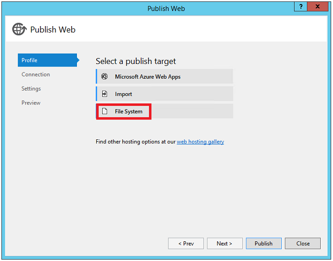

Publishing to IIS
=============================

By :ref:`Rick Anderson <pubIIS-author>`  | Updated : 21 May 2015

In this article:
	- `Publish from Visual Studio`_
	- `Xcopy to IIS Server`_
	- `Addition Resources`_
	
Publish from Visual Studio  
^^^^^^^^^^^^^^^^^^^^^^^^^^^^^^^^^^^^^^
1. Create an ASP.NET 5 app. In this sample, I'll create a MVC 6 app using the **Web Site** template under **ASP.NET 5 Preview Templates**. If you're not using the ``web`` and ``gen`` commands in your development and production work flow, you can remove them from the *project.json* file.

.. code-block:: javascript

	"commands": {
		"web": "Microsoft.AspNet.Hosting --server Microsoft.AspNet.Server.WebListener --server.urls http://localhost:5000",
		"gen": "Microsoft.Framework.CodeGeneration"
	  },
  
With these commands in the *project.json* file, the publish folder will contain web and gen scripts. See `DNX Commands <http://docs.asp.net/en/latest/dnx/overview.html?highlight=command#dnx-concept-commands>`_ for more information.

2. In **Solution Explorer**, right-click on the project and select **Publish**.

.. image:: pubIIS/_static/p1.png

3. In the **Publish Web** dialog, on the **Profile** tab, select **File System**. 

4. Enter a profile name. Click **Next**.
5. On the **Connection** tab you can change the publishing target path from the default *..\\..\\artifacts\\bin\\WebApp9\\Release\\Publish folder*. Click **Next**.
6. On the **Settings** tab you can select the configuration, target DNX version and publish options. Currently your deployment server must have .NET 4.5.1 or higher to use DNX core. We hope to have a native module in the future that will allow you to use DNX core in the app pool regardless of the full CLR. If you select **Precompile during publishing**, the *Publish\\approot\\src* directory and source files will not be created. If you don't check **Precompile during publishing**, your source files will be found in the  *Publish\\approot\\src* directory. Click **Next**.
7. The **Preview** tab shows you the publish path (by default, the same directory as the ".sln" solution file).

Xcopy to IIS Server
^^^^^^^^^^^^^^^^^^^^^^^^^^^^^^^^^^^^^^

#. Navigate to the the publish folder (*..\\..\\artifacts\\bin\\WebApp9\\Release\\Publish folder* in this sample). 
#. Copy the **approot** and **wwwroot** directories to the target IIS server.
#. In IIS manager, configure the app with application path to the **wwwroot** path. You can click on **Browse *.80(http)** to see your deployed app in the browser. 

.. image:: pubIIS/_static/b8.png

Addition Resources
^^^^^^^^^^^^^^^^^^^^^^^^^

- `Understanding ASP.NET 5 Web Apps <http://docs.asp.net/en/latest/conceptual-overview/understanding-aspnet5-apps.html>`_
- `Introducing .NET Core <http://docs.asp.net/en/latest/conceptual-overview/dotnetcore.html>`_
 
 .. _pubIIS-author:

.. include:: /_authors/rick-anderson.txt