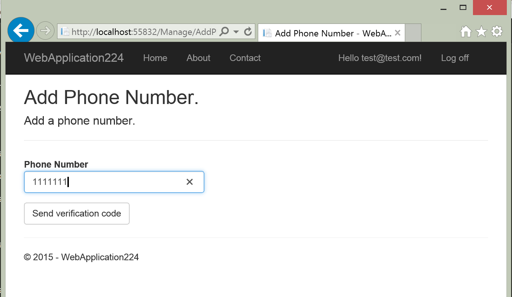
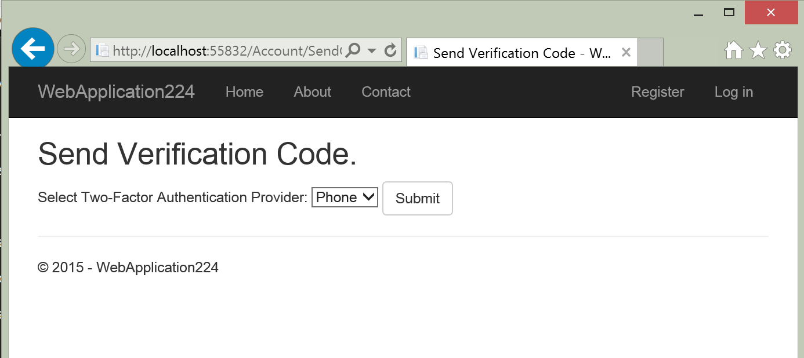
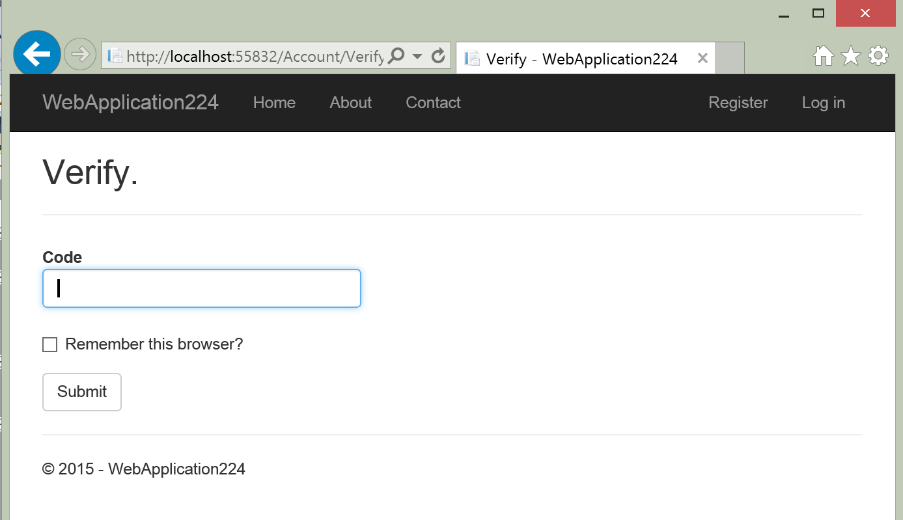
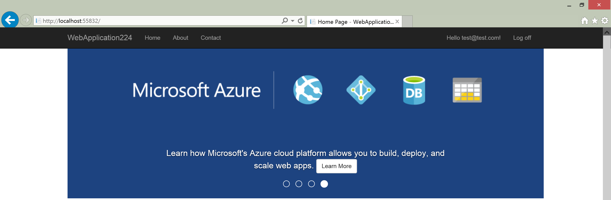

Two-factor authenication with SMS using ASP.NET Identity
========================================================
By :ref:`Pranav Rastogi <2fa-author>` | Originally Published: 28 April 2015 

This tutorial will show you how to set up Two-factor authentication (2FA) using SMS.

In this article:
	- `Create a New ASP.NET 5 Project`_
	- `Running the Application`_
	- `Setup up SMS for Two-factor authentication`_
	- `Enable Two-factor authentication`_
	- `Login with Two-factor authentication`_
	- `Account lockout for protecting against brute force attacks`_
	- `Next steps`_
	- `Summary`_

Create a New ASP.NET 5 Project
------------------------------

To get started, open Visual Studio 2015. Next, create a New Project (from the Start Page, or via File - New - Project).  On the left part of the New Project window, make sure the Visual C# templates are open and "Web" is selected, as shown:

.. image:: 2fa/_static/new-project.png

Next you should see another dialog, the New ASP.NET Project window:
 
.. image:: 2fa/_static/select-project.png
	
Select the ASP.NET 5 Web site template from the set of ASP.NET 5 templates. Make sure you have Individual Authentication selected for this template. After selecting, click OK.

At this point, the project is created. It may take a few moments to load, and you may notice Visual Studio's status bar indicates that Visual Studio id downloading some resources as part of this process.  Visual Studio ensures some required files are pulled into the project when a solution is opened (or a new project is created), and other files may be pulled in at compile time.

Running the Application
-----------------------

Run the application and after a quick build step, you should see it open in your web browser.

.. image:: 2fa/_static/first-run.png

Setup up SMS for Two-factor authentication
------------------------------------------
This tutorial uses Twilio, but you can use any SMS provider. 

 - Create a `Twilio <http://www.twilio.com/>`_ account.
 - From the Dashboard tab of your Twilio account, copy the Account SID and Auth token.
 - From the Numbers tab, copy your Twilio phone number.
 - Make the SID, account token and phone number available to the app:
 - Add the Twilio NuGet package to the app.

 - Add code in MessageServices to send SMS

.. code-block:: c#

    public static Task SendSmsAsync(string number, string message)
    {
        // Plug in your SMS service here to send a text message.
        var twilio = new TwilioRestClient("YourTwilioSid", "YourTwilioToken");
        var result = twilio.SendMessage("YourTwilioPhoneNumber", number, message);
        return Task.FromResult(0);
    }

.. note:: Twilio cannot target dnxcore50: If you build your project then you will get compilation errors. This is because Twilio does not have a package for dnxcore50. You can remove dnxcore50 from project.json or call the REST API from Twilio to send SMS.

.. note:: Security Note: Never store sensitive data in your source code. The account and credentials are added to the code above to keep the sample simple. Follow the steps on how to store secrets using the `Secret Manager <https://github.com/aspnet/Home/wiki/DNX-Secret-Configuration>`_ . The template code is setup to read configuration values from the SecretManager.

Enable Two-factor authentication
--------------------------------

The app already has the code to enable two-factor authentication. Follow these steps to enable two-factor authencation:

- In your project open Index view in Manage folder.
- Uncomment the code to add a phone number to an user account.

.. code-block:: html

    <dt>Phone Number:</dt>
    <dd>
        @(Model.PhoneNumber ?? "None") [
        @if (Model.PhoneNumber != null)
        {
            <a asp-controller="Manage" asp-action="AddPhoneNumber">Change</a>
                @: &nbsp;|&nbsp;
                <a asp-controller="Manage" asp-action="RemovePhoneNumber">Remove</a>
        }
        else
        {
            <a asp-controller="Manage" asp-action="AddPhoneNumber">Add</a>
        }
        ]
    </dd>

- Uncomment the code to enable/ disable two-factor authentication for an user account.

.. code-block:: html

    <dt>Two-Factor Authentication:</dt>
    <dd>
	    @if (Model.TwoFactor)
            {
                <form asp-controller="Manage" asp-action="DisableTwoFactorAuthentication" method="post" class="form-horizontal" role="form">
                    <text>
                        Enabled
                        <input type="submit" value="Disable" class="btn btn-link" />
                    </text>
                </form>
            }
            else
            {
                <form asp-controller="Manage" asp-action="EnableTwoFactorAuthentication" method="post" class="form-horizontal" role="form">
                    <text>
                        Disabled
                        <input type="submit" value="Enable" class="btn btn-link" />
                    </text>
                </form>
        }
	</dd>

Login with Two-factor authentication
------------------------------------

Let us run the Web site and show the two-factor authentication flow.

- Run the app and register a new user

.. image:: 2fa/_static/login2fa1.png

- Click on your user name, which activates the Index action method in Manage controller.

.. image:: 2fa/_static/login2fa2.png

- Add Phone Number

- You will get a text message with the verification code. Enter it and press Submit

.. image:: 2fa/_static/login2fa4.png

- The Manage view shows your phone number was added successfully.

.. image:: 2fa/_static/login2fa5.png

- Enable two-factor authenication.

.. image:: 2fa/_static/login2fa6.png

- Log Off.
- Login with user name and password.
- Since you have enable two-factor authentication, you have to verify the second step. In this case you have a verified phone number so you can use it to verify the PIN. If you had other factors such as email, QR code generators, then you could use those as a verification step.

- You will get a text message with the verification code. Enter it.
- Clicking on the Remember this browser check box will exempt you from needing to use 2FA to log on with that computer and browser. Enabling 2FA and clicking on the  Remember this browser will provide you with strong 2FA protection from malicious users trying to access your account, as long as they don't have access to your computer. You can do this on any private machine you regularly use. By setting  Remember this browser, you get the added security of 2FA from computers you don't regularly use, and you get the convenience on not having to go through 2FA on your own computers. 

- Log In.

           
Account lockout for protecting against brute force attacks
----------------------------------------------------------
We recommend you use account lockout with 2FA.Once a user logs in (through local account or social account), each failed attempt at 2FA is stored, and if the maximum attempts (default is 5) is reached, the user is locked out for five minutes (you can set the lock out time with DefaultAccountLockoutTimeSpan).
The following configures Account to be locked out for 10 min after 10 failed attempts.

.. code-block:: c#

    services.Configure<IdentityOptions>(options =>
    {
        options.Lockout.DefaultLockoutTimeSpan = TimeSpan.FromMinutes(10);
        options.Lockout.MaxFailedAccessAttempts = 10;
    });

Next steps
----------
- Once you publish your Web site to Azure Web App, you should reset the AppSecret in the Facebook developer portal. 
- Set the Facebook AppId and AppSecret as application setting in the Azure Web App portal. The configuration system is setup to read keys from environment variables.

Summary
-------

ASP.NET Identity can be used to add two-factor authentication.

.. _2fa-author:

.. include:: /_authors/pranav-rastogi.txt
