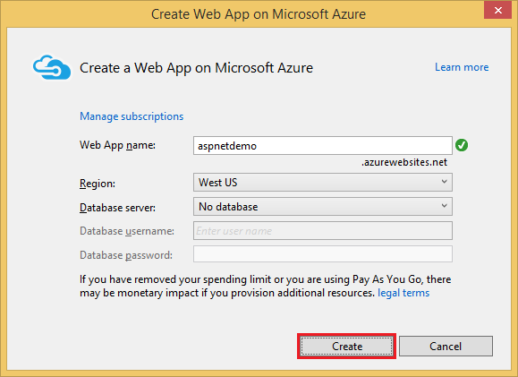
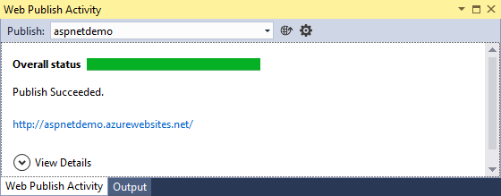

Publish to an Azure Web App using Visual Studio
===============================================
By :ref:`Erik Reitan <publish-to-azure-webapp-using-vs-author>` | Originally Published: 28 April 2015 

This article describes how to publish an ASP.NET web app to Azure using Visual Studio. 

**Note:** To complete this tutorial, you need a Microsoft Azure account. If you don't have an account, you can `activate your MSDN subscriber benefits`_ or `sign up for a free trial`_.

.. _`activate your MSDN subscriber benefits`: http://azure.microsoft.com/pricing/member-offers/msdn-benefits-details/?WT.mc_id=A261C142F

.. _`sign up for a free trial`: http://azure.microsoft.com/pricing/free-trial/?WT.mc_id=A261C142F

Start by either creating a new ASP.NET web app or opening an existing ASP.NET web app. 

1. In **Solution Explorer** of Visual Studio, right-click on the project and select **Publish**.

.. image:: publish-to-azure-webapp-using-vs/_static/01-Publish.png

2. In the **Publish Web** dialog box, click on **Microsoft Azure Web Apps** and log into your Azure subscription.

.. image:: publish-to-azure-webapp-using-vs/_static/02-PublishWebdb.png

3. Click **New** in the **Select Existing Web App** dialog box to create a new Web app in Azure.

.. image:: publish-to-azure-webapp-using-vs/_static/03-SelectExistingWebAppdb.png

4. Enter a site name and region. You can optionally create a new database server, however if you've created a database server in the past, use that. When you're ready to continue, click **Create**.

Database servers are a precious resource. For test and development it's best to use an existing server. There is **no** validation on the database password, so if you enter an incorrect value, you won't get an error until your web app attempts to access the database.

5. On the **Connection** tab of the **Publish Web** dialog box, click **Publish**.

.. image:: publish-to-azure-webapp-using-vs/_static/05-PublishWebdb.png

You can view the publishing progress in the **Web Publish Activity** window within Visual Studio.

When publishing to Azure is complete, your web app will be displayed in a browser running on Azure. 

.. image:: publish-to-azure-webapp-using-vs/_static/07-Browser.png

.. _publish-to-azure-webapp-using-vs-author:

.. include:: /_authors/erik-reitan.txt

