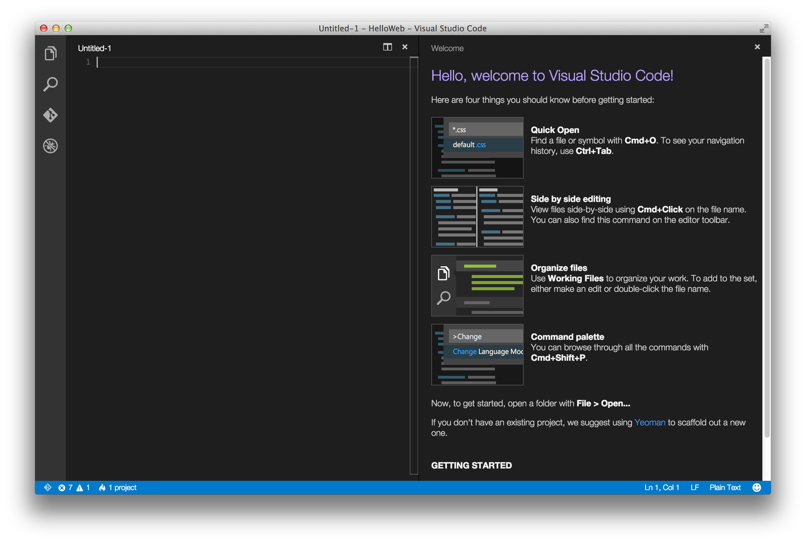
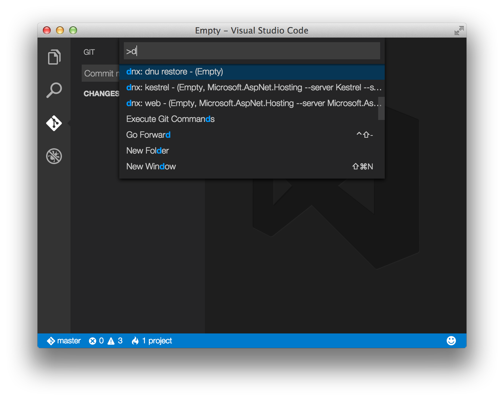
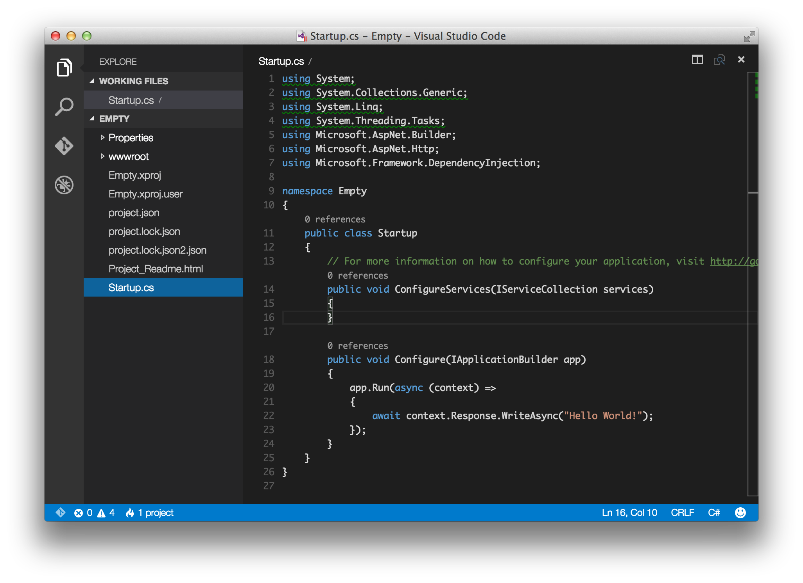
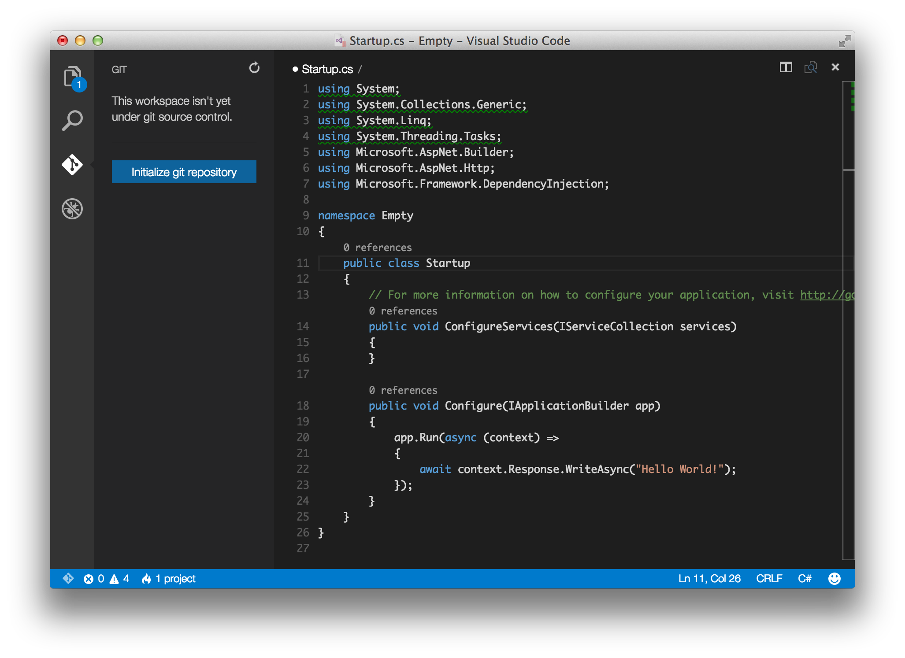
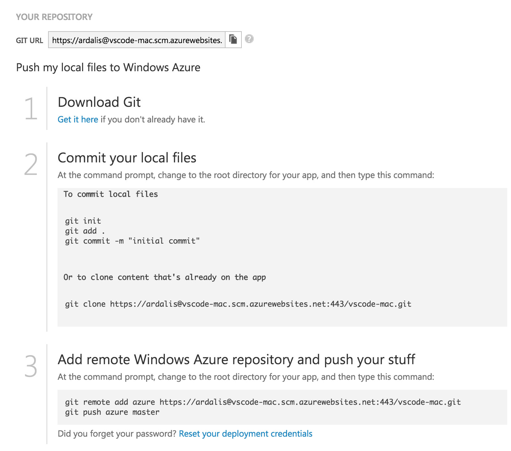
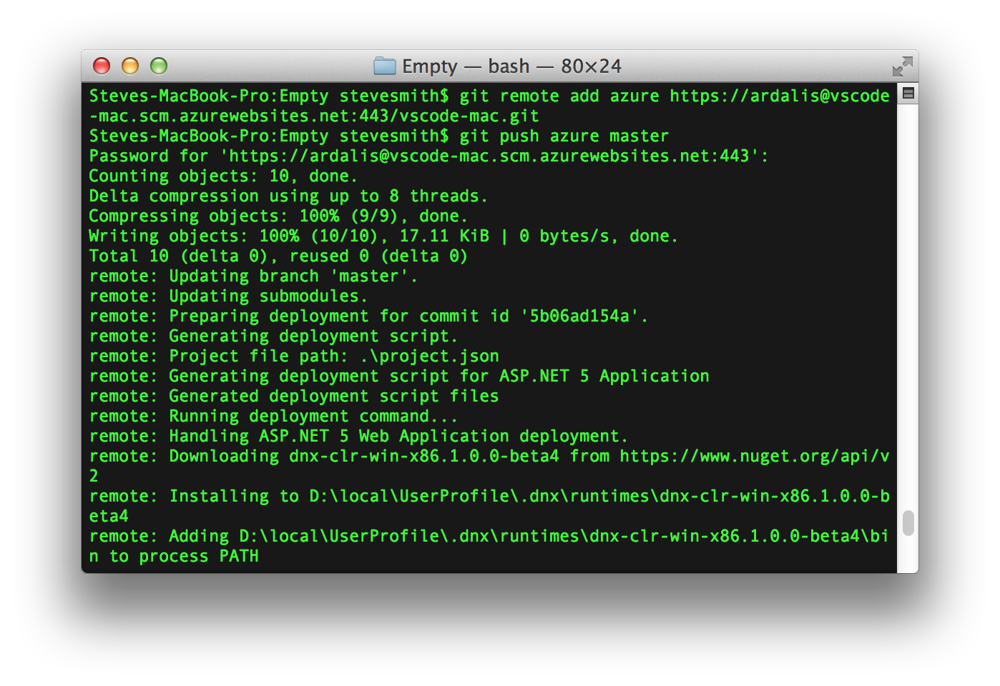
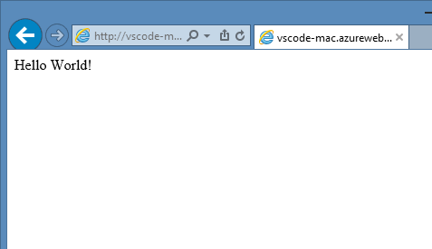
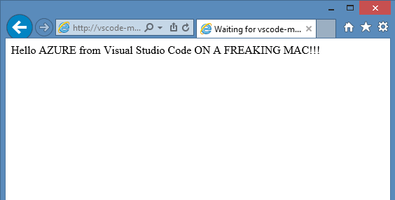

Your First ASP.NET 5 Application on a Mac
=========================================
By :ref:`Steve Smith <installing-on-mac-author>` | Originally Published: 29 April 2015

ASP.NET 5 is cross-platform and can be developed and run on Mac OS X as well as Linux and Windows. See how you can quickly install, scaffold, run, debug, and deploy ASP.NET applications on a Mac.

In this article:
	- `Setting Up Your Development Environment`_
	- `Scaffolding Applications Using Yeoman`_
	- `Developing ASP.NET Applications on a Mac With Visual Studio Code`_
	- `Running Locally Using Kestrel`_
	- `Publishing to Azure`_

Setting Up Your Development Environment
---------------------------------------

First, make sure you have :doc:`installed ASP.NET on your Mac OS X machine </getting-started/installing-on-mac>`. This step will include installing `Homebrew <http://brew.sh/>`_ and configuring DNVM. This article has been tested with DNX beta4. You can confirm that you are running the correct version of ``dnx`` by running the command ``dnvm list``. You should see ``default`` listed under the ``Alias`` column for ``1.0.0-beta4`` as shown:

.. image:: your-first-mac-aspnet/_static/dnvm-list-beta4.png

Scaffolding Applications Using Yeoman
-------------------------------------

Coming soon: instructions for getting started with `Yeoman <http://yeoman.io>`_.

`Download a sample Empty Web Site <https://github.com/aspnet/docs/>`_ to use with this article.

Developing ASP.NET Applications on a Mac With Visual Studio Code
----------------------------------------------------------------

Now, install Visual Studio Code from `code.visualstudio.com <http://code.visualstudio.com>`_. Unzip the application and open it - the first time you should see a welcome screen:

To get started with your first ASP.NET application on a Mac, select File -> Open and choose the folder where you unzipped the empty web site (or scaffolded a site with Yeoman).

.. image:: your-first-mac-aspnet/_static/file-open.png

Visual Studio Code may detect that you need to restore dependencies, as shown in this screenshot: 

.. image:: your-first-mac-aspnet/_static/vscode-restore.png

From a Terminal / bash prompt, run ``dnu restore`` to restore the project's dependencies. Alternately, you can press ``command o`` and then type ``>d`` as shown:

This will allow you to run commands directly from within Visual Studio Code, including ``dnu update`` and any commands defined in ``project.json``.

At this point, you should be able to host and browse to this simple ASP.NET web application, which we'll see in a moment.

This empty project template simply displays "Hello World!". Open ``Startup.cs`` in Visual Studio Code to see how this is configured:

If this is your first time using Visual Studio Code (or just *Code* for short), note that it provides a very steamlined, fast, clean interface for quickly working with files, while still providing tooling to make writing code extremely productive. 

In the left navigation bar, there are four icons, representing four viewlets:
	- Explore
	- Search
	- Git
	- Debug
	
The Explore viewlet allows you to quickly navigate within the folder system, as well as easily see the files you are currently working with. It displays a badge to indicate whether any files have unsaved changes, and new folders and files can easily be created (without having to open a separate dialog window). You can easily Save All from a menu option that appears on mouse over, as well.

The Search viewlet allows you to quickly search within the folder structure, searching filenames as well as contents.

*Code* will integrate with git if it is installed on your system. You can easily initialize a new repository, make commits, and push changes from the Git viewlet.

The Debug viewlet supports interactive debugging of applications. Currently only node.js and mono applications are supported by the interactive debugger.

Finally, Code's editor has a ton of great features. You should note right away that several using statements are underlined, because Code has determined they are not necessary. Note that classes and methods also display how many references there are in the project to them. If you're coming from Visual Studio, Code includes many of the keyboard shortcuts you're used to, such as ``command k c`` to comment a block of code, and ``command k u`` to uncomment.

Running Locally Using Kestrel
-----------------------------

The sample we're using is configured to use Kestrel as its web server. You can see it configured in the ``project.json`` file, where it is specified as a dependency and as a command.

.. code-block:: javascript
	:linenos:
	:emphasize-lines: 8,13

	{
	  "webroot": "wwwroot",
	  "version": "1.0.0-*",

	  "dependencies": {
		"Microsoft.AspNet.Server.IIS": "1.0.0-beta4",
		"Microsoft.AspNet.Server.WebListener": "1.0.0-beta4",
		"Kestrel": "1.0.0-beta4"
	  },

	  "commands": {
		  "web": "Microsoft.AspNet.Hosting --server Microsoft.AspNet.Server.WebListener --server.urls http://localhost:5000",
		  "kestrel": "Microsoft.AspNet.Hosting --server Kestrel --server.urls http://localhost:5001"
	  },
	// more deleted
	
In order to run the ``kestrel`` command, which will launch the web application on localhost port 5001, run ``dnx . kestrel`` from a command prompt:

.. image:: your-first-mac-aspnet/_static/dnx-dot-kestrel.png

Navigate to ``localhost:5001`` and you should see:

.. image:: your-first-mac-aspnet/_static/hello-world.png

It's not necessarily obvious, but if you want to stop the web server once you've started it, simply press ``enter``.

We can update the application to output information to the console whenever a request is received. Update the ``Configure()`` method as follows:

.. code-block:: c#
	:linenos:
	:emphasize-lines: 5
	
	public void Configure(IApplicationBuilder app)
        {
            app.Run(async (context) =>
            {
                Console.WriteLine("Request for " + context.Request.Path);
                await context.Response.WriteAsync("Hello World!");
            });
        }
		
Save the file and restart the web server. Make a few requests to the URL. You should see the request information output in the Terminal window (recall that most browsers will automatically attempt to request a ``favicon.ico`` file when making a request to a new domain):

.. image:: your-first-mac-aspnet/_static/kestrel-logging.png

As you can see, it's quite straightforward, especially if you're already familiar with command line tooling, to get started building ASP.NET applications using Visual Studio Code on Mac OS X.

Publishing to Azure
-------------------

Once you've developed your application, you can easily use the git integration built into Visual Studio Code to push updates to production, hosted on `Windows Azure <http://azure.microsoft.com>`_. 

Initialize Git
^^^^^^^^^^^^^^

First, if you haven't already done so, initialize git in the folder you're working in. Simply click on the git viewlet and click the ``Initialize git repository`` button.

.. image:: your-first-mac-aspnet/_static/vscode-git-commit.png

Add a commit message as shown in the image above, and press enter or click the checkmark icon to commit the staged files. Now git is tracking changes, so if you make an update to a file, the git viewlet will display how many files have changed since your last commit.

Initialize Azure Website
^^^^^^^^^^^^^^^^^^^^^^^^

If you're unfamiliar with Windows Azure, you may not know that you can deploy to Azure Web Apps directly using git. They also support other workflows, but being able to simply perform a ``git push`` to a remote can be a very convenient way to make updates.

.. note:: Learn more about `configuring Azure to support deployment from source control <http://azure.microsoft.com/en-us/documentation/articles/web-sites-publish-source-control/>`_.

Create a new Web App in Azure, and configure it to support git deployment. If you don't have an Azure account, you can `create a free trial <http://azure.microsoft.com/en-us/pricing/free-trial/>`_. Once it's configured, you should see a page like this:

Note the ``GIT URL``, which is also shown in step 3. Assuming you've been following along, you can skip steps 1 and 2 and go directly to step 3. In a Terminal window, add a remote named ``azure`` with the ``GIT URL`` shown, and then perform ``git push azure master`` to deploy. You should see output similar to the following:

Now you can browse to your Web App and you should see your newly deployed application.

At this point, you can make additional changes to the application, commit them, and whenever you're ready to deploy, simply perform another ``git push azure master`` from a Terminal prompt. To demonstrate, let's update the message being printed:

.. code-block:: c#
	:linenos:
	:emphasize-lines: 6
	
	public void Configure(IApplicationBuilder app)
        {
            app.Run(async (context) =>
            {
                Console.WriteLine("Request for " + context.Request.Path);
                await context.Response.WriteAsync(
		"Hello AZURE from Visual Studio Code ON A FREAKING MAC!!!");
            });
        }

Save the changes. Commit them using the git viewlet. Run ``git push azure master`` from a Terminal prompt, once more. Then refresh your browser:

Summary
-------

ASP.NET 5 and DNX support installation on Mac OS X. Developers can quickly install the necessary tools to get started, including Yeoman for app scaffolding and `Visual Studio Code <http://code.visualstudio.com>`_ for rapid lightweight editing with built-in support for debugging, git integration, and Intellisense.

Additional Reading
------------------

Learn more about Visual Studio Code:
	- `Announcing Visual Studio Code Preview <http://blogs.msdn.com/b/vscode/archive/2015/04/29/announcing-visual-studio-code-preview.aspx>`_
	- `code.visualstudio.com <http://code.visualstudio.com>`_
	- `Visual Studio Code Documentation <http://go.microsoft.com/fwlink/?LinkID=533484>`_
		
.. _installing-on-mac-author:

.. include:: /_authors/steve-smith.txt
