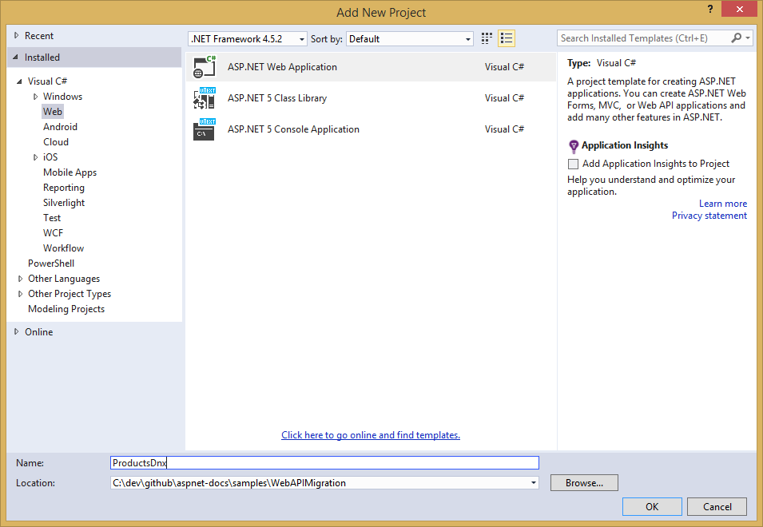
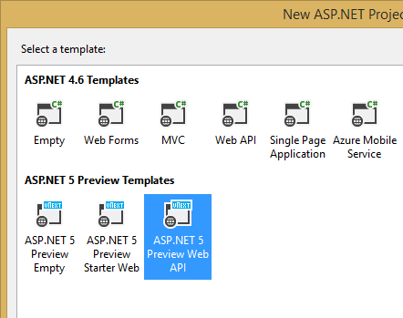

Migrating From ASP.NET Web API 2 to ASP.NET 5
=============================================
By `Steve Smith`_ | Originally Published: 1 June 2015 

.. _`Steve Smith`: Author_

ASP.NET Web API 2 was separate from ASP.NET MVC 5, with each using their own libraries for dependency resolution, among other things. In ASP.NET 6, Web API has been merged with MVC, providing a single, consistent way of building web applications. In this article we demonstrate the steps required to migrate from an ASP.NET Web API 2 project to ASP.NET 5.

This article covers the following topics:
	- Review Web API 2 Project
	- Create the Destination Project
	- Migrate Configuration
	- Migrate Models and Controllers

You can view the finished source from the project created in this article `on GitHub <https://github.com/aspnet/Docs/tree/master/samples/WebAPIMigration>`_.

Review Web API 2 Project
^^^^^^^^^^^^^^^^^^^^^^^^

This article uses the sample project, ProductsApp, created in the article, `Getting Started with ASP.NET Web API 2 (C#) <http://www.asp.net/web-api/overview/getting-started-with-aspnet-web-api/tutorial-your-first-web-api>`_ as its starting point.

In Global.asax.cs, a call is made to WebApiConfig.Register:

.. literalinclude:: ../../../samples/WebAPIMigration/ProductsApp/global.asax.cs
	:language: c#
	:emphasize-lines: 14
	:linenos:

WebApiConfig is defined in App_Start, and has just one static Register method:

.. literalinclude:: ../../../samples/WebAPIMigration/ProductsApp/App_Start/WebApiConfig.cs
	:language: c#
	:emphasize-lines: 15-20
	:linenos:

This class configures `attribute routing <http://www.asp.net/web-api/overview/web-api-routing-and-actions/attribute-routing-in-web-api-2>`_, which isn't actually being used in this project, as well as the routing table that Web API 2 uses. In this case, Web API will expect URLs to match /api/{controller}/{id}, with {id} being optional.

The ProductsApp project includes just one simple controller, which inherits from ApiController and exposes two methods:

.. literalinclude:: ../../../samples/WebAPIMigration/ProductsApp/Controllers/ProductsController.cs
	:language: c#
	:emphasize-lines: 19,24
	:linenos:

Finally, the model, Product, used by the ProductsApp, is a simple class:

.. literalinclude:: ../../../samples/WebAPIMigration/ProductsApp/Models/Product.cs
	:language: c#
	:linenos:

Create the Destination Project
^^^^^^^^^^^^^^^^^^^^^^^^^^^^^^

Using Visual Studio 2015, create a new, empty solution, and add the existing ProductsApp project to it. Then, add a new Web Project to the solution. In this case, I'm naming the new project 'ProductsDnx'.

Next, choose the ASP.NET 5 Web API template project. We will migrate the ProductsApp contents to this new project.

Delete the Project_Readme.html file from the new project. You can also delete the Your solution should now look like this:

.. image:: _static/webapimigration-solution.png

Migrate Configuration
^^^^^^^^^^^^^^^^^^^^^

ASP.NET 5 no longer uses global.asax, web.config, or App_Start folders. Instead, all startup tasks are done in Startup.cs in the root of the project, and static configuration files can be wired up from there if needed. Since Web API is now built into ASP.NET 5, there is less need to configure it. Attribute-based routing is now included by default when UseMvc() is called, and this is how the Web API starter project handles routing.

.. literalinclude:: ../../../samples/WebAPIMigration/ProductsDnx/Startup.cs
	:language: c#
	:emphasize-lines: 27
	:linenos:
	
If you want to use attribute routing in your project going forward, you don't need to do any additional configuration. You can simply apply the attributes as needed to the API methods or controllers, as is done in the sample ValuesController.cs class that is included in the Web API starter project:

.. literalinclude:: ../../../samples/WebAPIMigration/ProductsDnx/Controllers/ValuesController.cs
	:language: c#
	:emphasize-lines: 8,12,19,32,38
	:linenos:

In this case, once we copy ProductsController to the new project, we would simply include the route attribute on the controller:

.. code-block:: c#

	[Route("api/[controller]")]

However, if you have a large number of files, or you simply want to configure your routes in one place, rather than on each Controller, you can still configure routing globally. Back in Startup.cs, the UseMvc() call accepts a parameter that defines routing information. You can pass in the same route configuration that was previously defined in WebApiConfig.cs in the old project, like so:

.. code-block:: c# 

	app.UseMvc(routes =>
	{
		routes.MapRoute(
			name: "DefaultApi",
			template: "api/{controller}/{action}/{id:int?}",
			defaults: new { controller = "Products", action = "GetAllProducts" });
	});

**Note** `routeTemplate` has been renamed to `template`, and the id parameter has now been marked as being an `int` and option (`?`) without the need for specifying anything in the `defaults` parameter.

If you are using the `sample project <https://github.com/aspnet/Docs/tree/master/samples/WebAPIMigration>`_, you will need to uncomment the above code block in Startup.cs.

No additional configuration is required for us to complete the migration.

Migrate Models and Controllers
^^^^^^^^^^^^^^^^^^^^^^^^^^^^^^

The last step in the migration process for this simple Web API project is to copy over the Controllers and any Models they use. In this case, simply copy Controllers/ProductsController.cs from the original project to the new one. Then, copy the entire Models folder from the original project to the new one. Adjust the namespaces to match the new project name (`ProductsDnx`).  At this point, you can build the application, and you will find a number of compilation errors. These should generally fall into three categories:

	- `ApiController` does not exist
	- `System.Web.Http` namespace does not exist
	- `IHttpActionResult` does not exist
	- `NotFound` does not exist
	- `Ok` does not exist
	
Fortunately, these are all very easy to correct:

	- Change `ApiController` to `Controller` (you may need to add `using Microsoft.AspNet.Mvc`)
	- Delete any using statement referring to `System.Web.Http`
	- Change any method returning `IHttpActionResult` to return a `IActionResult`
	- Change `NotFound` to `HttpNotFound`
	- Change `Ok(product)` to `new ObjectResult(product)`

Once these changes have been made and unused using statements removed, the migrated ProductsController class looks like this:

.. literalinclude:: ../../../samples/WebAPIMigration/ProductsDnx/Controllers/ProductsController.cs
	:language: c#
	:emphasize-lines: 1,2,6,8,22,27,29
	:linenos:
	
You should now be able to run the migrated project and browse to /api/products, and you should see the full list of 3 products.

Summary
^^^^^^^

Migrating a simple Web API 2 project to ASP.NET 5 is fairly straightforward, thanks to the fact that Web API has been merged with MVC in ASP.NET 5. The main pieces every Web API 2 project will need to migrate are routes, controllers, and models, along with updates to the types used by ASP.NET 5 controllers and actions.

Related Resources
^^^^^^^^^^^^^^^^^

`Create a Web API in MVC 6 <http://www.asp.net/vnext/overview/aspnet-vnext/create-a-web-api-with-mvc-6>`_

.. include:: /_authors/steve-smith.rst
