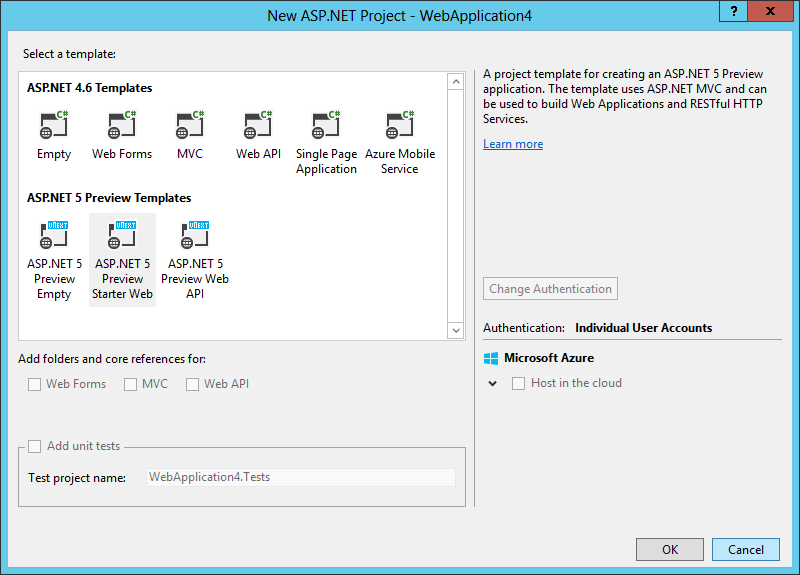

.. highlight:: c#

Your First ASP.NET 5 Application Using Visual Studio
====================================================
By `Steve Smith`_ | Originally Published: 1 June 2015 

.. _`Steve Smith`: Author_

ASP.NET 5 provides a host of improvements over its predecessors, including improved performance, better support for modern web development standards and tools, and improved integration between WebAPI, MVC, and WebForms.  In addition, you can easily develop ASP.NET 5 applications using a variety of tools and editors, but Visual Studio continues to provide a very productive way to build web applications.  In this article, we'll walk through creating your first ASP.NET 5 web application using Visual Studio 2015.

This article covers the following topics:
	- Create a new ASP.NET 5 Project
	- The wwwroot folder
	- Resolving Client-Side Dependencies
	- Resolving Servier-Side Dependencies
	- Configuring the Application
	- Application Startup
	
You can download the finished source from the project created in this article HERE **(TODO)**.

Create a New ASP.NET 5 Project
^^^^^^^^^^^^^^^^^^^^^^^^^^^^^^

To get started, open Visual Studio 2015. Next, create a New Project (from the Start Page, or via File - New - Project).  On the left part of the New Project window, make sure the Visual C# templates are open and "Web" is selected, as shown:

.. image:: _static/100-new-project.png
	:width: 500

On the right, choose ASP.NET Web Application. Make sure the framework specified at the top of the window is .NET Framework 4.6. Enter a name and confirm where you would like the project to be created, and click OK.

Next you should see another dialog, the New ASP.NET Project window:
 

	
Select the ASP.NET 5 Starter Web template from the set of ASP.NET 5 templates. These are distinct from the ASP.NET 4.6 templates, which can be used to create ASP.NET projects using the previous version of ASP.NET. Note that you can choose to configure hosting in Microsoft Azure directly from this dialog by checking the box on the right **(ED: confirm this is available at RTM)**. After selecting ASP.NET 5 Starter Web, click OK.

At this point, the project is created. It may take a few moments to load, and you may notice Visual Studio's status bar indicates that Visual Studio id downloading some resources as part of this process.  Visual Studio ensures some required files are pulled into the project when a solution is opened (or a new project is created), and other files may be pulled in at compile time.  Your project, once fully loaded, should look like this:

.. image:: _static/300-visual-studio-on-project-load.png
	:width: 500

Looking at the Solution Explorer and comparing the elements with what we're familiar with in previous versions of ASP.NET, a few things stick out as being new and different. There's now a *wwwroot* folder, with its own icon. Similarly, there's a *Dependencies* folder **and** still a *References* folder – we'll discuss the differences between these two in a moment. Finally, there's a Compiler folder that isn't something we've seen in prior versions of ASP.NET. Rounding out the list of folders, we have Controllers, Models, and Views, which make sense for an ASP.NET MVC project, and Migrations, which holds classes used by Entity Framework to track updates to our model's database schema.

Looking at the files in the root of the project, we may notice the absence of a few files. Global.asax is no longer present, nor is web.config, both mainstays from the start of ASP.NET. Instead, we find a Startup.cs file and a config.json file.  Adding to this mix are bower.json, gruntfile.js, package.json, and project.json (the Project_Readme.html file you can see in the browser tab). Clearly the success of Javascript in web development has had an effect on how ASP.NET 5 projects are configured and compiled, and deployed, with JavaScript Object Notation (JSON) files replacing XML for configuration purposes.

While we're at it, you may not notice it from the Solution Explorer, but if you open Windows Explorer you'll see that there is no longer a .csproj file, either. Instead you'll find a .kproj file **(ED: which is still XML and my understanding is that it may be going away before RTM – update this section prior to RTM)**.

Let's address each of these new parts of the ASP.NET project one by one.

The wwwroot Folder
^^^^^^^^^^^^^^^^^^

In previous versions of ASP.NET, the root of the project was also the root of the website, typically. If you placed a Default.aspx file in the project root of an early version of ASP.NET, it would load if a request was made to the web application’s root. In later versions of ASP.NET, support for routing was added (first to MVC, and later to all ASP.NET applications), making it possible to easily decouple the locations of files from their corresponding URLs (thus, HomeController in the Controllers folder is able to serve requests made to the root of the site, using a default route implementation). However, this routing typically was used only for ASP.NET-specific application logic, not static files needed by the client to properly render the resulting page. Resources like images, script files, and stylesheets were generally still loaded based on their location within the file structure of the application, based off of the root of the project.

.. image:: _static/400-wwwroot.png

This approach presented some problems. First, protecting sensitive project files required framework-level protection of certain filenames or extensions, to prevent having things like web.config or global.asax served to a client in response to a request. Having to specifically block access to certain files is much less secure than granting access only to those files which should be accessible. It was also frequently the case that different versions of files would be needed during development than when deployed to the server. Client scripts would typically be referenced individually and in a readable format during development, but would be minified and potentially bundled together when deployed to the server. In some cases it would be desirable not to deploy original sources of such files, but handling these kinds of scenarios was difficult with everything in a single folder.

Enter the *wwwroot* folder in ASP.NET 5. The wwwroot folder represents the actual root of the web application when running on a web server. Static files, like config.json, which are not located in wwwroot will never be accessible, and there is no need to create special rules to block access to sensitive files. Instead of blacklisting access to sensitive files, a more secure whitelist approach is taken whereby only those files that placed in the wwwroot folder are accessible via web requests made to the application.

In addition to the security benefits, the wwwroot folder also simplifies common tasks like bundling and minification, which can now be more easily incorporated into a standard build process and automated using tools like Grunt.

Client Side Dependency Management
^^^^^^^^^^^^^^^^^^^^^^^^^^^^^^^^^

The Dependencies folder contains two subfolders: Bower and NPM. These folders correspond to two package managers by the same names, and they’re used to pull in client-side dependencies and tools (e.g. jQuery, bootstrap, or grunt). Expanding the folders reveals which dependencies are currently managed by each tool, and the current version being used by the project.

.. image:: _static/501-dependencies.png

The bower dependencies are controlled by the bower.json file. You’ll notice that each of the items listed in the figure above correspond to dependencies listed in bower.json:

.. image:: _static/600-bower-json.png
	:width: 500

Each dependency is then further configured in its own section within the bower.json file, indicating how it should be deployed to the wwwroot folder when the bower task is executed.

By default, the bower task is executed using grunt, which is configured in gruntfile.js. The current web template’s gruntfile simply configures bower and npm:

.. image:: _static/700-gruntfile.png
	:width: 500

(**(TODO)**: Show bower_components and node_modules folders in file system)

Server Side Dependency Management
^^^^^^^^^^^^^^^^^^^^^^^^^^^^^^^^^

The References folder details the server-side references for the project. It should be familiar to ASP.NET developers who have worked with previous versions of ASP.NET, but it has been modified to differentiate between references for different framework targets, such as the full ASP.NET 5.0 vs. ASP.NET Core 5.0.  Within each framework target, you will find individual references, with icons indicating whether the reference is to an assembly, a NuGet package, or a project. Note that these dependencies are typically checked at compile time, with missing dependencies downloaded from the configured NuGet package source (specified under Options – NuGet Package Manager – Package Sources).	

.. image:: _static/801-references.png
	:width: 500

Configuring the Application
^^^^^^^^^^^^^^^^^^^^^^^^^^^

**(TODO)** 

Application Startup
^^^^^^^^^^^^^^^^^^^

**(TODO)**

Summary
^^^^^^^

**(TODO)**
	
Playing Around With Code Formatting Section
^^^^^^^^^^^^^^^^^^^^^^^^^^^^^^^^^^^^^^^^^^^

Some other content and here is some code::
	
	using System;
	using System.Web;
	// just kidding, we aren't going to use System.Web!
	public class Foo
	{
		public void Bar()
		{
			var x = new String();
			
			x = x.ToLower();
		}
	}
	
That's it for that code block. What if we want to now show some HTML markup?

.. code-block:: html
	
	<html>
	<head><title>Title</title></head>
	<body>
		

	</body>
	</html>

The above should be highlighted as HTML.

.. include:: ../_authors/steve-smith.rst
