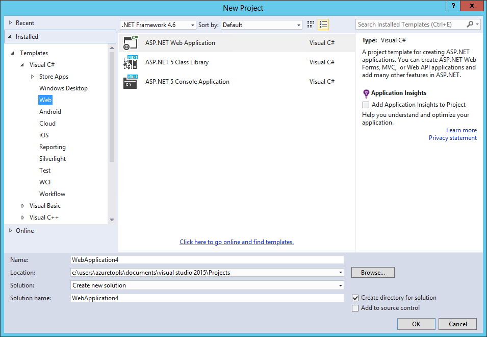

.. highlight:: c#

Your First ASP.NET Application Using Visual Studio
==================================================
By `Steve Smith`_ | Originally Published: 1 June 2015

Header
======

Some content

Subhead
^^^^^^^

Some other content and here is some code::
	
	using System;
	using System.Web;
	// just kidding, we aren't going to use System.Web!
	public class Foo
	{
		public void Bar()
		{
			var x = new String();
			
			x = x.ToLower();
		}
	}
	
That's it for that code block. What if we want to now show some HTML markup?

.. code-block:: html
	
	<html>
	<head><title>Title</title></head>
	<body>
		

	</body>
	</html>

The above should be highlighted as HTML.

To get started, open Visual Studio and Add a New Project:

Next...

.. _`Steve Smith`:
 
Author
^^^^^^

Steve Smith is an ASP.NET MVP and Chief Technology Officer at Falafel Software. You can
follow him on twitter as `@ardalis`_ or on his blog, `ardalis.com`_.

.. _`@ardalis`: http://twitter.com/ardalis
.. _`ardalis.com`: http://ardalis.com/ardalis
