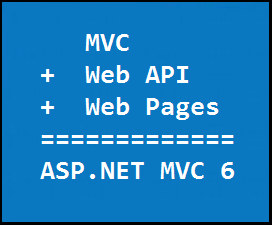

Overview of ASP.NET MVC
=======================
By `Tom Archer`

Based on the *MVC architectural pattern*, the ASP.NET MVC framework is a lightweight, cross-platform, highly testable application-development framework that separates an application into three main components: model, view, and controller:

- :doc:`Models </models/index>` are the parts of the application that implement the logic for the application's data domain. Often, model objects retrieve and store model state in a database. For example, a Product object might retrieve information from a database, operate on it, and then write updated information back to a Products table in a SQL Server database.

- :doc:`Views </views/index>` are responsible for displaying the application's user interface (UI). Typically, this UI is created from the model data. An example would be an edit view of a Products table that displays text boxes, drop-down lists, and check boxes based on the current state of the Product object being represented in the view.

- :doc:`Controllers </controllers/index>` process incoming requests, work with the model, and ultimately return a view to the client that displays the user interface.

This delineation of responsibilities – referred to as the *separation of concerns (SoC)*  - helps you scale the application in terms of complexity because it’s much easier to code, debug, and test something (model, view, or controller) that has a single job rather than something that performs multiple tasks.

Features of the ASP.NET MVC framework
-------------------------------------

The ASP.NET MVC framework provides the following features:

- Separation of application tasks (input logic, business logic, and UI logic), testability, and test-driven development (TDD). All core contracts in the MVC framework are interface-based and can be tested by using *mocking* - a process of creating simple substitute (mock) objects for the dependencies in a class so you can test the class without the dependencies.

- Built-in :doc:`Dependency Injection (DI) </views/dependency-injection>` - a software design pattern that implements the Inversion of Control (IoC) principle for resolving dependencies.

- Extensive support for :doc:`ASP.NET routing </controllers/routing>`, which is a powerful URL-mapping component that lets you build applications that have comprehensible and searchable URLs. This enables you to define your application's URL naming patterns that work well for search engine optimization (SEO) and for link generation.

- Support for existing ASP.NET features. ASP.NET MVC lets you use features such as forms authentication and Windows authentication, URL authorization, membership and roles, output and data caching, session and profile state management, health monitoring, the configuration system, and the provider architecture.

- `Content negotiation <http://www.asp.net/web-api/overview/formats-and-model-binding/content-negotiation>`_ is a mechanism defined in the HTTP specification (RFC 2616) as "the process of selecting the best representation for a given response when there are multiple representations available."

MVC 6 - A unified framework for Web UI and Web APIs
---------------------------------------------------

Prior to MVC 6, we have various frameworks built on top of ASP.NET:

- `Web Pages <http://asp.net/web-pages>`_ is a lightweight framework for building UI. It's designed for being able to quickly and easily create a set of Web pages.
- `MVC <http://asp.net/mvc>`_ is what you use for more sophisticated, complex applications that require more structure and the ability to easily unit test.
- `Web API <http://asp.net/web-api>`_ is great for coding Web services where you want to target a variety of clients - such as browsers and mobile devices.

All of these frameworks are similar in some ways, but very different in others. They have parts that are common and other places where they diverge. In some cases, these frameworks diverge for specific technical reasons - such as they target different scenarios so they do different things to achieve their goals. In other cases, the frameworks diverge mostly for historical reasons.

For example, Web Pages and MVC both use Razor as their underlying syntax for building views. But, Web Pages and MVC diverge in terms
of the set of the HTML Helpers they support once you're coding your Razor page.

The MVC and Web API frameworks have a lot of concepts that are similar: You create controllers and actions within those controllers with both frameworks.
However, there's no sharing of implementation; the types are completely different.
You have controllers in Web API and controllers in MVC. You have actions in Web API and actions in MVC.
But in terms of implementation, they're actually completely decoupled.
This holds true for other concepts common to both Web API and MVC - filters, model binding, DI, etc.

Prior to MVC 6, the Web API and MVC frameworks shared no code at all, which is due purely for historical reasons. The MVC framework - which came first - was built on top of ASP.NET and tightly bound to the ASP.NET pipeline. Therefore, MVC ran only inside IIS. Web API was created and released a little bit later and it came from a service background. We knew when we built Web API that we wanted to be able to support scenarios such as self-hosting. We wanted to leverage the new modern HTTP programming model, and so on. As a result, the two frameworks
couldn't be the same, but we wanted to allow the concepts to be familiar.

As a result, we ended up with duplication - two different variants of filters, controllers, and actions and so on. And while that meant that things felt familiar, it meant you couldn't reuse its
components in a way that you might like to do - such as being able to implement a single filter that you could use in both MVC and also with Web API.

As a result, you can now have controllers that return views that render html, and those same controllers can also do Web API and return formatted data (such as JSON or XML).

This is why MVC 6 is taking a huge step forward in merging all three frameworks. Therefore, you can think of MVC 6 as being the latest version of all three frameworks:

- Web API 3 = MVC 6
- Web Pages 4 = MVC 6
- MVC 6 = MVC 6
