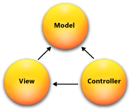

Overview of ASP.NET MVC
=======================
By `Tom Archer`

Based on the *MVC architectural pattern*, the ASP.NET MVC framework is a lightweight, cross-platform, highly testable application-development framework that separates an application into three main components: model, view, and controller:

- :doc:`Models </models/index>` are the parts of the application that implement the logic for the application's data domain. Often, model objects retrieve and store model state in a database. For example, a Product object might retrieve information from a database, operate on it, and then write updated information back to a Products table in a SQL Server database.

- :doc:`Views </views/index>` are responsible for displaying the application's user interface (UI). Typically, this UI is created from the model data. An example would be an edit view of a Products table that displays text boxes, drop-down lists, and check boxes based on the current state of the Product object being represented in the view.

- :doc:`Controllers </controllers/index>` process incoming requests, work with the model, and ultimately return a view to the client that displays the user interface.

This delineation of responsibilities – referred to as the *separation of concerns (SoC)*  - helps you scale the application in terms of complexity because it’s much easier to code, debug, and test something (model, view, or controller) that has a single job rather than something that performs multiple tasks.

Features of the ASP.NET MVC framework
-------------------------------------

The ASP.NET MVC framework provides the following features:

- `Routing`_

- `Model binding and formatting`_

- `Razor views`_

- `Dependency Injection`_

- `Filters`_

- `Areas`_

- `Mobile development`_

- `Single unified framework for Web UI and Web APIs`_

- `Test-driven Development`_

- `Built on top of ASP.NET 5`_

Routing
-------

:doc:`Routing </controllers/routing>` is a powerful URL-mapping component that lets you build applications that have comprehensible and searchable URLs. This enables you to define your application's URL naming patterns that work well for search engine optimization (SEO) and for link generation.

  - **Convention routing** enables you to define the URL formats that your application accepts and how each of those formats maps to a specific action method on given controller. When an incoming request is received, the routing engine parses the incoming URL and matches it to one of the defined URL formats, and calls the associated controller's action method.

  - **Attribute routing** enables you to specify routing information by decorating your controllers and actions with attributes that define your application's routes. This means that your route definitions are placed next to the controller and action with which they're associated.

  - **Route tokens** enable you to future-proof your routes by allowing you to specify tokens - such as ``[controller]`` or ``[action]`` - instead of hard-coded literals representing specific controllers or action names. This way, if you change the name of your controller or action at some point, your routes will still work as your routing entry refers to the token and not the underlying string value.

  - Constraints, defaults, and optionality - MVC gives you complete control over how requests are mapped to routes. This includes the ability to use regular expressions in setting up constraints, defining default values, and specifying optional values.

Model binding and formatting
----------------------------

MVC :doc:`model binding and formatting </models/model-binding>` converts form (Web page) values and route data from the incoming HTTP request into objects that the controller can handle.

  - Strongly typed action parameters for form data, headers, and query string values
  - Handles standard data formats such as JSON and XML
  - Custom model binding - Easily specify how you want complex route data to appear to the controller.
  - `Content negotiation <http://www.asp.net/web-api/overview/formats-and-model-binding/content-negotiation>`_ support

Razor Views
-----------

:doc:`Razor views </views/razor>` enable you to use create dynamic web pages with C#.

  - :doc:`Dynamic and strongly typed views </views/dynamic-vs-static>`
  - Support to inline C#
  - Support for C# 6 - Full support for the latest version of C#
  - Layout
  - :doc:`Tag Helpers </views/tag-helpers/intro>` - Similar to HTML Helpers, Tag Helpers enable you to dynamically modify the HTML returned to the client based on input from the controller.
  - :doc:`View components </views/view-components>` - Similar to partial views, view components include the same separation-of-concerns and testability benefits found between a controller and view that acts as a mini-controller capable of rendering a partial response to the client rather than a whole response.

Dependency Injection
--------------------

:doc:`Dependency Injection (DI) </views/dependency-injection>` is a software design pattern that implements the Inversion of Control (IoC) principle for resolving dependencies.

Filters
-------

:doc:`Filters </controllers/filters>` enables you to specify pre and post processing logic for control action methods.

  - Action filters - Performs additional processing, such as providing extra data to the action method, inspecting the return value, or canceling execution of the action method.
  - Action result filters - Performs additional processing of the result, such as modifying the HTTP response.
  - Authorization filters - Makes security decisions about whether to execute an action method, such as performing authentication or validating properties of the request.
  - Exception filters - Execute if there is an unhandled exception thrown from an action method, starting with the authorization filters and ending with the execution of the result. Exception filters can be used for tasks such as logging or displaying an error page.

Areas
-----

:doc:`Areas </controllers/areas>` provides a way to separate a large MVC application into semantically-related groups of models, views, and controllers.

Mobile Development
------------------

MVC has great support for :doc:`mobile development </views/mobile>`, including the ability to create mobile-specific views to give your customers the best possible experience on their devices.

Single Unified Framework for Web UI and Web APIs
------------------------------------------------

The following frameworks are now combined into a single framework making Web UI and Web API development easier than ever.

  - `MVC <http://asp.net/mvc>`_ is what you use for more sophisticated, complex applications that require more structure and the ability to easily unit test.
  - `Web API <http://asp.net/web-api>`_ is great for coding Web services where you want to target a variety of clients - such as browsers and mobile devices.
  - `Web Pages (future) <http://asp.net/web-pages>`_ is a lightweight framework for building UI. It's designed for being able to quickly and easily create a set of Web pages.

Test-driven Development
-----------------------

All core contracts in the MVC framework are interface-based and can be tested by using *mocking* - a process of creating simple substitute (mock) objects for the dependencies in a class so you can test the class without the dependencies.

Built on top of ASP.NET 5
-------------------------

MVC support ASP.NET features such as forms and Windows authentication, URL authorization, membership and roles, output and data caching, session and profile state management, health monitoring, and the configuration system.
