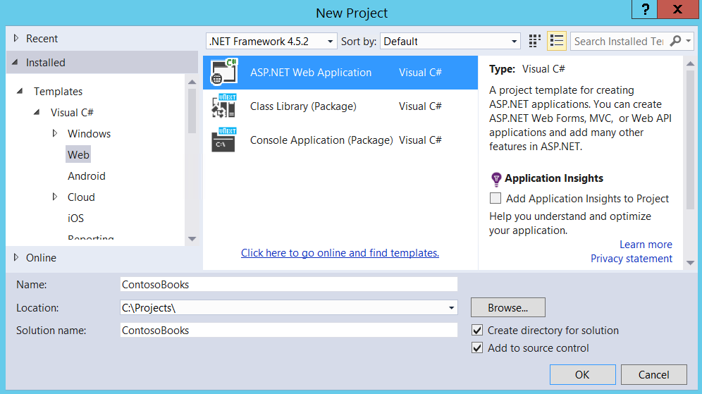
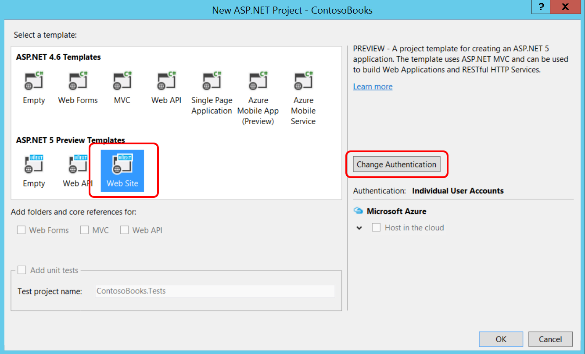
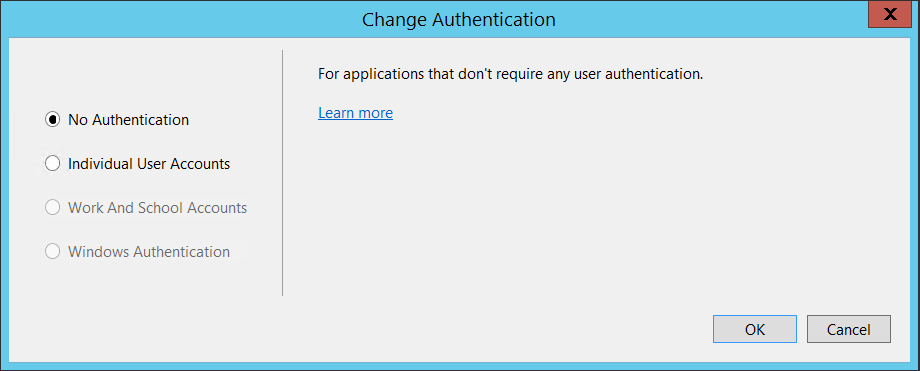
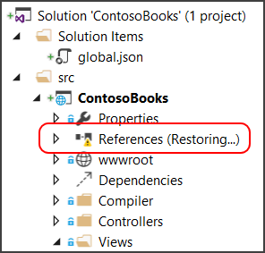
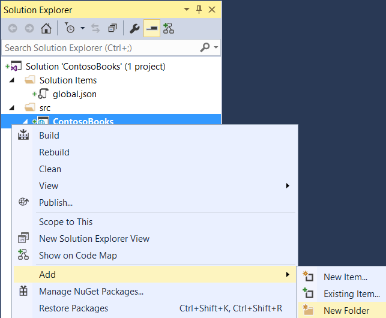
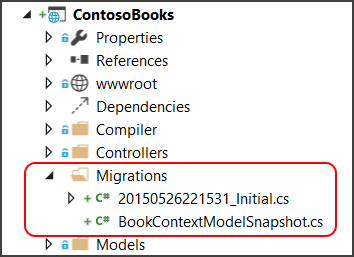
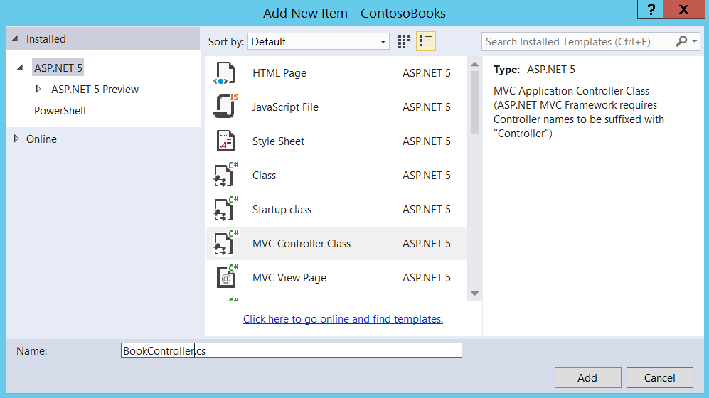
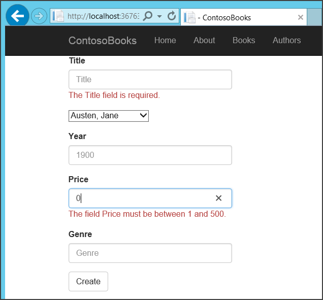

Get Started with Entity Framework 7 using ASP.NET MVC 6
============================================================

By `Mike Wasson`_  and `Rick Anderson`_

In this tutorial, you’ll create a simple web app using ASP.NET MVC and Entity Framework (EF). The app stores records in a SQL database and supports the basic CRUD operations (create, read, update, delete).

.. note:: This tutorial uses Visual Studio 2015. If you are completely new to ASP.NET MVC or Visual Studio, read :doc:`/getting-started/first-mvc-app/index` first.

The sample app that you'll build manages a list of authors and books. Here is a screen shot of the app:

.. image:: mvc-with-entity-framework/_static/screenshot1.png

The app uses Razor to generate static HTML. (An alternate approach is to update pages dynamically on the client, with a combination of AJAX calls, JSON data, and client-side JavaScript. This tutorial doesn’t cover that approach.)

In this article:

    - `Create the project`_
    - `Add Entity Framework`_
    - `Create entity classes`_
    - `Add a DbContext class`_
    - `Configure Entity Framework`_
    - `Add an index page`_
    - `Add a details page`_
    - `Add a create page`_
    - `Add an edit page`_
    - `Add a delete page`_
    - `Wrapping up`_

You can browse the source code for the sample app on `GitHub <https://github.com/aspnet/Docs/tree/master/mvc/tutorials/mvc-with-entity-framework/sample>`__.

Create the project
------------------

Start Visual Studio 2015. From the **File** menu, select **New** > **Project**.

Select the **ASP.NET Web Application** project template. It appears under **Installed** > **Templates** > **Visual C#** > **Web**. Name the project ``ContosoBooks`` and click **OK**.

In the **New Project** dialog, select **Web Site** under **ASP.NET 5 Templates**.

Click **Change Authentication** and select **No Authentication**. You won’t need authentication for this sample. Click **OK** twice to complete the dialogs and create the project.

Open the *Views/Shared/_Layout.cshtml* file. Replace the following code:

.. code-block:: aspx-cs

    <li><a asp-controller="Home" asp-action="Index">Home</a></li>
    <li><a asp-controller="Home" asp-action="About">About</a></li>
    <li><a asp-controller="Home" asp-action="Contact">Contact</a></li>

with this:

.. literalinclude:: mvc-with-entity-framework/sample/src/ContosoBooks/Views/Shared/_Layout.cshtml
    :language: aspx-cs
    :lines: 37-38
    :dedent: 24

This adds a link to the Books page, which we haven’t created yet. (That will come later in tutorial.)

Add Entity Framework
--------------------

Open the *project.json* file. In the dependencies section, add the following line:

.. code-block:: json

  "dependencies": {
    ...
    "EntityFramework.SqlServer": "7.0.0-rc1-final"
  },

When you save *project.json*, Visual Studio automatically resolves the new package reference.

Create entity classes
---------------------

The app will have two entities:

- Book
- Author

We'll define a class for each. First, add a new folder to the project. In Solution Explorer, right-click the project. (The project appears under the "src" folder.) Select **Add** > **New Folder**. Name the folder *Models*.

.. note:: You can put model classes anywhere in your project. The *Models* folder is just a convention.

Right-click the *Models* folder and select **Add** > **New Item**. In the **Add New Item** dialog, select the **Class** template. In the **Name** edit box, type "Author.cs" and click OK. Replace the boilerplate code with:

.. literalinclude:: mvc-with-entity-framework/sample/src/ContosoBooks/Models/Author.cs
    :language: c#
    :lines: 1-8,10-16

Repeat these steps to add another class named ``Book`` with the following code:

.. literalinclude:: mvc-with-entity-framework/sample/src/ContosoBooks/Models/Book.cs
    :language: c#
    :lines: 1-8,10-13,15-24

To keep the app simple, each book has a single author. The ``Author`` property provides a way to navigate the relationship from a book to an author. In EF, this type of property is called a *navigation property*. When EF creates the DB schema, EF automatically infers that ``AuthorID`` should be a foreign key to the Authors table.

Add a DbContext class
---------------------

In EF 7, the primary class for interacting with data is ``Microsoft.Data.Entity.DbContext``. Add a class in the *Models* folder named ``BookContext`` that derives from ``DbContext``:

.. literalinclude:: mvc-with-entity-framework/sample/src/ContosoBooks/Models/BookContext.cs
    :language: c#

The ``DbSet`` properties represent collections of entities. These will become tables in the SQL database.

Next, we'll create some sample data. Add a class named ``SampleData`` in the *Models* folder with the following code:

.. literalinclude:: mvc-with-entity-framework/sample/src/ContosoBooks/Models/SampleData.cs
    :language: c#

You wouldn’t put this into production code, but it’s OK for a sample app.

Configure Entity Framework
--------------------------

Open *config.json*. Add the following highlighted lines:

.. literalinclude:: mvc-with-entity-framework/sample/src/ContosoBooks/config.json
    :language: json
    :emphasize-lines: 5-7

This defines a connection string to LocalDB, which is a lightweight version of SQL Server Express for development.

Open the *Startup.cs* file. In the ``ConfigureServices`` method, add:

.. literalinclude:: mvc-with-entity-framework/sample/src/ContosoBooks/Startup.cs
    :language: c#
    :lines: 35-40
    :dedent: 12

Add the following code at the end of the *Configure* method:

.. literalinclude:: mvc-with-entity-framework/sample/src/ContosoBooks/Startup.cs
    :language: c#
    :lines: 77
    :dedent: 12

Notice in *ConfigureServices* that we call ``Configuration.Get`` to get the database connection string. During development, this setting comes from the *config.json* file. When you deploy the app to a production environment, you set the connection string in an environment variable on the host. If the Configuration API finds an environment variable with the same key, it returns the environment variable instead of the value that is in *config.json*.

Here is the complete *Startup.cs* after these changes:

.. literalinclude:: mvc-with-entity-framework/sample/src/ContosoBooks/Startup.cs
    :language: c#
    :emphasize-lines: 1,4,35-40,77

Use data migrations to create the database
^^^^^^^^^^^^^^^^^^^^^^^^^^^^^^^^^^^^^^^^^^

Open *project.json*.
- In the "commands" and "dependencies" sections, add an entry for ``EntityFramework.Commands``.

.. literalinclude:: mvc-with-entity-framework/sample/src/ContosoBooks/project.json
    :language: json
    :emphasize-lines: 18,23

Build the app.

..	dnu restore removed

Open a command prompt in the project directory (ContosoBooks/src/ContosoBooks) and run the following commands:

.. code-block:: none

    dnvm use 1.0.0-rc1-update1
    dnx ef migrations add Initial
    dnx ef database update

The "``add Initial``" command adds code to the project that allows EF to update the database schema. The "``update``" command creates or updates the actual database. After you run the run these commands, your project has a new folder named *Migrations*:

- **dnvm** : The .NET Version Manager, a set of command line utilities that are used to update and configure .NET Runtime. The command ``dnvm use 1.0.0-rc1-update1`` instructs the .NET Version Manager to add the 1.0.0-rc1-update1 ASP.NET 5 runtime to the ``PATH`` environment variable for the current shell. For ASP.NET 5, the following is displayed:

.. code-block:: none

	Adding C:\\Users\\<user>\\.dnx\\runtimes\\dnx-clr-win-x86.1.0.0-rc1-update1\\bin to process PATH

- **dnx ef migrations add Initial** :  `DNX <http://docs.asp.net/en/latest/dnx/overview.html>`_ is the .NET Execution Environment. The ``ef migration apply`` command runs pending migration code. For more information about ``dnvm``, ``dnu``, and ``dnx``, see :ref:`DNX Overview <aspnet:dnx-overview>`.

Add an index page
-----------------

In this step, you’ll add code to display a list of books.

Right-click the *Controllers* folder. Select **Add** > **New Item**. Select the **MVC Controller Class** template. Name the class ``BookController``.

Replace the boilerplate code with the following:

.. literalinclude:: mvc-with-entity-framework/sample/src/ContosoBooks/Controllers/BookController.cs
    :language: c#
    :lines: 1-26,161-162

Notice that we don't set any value for ``Logger`` and ``BookContext``. The dependency injection (DI) subsystem automatically sets these properties at runtime. DI also handles the object lifetimes, so you don't need to call ``Dispose``. For more information, see :ref:`Dependency Injection  <aspnet:fundamentals-dependency-injection>`.

In the *Views* folder, make a sub-folder named *Book*. You can do this by right-clicking the *Views* folder in Solution Explorer and clicking **Add New Folder**.

Right-click the *Views/Book* subfolder that you just created, and select **Add** > **New Item**. Select the **MVC View Page** template. Keep the default name, *Index.cshtml*.

.. Note:: For views, the folder and file name are significant. The view defined in *Views/Book/Index.cshtml* corresponds to the action defined in the ``BookController.Index`` method.

Replace the boilerplate code with:

.. literalinclude:: mvc-with-entity-framework/sample/src/ContosoBooks/Views/Book/Index.cshtml
    :language: aspx-cs

Run the app and click the "Books" link in the top nav bar. You should see a list of books. The links for create, edit, details, and delete are not functioning yet. We’ll add those next.

Add a details page
------------------

Add the following method to the ``BooksController`` class:

.. literalinclude:: mvc-with-entity-framework/sample/src/ContosoBooks/Controllers/BookController.cs
    :language: c#
    :lines: 27-39
    :dedent: 8

This code looks up a book by ID. In the EF query:

- The ``Include`` method tells EF to fetch the related ``Author`` entity.
- The ``SingleOrDefaultAsync`` method returns a single entity, or ``null`` if one is not found.

If the EF query returns ``null``, the controller method returns ``HttpNotFound``, which ASP.NET translates into a 404 response. Otherwise, the controller passes *book* to a view, which renders the details page. Let’s add the view now.

In the *Views/Book* folder, add a view named *Details.cshtml* with the following code:

.. literalinclude:: mvc-with-entity-framework/sample/src/ContosoBooks/Views/Book/Details.cshtml
    :language: aspx-cs

Add a create page
-----------------

Add the following two methods to ``BookController``:

.. literalinclude:: mvc-with-entity-framework/sample/src/ContosoBooks/Controllers/BookController.cs
    :language: c#
    :lines: 40-46,135-148
    :dedent: 8

Add a view named *Views/Book/Create.cshtml*.

.. literalinclude:: mvc-with-entity-framework/sample/src/ContosoBooks/Views/Book/Create.cshtml
    :language: aspx-cs

This view renders an HTML form. In the ``form`` element, the ``asp-action`` tag helper specifies the controller action to invoke when the client submits the form. Notice that the form uses HTTP POST.

.. literalinclude:: mvc-with-entity-framework/sample/src/ContosoBooks/Views/Book/Create.cshtml
    :language: aspx-cs
    :lines: 4
    :dedent: 2

Now let’s write the controller action to handle the form post. In the ``BookController`` class, add the following method.

.. literalinclude:: mvc-with-entity-framework/sample/src/ContosoBooks/Controllers/BookController.cs
    :language: c#
    :lines: 46-65
    :dedent: 8

The ``[HttpPost]`` attribute tells MVC that this action applies to HTTP POST requests. The ``[ValidateAntiForgeryToken]`` attribute is a security feature that guards against cross-site request forgery. For more information, see :doc:`../../security/anti-request-forgery`.

Inside this method, we check the model state (``ModelState.IsValid``). If the client submitted a valid model, we add it to the database. Otherwise, we return the original view with validation errors shown:

.. literalinclude:: mvc-with-entity-framework/sample/src/ContosoBooks/Views/Book/Create.cshtml
    :language: aspx-cs
    :lines: 9
    :dedent: 6

Add validation rules to the book model
^^^^^^^^^^^^^^^^^^^^^^^^^^^^^^^^^^^^^^

To see how validation works, let's add some validation rules to the ``Book`` model.

#. Open Book.cs.
#. Add the ``[Required]`` attribute to the ``Title`` property.
#. Add the ``[Range]`` property to the ``Price`` property, as shown below.

.. literalinclude:: mvc-with-entity-framework/sample/src/ContosoBooks/Models/Book.cs
    :language: c#
    :lines: 5-23
    :dedent: 4
    :emphasize-lines: 5,10

Run the app. Click **Books** > **Create New Book**. Leave Title blank, set Price to zero, and click **Create**.

Notice how the form automatically adds error messages next to the fields with invalid data. The errors are enforced both client-side (using JavaScript and jQuery) and server-side (using ``ModelState``).

Client-side validation alerts the user before the form is submitted, which avoids a round-trip. However, server-side validation is still important, because it guards against malicious requests, and works even if the user has JavaScript disabled.

The data annotation attributes like ``[Required]`` and ``[Range]`` only give you basic validation. To validate more complex business rules, you’ll need to write additional code that is specific to your domain.

Add an edit page
----------------

Add the following methods to ``BookController``:

.. literalinclude:: mvc-with-entity-framework/sample/src/ContosoBooks/Controllers/BookController.cs
    :language: c#
    :lines: 97-133
    :dedent: 8

This code is very similar to adding a new entity, except for the code needed to update the database:

.. literalinclude:: mvc-with-entity-framework/sample/src/ContosoBooks/Controllers/BookController.cs
    :language: c#
    :lines: 118-119
    :dedent: 16

Add a view named *Views/Book/Edit.cshtml* view with the following code:

.. literalinclude:: mvc-with-entity-framework/sample/src/ContosoBooks/Views/Book/Edit.cshtml
    :language: aspx-cs

This view defines a form, very similar to the Create form.

Add a delete page
-----------------

Add the following code to ``BookController``.

.. literalinclude:: mvc-with-entity-framework/sample/src/ContosoBooks/Controllers/BookController.cs
    :language: c#
    :lines: 66-96
    :dedent: 8

Add a view named *Views/Book/Delete.cshtml* view with the following code:

.. literalinclude:: mvc-with-entity-framework/sample/src/ContosoBooks/Views/Book/Delete.cshtml
    :language: aspx-cs

The basic flow is:

#. From the details page, the user clicks the "Delete" link.
#. The app displays a confirmation page.
#. The confirmation page is a form. Submitting the form (via HTTP POST) does the actual deletion.

You don't want the "Delete" link itself to delete the item. Performing a delete operation in response to a GET request creates a security risk. For more information, see `ASP.NET MVC Tip #46 — Don't use Delete Links because they create Security Holes <http://stephenwalther.com/archive/2009/01/21/asp-net-mvc-tip-46-ndash-donrsquot-use-delete-links-because>`_ on Stephen Walther's blog.

Wrapping up
-----------

The sample app has equivalent pages for authors. However, they don't contain any new concepts, so I won’t show them in the tutorial. You can browse the source code on `GitHub <https://github.com/aspnet/Docs/tree/master/mvc/tutorials/mvc-with-entity-framework/sample>`__.

For information about deploying your app, see :ref:`Publishing and Deployment <aspnet:publishing-and-deployment>`.
