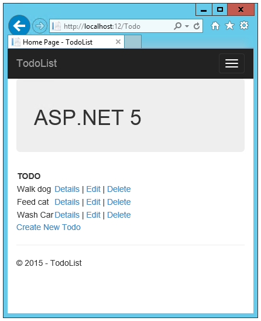
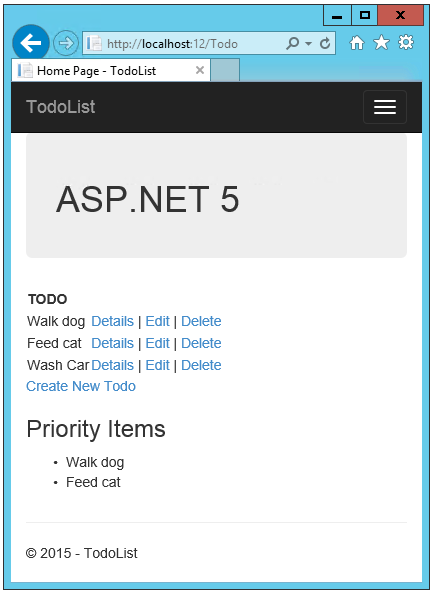
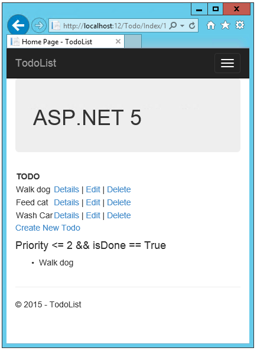
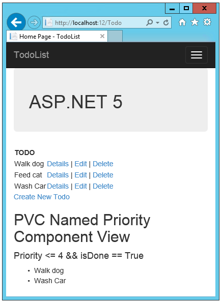

View Components in MVC 6
======================================================

By `Rick Anderson`_

In this article:
	- `Introducing view components`_
	- `Download the ASP.NET 5 starter project`_
	- `Examine the view component class`_
	- `Examine the view component view`_
	- `Add InvokeAsync to the priority component`_
	- `Specifying a view name`_
	- `Injecting a service into a view`_
	- `Addition Resources`_
	

Introducing view components
^^^^^^^^^^^^^^^^^^^^^^^^^^^^^^^^^^^^^^^^^^

New to ASP.NET MVC 6, view components (VCs) are similar to partial views, but they are much more powerful. VCs include the same separation-of-concerns and testability benefits found between a controller and view. You can think of a VC as a mini-controller—it’s responsible for rendering a chunk rather than a whole response. You can use VCs to solve any problem that you feel is too complex with a partial, such as:  

- Dynamic navigation menus
- Tag cloud (where it queries the database)
- Login panel
- Shopping cart
- Recently published articles
- Sidebar content on a typical blog 
 
One use of a VC could be to create a login panel that would be displayed on every page with the following functionality:

- If the user is not logged in, a login panel is rendered.
- If the user is logged in, links to log out and manage account are rendered.
- If the user is in the admin role, an admin panel is rendered.

You can also create a VC that gets and renders data depending on the user's claims. You can add this VC view to the layout page and have it get and render user-specific data throughout the whole application. ViewComponents don’t use model binding, and only depend on the data you provide when calling into it. 

A VC consists of two parts, the class (typically derived from  ``ViewComponent``) and the Razor view which calls methods in the VC class. Like the new ASP.NET controllers, a VC can be a POCO, but most users will want to take advantage of the methods and properties available by deriving from ``ViewComponent``.

A view component class can be created by any of the following:

- Deriving from  `ViewComponent <https://github.com/aspnet/Mvc/blob/dev/src/Microsoft.AspNet.Mvc.Core/ViewComponents/ViewComponent.cs>`__ .
- Decorating the class with the ``[ViewComponent]`` attribute, or deriving from a class with the ``[ViewComponent]`` attribute.
- Creating a class where the name ends with the suffix *ViewComponent*.

Like controllers, VCs must be public, non-nested, non-abstract classes.

.. rewrite tutorial so you start working with a starter project

Download the ASP.NET 5 starter project  
^^^^^^^^^^^^^^^^^^^^^^^^^^^^^^^^^^^^^^^

- Download and open the `TodoList <https://github.com/Rick-Anderson/ViewComponents>`_ completed project.
- Open a command prompt in the project directory (*TodoList\\src\\TodoList*) and run the following commands:

.. code-block:: none

	dnvm use 1.0.0-beta5  
	dnx . ef migration apply

- **dnvm** : The .NET Version Manager, a set of command line utilities that are used to update and configure .NET Runtime. The command ``dnvm use 1.0.0-beta5`` instructs the .NET Version Manager to add the 1.0.0-beta5 version of the ASP.NET 5 runtime to the ``PATH`` environment variable for the current shell. For ASP.NET 5 Beta 5, the following is displayed: 

.. code-block:: none

	Adding C:\\Users\\<user>\\.dnx\\runtimes\\dnx-clr-win-x86.1.0.0-beta5\\bin to process PATH 

- `DNX <http://docs.asp.net/en/latest/dnx/overview.html>`_ is the .NET Execution Environment. 
- **dnx . ef migration add Initial** :  `DNX <http://docs.asp.net/en/latest/dnx/overview.html>`_ is the .NET Execution Environment. The ``ef migration apply`` command runs pending migration code.

Run the app
^^^^^^^^^^^^^^^^^^^^^

.. note:: With this version of Visual Studio 2015, you might have to exit Visual Studio after loading the project before you can run it.

Run the app, click the **Todo** link and create a couple *Todo* items. Make at least one of the *Todo* items with priority 1 and ``IsDone`` false (not checked).

Examine the view component class
^^^^^^^^^^^^^^^^^^^^^^^^^^^^^^^^^^^^^^^^^^

- Examine the *src\TodoList\ViewComponents\PriorityListViewComponent.cs* file:

.. code-block:: c#

	using System.Linq;
	using Microsoft.AspNet.Mvc;
	using TodoList.Models;

	namespace TodoList.ViewComponents
	{
	  public class PriorityListViewComponent : ViewComponent
	  {
		private readonly ApplicationDbContext db;

		public PriorityListViewComponent(ApplicationDbContext context)
		{
		  db = context;
		}

		public IViewComponentResult Invoke(int maxPriority)
		{
		  var items = db.TodoItems.Where(x => x.IsDone == false &&
					x.Priority <= maxPriority);

		  return View(items);
		}
	  }
	}

Notes on the code: 

- View component classes can be contained in **any** folder in the project.
- Because the class name ``PriorityListViewComponent`` ends with the suffix **ViewComponent**, the runtime will use the string "PriorityList" when referencing the class component from a view. I'll explain that in more detail later. 
- The ``[ViewComponent]`` attribute can change the name used to reference a VC. For example, we could have named the class ``XYZ``,  and  applied the  ``ViewComponent`` attribute:

.. code-block:: c#

	[ViewComponent(Name = "PriorityList")]
	public class XYZ : ViewComponent

The ``[ViewComponent]`` attribute above tells the view component selector to use the name ``PriorityList`` when looking for the views associated with the component, and to use the string "PriorityList" when referencing the class component from a view. I'll explain that in more detail later. 

- The component uses constructor injection to make the data context available. 
- ``Invoke`` exposes a method which can be called from a view, and it can take an arbitrary number of arguments. An asynchronous version, ``InvokeAsync``, is available. We'll see ``InvokeAsync`` and multiple arguments later in the tutorial. In the code above, the ``Invoke`` method returns the set of *ToDoItems* that are not completed and have priority greater than or equal to ``maxPriority``.

Examine the view component view
^^^^^^^^^^^^^^^^^^^^^^^^^^^^^^^^^^^^^^^^^^

1. Examine the contents of the *Views\\Todo\\Components*. This folder **must** be named *Components*.

.. note:: View Component views are more typically added to the *Views\\Shared\\Components* folder, because VCs are typically not controller specific.

2. Examine the *Views\\Todo\\Components\\PriorityList* folder. This folder name must match the name of the view component class, or the name of the class minus the suffix (if we followed convention and used the *ViewComponent* suffix in the class name). If you used the the ``ViewComponent`` attribute, the class name would need to match the attribute designation. 
3. Examine the *Views\\Todo\\Components\\PriorityList\\Default.cshtml* Razor view. 

.. code-block:: javascript

	@model IEnumerable<TodoList.Models.TodoItem>

	<h3>Priority Items</h3>
	<ul>
		@foreach (var todo in Model)
		{
			<li>@todo.Title</li>
		}
	</ul>

The Razor view takes a list of ``TodoItems`` and displays them. If the VC ``invoke`` method doesn't pass the name of the view (as in our sample),  *Default* is used for the view name by convention. Later in the tutorial, I'll show you how to pass the name of the view.

4. Add a ``div`` containing a call to the priority list component to the bottom of the *views\\todo\\index.cshtml* file:

.. code-block:: javascript
   :emphasize-lines: 5-7

		@* Markup removed for brevity *@
		
@Html.ActionLink("Create New Todo", "Create", "Todo") 

	  

	  

		@Component.Invoke("PriorityList", 1)
	  

	

The markup ``@Component.Invoke`` shows the syntax for calling view components. The first argument is the name of the component we want to invoke or call. Subsequent parameters are passed to the component. In this case, we are passing "1" as the priority we want to filter on. ``Invoke`` and ``InvokeAsync`` can take an arbitrary number of arguments.

The following image shows the priority items:  (make sure you have at least one priority 1 item that is not completed)

Add InvokeAsync to the priority component
^^^^^^^^^^^^^^^^^^^^^^^^^^^^^^^^^^^^^^^^^^^^^^^^^^^^^^^^^^^^^^^^^^^^^^^^^^^^^^^^^^^^

Update the priority view component class with the following code:

.. note:: ``IQueryable`` renders the sample synchronous, not asynchronous. This is a simple example of how you could call asynchronous methods.

.. code-block:: c#
   :emphasize-lines: 1, 12-34
   
	using System.Threading.Tasks;
   
	public class PriorityListViewComponent : ViewComponent
	{
	   private readonly ApplicationDbContext db;

	   public PriorityListViewComponent(ApplicationDbContext context)
	   {
		  db = context;
	   }

	   // Synchronous Invoke removed.

	   public async Task<IViewComponentResult> InvokeAsync(int maxPriority, bool isDone)
	   {
		  var items = await GetItemsAsync(maxPriority, isDone);
		  return View(items);
	   }

	   private Task<IQueryable<TodoItem>> GetItemsAsync(int maxPriority, bool isDone)
	   {
		  return Task.FromResult(GetItems(maxPriority, isDone));
	   }
	   private IQueryable<TodoItem> GetItems(int maxPriority, bool isDone)
	   {
		  var items = db.TodoItems.Where(x => x.IsDone == isDone &&
					x.Priority <= maxPriority);

		  string msg = "Priority <= " + maxPriority.ToString() +
					   " && isDone == " + isDone.ToString();
		  ViewBag.PriorityMessage = msg;

		  return items;
	   }
	}

Update the VC Razor view (*TodoList\\src\\TodoList\\Views\\ToDo\\Components\\PriorityList\\Default.cshtml*) to show the priority message :

.. code-block:: javascript
   :emphasize-lines: 3
   
	@model IEnumerable<TodoList.Models.TodoItem>

		<h4>@ViewBag.PriorityMessage</h4>
		<ul>
			@foreach (var todo in Model)
			{
				<li>@todo.Title</li>
			}
		</ul>

Finally, update the  *views\\todo\\index.cshtml* view:

.. code-block:: javascript
   :emphasize-lines: 4

		@* Markup removed for brevity. *@
		
		

			@await Component.InvokeAsync("PriorityList", 2, true)
		

	

The following image reflects the changes we made to the priority VC and  Index view:

Specifying a view name
^^^^^^^^^^^^^^^^^^^^^^^^

A complex VC might need to specify a non-default view under some conditions. The following shows how to specify the "PVC" view  from the  ``InvokeAsync`` method: Update the ``InvokeAsync`` method in the ``PriorityListViewComponent`` class.

.. code-block:: javascript
   :emphasize-lines: 3-22
   
	public async Task<IViewComponentResult> InvokeAsync(int maxPriority, bool isDone)
	{
		string MyView = "Default";
		// If asking for all completed tasks, render with the "PVC" view.
		if (maxPriority > 3 && isDone == true)
		{
			MyView = "PVC";
		}
		var items = await GetItemsAsync(maxPriority, isDone);
		return View(MyView, items);
	}

Examine the *Views\\Todo\\Components\\PriorityList\\PVC.cshtml* view. I changed the PVC view to verify it's being used:

.. code-block:: javascript
   :emphasize-lines: 3

	@model IEnumerable<TodoList.Models.TodoItem>

	<h2> PVC Named Priority Component View</h2>
	<h4>@ViewBag.PriorityMessage</h4>
	<ul>
		@foreach (var todo in Model)
		{
			<li>@todo.Title</li>
		}
	</ul>

Finally, update *Views\\Todo\Index.cshtml*

.. code-block:: javascript

	@await Component.InvokeAsync("PriorityList",  4, true)

Run the app and click on the PVC link (or navigate to localhost:<port>/Todo/IndexFinal). Refresh the page to see the PVC view.

Injecting a service into a view
^^^^^^^^^^^^^^^^^^^^^^^^^^^^^^^^

ASP.NET MVC 6 now supports injection into a view from a class. Unlike a VC class, there are no restrictions other than the class must be must be public, non-nested and non-abstract. For this example, we'll create a simple class that exposes the total *todo* count, completed count and average priority. 

1. Examine the *Services\\StatisticsService.cs* class.

The StatisticsService class:

.. code-block:: c#

	using System.Linq;
	using System.Threading.Tasks;
	using TodoList.Models;

	namespace TodoList.Services
	{
	   public class StatisticsService
	   {
		  private readonly ApplicationDbContext db;

		  public StatisticsService(ApplicationDbContext context)
		  {
			 db = context;
		  }

		  public async Task<int> GetCount()
		  {
			 return await Task.FromResult(db.TodoItems.Count());
		  }

		  public async Task<int> GetCompletedCount()
		  {
			 return await Task.FromResult(
				 db.TodoItems.Count(x => x.IsDone == true));
		  }

		  public async Task<double> GetAveragePriority()
		  {
			 if (db.TodoItems.Count() == 0)
			 {
				return 0.0;
			 }

			 return await Task.FromResult(
				 db.TodoItems.Average(x =>x.Priority));
		  }
	   }
	}

2. Update the *Index* view to inject the *todo* statistical data. Add the ``inject`` statement to the top of the file:

.. code-block:: html 

	@inject TodoList.Services.StatisticsService Statistics

Add markup calling the StatisticsService to the end of the file:

.. code-block:: html
   :emphasize-lines: 6-11

	 @* Markup removed for brevity *@
		  
@Html.ActionLink("Create New Todo", "Create", "Todo") 

	   

	   

		  @await Component.InvokeAsync("PriorityList", 4, true)
		  <h3>Stats</h3>
		  <ul>
			 <li>Items: @await Statistics.GetCount()</li>
			 <li>Completed:@await Statistics.GetCompletedCount()</li>
			 <li>Average Priority:@await Statistics.GetAveragePriority()</li>
		  </ul>
	   

	

3. Register the ``StatisticsService`` class in the *Startup.cs* file: 

.. code-block:: c#
   :emphasize-lines: 8

	public void ConfigureServices(IServiceCollection services)
	{
	   // Add Application settings to the services container.
	   services.Configure<AppSettings>(Configuration.GetConfigurationSection("AppSettings"));
	   // Code removed for brevity.
	   // Add MVC services to the services container.
	   services.AddMvc();
	   services.AddTransient<TodoList.Services.StatisticsService>();
	}

The statistics are displayed:
 
 .. image:: _static/stat.png
 

Addition Resources
^^^^^^^^^^^^^^^^^^^^^^^^^

- `Understanding ASP.NET 5 Web Apps <http://docs.asp.net/en/latest/conceptual-overview/understanding-aspnet5-apps.html>`_
- `Introducing .NET Core <http://docs.asp.net/en/latest/conceptual-overview/dotnetcore.html>`_

