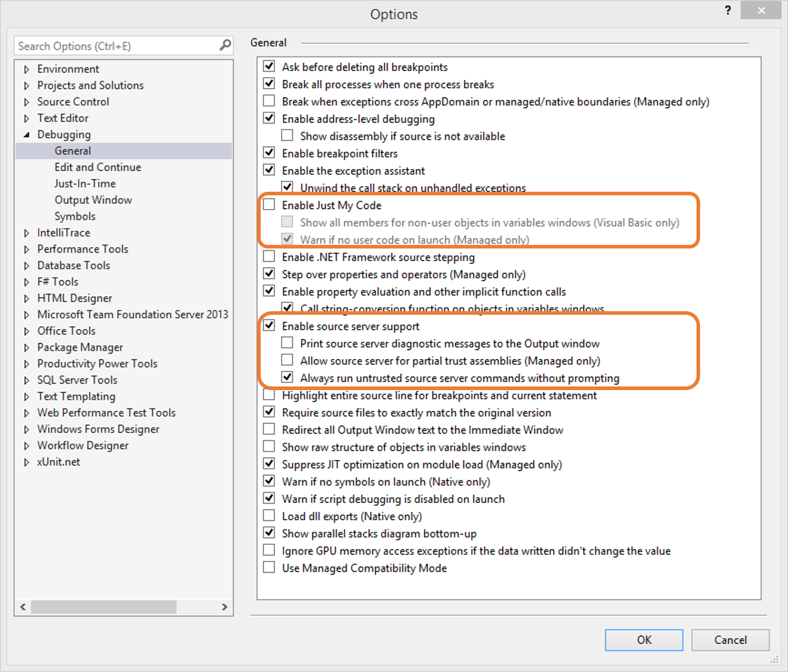

.. include:: /../common/stub-topic.txt

Debugging
=========

Debugging in Azure
------------------

To debug your Web Application while running in Azure, please see the tutorial `Troubleshoot a web app in Azure App Service using 
Visual Studio <https://azure.microsoft.com/en-us/documentation/articles/web-sites-dotnet-troubleshoot-visual-studio/#webserverlogs>`_.

Debugging with Source and Symbols
---------------------------------

In addition to debugging your own code, it is possible to debug directly 
into Microsoft ASP.NET WebHooks, and in fact all of .NET. This works 
regardless of whether you debug locally or remotely. First, configure Visual Studio to find the source and symbols by going to **Debug** 
and then **Options and Settings**. Set the options like this: 

Then add a link to `symbolsource.org <http://symbolsource.org>`_ for downloading the source and symbols. Go to the **Symbols** tab of the menu above and add the following as a symbol location::

  http://srv.symbolsource.org/pdb/Public

In addition, make sure that the cache directory has a short name; otherwise the file names can get too long which will cause the symbols to not load. A sample
path is::

 C:\SymCache

The settings should look similar to this:

.. image:: _static/SymSource.png
 